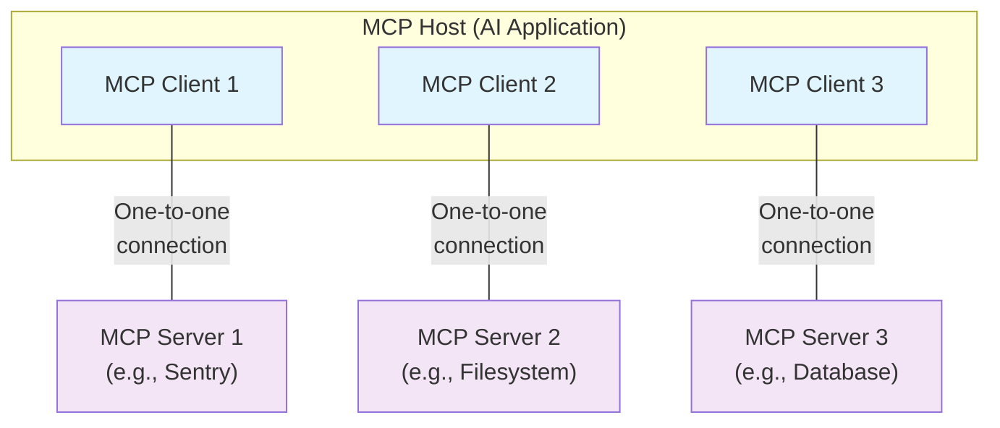

Diese Übersicht über das Model Context Protocol (MCP) behandelt seinen [Geltungsbereich](#scope) und die [Kernkonzepte](#concepts-of-mcp) und liefert ein [Beispiel](#example), das jedes Kernkonzept veranschaulicht.

Da MCP-SDKs viele Aspekte abstrahieren, werden die meisten Entwickler den Abschnitt zum [Datenebenenprotokoll](#data-layer-protocol) am nützlichsten finden. Dort wird erläutert, wie MCP-Server einer KI-Anwendung Kontext bereitstellen können.

Für spezifische Implementierungsdetails siehe die Dokumentation zu deinem [sprachspezifischen SDK](/de/docs/sdk).

<div id="scope">
  ## Umfang
</div>

Das Model Context Protocol umfasst die folgenden Projekte:

* [MCP Specification](https://modelcontextprotocol.io/specification/latest): Eine Spezifikation von MCP, die die Implementierungsanforderungen für Clients und Server beschreibt.
* [MCP SDKs](/de/docs/sdk): SDKs für verschiedene Programmiersprachen, die MCP implementieren.
* **MCP Development Tools**: Werkzeuge für die Entwicklung von MCP-Servern und -Clients, einschließlich des [MCP-Inspector](https://github.com/modelcontextprotocol/inspector)
* [MCP Reference Server Implementations](https://github.com/modelcontextprotocol/servers): Referenzimplementierungen von MCP-Servern.

<Note>
  MCP konzentriert sich ausschließlich auf das Protokoll für den Kontextaustausch—it does not dictate
  how AI applications use LLMs or manage the provided context.
</Note>

<div id="concepts-of-mcp">
  ## Konzepte des MCP
</div>

<div id="participants">
  ### Teilnehmende
</div>

MCP folgt einer Client-Server-Architektur, bei der ein MCP-Host — eine KI-Anwendung wie [Claude Code](https://www.anthropic.com/claude-code) oder [Claude Desktop](https://www.claude.ai/download) — Verbindungen zu einem oder mehreren MCP-Servern herstellt. Der MCP-Host erreicht dies, indem er für jeden MCP-Server einen MCP-Client erstellt. Jeder MCP-Client hält eine dedizierte Eins-zu-eins-Verbindung zu seinem jeweiligen MCP-Server aufrecht.

Die wichtigsten Teilnehmenden in der MCP-Architektur sind:

* **MCP-Host**: Die KI-Anwendung, die einen oder mehrere MCP-Clients koordiniert und verwaltet
* **MCP-Client**: Eine Komponente, die eine Verbindung zu einem MCP-Server aufrechterhält und Kontext von einem MCP-Server bezieht, den der MCP-Host nutzt
* **MCP-Server**: Ein Programm, das MCP-Clients Kontext bereitstellt

**Zum Beispiel**: Visual Studio Code fungiert als MCP-Host. Wenn Visual Studio Code eine Verbindung zu einem MCP-Server herstellt, etwa dem [Sentry MCP Server](https://docs.sentry.io/product/sentry-mcp/), instanziiert die Visual Studio Code-Laufzeit ein MCP-Client-Objekt, das die Verbindung zum Sentry MCP-Server aufrechterhält.
Wenn Visual Studio Code anschließend eine Verbindung zu einem weiteren MCP-Server herstellt, etwa dem [lokalen Filesystem-Server](https://github.com/modelcontextprotocol/servers/tree/main/src/filesystem), instanziiert die Visual Studio Code-Laufzeit ein zusätzliches MCP-Client-Objekt, um diese Verbindung aufrechtzuerhalten, und bewahrt so eine Eins-zu-eins-
Beziehung von MCP-Clients zu MCP-Servern.



Beachten Sie, dass sich **MCP-Server** auf das Programm bezieht, das Kontextdaten bereitstellt — unabhängig davon, wo es ausgeführt wird. MCP-Server können lokal oder remote laufen. Wenn beispielsweise Claude Desktop den [Filesystem-Server](https://github.com/modelcontextprotocol/servers/tree/main/src/filesystem) startet, läuft der Server lokal auf demselben Rechner, da er den STDIO-
Transport verwendet. Dies wird üblicherweise als „lokaler“ MCP-Server bezeichnet. Der offizielle [Sentry MCP Server](https://docs.sentry.io/product/sentry-mcp/) läuft auf der Sentry-Plattform und verwendet den Streamable HTTP-Transport. Dies wird üblicherweise als „entfernter“ MCP-Server bezeichnet.

<div id="layers">
  ### Schichten
</div>

MCP besteht aus zwei Schichten:

* **Datenebene**: Definiert das auf JSON-RPC 2.0 basierende Protokoll für die Client-Server-Kommunikation, einschließlich Lebenszyklusverwaltung, sowie grundlegende Primitive wie Werkzeuge, Ressourcen, Prompts und Benachrichtigungen.
* **Transportebene**: Definiert die Kommunikationsmechanismen und -kanäle, die den Datenaustausch zwischen Clients und Servern ermöglichen, einschließlich transportspezifischer Verbindungsherstellung, Nachrichtenframing und Autorisierung.

Konzeptionell ist die Datenebene die innere Ebene, während die Transportebene die äußere Ebene ist.

<div id="data-layer">
  #### Datenschicht
</div>

Die Datenschicht implementiert ein auf [JSON-RPC 2.0](https://www.jsonrpc.org/) basierendes Austauschprotokoll, das die Nachrichtenstruktur und -semantik definiert.
Diese Schicht umfasst:

* **Lebenszyklusverwaltung**: Handhabt die Verbindungsinitialisierung, Fähigkeitenaushandlung und Beendigung der Verbindung zwischen Clients und Servern
* **Serverfunktionen**: Ermöglicht Servern die Bereitstellung von Kernfunktionen, einschließlich Werkzeuge für KI-Aktionen, Ressourcen für Kontextdaten und Prompts für Interaktionsvorlagen zum und vom Client
* **Clientfunktionen**: Ermöglicht Servern, den Client zu bitten, beim Host-LLM Sampling durchzuführen, Eingaben vom Benutzer zu eliciteren und Nachrichten beim Client zu protokollieren
* **Dienstfunktionen**: Unterstützt zusätzliche Fähigkeiten wie Benachrichtigungen für Echtzeit-Updates und die Fortschrittsverfolgung bei lang laufenden Operationen

<div id="transport-layer">
  #### Transportschicht
</div>

Die Transportschicht verwaltet Kommunikationskanäle und Authentifizierung zwischen Clients und Servern. Sie übernimmt die Verbindungsherstellung, das Framing von Nachrichten sowie die sichere Kommunikation zwischen MCP-Teilnehmenden.

MCP unterstützt zwei Transportmechanismen:

* **STDIO-Transport**: Verwendet Standard-Ein-/Ausgabe-Streams für die direkte Prozesskommunikation zwischen lokalen Prozessen auf derselben Maschine und bietet optimale Leistung ohne Netzwerk-Overhead.
* **Streamable-HTTP-Transport**: Verwendet HTTP POST für Nachrichten vom Client zum Server mit optionalen Server-Sent Events für Streaming-Funktionen. Dieser Transport ermöglicht die Kommunikation mit entfernten Servern und unterstützt gängige HTTP-Authentifizierungsmethoden, einschließlich Bearer-Tokens, API-Schlüsseln und benutzerdefinierten Headern. MCP empfiehlt die Verwendung von OAuth, um Authentifizierungs-Token zu erhalten.

Die Transportschicht abstrahiert Kommunikationsdetails von der Protokollschicht und ermöglicht dasselbe JSON-RPC-2.0-Nachrichtenformat über alle Transportmechanismen hinweg.

<div id="data-layer-protocol">
  ### Datenebenenprotokoll
</div>

Ein zentraler Bestandteil von MCP ist die Definition von Schema und Semantik zwischen MCP-Clients und MCP-Servern. Entwicklerinnen und Entwickler werden die Datenebene — insbesondere die Menge der [Primitives](#primitives) — wahrscheinlich als den interessantesten Teil von MCP empfinden. Sie ist der Teil von MCP, der festlegt, wie Kontext von MCP-Servern an MCP-Clients weitergegeben werden kann.

MCP verwendet [JSON-RPC 2.0](https://www.jsonrpc.org/) als zugrunde liegendes RPC-Protokoll. Clients und Server senden einander Anfragen und antworten entsprechend. Benachrichtigungen können verwendet werden, wenn keine Antwort erforderlich ist.

<div id="lifecycle-management">
  #### Lebenszyklusverwaltung
</div>

MCP ist ein <Tooltip tip="Ein Teil von MCP kann mithilfe des Streamable HTTP-Transports zustandslos gemacht werden">zustandsbehaftetes Protokoll</Tooltip>, das eine Lebenszyklusverwaltung erfordert. Ziel der Lebenszyklusverwaltung ist die Aushandlung der <Tooltip tip="Funktionen und Vorgänge, die ein Client oder Server unterstützt, etwa Werkzeuge, Ressourcen oder Prompts">Fähigkeiten</Tooltip>, die sowohl vom Client als auch vom Server unterstützt werden. Ausführliche Informationen finden Sie in der [Spezifikation](/de/specification/2025-06-18/basic/lifecycle); das [Beispiel](#example) zeigt die Initialisierungssequenz.

<div id="primitives">
  #### Primitiven
</div>

MCP-Primitiven sind das wichtigste Konzept innerhalb von MCP. Sie definieren, was Clients und Server einander anbieten können. Diese Primitiven legen fest, welche Arten kontextueller Informationen mit KI-Anwendungen geteilt werden können und welche Bandbreite an Aktionen ausgeführt werden kann.

MCP definiert drei Kernprimitiven, die *Server* bereitstellen können:

* **Werkzeuge**: Ausführbare Funktionen, die KI-Anwendungen aufrufen können, um Aktionen auszuführen (z. B. Dateioperationen, API-Aufrufe, Datenbankabfragen)
* **Ressourcen**: Datenquellen, die KI-Anwendungen kontextuelle Informationen bereitstellen (z. B. Dateiinhalte, Datensätze, API-Antworten)
* **Prompts**: Wiederverwendbare Vorlagen, die helfen, Interaktionen mit Sprachmodellen zu strukturieren (z. B. System-Prompts, Few-Shot-Beispiele)

Jeder Primitiventyp verfügt über zugehörige Methoden zur Auffindbarkeit (`*/list`), zum Abruf (`*/get`) und in einigen Fällen zur Ausführung (`tools/call`).
MCP-Clients verwenden die `*/list`-Methoden, um verfügbare Primitiven zu entdecken. Ein Client kann beispielsweise zunächst alle verfügbaren Werkzeuge auflisten (`tools/list`) und sie anschließend ausführen. Dieses Design erlaubt dynamische Auflistungen.

Als konkretes Beispiel betrachten Sie einen MCP-Server, der Kontext zu einer Datenbank bereitstellt. Er kann Werkzeuge zum Abfragen der Datenbank, eine Ressource mit dem Schema der Datenbank sowie einen Prompt mit Few-Shot-Beispielen für die Interaktion mit den Werkzeugen bereitstellen.

Weitere Details zu Server-Primitiven finden Sie unter [Serverkonzepte](de/./server-concepts).

MCP definiert auch Primitiven, die *Clients* bereitstellen können. Diese Primitiven ermöglichen Autorinnen und Autoren von MCP-Servern, reichhaltigere Interaktionen zu entwickeln.

* **Sampling**: Ermöglicht Servern, vom KI-Produkt des Clients Sprachmodellvervollständigungen anzufordern. Das ist nützlich, wenn Autorinnen und Autoren von Servern Zugriff auf ein Sprachmodell wünschen, aber modellunabhängig bleiben und kein Sprachmodell-SDK in ihren MCP-Server integrieren möchten. Sie können die Methode `sampling/complete` verwenden, um vom KI-Produkt des Clients eine Sprachmodellvervollständigung anzufordern.
* **Elicitierung**: Ermöglicht Servern, zusätzliche Informationen von Nutzenden anzufordern. Das ist nützlich, wenn Autorinnen und Autoren von Servern mehr Informationen von der Nutzerschaft einholen oder eine Aktion bestätigen lassen möchten. Sie können die Methode `elicitation/request` verwenden, um zusätzliche Informationen von den Nutzenden anzufordern.
* **Protokollierung**: Ermöglicht Servern, Protokollmeldungen zu Debugging- und Überwachungszwecken an Clients zu senden.

Weitere Details zu Client-Primitiven finden Sie unter [Clientkonzepte](de/./client-concepts).

<div id="notifications">
  #### Benachrichtigungen
</div>

Das Protokoll unterstützt Echtzeit-Benachrichtigungen, um dynamische Aktualisierungen zwischen Servern und Clients zu ermöglichen. Ändern sich beispielsweise die verfügbaren Werkzeuge eines Servers – etwa wenn neue Funktionen hinzukommen oder bestehende Werkzeuge angepasst werden –, kann der Server Tool-Update-Benachrichtigungen senden, um verbundene Clients über diese Änderungen zu informieren. Benachrichtigungen werden als JSON-RPC-2.0-Benachrichtigungen (ohne erwartete Antwort) gesendet und ermöglichen MCP-Servern, Clients in Echtzeit zu aktualisieren.

<div id="example">
  ## Beispiel
</div>

<div id="data-layer">
  ### Datenschicht
</div>

Dieser Abschnitt führt Schritt für Schritt durch eine MCP-Client-Server-Interaktion mit Fokus auf das Protokoll der Datenschicht. Wir zeigen die Lebenszyklusabfolge, Werkzeuge-Operationen und Benachrichtigungen anhand von JSON-RPC-2.0-Nachrichten.

<Steps>
  <Step title="Initialization (Lifecycle Management)">
    MCP beginnt mit dem Lebenszyklusmanagement über einen Handshake zur Fähigkeitenaushandlung. Wie im Abschnitt [Lebenszyklusmanagement](#lifecycle-management) beschrieben, sendet der Client eine `initialize`-Anfrage, um die Verbindung herzustellen und unterstützte Funktionen auszuhandeln.

    <CodeGroup>
      ```json Initialize Request
      {
        "jsonrpc": "2.0",
        "id": 1,
        "method": "initialize",
        "params": {
          "protocolVersion": "2025-06-18",
          "capabilities": {
            "elicitation": {}
          },
          "clientInfo": {
            "name": "example-client",
            "version": "1.0.0"
          }
        }
      }
      ```

      ```json Initialize Response
      {
        "jsonrpc": "2.0",
        "id": 1,
        "result": {
          "protocolVersion": "2025-06-18",
          "capabilities": {
            "tools": {
              "listChanged": true
            },
            "resources": {}
          },
          "serverInfo": {
            "name": "example-server",
            "version": "1.0.0"
          }
        }
      }
      ```
    </CodeGroup>

    #### Verständnis des Initialisierungs­austauschs

    Der Initialisierungsprozess ist ein zentraler Bestandteil des Lebenszyklusmanagements von MCP und erfüllt mehrere kritische Zwecke:

    1. **Aushandlung der Protokollversion**: Das Feld `protocolVersion` (z. B. „2025-06-18“) stellt sicher, dass Client und Server kompatible Protokollversionen verwenden. So werden Kommunikationsfehler vermieden, die auftreten könnten, wenn unterschiedliche Versionen miteinander interagieren. Wird keine kompatible Version gefunden, sollte die Verbindung beendet werden.

    2. **Ermittlung von Fähigkeiten**: Das Objekt `capabilities` ermöglicht es beiden Parteien anzugeben, welche Funktionen sie unterstützen, einschließlich der [Primitives](#primitives), die sie handhaben können (tools, resources, prompts), sowie ob sie Funktionen wie [Benachrichtigungen](#notifications) unterstützen. So werden nicht unterstützte Vorgänge vermieden und die Kommunikation effizienter.

    3. **Identitätsaustausch**: Die Objekte `clientInfo` und `serverInfo` liefern Identifikations- und Versionsinformationen für Debugging- und Kompatibilitätszwecke.

    In diesem Beispiel zeigt die Fähigkeitenaushandlung, wie MCP-Primitives deklariert werden:

    **Client-Fähigkeiten**:

    * `"elicitation": {}` – Der Client gibt an, dass er mit Benutzerinteraktionsanforderungen arbeiten kann (kann `elicitation/create`-Methodenaufrufe empfangen)

    **Server-Fähigkeiten**:

    * `"tools": {"listChanged": true}` – Der Server unterstützt das Tools-Primitiv UND kann `tools/list_changed`-Benachrichtigungen senden, wenn sich seine Toolliste ändert
    * `"resources": {}` – Der Server unterstützt außerdem das Resources-Primitiv (kann die Methoden `resources/list` und `resources/read` verarbeiten)

    Nach erfolgreicher Initialisierung sendet der Client eine Benachrichtigung, dass er bereit ist:

    ```json Notification
    {
      "jsonrpc": "2.0",
      "method": "notifications/initialized"
    }
    ```

    #### Wie das in KI-Anwendungen funktioniert

    Während der Initialisierung stellt der MCP-Client-Manager der KI-Anwendung Verbindungen zu konfigurierten Servern her und speichert deren Fähigkeiten für die spätere Nutzung. Die Anwendung nutzt diese Informationen, um zu bestimmen, welche Server bestimmte Arten von Funktionalität bereitstellen können (tools, resources, prompts) und ob sie Echtzeitaktualisierungen unterstützen.

    ```python Pseudo-code for AI application initialization
    # Pseudo Code
    async with stdio_client(server_config) as (read, write):
        async with ClientSession(read, write) as session:
            init_response = await session.initialize()
            if init_response.capabilities.tools:
                app.register_mcp_server(session, supports_tools=True)
            app.set_server_ready(session)
    ```
  </Step>

  <Step title="Tool Discovery (Primitives)">
    Now that the connection is established, the client can discover available tools by sending a `tools/list` request. This request is fundamental to MCP&#39;s tool discovery mechanism — it allows clients to understand what tools are available on the server before attempting to use them.

    <CodeGroup>
      ```json Tools List Request
      {
        "jsonrpc": "2.0",
        "id": 2,
        "method": "tools/list"
      }
      ```

      ```json Tools List Response
      {
        "jsonrpc": "2.0",
        "id": 2,
        "result": {
          "tools": [
            {
              "name": "calculator_arithmetic",
              "title": "Calculator",
              "description": "Perform mathematical calculations including basic arithmetic, trigonometric functions, and algebraic operations",
              "inputSchema": {
                "type": "object",
                "properties": {
                  "expression": {
                    "type": "string",
                    "description": "Mathematical expression to evaluate (e.g., '2 + 3 * 4', 'sin(30)', 'sqrt(16)')"
                  }
                },
                "required": ["expression"]
              }
            },
            {
              "name": "weather_current",
              "title": "Weather Information",
              "description": "Get current weather information for any location worldwide",
              "inputSchema": {
                "type": "object",
                "properties": {
                  "location": {
                    "type": "string",
                    "description": "City name, address, or coordinates (latitude,longitude)"
                  },
                  "units": {
                    "type": "string",
                    "enum": ["metric", "imperial", "kelvin"],
                    "description": "Temperature units to use in response",
                    "default": "metric"
                  }
                },
                "required": ["location"]
              }
            }
          ]
        }
      }
      ```
    </CodeGroup>

    #### Verständnis der Tool-Discovery-Anfrage

    Die `tools/list`-Anfrage ist unkompliziert und enthält keine Parameter.

    #### Verständnis der Tool-Discovery-Antwort

    Die Antwort enthält ein `tools`-Array mit umfassenden Metadaten zu jedem verfügbaren Werkzeug. Diese Array-basierte Struktur ermöglicht es Servern, mehrere Werkzeuge gleichzeitig bereitzustellen und dabei klare Abgrenzungen zwischen unterschiedlichen Funktionalitäten beizubehalten.

    Jedes Tool-Objekt in der Antwort umfasst mehrere zentrale Felder:

    * **`name`**: Eindeutiger Bezeichner für das Werkzeug innerhalb des Server-Namespace. Er dient als Primärschlüssel für die Tool-Ausführung und sollte einem klaren Benennungsschema folgen (z. B. `calculator_arithmetic` statt nur `calculate`)
    * **`title`**: Menschlich lesbarer Anzeigename für das Werkzeug, den Clients Nutzerinnen und Nutzern anzeigen können
    * **`description`**: Detaillierte Beschreibung dessen, was das Werkzeug macht und wann es einzusetzen ist
    * **`inputSchema`**: Ein JSON Schema, das die erwarteten Eingabeparameter definiert, Typvalidierung ermöglicht und klare Dokumentation zu erforderlichen und optionalen Parametern liefert

    #### So funktioniert das in KI-Anwendungen

    Die KI-Anwendung ruft verfügbare Werkzeuge von allen verbundenen MCP-Servern ab und führt sie in einem einheitlichen Tool-Register zusammen, auf das das Sprachmodell zugreifen kann. So versteht das LLM, welche Aktionen es ausführen kann, und generiert während Unterhaltungen automatisch die passenden Tool-Aufrufe.

    ```python Pseudo-code for AI application tool discovery
    # Pseudo-code using MCP Python SDK patterns
    available_tools = []
    for session in app.mcp_server_sessions():
        tools_response = await session.list_tools()
        available_tools.extend(tools_response.tools)
    conversation.register_available_tools(available_tools)
    ```
  </Step>

  <Step title="Tool Execution (Primitives)">
    Der Client kann nun ein Werkzeug mit der Methode `tools/call` ausführen. Das zeigt, wie MCP‑Primitiven in der Praxis verwendet werden: Nachdem verfügbare Werkzeuge entdeckt wurden, kann der Client sie mit passenden Argumenten aufrufen.

    #### Verständnis der Werkzeugausführungsanfrage

    Die Anfrage `tools/call` folgt einem strukturierten Format, das Typsicherheit und klare Kommunikation zwischen Client und Server sicherstellt. Beachten Sie, dass wir den korrekten Werkzeugnamen aus der Discovery‑Antwort (`weather_current`) verwenden und nicht einen vereinfachten Namen:

    <CodeGroup>
      ```json Tool Call Request
      {
        "jsonrpc": "2.0",
        "id": 3,
        "method": "tools/call",
        "params": {
          "name": "weather_current",
          "arguments": {
            "location": "San Francisco",
            "units": "imperial"
          }
        }
      }
      ```

      ```json Tool Call Response
      {
        "jsonrpc": "2.0",
        "id": 3,
        "result": {
          "content": [
            {
              "type": "text",
              "text": "Current weather in San Francisco: 68°F, partly cloudy with light winds from the west at 8 mph. Humidity: 65%"
            }
          ]
        }
      }
      ```
    </CodeGroup>

    #### Schlüsselelemente der Werkzeugausführung

    Die Anfragestruktur umfasst mehrere wichtige Bestandteile:

    1. **`name`**: Muss exakt dem Werkzeugnamen aus der Discovery‑Antwort (`weather_current`) entsprechen. So kann der Server eindeutig erkennen, welches Werkzeug auszuführen ist.

    2. **`arguments`**: Enthält die Eingabeparameter, wie sie durch das `inputSchema` des Werkzeugs definiert sind. In diesem Beispiel:
       * `location`: &quot;San Francisco&quot; (erforderlicher Parameter)
       * `units`: &quot;imperial&quot; (optional, standardmäßig &quot;metric&quot;, falls nicht angegeben)

    3. **JSON‑RPC‑Struktur**: Verwendet das standardisierte JSON‑RPC‑2.0‑Format mit eindeutiger `id` zur Zuordnung von Anfrage und Antwort.

    #### Verständnis der Werkzeugausführungsantwort

    Die Antwort demonstriert das flexible Inhaltssystem von MCP:

    1. **`content`‑Array**: Werkzeugantworten liefern ein Array von Inhaltsobjekten und ermöglichen dadurch reichhaltige, mehrformatige Antworten (Text, Bilder, Ressourcen usw.).

    2. **Inhaltstypen**: Jedes Inhaltsobjekt hat ein `type`‑Feld. In diesem Beispiel zeigt `"type": "text"` an, dass es sich um reinen Text handelt; MCP unterstützt jedoch verschiedene Inhaltstypen für unterschiedliche Anwendungsfälle.

    3. **Strukturierte Ausgabe**: Die Antwort liefert umsetzbare Informationen, die die KI‑Anwendung als Kontext für Interaktionen mit dem Sprachmodell verwenden kann.

    Dieses Ausführungsmuster ermöglicht es KI‑Anwendungen, Serverfunktionen dynamisch aufzurufen und strukturierte Antworten zu erhalten, die in Unterhaltungen mit Sprachmodellen integriert werden können.

    #### So funktioniert dies in KI‑Anwendungen

    Wenn das Sprachmodell während einer Unterhaltung ein Werkzeug verwenden möchte, fängt die KI‑Anwendung den Werkzeugaufruf ab, leitet ihn an den passenden MCP‑Server weiter, führt ihn aus und gibt die Ergebnisse als Teil des Gesprächsflusses an das LLM zurück. So kann das LLM in Echtzeit auf Daten zugreifen und Aktionen in der Außenwelt ausführen.

    ```python
    # Pseudo-Code für die Werkzeugausführung in einer KI-Anwendung
    async def handle_tool_call(conversation, tool_name, arguments):
        session = app.find_mcp_session_for_tool(tool_name)
        result = await session.call_tool(tool_name, arguments)
        conversation.add_tool_result(result.content)
    ```
  </Step>

  <Step title="Real-time Updates (Notifications)">
    MCP unterstützt Echtzeit-Benachrichtigungen, mit denen Server Clients über Änderungen informieren können, ohne dass diese ausdrücklich angefordert werden. Dies demonstriert das Benachrichtigungssystem – ein zentrales Feature, das MCP-Verbindungen synchron und reaktionsfähig hält.

    #### Benachrichtigungen über Änderungen der Werkzeugliste verstehen

    Wenn sich die verfügbaren Werkzeuge des Servers ändern – etwa wenn neue Funktionalität verfügbar wird, bestehende Werkzeuge angepasst werden oder Werkzeuge vorübergehend nicht verfügbar sind – kann der Server verbundene Clients proaktiv benachrichtigen:

    ```json Request
    {
      "jsonrpc": "2.0",
      "method": "notifications/tools/list_changed"
    }
    ```

    #### Zentrale Eigenschaften von MCP-Benachrichtigungen

    1. **Keine Antwort erforderlich**: Beachten Sie, dass in der Benachrichtigung kein `id`-Feld vorhanden ist. Das entspricht den Benachrichtigungssemantiken von JSON-RPC 2.0, bei denen keine Antwort erwartet oder gesendet wird.

    2. **Fähigkeitsbasiert**: Diese Benachrichtigung wird nur von Servern gesendet, die während der Initialisierung `"listChanged": true` in ihrer Tools-Fähigkeit deklariert haben (wie in Schritt 1 gezeigt).

    3. **Ereignisgesteuert**: Der Server entscheidet auf Basis interner Zustandsänderungen, wann Benachrichtigungen gesendet werden, wodurch MCP-Verbindungen dynamisch und reaktionsfähig bleiben.

    #### Reaktion des Clients auf Benachrichtigungen

    Nach Empfang dieser Benachrichtigung fordert der Client typischerweise die aktualisierte Werkzeugliste an. Dies erzeugt einen Aktualisierungszyklus, der das Verständnis des Clients über verfügbare Werkzeuge aktuell hält:

    ```json Request
    {
      "jsonrpc": "2.0",
      "id": 4,
      "method": "tools/list"
    }
    ```

    #### Warum Benachrichtigungen wichtig sind

    Dieses Benachrichtigungssystem ist aus mehreren Gründen entscheidend:

    1. **Dynamische Umgebungen**: Werkzeuge können je nach Serverzustand, externen Abhängigkeiten oder Benutzerberechtigungen hinzukommen oder wegfallen.
    2. **Effizienz**: Clients müssen nicht auf Änderungen pollen; sie werden benachrichtigt, wenn Aktualisierungen auftreten.
    3. **Konsistenz**: Stellt sicher, dass Clients stets über korrekte Informationen zu den verfügbaren Serverfähigkeiten verfügen.
    4. **Echtzeit-Zusammenarbeit**: Ermöglicht reaktionsfähige KI-Anwendungen, die sich an wechselnde Kontexte anpassen können.

    Dieses Benachrichtigungsmuster erstreckt sich über Werkzeuge hinaus auf andere MCP-Primitive und ermöglicht eine umfassende Echtzeit-Synchronisierung zwischen Clients und Servern.

    #### So funktioniert das in KI-Anwendungen

    Wenn die KI-Anwendung eine Benachrichtigung über geänderte Werkzeuge erhält, aktualisiert sie umgehend ihr Werkzeugregister und die dem LLM verfügbaren Fähigkeiten. Dadurch haben laufende Unterhaltungen stets Zugriff auf den aktuellsten Werkzeugsatz, und das LLM kann sich dynamisch an neue Funktionalität anpassen, sobald diese verfügbar wird.

    ```python
    # Pseudo-Code für die Benachrichtigungsbehandlung in KI-Anwendungen
    async def handle_tools_changed_notification(session):
        tools_response = await session.list_tools()
        app.update_available_tools(session, tools_response.tools)
        if app.conversation.is_active():
            app.conversation.notify_llm_of_new_capabilities()
    ```
  </Step>
</Steps>