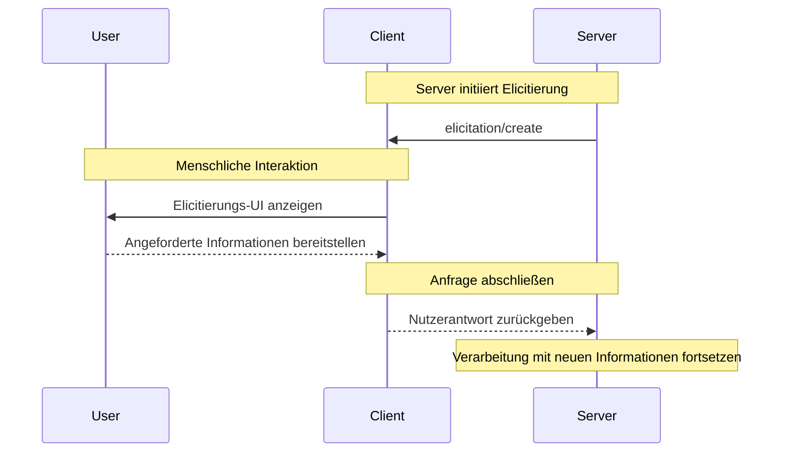
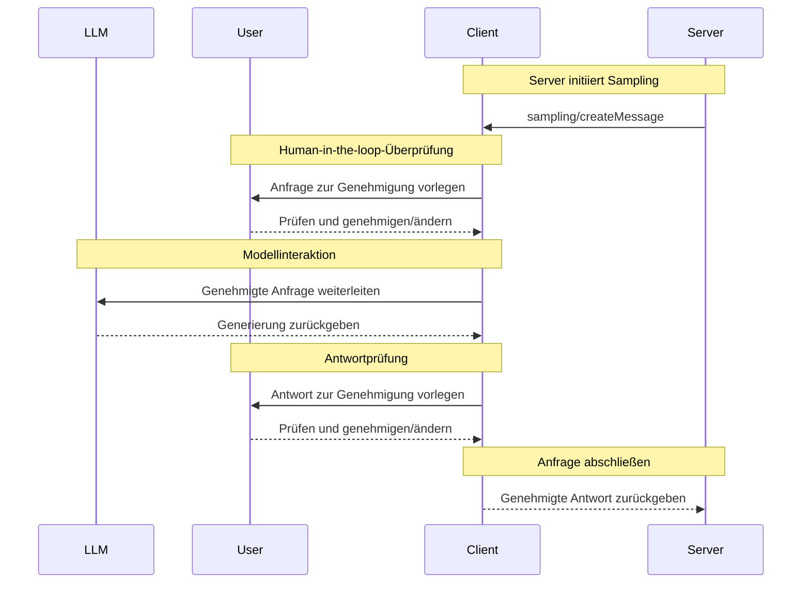

MCP-Clients werden von Host-Anwendungen instanziiert, um mit bestimmten MCP-Servern zu kommunizieren. Die Host-Anwendung, etwa Claude.ai oder eine IDE, steuert das gesamte Nutzererlebnis und koordiniert mehrere Clients. Jeder Client übernimmt die direkte Kommunikation mit genau einem Server.

Die Unterscheidung ist wichtig: Der _Host_ ist die Anwendung, mit der Nutzer interagieren, während _Clients_ die Protokollkomponenten sind, die Serververbindungen ermöglichen.

<div id="core-client-features">
  ## Zentrale Client-Funktionen
</div>

Zusätzlich zur Nutzung von Kontext, der von Servern bereitgestellt wird, können Clients den Servern mehrere Funktionen bereitstellen. Diese Client-Funktionen ermöglichen es Server-Autorinnen und -Autoren, reichhaltigere Interaktionen zu entwickeln.

| Funktion        | Erklärung                                                                                                                                                                                                 | Beispiel                                                                                                                                |
| --------------- | --------------------------------------------------------------------------------------------------------------------------------------------------------------------------------------------------------- | -------------------------------------------------------------------------------------------------------------------------------------- |
| **Sampling**    | Sampling ermöglicht es Servern, über den Client LLM-Completions anzufordern und so einen agentischen Workflow zu realisieren. Dieser Ansatz gibt dem Client die vollständige Kontrolle über Benutzerberechtigungen und Sicherheitsmaßnahmen. | Ein Server zur Reisebuchung kann eine Liste von Flügen an ein LLM senden und das LLM bitten, den besten Flug für die Nutzerin oder den Nutzer auszuwählen.           |
| **Wurzeln**     | Wurzeln ermöglichen es Clients, anzugeben, auf welche Dateien Server zugreifen können, und leiten sie zu relevanten Verzeichnissen, während Sicherheitsgrenzen gewahrt bleiben.                           | Ein Server zur Reisebuchung kann Zugriff auf ein bestimmtes Verzeichnis erhalten, aus dem er den Kalender einer Nutzerin oder eines Nutzers lesen kann.                     |
| **Elicitierung** | Elicitierung ermöglicht es Servern, während Interaktionen gezielt Informationen von Nutzerinnen und Nutzern anzufordern und bietet eine strukturierte Methode, um bei Bedarf Informationen zu erfassen. | Ein Server zur Reisebuchung kann nach den Präferenzen der Nutzerin oder des Nutzers für Flugzeugsitze, Zimmertyp oder die Kontaktnummer fragen, um eine Buchung abzuschließen. |

<div id="elicitation">
  ### Elicitierung
</div>

Elicitierung ermöglicht es Servern, während Interaktionen gezielt Informationen von Nutzern anzufordern und dadurch dynamischere und reaktionsschnellere Workflows zu schaffen.

<div id="overview">
  #### Übersicht
</div>

Elicitierung bietet eine strukturierte Möglichkeit für Server, bei Bedarf notwendige Informationen einzuholen. Anstatt alle Informationen im Voraus zu verlangen oder zu scheitern, wenn Daten fehlen, können Server ihre Verarbeitung pausieren, um gezielt Eingaben von Nutzern anzufordern. So entstehen flexiblere Interaktionen, bei denen sich Server an die Bedürfnisse der Nutzer anpassen, statt starren Mustern zu folgen.

**Ablauf der Elicitierung:**



Der Ablauf ermöglicht eine dynamische Informationsbeschaffung: Server können bei Bedarf spezifische Daten anfordern, Nutzer geben Informationen über eine passende UI ein, und Server setzen die Verarbeitung mit dem neu gewonnenen Kontext fort.

**Beispiel für Elicitierungs‑Komponenten:**

```typescript
{
  method: "elicitation/requestInput",
  params: {
    message: "Please confirm your Barcelona vacation booking details:",
    schema: {
      type: "object",
      properties: {
        confirmBooking: {
          type: "boolean",
          description: "Confirm the booking (Flights + Hotel = $3,000)"
        },
        seatPreference: {
          type: "string",
          enum: ["window", "aisle", "no preference"],
          description: "Preferred seat type for flights"
        },
        roomType: {
          type: "string",
          enum: ["sea view", "city view", "garden view"],
          description: "Preferred room type at hotel"
        },
        travelInsurance: {
          type: "boolean",
          default: false,
          description: "Add travel insurance ($150)"
        }
      },
      required: ["confirmBooking"]
    }
  }
}
```

<div id="example-holiday-booking-approval">
  #### Beispiel: Genehmigung einer Urlaubsbuchung
</div>

Ein Reisebuchungsserver demonstriert die Stärke der Elicitierung am abschließenden Buchungsbestätigungsprozess. Wenn ein Nutzer sein ideales Urlaubspaket nach Barcelona ausgewählt hat, muss der Server vor dem Fortfahren die endgültige Zustimmung und alle fehlenden Details einholen.

Der Server holt die Buchungsbestätigung mittels einer strukturierten Anfrage ein, die die Reisezusammenfassung (Flüge nach Barcelona vom 15.–22. Juni, Strandhotel, Gesamtbetrag: 3.000 $) sowie Felder für zusätzliche Präferenzen enthält – etwa Sitzplatzwahl, Zimmertyp oder Optionen für eine Reiseversicherung.

Während die Buchung fortschreitet, fordert der Server die Kontaktinformationen an, die zum Abschluss der Reservierung benötigt werden. Er könnte nach Reisendendaten für Flugbuchungen, Sonderwünschen für das Hotel oder Notfallkontaktinformationen fragen.

<div id="user-interaction-model">
  #### Modell der Benutzerinteraktion
</div>

Elicitierungsinteraktionen sind so gestaltet, dass sie klar, kontextualisiert und respektvoll gegenüber der Autonomie der Nutzer sind:

**Darstellung der Anfrage**: Clients zeigen Elicitierungsanfragen mit klarem Kontext an – welcher Server fragt, warum die Informationen benötigt werden und wie sie verwendet werden. Die Anfrage-Nachricht erläutert den Zweck, während das Schema Struktur und Validierung vorgibt.

**Antwortoptionen**: Nutzer können die angeforderten Informationen über passende UI-Steuerelemente (Textfelder, Dropdowns, Kontrollkästchen) bereitstellen, die Angabe mit optionaler Begründung verweigern oder den gesamten Vorgang abbrechen. Clients validieren Antworten anhand des bereitgestellten Schemas, bevor sie diese an Server zurücksenden.

**Datenschutzaspekte**: Elicitierung fordert niemals Passwörter oder API-Schlüssel an. Clients warnen vor verdächtigen Anfragen und ermöglichen es Nutzern, die Daten vor dem Senden zu überprüfen.

<div id="roots">
  ### Wurzeln
</div>

Wurzeln definieren Dateisystemgrenzen für Servervorgänge und ermöglichen Clients anzugeben, auf welche Verzeichnisse sich Server konzentrieren sollen.

<div id="overview">
  #### Überblick
</div>

Wurzeln sind ein Mechanismus, mit dem Clients Servern die Grenzen für den Dateisystemzugriff mitteilen. Sie bestehen aus Datei-URIs, die Verzeichnisse angeben, in denen Server arbeiten können, und helfen Servern, den Geltungsbereich der verfügbaren Dateien und Ordner zu verstehen. Anstatt Servern uneingeschränkten Zugriff auf das Dateisystem zu gewähren, lenken Wurzeln sie zu relevanten Arbeitsverzeichnissen, während Sicherheitsgrenzen gewahrt bleiben.

**Struktur einer Wurzel:**

```json
{
  "uri": "file:///Users/agent/travel-planning",
  "name": "Travel Planning Workspace"
}
```

Wurzeln sind ausschließlich Dateisystempfade und verwenden immer das `file://`-URI-Schema. Sie helfen Servern, Projektgrenzen, die Organisation des Arbeitsbereichs und zugängliche Verzeichnisse zu verstehen. Die Liste der Wurzeln kann dynamisch aktualisiert werden, wenn Nutzer mit unterschiedlichen Projekten oder Ordnern arbeiten; Server erhalten Benachrichtigungen über `roots/list_changed`, wenn sich die Grenzen ändern.

Wichtig ist, dass Wurzeln zwar Servern Hinweise darauf geben, wo sie tätig werden sollen, der Client jedoch stets die volle Kontrolle über den Dateizugriff behält. Wurzeln kommunizieren lediglich die vorgesehenen Grenzen – der tatsächliche Dateizugriff wird immer durch die Sicherheitsrichtlinien des Clients gesteuert.

<div id="example-travel-planning-workspace">
  #### Beispiel: Arbeitsbereich für Reiseplanung
</div>

Ein Reiseberater, der mehrere Kundenreisen betreut, profitiert von Wurzeln, um den Zugriff auf das Dateisystem zu organisieren. Stellen Sie sich einen Arbeitsbereich mit verschiedenen Verzeichnissen für unterschiedliche Aspekte der Reiseplanung vor.

Der Client stellt dem Reiseplanungs-Server Dateisystem-Wurzeln bereit:

- `file:///Users/agent/travel-planning` - Hauptarbeitsbereich mit allen Reisedateien
- `file:///Users/agent/travel-templates` - Wiederverwendbare Reiseplan-Vorlagen und Ressourcen
- `file:///Users/agent/client-documents` - Reisepässe der Kunden und Reisedokumente

Wenn der Agent eine Barcelona-Reiseplanung erstellt, arbeitet der Server innerhalb dieser Grenzen: Er greift auf Vorlagen zu, speichert die neue Reiseplanung und verweist auf Kundendokumente. Er kann nicht auf Dateien außerhalb dieser Wurzeln zugreifen. Server greifen in der Regel auf Dateien innerhalb von Wurzeln zu, indem sie relative Pfade von den Wurzelverzeichnissen verwenden oder Dateisuchwerkzeuge nutzen, die die Wurzelgrenzen respektieren.

Wenn der Agent einen Archivordner wie `file:///Users/agent/archive/2023-trips` öffnet, aktualisiert der Client die Wurzelliste über `roots/list_changed`.

<div id="user-interaction-model">
  #### Benutzerinteraktionsmodell
</div>

Wurzeln werden in der Regel automatisch von Host-Anwendungen basierend auf Benutzeraktionen verwaltet, auch wenn einige Anwendungen eine manuelle Verwaltung von Wurzeln ermöglichen:

**Automatische Erkennung von Wurzeln**: Wenn Benutzer Ordner öffnen, stellen Clients diese automatisch als Wurzeln bereit. Das Öffnen eines Reise-Arbeitsbereichs gewährt Servern Zugriff auf Reiserouten und Dokumente in diesem Verzeichnis.

**Manuelle Konfiguration von Wurzeln**: Erfahrene Benutzer können Wurzeln über die Konfiguration festlegen. Zum Beispiel kann `/travel-templates` für wiederverwendbare Ressourcen hinzugefügt werden, während Verzeichnisse mit Finanzunterlagen ausgeschlossen werden.

<div id="sampling">
  ### Sampling
</div>

Sampling ermöglicht es Servern, über den Client Sprachmodell‑Vervollständigungen anzufordern. So werden agentische Funktionen ermöglicht, während Sicherheit und Nutzerkontrolle gewahrt bleiben.

<div id="overview">
  #### Überblick
</div>

Sampling ermöglicht es Servern, KI-abhängige Aufgaben auszuführen, ohne KI-Modelle direkt zu integrieren oder dafür zu bezahlen. Stattdessen können Server den Client – der bereits Zugriff auf KI-Modelle hat – bitten, diese Aufgaben in ihrem Namen zu übernehmen. Dieser Ansatz gibt dem Client die vollständige Kontrolle über Benutzerberechtigungen und Sicherheitsmaßnahmen. Da Sampling-Anfragen im Kontext anderer Operationen stattfinden – etwa wenn ein Werkzeug Daten analysiert – und als separate Modellaufrufe verarbeitet werden, bleiben die Grenzen zwischen verschiedenen Kontexten klar, was eine effizientere Nutzung des Kontextfensters ermöglicht.

**Sampling-Ablauf:**



Der Ablauf gewährleistet Sicherheit durch mehrere Human-in-the-loop-Kontrollpunkte. Benutzer prüfen die ursprüngliche Anfrage und die generierte Antwort und können beide vor der Rückgabe an den Server ändern.

**Beispiel für Anforderungsparameter:**

```typescript
{
  messages: [
    {
      role: "user",
      content: "Analyze these flight options and recommend the best choice:\n" +
               "[47 flights with prices, times, airlines, and layovers]\n" +
               "User preferences: morning departure, max 1 layover"
    }
  ],
  modelPreferences: {
    hints: [{
      name: "claude-3-5-sonnet"  // Suggested model
    }],
    costPriority: 0.3,      // Less concerned about API cost
    speedPriority: 0.2,     // Can wait for thorough analysis
    intelligencePriority: 0.9  // Need complex trade-off evaluation
  },
  systemPrompt: "You are a travel expert helping users find the best flights based on their preferences",
  maxTokens: 1500
}
```

<div id="example-flight-analysis-tool">
  #### Beispiel: Werkzeug zur Fluganalyse
</div>

Stellen Sie sich einen Reisebuchungs-Server mit einem Werkzeug namens `findBestFlight` vor, das Sampling verwendet, um verfügbare Flüge zu analysieren und die optimale Option zu empfehlen. Wenn ein Nutzer fragt: „Buche mir nächsten Monat den besten Flug nach Barcelona“, benötigt das Werkzeug KI-Unterstützung, um komplexe Abwägungen vorzunehmen.

Das Werkzeug fragt Fluggesellschafts-APIs ab und sammelt 47 Flugoptionen. Anschließend fordert es KI-Unterstützung an, um diese Optionen zu analysieren: „Analysiere diese Flugoptionen und empfehle die beste Wahl: [47 Flüge mit Preisen, Zeiten, Fluggesellschaften und Zwischenstopps] Nutzerpräferenzen: Abflug am Morgen, max. 1 Zwischenstopp.“

Der Client initiiert die Sampling-Anfrage und ermöglicht der KI, Abwägungen vorzunehmen – etwa günstigere Nachtflüge gegenüber bequemen morgendlichen Abflügen. Das Werkzeug nutzt diese Analyse, um die drei besten Empfehlungen zu präsentieren.

<div id="user-interaction-model">
  #### Benutzerinteraktionsmodell
</div>

Sampling ist zwar nicht zwingend erforderlich, wurde jedoch so konzipiert, dass menschliche Kontrolle im Ablauf möglich ist. Nutzer können die Aufsicht über mehrere Mechanismen wahren:

**Genehmigungssteuerelemente**: Sampling-Anfragen können eine ausdrückliche Zustimmung des Nutzers erfordern. Clients können anzeigen, was der Server analysieren möchte und warum. Nutzer können Anfragen genehmigen, ablehnen oder anpassen.

**Transparenzfunktionen**: Clients können den genauen Prompt, die Modellauswahl und Token-Grenzen anzeigen, sodass Nutzer KI-Antworten prüfen können, bevor sie an den Server zurückgesendet werden.

**Konfigurationsoptionen**: Nutzer können Modellpräferenzen festlegen, automatische Genehmigungen für vertrauenswürdige Vorgänge konfigurieren oder eine Genehmigung für alles verlangen. Clients können Optionen zum Redigieren sensibler Informationen bereitstellen.

**Sicherheitsaspekte**: Sowohl Clients als auch Server müssen während des Sampling sensible Daten angemessen behandeln. Clients sollten Rate Limiting implementieren und sämtliche Nachrichteninhalte validieren. Das Human-in-the-Loop-Design stellt sicher, dass vom Server initiierte KI-Interaktionen die Sicherheit nicht gefährden oder auf sensible Daten zugreifen können, ohne ausdrückliche Zustimmung des Nutzers.