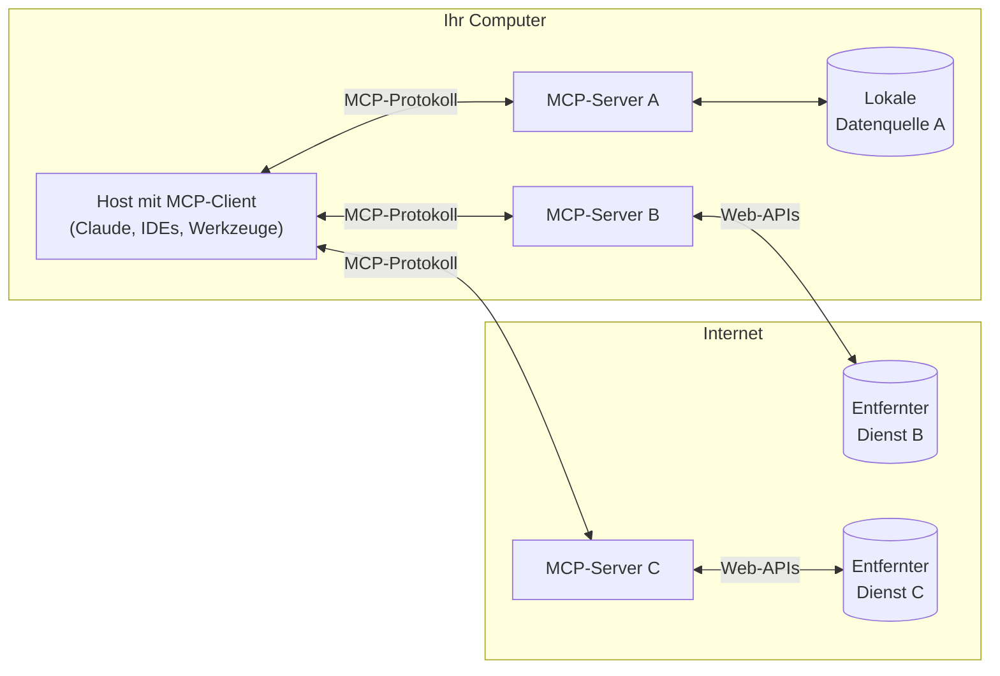

MCP ist ein offenes Protokoll, das standardisiert, wie Anwendungen LLMs Kontext bereitstellen. Denken Sie an MCP wie an einen USB‑C‑Anschluss für KI-Anwendungen. So wie USB‑C eine standardisierte Möglichkeit bietet, Ihre Geräte mit verschiedenen Peripheriegeräten und Zubehör zu verbinden, bietet MCP eine standardisierte Möglichkeit, KI-Modelle mit unterschiedlichen Datenquellen und Werkzeugen zu verbinden.

  ## Warum MCP?

MCP hilft Ihnen, Agenten und komplexe Workflows auf Basis von LLMs zu entwickeln. LLMs müssen häufig mit Daten und Werkzeugen integriert werden, und MCP bietet:

* Eine wachsende Liste vorgefertigter Integrationen, die Ihr LLM direkt nutzen kann
* Die Flexibilität, zwischen LLM-Anbietern und -Dienstleistern zu wechseln
* Bewährte Verfahren, um Ihre Daten innerhalb Ihrer Infrastruktur zu schützen

  ### Allgemeine Architektur

Im Kern folgt MCP einer Client-Server-Architektur, bei der eine Host-Anwendung eine Verbindung zu mehreren Servern herstellen kann:

* **MCP-Hosts**: Programme wie Claude Desktop, IDEs oder KI-Werkzeuge, die über MCP auf Daten zugreifen möchten
* **MCP-Clients**: Protokoll-Clients, die 1:1-Verbindungen mit Servern aufrechterhalten
* **MCP-Server**: Schlanke Programme, die jeweils spezifische Fähigkeiten über das standardisierte Model Context Protocol bereitstellen
* **Lokale Datenquellen**: Die Dateien, Datenbanken und Dienste Ihres Computers, auf die MCP-Server sicher zugreifen können
* **Entfernte Dienste**: Externe Systeme, die über das Internet verfügbar sind (z. B. über APIs), mit denen sich MCP-Server verbinden können

  ## Erste Schritte

Wählen Sie den Weg, der Ihren Anforderungen am besten entspricht:

  ### Schnellstart

<CardGroup cols={2}>
  <Card title="Für Serverentwickler" icon="bolt" href="/de/quickstart/server">
    Starten Sie mit dem Erstellen eines eigenen Servers für die Verwendung in Claude für Desktop und anderen Clients
  </Card>

  <Card title="Für Cliententwickler" icon="bolt" href="/de/quickstart/client">
    Starten Sie mit dem Erstellen eines eigenen Clients, der sich mit allen MCP-Servern integrieren kann
  </Card>

  <Card title="Für Claude-Desktop-Nutzer" icon="bolt" href="/de/docs/develop/connect-local-servers">
    Starten Sie mit der Verwendung vorkonfigurierter Server in Claude für Desktop
  </Card>
</CardGroup>

  ### Beispiele

<CardGroup cols={2}>
  <Card title="Beispielserver" icon="grid" href="/de/examples">
    Entdecken Sie unsere Galerie offizieller MCP-Server und Implementierungen
  </Card>

  <Card title="Beispielclients" icon="cubes" href="/de/clients">
    Sehen Sie sich die Liste der Clients an, die MCP-Integrationen unterstützen
  </Card>
</CardGroup>

  ## Tutorials

<CardGroup cols={2}>
  <Card title="MCP mit LLMs entwickeln" icon="comments" href="/de/tutorials/building-mcp-with-llms">
    Lernen Sie, wie Sie LLMs wie Claude einsetzen, um Ihre MCP-Entwicklung zu beschleunigen
  </Card>

  <Card title="Debugging-Leitfaden" icon="bug" href="/de/legacy/tools/debugging">
    Erfahren Sie, wie Sie MCP-Server und Integrationen effektiv debuggen
  </Card>

  <Card title="MCP-Inspektor" icon="magnifying-glass" href="/de/legacy/tools/inspector">
    Testen und inspizieren Sie Ihre MCP-Server mit unserem interaktiven Debugging-Werkzeug
  </Card>

  <Card title="MCP-Workshop (Video, 2 Std.)" icon="person-chalkboard" href="https://www.youtube.com/watch?v=kQmXtrmQ5Zg">
    <iframe src="https://www.youtube.com/embed/kQmXtrmQ5Zg" />
  </Card>
</CardGroup>

  ## MCP erkunden

Tauchen Sie tiefer in die Kernkonzepte und Fähigkeiten von MCP ein:

<CardGroup cols={2}>
  <Card title="Kernarchitektur" icon="sitemap" href="/de/legacy/concepts/architecture">
    Verstehen Sie, wie MCP Clients, Server und LLMs verbindet
  </Card>

  <Card title="Ressourcen" icon="database" href="/de/legacy/concepts/resources">
    Stellen Sie Daten und Inhalte von Ihren Servern für LLMs bereit
  </Card>

  <Card title="Prompts" icon="message" href="/de/legacy/concepts/prompts">
    Erstellen Sie wiederverwendbare Prompt-Vorlagen und Workflows
  </Card>

  <Card title="Werkzeuge" icon="wrench" href="/de/legacy/concepts/tools">
    Ermöglichen Sie LLMs, Aktionen über Ihren Server auszuführen
  </Card>

  <Card title="Sampling" icon="robot" href="/de/legacy/concepts/sampling">
    Lassen Sie Ihre Server Vervollständigungen von LLMs anfordern
  </Card>

  <Card title="Transporte" icon="network-wired" href="/de/legacy/concepts/transports">
    Erfahren Sie mehr über den Kommunikationsmechanismus von MCP
  </Card>
</CardGroup>

  ## Mitmachen

Sie möchten mitwirken? Lesen Sie unseren [Beitragsleitfaden](/de/development/contributing), um zu erfahren, wie Sie MCP verbessern können.

  ## Support und Feedback

So erhalten Sie Hilfe oder geben Rückmeldung:

* Für Fehlerberichte und Funktionswünsche zur MCP-Spezifikation, den SDKs oder der (Open-Source-)Dokumentation bitte [ein GitHub-Issue erstellen](https://github.com/modelcontextprotocol)
* Für Diskussionen oder Fragen zur MCP-Spezifikation nutzen Sie die [Specification Discussions](https://github.com/modelcontextprotocol/specification/discussions)
* Für Diskussionen oder Fragen zu anderen Open-Source-Komponenten von MCP nutzen Sie die [Organization Discussions](https://github.com/orgs/modelcontextprotocol/discussions)
* Für Fehlerberichte, Funktionswünsche und Fragen zur MCP-Integration von Claude.app und claude.ai siehe Anthropics Leitfaden: [How to Get Support](https://support.anthropic.com/en/articles/9015913-how-to-get-support)