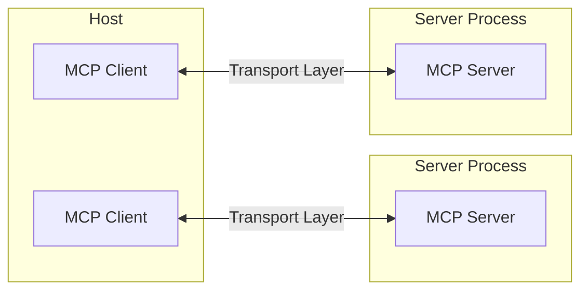
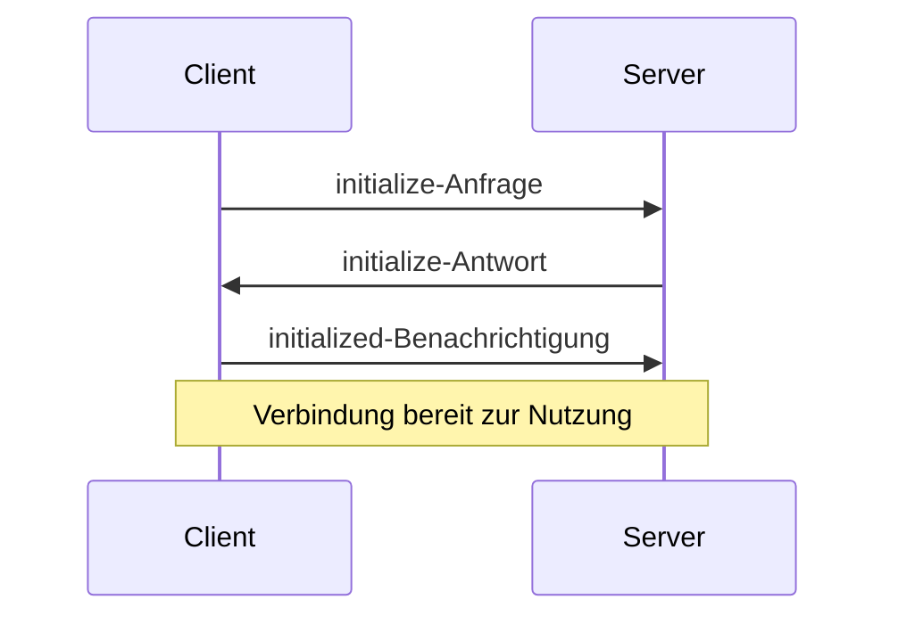

Das Model Context Protocol (MCP) basiert auf einer flexiblen, erweiterbaren Architektur, die eine nahtlose Kommunikation zwischen LLM-Anwendungen und Integrationen ermöglicht. Dieses Dokument behandelt die zentralen architektonischen Komponenten und Konzepte.

<div id="overview">
  ## Überblick
</div>

MCP folgt einer Client-Server-Architektur, bei der:

* **Hosts** LLM-Anwendungen sind (wie Claude Desktop oder IDEs), die Verbindungen initiieren
* **Clients** 1:1-Verbindungen mit Servern innerhalb der Host-Anwendung aufrechterhalten
* **Server** Kontext, Tools und Prompts für Clients bereitstellen



<div id="core-components">
  ## Zentrale Komponenten
</div>

<div id="protocol-layer">
  ### Protokollschicht
</div>

Die Protokollschicht kümmert sich um Nachrichtenframing, die Verknüpfung von Anfrage und Antwort sowie um hochlevelige Kommunikationsmuster.

<CodeGroup>
  ```typescript TypeScript
  class Protocol<Request, Notification, Result> {
    // Handle incoming requests
    setRequestHandler<T>(
      schema: T,
      handler: (request: T, extra: RequestHandlerExtra) => Promise<Result>,
    ): void;

    // Handle incoming notifications
    setNotificationHandler<T>(
      schema: T,
      handler: (notification: T) => Promise<void>,
    ): void;

    // Send requests and await responses
    request<T>(request: Request, schema: T, options?: RequestOptions): Promise<T>;

    // Send one-way notifications
    notification(notification: Notification): Promise<void>;
  }
  ```

  ```python Python
  class Session(BaseSession[RequestT, NotificationT, ResultT]):
      async def send_request(
          self,
          request: RequestT,
          result_type: type[Result]
      ) -> Result:
          """Anfrage senden und auf Antwort warten. Löst McpError aus, wenn die Antwort einen Fehler enthält."""
          # Implementierung der Anfrageverarbeitung

      async def send_notification(
          self,
          notification: NotificationT
      ) -> None:
          """Einweg-Benachrichtigung senden, die keine Antwort erwartet."""
          # Implementierung der Benachrichtigungsverarbeitung

      async def _received_request(
          self,
          responder: RequestResponder[ReceiveRequestT, ResultT]
      ) -> None:
          """Eingehende Anfrage von der Gegenseite verarbeiten."""
          # Implementierung der Anfrageverarbeitung

      async def _received_notification(
          self,
          notification: ReceiveNotificationT
      ) -> None:
          """Eingehende Benachrichtigung von der Gegenseite verarbeiten."""
          # Implementierung der Benachrichtigungsverarbeitung
  ```
</CodeGroup>

Zentrale Klassen sind:

* `Protocol`
* `Client`
* `Server`

<div id="transport-layer">
  ### Transportschicht
</div>

Die Transportschicht übernimmt die eigentliche Kommunikation zwischen Clients und Servern. MCP unterstützt mehrere Transportmechanismen:

1. **STDIO-Transport**
   * Verwendet Standard Input/Output für die Kommunikation
   * Ideal für lokale Prozesse

2. **Streamable-HTTP-Transport**
   * Verwendet HTTP mit optionalen Server-Sent Events für Streaming
   * HTTP POST für Nachrichten vom Client zum Server

Alle Transporte verwenden [JSON-RPC](https://www.jsonrpc.org/) 2.0 zum Austausch von Nachrichten. Siehe die [Spezifikation](/de/specification/) für detaillierte Informationen zum Nachrichtenformat des Model Context Protocol.

<div id="message-types">
  ### Nachrichtentypen
</div>

MCP unterscheidet die folgenden Haupttypen von Nachrichten:

1. **Requests** erwarten eine Antwort von der Gegenseite:

   ```typescript
   interface Request {
     method: string;
     params?: { ... };
   }
   ```

2. **Results** sind erfolgreiche Antworten auf Requests:

   ```typescript
   interface Result {
     [key: string]: unknown;
   }
   ```

3. **Errors** zeigen an, dass ein Request fehlgeschlagen ist:

   ```typescript
   interface Error {
     code: number;
     message: string;
     data?: unknown;
   }
   ```

4. **Benachrichtigungen** sind Einweg-Nachrichten, die keine Antwort erwarten:
   ```typescript
   interface Notification {
     method: string;
     params?: { ... };
   }
   ```

<div id="connection-lifecycle">
  ## Verbindungslebenszyklus
</div>

<div id="1-initialization">
  ### 1. Initialisierung
</div>



1. Client sendet eine `initialize`-Anfrage mit Protokollversion und Fähigkeiten
2. Server antwortet mit seiner Protokollversion und seinen Fähigkeiten
3. Client sendet eine `initialized`-Benachrichtigung als Bestätigung
4. Der normale Nachrichtenaustausch beginnt

<div id="2-message-exchange">
  ### 2. Nachrichtenaustausch
</div>

Nach der Initialisierung werden die folgenden Muster unterstützt:

* **Request-Response**: Client oder Server sendet Anfragen, die Gegenseite antwortet
* **Benachrichtigungen**: Eine der Parteien sendet Einweg-Nachrichten

<div id="3-termination">
  ### 3. Beendigung
</div>

Beide Parteien können die Verbindung beenden:

* Ordnungsgemäßes Herunterfahren über `close()`
* Unterbrechung des Transports
* Fehlersituationen

<div id="error-handling">
  ## Fehlerbehandlung
</div>

MCP definiert diese standardisierten Fehlercodes:

```typescript
enum ErrorCode {
  // Standard-JSON-RPC-Fehlercodes
  ParseError = -32700,
  InvalidRequest = -32600,
  MethodNotFound = -32601,
  InvalidParams = -32602,
  InternalError = -32603,
}
```

SDKs und Anwendungen können eigene Fehlercodes größer als -32000 definieren.

Fehler werden propagiert durch:

* Fehlerantworten auf Requests
* Fehlerereignisse auf Transporten
* Fehlerbehandler auf Protokollebene

<div id="implementation-example">
  ## Implementierungsbeispiel
</div>

Hier ist ein einfaches Beispiel für die Implementierung eines MCP-Servers:

<CodeGroup>
  ```typescript TypeScript
  import { Server } from "@modelcontextprotocol/sdk/server/index.js";
  import { StdioServerTransport } from "@modelcontextprotocol/sdk/server/stdio.js";

  const server = new Server(
    {
      name: "example-server",
      version: "1.0.0",
    },
    {
      capabilities: {
        resources: {},
      },
    },
  );

  // Anfragen verarbeiten
  server.setRequestHandler(ListResourcesRequestSchema, async () => {
    return {
      resources: [
        {
          uri: "example://resource",
          name: "Example Resource",
        },
      ],
    };
  });

  // Transport verbinden
  const transport = new StdioServerTransport();
  await server.connect(transport);
  ```

  ```python Python
  import asyncio
  import mcp.types as types
  from mcp.server import Server
  from mcp.server.stdio import stdio_server

  app = Server("example-server")

  @app.list_resources()
  async def list_resources() -> list[types.Resource]:
      return [
          types.Resource(
              uri="example://resource",
              name="Example Resource"
          )
      ]

  async def main():
      async with stdio_server() as streams:
          await app.run(
              streams[0],
              streams[1],
              app.create_initialization_options()
          )

  if __name__ == "__main__":
      asyncio.run(main())
  ```
</CodeGroup>

<div id="best-practices">
  ## Bewährte Verfahren
</div>

<div id="transport-selection">
  ### Transportauswahl
</div>

1. **Lokale Kommunikation**
   * Verwenden Sie den STDIO-Transport für lokale Prozesse
   * Effizient für die Kommunikation auf demselben Rechner
   * Einfaches Prozessmanagement

2. **Remote-Kommunikation**
   * Verwenden Sie Streamable HTTP für Szenarien, die HTTP-Kompatibilität erfordern
   * Berücksichtigen Sie Sicherheitsaspekte, einschließlich Authentifizierung und Autorisierung

<div id="message-handling">
  ### Nachrichtenverarbeitung
</div>

1. **Anfragenverarbeitung**
   * Eingaben gründlich validieren
   * Typsichere Schemas verwenden
   * Fehler robust behandeln
   * Timeouts implementieren

2. **Fortschrittsberichterstattung**
   * Fortschritts-Token für lang laufende Operationen verwenden
   * Fortschritt schrittweise melden
   * Gesamten Fortschritt angeben, wenn bekannt

3. **Fehlermanagement**
   * Geeignete Fehlercodes verwenden
   * Aussagekräftige Fehlermeldungen bereitstellen
   * Ressourcen bei Fehlern bereinigen

<div id="security-considerations">
  ## Sicherheitsaspekte
</div>

1. **Transportsicherheit**
   * TLS für Remote-Verbindungen verwenden
   * Herkunft von Verbindungen prüfen
   * Bei Bedarf Authentifizierung einführen

2. **Nachrichtenvalidierung**
   * Alle eingehenden Nachrichten validieren
   * Eingaben bereinigen
   * Größenbeschränkungen für Nachrichten prüfen
   * JSON-RPC-Format prüfen

3. **Ressourcenschutz**
   * Zugriffskontrollen umsetzen
   * Ressourcenpfade validieren
   * Ressourcennutzung überwachen
   * Anfragen rate-limitieren

4. **Fehlerbehandlung**
   * Keine sensiblen Informationen preisgeben
   * Sicherheitsrelevante Fehler protokollieren
   * Ordnungsgemäße Bereinigung sicherstellen
   * DoS-Szenarien behandeln

<div id="debugging-and-monitoring">
  ## Debugging und Monitoring
</div>

1. **Logging**
   * Protokollereignisse aufzeichnen
   * Nachrichtenfluss nachverfolgen
   * Leistung überwachen
   * Fehler protokollieren

2. **Diagnostik**
   * Health Checks implementieren
   * Verbindungszustand überwachen
   * Ressourcennutzung nachverfolgen
   * Performance profilieren

3. **Tests**
   * Verschiedene Transporte testen
   * Fehlerbehandlung überprüfen
   * Randfälle prüfen
   * Server einem Lasttest unterziehen