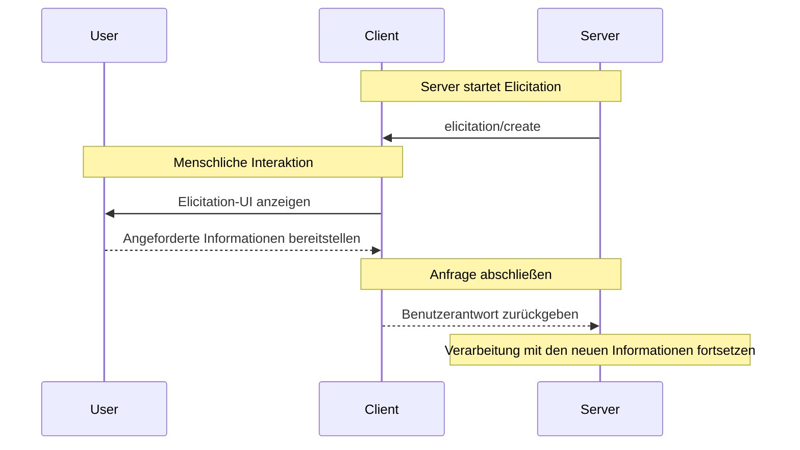

Elicitation ist eine leistungsfähige MCP-Funktion, die es Servern ermöglicht, während Interaktionen zusätzliche Informationen von Nutzenden anzufordern. So werden dynamische Workflows möglich, bei denen Server benötigte Daten bedarfsorientiert erheben können – bei gleichzeitiger Wahrung von Nutzerkontrolle und Privatsphäre.

<Info>
  Elicitation wurde in der MCP-Spezifikation [Revision
  2025-06-18](/de/specification/2025-06-18/client/elicitation) neu eingeführt.
</Info>

<div id="what-is-elicitation">
  ## Was ist Elicitation?
</div>

Elicitation bietet eine standardisierte Methode für MCP-Server, über den Client strukturierte Informationen von Nutzerinnen und Nutzern anzufordern. Anstatt alle Informationen im Voraus zu verlangen, können Server genau dann spezifische Daten abfragen, wenn sie benötigt werden, was natürlichere und flexiblere Interaktionen ermöglicht.

Beispielsweise könnte ein Server:

* Beim Herstellen einer Verbindung zu einem Dienst nach einem Benutzernamen fragen
* Während der Einrichtung nach Konfigurationspräferenzen fragen
* Projektdetails abfragen, wenn neue Ressourcen erstellt werden

<div id="how-elicitation-works">
  ## Wie Elicitation funktioniert
</div>

Der Elicitation-Ablauf ist unkompliziert:

1. Der Server sendet eine Elicitation-Anfrage mit einer Nachricht und der erwarteten Datenstruktur.
2. Der Client zeigt die Anfrage der Nutzerin/dem Nutzer in einer geeigneten Benutzeroberfläche an.
3. Die Nutzerin/der Nutzer akzeptiert, lehnt ab oder bricht die Anfrage ab.
4. Der Client validiert die Antwort und sendet sie an den Server zurück.
5. Der Server setzt die Verarbeitung mit den bereitgestellten Informationen fort.

<div id="request-structure">
  ## Anfragestruktur
</div>

Elicitation-Anfragen enthalten zwei zentrale Komponenten:

<div id="message">
  ### Nachricht
</div>

Eine klare, gut verständliche Erklärung, welche Informationen benötigt werden und warum.

<div id="schema">
  ### Schema
</div>

Ein JSON-Schema, das die erwartete Struktur der Antwort definiert. Das Schema ist bewusst auf flache Objekte mit primitiven Typen beschränkt, um die Implementierung im Client zu vereinfachen.

Beispielanfrage:

```json
{
  "message": "Please provide your GitHub username",
  "requestedSchema": {
    "type": "object",
    "properties": {
      "username": {
        "type": "string",
        "title": "GitHub Username",
        "description": "Your GitHub username (e.g., octocat)"
      }
    },
    "required": ["username"]
  }
}
```

<div id="supported-data-types">
  ## Unterstützte Datentypen
</div>

Elicitation unterstützt die folgenden primitiven Typen:

<div id="text-input">
  ### Texteingabe
</div>

```json
{
  "type": "string",
  "title": "Projektname",
  "description": "Name für Ihr neues Projekt",
  "minLength": 3,
  "maxLength": 50,
  "default": "my-project"
}
```

<div id="numbers">
  ### Zahlen
</div>

```json
{
  "type": "number",
  "title": "Portnummer",
  "description": "Port, auf dem der Server läuft",
  "minimum": 1024,
  "maximum": 65535,
  "default": 3000
}
```

<div id="boolean-choices">
  ### Boolesche Optionen
</div>

```json
{
  "type": "boolean",
  "title": "Analysen aktivieren",
  "description": "Anonyme Nutzungsstatistiken senden",
  "default": false
}
```

<div id="selection-lists">
  ### Auswahllisten
</div>

```json
{
  "type": "string",
  "title": "Umgebung",
  "enum": ["development", "staging", "production"],
  "enumNames": ["Entwicklung", "Staging", "Produktion"],
  "default": "development"
}
```

<div id="user-response-actions">
  ## Benutzerreaktionen
</div>

Benutzer können auf Elicitation-Anfragen auf drei Arten reagieren:

1. **Akzeptieren**: Der Benutzer gibt die angeforderten Informationen an
2. **Ablehnen**: Der Benutzer verweigert ausdrücklich die Bereitstellung von Informationen
3. **Abbrechen**: Der Benutzer schließt ohne Auswahl ab (z. B. Dialog schließen)

Server sollten jede Antwort angemessen behandeln:

* Akzeptieren → Die bereitgestellten Daten verarbeiten
* Ablehnen → Alternativen anbieten oder den Ablauf anpassen
* Abbrechen → Später erneut versuchen oder Standardwerte verwenden in Erwägung ziehen

<div id="best-practices">
  ## Best Practices
</div>

Bei der Implementierung von Elicitation:

<div id="for-servers">
  ### Für Server
</div>

1. **Sei klar**: Verfasse aussagekräftige Nachrichten, die erklären, warum Informationen benötigt werden
2. **Sei minimal**: Fordere nur unbedingt notwendige Informationen an
3. **Sei flexibel**: Halte Rückfalloptionen für abgelehnte oder abgebrochene Anfragen bereit
4. **Sei zeitnah**: Fordere Informationen an, wenn sie tatsächlich benötigt werden, nicht im Voraus
5. **Sei respektvoll**: Fordere niemals sensible Informationen wie Passwörter oder Token an

<div id="for-clients">
  ### Für Clients
</div>

1. **Seien Sie transparent**: Zeigen Sie deutlich, welcher Server Informationen anfordert
2. **Schützen Sie**: Ermöglichen Sie Nutzerinnen und Nutzern, Antworten zu prüfen und zu bearbeiten
3. **Validieren Sie**: Prüfen Sie Antworten anhand des bereitgestellten Schemas
4. **Ermächtigen Sie**: Heben Sie die Optionen „Ablehnen“ und „Abbrechen“ deutlich hervor
5. **Begrenzen Sie**: Implementieren Sie Rate Limiting, um Spam zu verhindern

<div id="common-use-cases">
  ## Häufige Anwendungsfälle
</div>

Elicitation eignet sich besonders in Szenarien wie:

* **Ersteinrichtung**: Erfassen von Konfigurationen während der ersten Einrichtung
* **Dynamische Workflows**: Anfordern kontextspezifischer Informationen
* **Benutzervorlieben**: Sammeln optionaler Einstellungen und Präferenzen
* **Projektdetails**: Erfassen von Metadaten zu den zu erstellenden Ressourcen
* **Service-Integration**: Anfordern von Benutzernamen oder IDs für externe Dienste

<div id="example-workflow">
  ## Beispiel-Workflow
</div>

So läuft eine typische Elicitation-Interaktion ab:



<div id="security-considerations">
  ## Sicherheitsüberlegungen
</div>

<Warning>
  Server dürfen niemals Elicitation verwenden, um nach Passwörtern, API-Schlüsseln, Token oder
  anderen sensiblen Zugangsdaten zu fragen. Verwenden Sie stattdessen geeignete Authentifizierungsabläufe.
</Warning>

Wichtige Sicherheitsrichtlinien:

1. Server sollten nur nicht sensible Informationen anfordern
2. Clients sollten klar angeben, welcher Server Daten anfordert
3. Benutzer sollten stets die Möglichkeit haben, abzulehnen
4. Antworten sollten gegen das Schema validiert werden
5. Ratenbegrenzung sollte Anfragestürme verhindern

<div id="implementation-example">
  ## Implementierungsbeispiel
</div>

So könnte ein Server Elicitation verwenden, um Projektinformationen zu erfassen:

```typescript
// Server fordert Projektdetails an
const response = await client.request("elicitation/create", {
  message: "Lass uns dein neues Projekt einrichten",
  requestedSchema: {
    type: "object",
    properties: {
      name: {
        type: "string",
        title: "Projektname",
        description: "Ein aussagekräftiger Name für dein Projekt",
      },
      framework: {
        type: "string",
        title: "Framework",
        enum: ["react", "vue", "angular", "none"],
        enumNames: ["React", "Vue", "Angular", "None"],
      },
      useTypeScript: {
        type: "boolean",
        title: "TypeScript verwenden",
        default: true,
      },
      port: {
        type: "number",
        title: "Entwicklungsport",
        description: "Portnummer für den Dev-Server",
        default: 3000,
      },
    },
    required: ["name", "framework"],
  },
});

// Antwort verarbeiten
if (response.action === "accept") {
  // Projekt mit den angegebenen Details erstellen
  await createProject(response.content);
} else if (response.action === "decline") {
  // Standardwerte verwenden oder Alternativen anbieten
  await createDefaultProject();
} else {
  // Benutzer hat abgebrochen – ggf. später erneut versuchen
  console.log("Projekterstellung abgebrochen");
}
```

Dieser Ansatz ermöglicht eine reibungslose, interaktive Erfahrung und respektiert zugleich Benutzerkontrolle und Datenschutz.