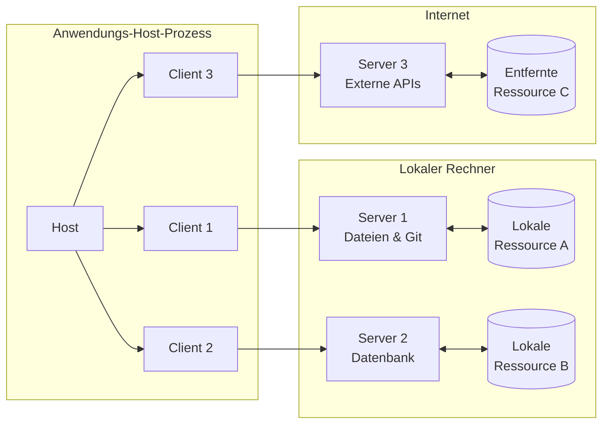
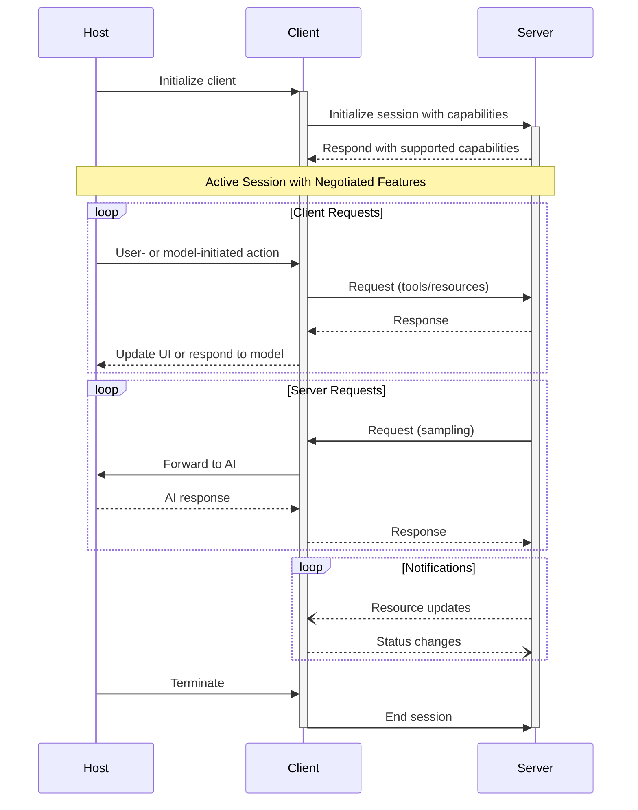

Das Model Context Protocol (MCP) folgt einer Client-Host-Server-Architektur, in der jeder Host mehrere Client-Instanzen ausführen kann. Diese Architektur ermöglicht es Nutzenden, KI-Funktionen anwendungsübergreifend zu integrieren, während klare Sicherheitsgrenzen gewahrt und Zuständigkeiten sauber getrennt werden. Aufbauend auf JSON-RPC 2.0 bietet MCP ein zustandsbehaftetes Sitzungsprotokoll, das sich auf den Austausch von Kontext und die Koordination von Sampling zwischen Clients und Servern konzentriert.

  ## Zentrale Komponenten

  ### Host

Der Host-Prozess dient als Container und Koordinator:

* Erstellt und verwaltet mehrere Client-Instanzen
* Steuert Verbindungsberechtigungen und Lebenszyklus der Clients
* Setzt Sicherheitsrichtlinien und Einwilligungsvorgaben durch
* Trifft Entscheidungen zur Benutzerautorisierung
* Koordiniert die AI/LLM-Integration und das Sampling
* Verwaltet die Kontextaggregation über Clients hinweg

  ### Clients

Jeder Client wird vom Host erstellt und hält eine isolierte Serververbindung aufrecht:

* Etabliert eine zustandsbehaftete Sitzung pro Server
* Handhabt Protokoll- und Fähigkeitenaushandlung
* Leitet Protokollnachrichten bidirektional weiter
* Verwaltert Abonnements und Benachrichtigungen
* Gewährleistet Sicherheitsgrenzen zwischen Servern

Eine Host-Anwendung erstellt und verwaltet mehrere Clients, wobei jeder Client in einer 1:1-Beziehung zu einem bestimmten Server steht.

  ### Server

Server stellen spezialisierten Kontext und Fähigkeiten bereit:

* Stellen Ressourcen, Werkzeuge und Prompts über MCP-Primitiven bereit
* Arbeiten unabhängig mit klar abgegrenzten Zuständigkeiten
* Fordern Sampling über Client-Schnittstellen an
* Müssen Sicherheitsvorgaben einhalten
* Können lokale Prozesse oder entfernte Dienste sein

  ## Designgrundsätze

MCP basiert auf mehreren zentralen Designgrundsätzen, die seine Architektur und
Implementierung prägen:

1. **Server sollten extrem einfach zu entwickeln sein**
   * Host-Anwendungen übernehmen die komplexe Orchestrierung
   * Server fokussieren sich auf spezifische, klar definierte Fähigkeiten
   * Einfache Schnittstellen minimieren den Implementierungsaufwand
   * Klare Trennung ermöglicht gut wartbaren Code

2. **Server sollten hochgradig komponierbar sein**
   * Jeder Server liefert isoliert fokussierte Funktionalität
   * Mehrere Server lassen sich nahtlos kombinieren
   * Ein gemeinsames Protokoll ermöglicht Interoperabilität
   * Modulares Design unterstützt Erweiterbarkeit

3. **Server sollten weder das gesamte Gespräch lesen noch „in“ andere Server „hineinsehen“ können**
   * Server erhalten nur die notwendigen Kontextinformationen
   * Der vollständige Gesprächsverlauf verbleibt beim Host
   * Jede Serververbindung bleibt isoliert
   * Interaktionen zwischen Servern werden vom Host gesteuert
   * Der Host-Prozess setzt Sicherheitsgrenzen durch

4. **Funktionen können schrittweise zu Servern und Clients hinzugefügt werden**
   * Das Kernprotokoll stellt die minimal erforderliche Funktionalität bereit
   * Zusätzliche Fähigkeiten können bei Bedarf ausgehandelt werden
   * Server und Clients entwickeln sich unabhängig weiter
   * Das Protokoll ist auf zukünftige Erweiterbarkeit ausgelegt
   * Abwärtskompatibilität bleibt erhalten

  ## Nachrichtentypen

MCP definiert drei grundlegende Nachrichtentypen auf Basis von
[JSON-RPC 2.0](https://www.jsonrpc.org/specification):

* **Requests**: Bidirektionale Nachrichten mit Methode und Parametern, die eine Antwort erwarten
* **Responses**: Erfolgreiche Ergebnisse oder Fehler, die bestimmten Request-IDs zugeordnet sind
* **Benachrichtigungen**: Einweg-Nachrichten, die keine Antwort erfordern

Jeder Nachrichtentyp folgt der JSON-RPC-2.0-Spezifikation hinsichtlich Struktur und Übermittlungssemantik.

  ## Fähigkeitenaushandlung

Das Model Context Protocol verwendet ein fähigkeitsbasiertes Aushandlungssystem, bei dem Clients und
Server ihre unterstützten Funktionen während der Initialisierung ausdrücklich angeben. Fähigkeiten
bestimmen, welche Protokollfunktionen und -primitive während einer Sitzung verfügbar sind.

* Server geben Fähigkeiten wie Ressourcenabonnements, Unterstützung für Werkzeuge und Prompt-
  Vorlagen an
* Clients geben Fähigkeiten wie Unterstützung für Sampling und das Handling von Benachrichtigungen an
* Beide Parteien müssen die angegebenen Fähigkeiten während der gesamten Sitzung einhalten
* Zusätzliche Fähigkeiten können über Erweiterungen des Protokolls ausgehandelt werden

Jede Fähigkeit schaltet spezifische Protokollfunktionen für die Nutzung während der Sitzung frei. Zum
Beispiel:

* Implementierte [Serverfunktionen](/de/specification/2024-11-05/server) müssen in den
  Fähigkeiten des Servers ausgewiesen werden
* Das Senden von Benachrichtigungen zu Ressourcenabonnements erfordert, dass der Server
  Unterstützung für Abonnements angibt
* Die Werkzeugausführung erfordert, dass der Server Werkzeugfähigkeiten angibt
* [Sampling](/de/specification/2024-11-05/client) erfordert, dass der Client
  die Unterstützung in seinen Fähigkeiten angibt

Diese Fähigkeitenaushandlung stellt sicher, dass Clients und Server die unterstützte
Funktionalität klar verstehen und gleichzeitig die Erweiterbarkeit des Protokolls gewahrt bleibt.