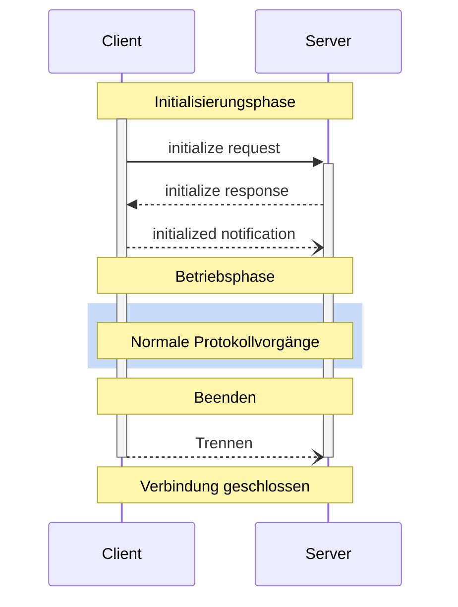

<Info>**Protokollrevision**: 2024-11-05</Info>

Das Model Context Protocol (MCP) definiert einen klaren Lebenszyklus für Client-Server-
Verbindungen, der eine korrekte Fähigkeitsaushandlung und Zustandsverwaltung sicherstellt.

1. **Initialisierung**: Fähigkeitsaushandlung und Vereinbarung der Protokollversion
2. **Betrieb**: Normale Protokollkommunikation
3. **Beenden**: Ordnungsgemäße Termination der Verbindung



<div id="lifecycle-phases">
  ## Phasen des Lebenszyklus
</div>

<div id="initialization">
  ### Initialisierung
</div>

Die Initialisierungsphase **MUSS** die erste Interaktion zwischen Client und Server sein.
Während dieser Phase stellen Client und Server:

* die Kompatibilität der Protokollversion fest,
* ihre Fähigkeiten vor und handeln diese aus,
* Implementierungsdetails bereit.

Der Client **MUSS** diese Phase einleiten, indem er eine `initialize`-Anfrage sendet, die Folgendes enthält:

* Unterstützte Protokollversion
* Client-Fähigkeiten
* Informationen zur Client-Implementierung

```json
{
  "jsonrpc": "2.0",
  "id": 1,
  "method": "initialize",
  "params": {
    "protocolVersion": "2024-11-05",
    "capabilities": {
      "roots": {
        "listChanged": true
      },
      "sampling": {}
    },
    "clientInfo": {
      "name": "ExampleClient",
      "version": "1.0.0"
    }
  }
}
```

Der Server **MUSS** mit seinen eigenen Fähigkeiten und Informationen antworten:

```json
{
  "jsonrpc": "2.0",
  "id": 1,
  "result": {
    "protocolVersion": "2024-11-05",
    "capabilities": {
      "logging": {},
      "prompts": {
        "listChanged": true
      },
      "resources": {
        "subscribe": true,
        "listChanged": true
      },
      "tools": {
        "listChanged": true
      }
    },
    "serverInfo": {
      "name": "ExampleServer",
      "version": "1.0.0"
    }
  }
}
```

Nach erfolgreicher Initialisierung **MUSS** der Client eine `initialized`-Benachrichtigung senden,
um anzuzeigen, dass er bereit ist, den Normalbetrieb aufzunehmen:

```json
{
  "jsonrpc": "2.0",
  "method": "notifications/initialized"
}
```

* Der Client **SOLLTE KEINE** anderen Anfragen als
  [Pings](/de/specification/2024-11-05/basic/utilities/ping) senden, bevor der Server
  auf die `initialize`-Anfrage geantwortet hat.
* Der Server **SOLLTE KEINE** anderen Anfragen als
  [Pings](/de/specification/2024-11-05/basic/utilities/ping) und
  [Logging](/de/specification/2024-11-05/server/utilities/logging) senden, bevor
  die `initialized`-Benachrichtigung empfangen wurde.

<div id="version-negotiation">
  #### Versionsaushandlung
</div>

Im `initialize`-Request MUSS der Client eine von ihm unterstützte Protokollversion senden.
Dies SOLLTE die neueste vom Client unterstützte Version sein.

Wenn der Server die angeforderte Protokollversion unterstützt, MUSS er mit derselben
Version antworten. Andernfalls MUSS der Server mit einer anderen von ihm unterstützten
Protokollversion antworten. Dies SOLLTE die neueste vom Server unterstützte Version sein.

Wenn der Client die in der Serverantwort angegebene Version nicht unterstützt, SOLLTE er
die Verbindung trennen.

<div id="capability-negotiation">
  #### Fähigkeitsaushandlung
</div>

Client- und Server-Fähigkeiten legen fest, welche optionalen Protokollfunktionen während der Sitzung verfügbar sind.

Wichtige Fähigkeiten sind:

| Kategorie | Fähigkeit      | Beschreibung                                                                          |
| --------- | -------------- | ------------------------------------------------------------------------------------- |
| Client    | `roots`        | Fähigkeit, Dateisystem-[Wurzeln](/de/specification/2024-11-05/client/roots) bereitzustellen |
| Client    | `sampling`     | Unterstützung für LLM-[Sampling](/de/specification/2024-11-05/client/sampling)-Anfragen |
| Client    | `experimental` | Beschreibt die Unterstützung für nicht standardisierte experimentelle Funktionen     |
| Server    | `prompts`      | Bietet [Prompts](/de/specification/2024-11-05/server/prompts)                           |
| Server    | `resources`    | Stellt lesbare [Ressourcen](/de/specification/2024-11-05/server/resources) bereit       |
| Server    | `tools`        | Stellt aufrufbare [Werkzeuge](/de/specification/2024-11-05/server/tools) bereit         |
| Server    | `logging`      | Gibt strukturierte [Log-Nachrichten](/de/specification/2024-11-05/server/utilities/logging) aus |
| Server    | `experimental` | Beschreibt die Unterstützung für nicht standardisierte experimentelle Funktionen     |

Fähigkeitsobjekte können Unterfähigkeiten beschreiben wie:

* `listChanged`: Unterstützung für Benachrichtigungen über Listenänderungen (für Prompts, Ressourcen und Werkzeuge)
* `subscribe`: Unterstützung für das Abonnieren von Änderungen einzelner Elemente (nur Ressourcen)

<div id="operation">
  ### Betrieb
</div>

Während der Betriebsphase tauschen Client und Server Nachrichten gemäß den
ausgehandelten Fähigkeiten aus.

Beide Parteien **SOLLTEN**:

* Die ausgehandelte Protokollversion einhalten
* Nur Fähigkeiten verwenden, die erfolgreich ausgehandelt wurden

<div id="shutdown">
  ### Herunterfahren
</div>

Während der Herunterfahrphase beendet eine Seite (in der Regel der Client) die Protokollverbindung sauber. Es sind keine spezifischen Herunterfahrmeldungen definiert – stattdessen sollte der zugrunde liegende Transportmechanismus verwendet werden, um die Beendigung der Verbindung zu signalisieren:

<div id="stdio">
  #### stdio
</div>

Für den stdio-[Transport](/de/specification/2024-11-05/basic/transports) sollte der
Client die Beendigung wie folgt einleiten:

1. Zuerst den Eingabestream zum Kindprozess (dem Server) schließen
2. Warten, bis der Server beendet ist, oder `SIGTERM` senden, wenn der Server nicht innerhalb einer angemessenen Zeit beendet
3. `SIGKILL` senden, wenn der Server nicht innerhalb einer angemessenen Zeit nach `SIGTERM` beendet

Der Server kann die Beendigung einleiten, indem er seinen Ausgabestream zum Client schließt und sich beendet.

<div id="http">
  #### HTTP
</div>

Bei HTTP-[Transporten](/de/specification/2024-11-05/basic/transports) wird das Herunterfahren durch das Schließen der entsprechenden HTTP-Verbindung(en) angezeigt.

<div id="error-handling">
  ## Fehlerbehandlung
</div>

Implementierungen SOLLTEN auf die folgenden Fehlerfälle vorbereitet sein:

* Protokollversionsinkompatibilität
* Fehlgeschlagene Aushandlung erforderlicher Fähigkeiten
* Timeout bei der Initialize-Anfrage
* Timeout beim Shutdown

Implementierungen SOLLTEN geeignete Timeouts für alle Anfragen vorsehen, um
hängende Verbindungen und die Erschöpfung von Ressourcen zu verhindern.

Beispiel für einen Initialisierungsfehler:

```json
{
  "jsonrpc": "2.0",
  "id": 1,
  "error": {
    "code": -32602,
    "message": "Unsupported protocol version",
    "data": {
      "supported": ["2024-11-05"],
      "requested": "1.0.0"
    }
  }
}
```