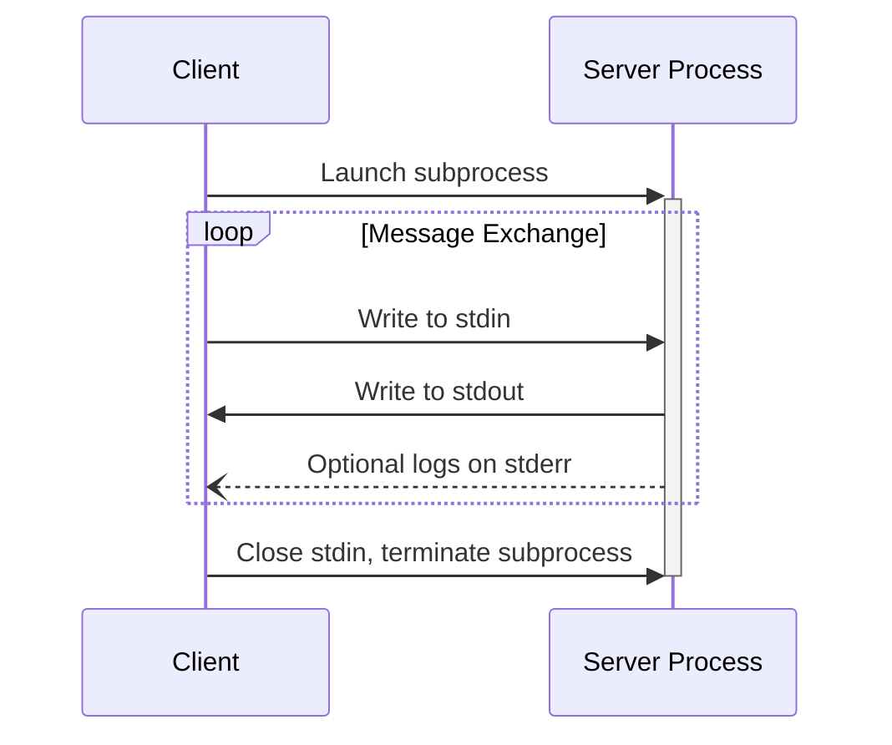
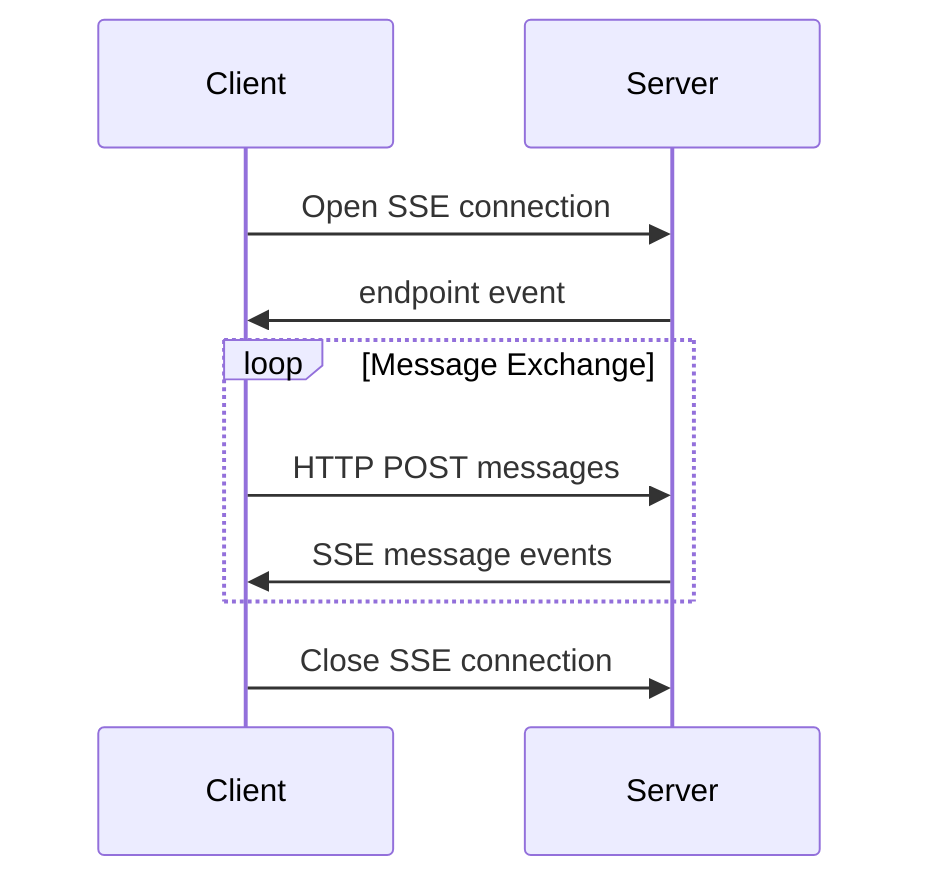

<Info>**Protokollrevision**: 2024-11-05</Info>

MCP definiert derzeit zwei standardisierte Transportmechanismen für die Client-Server-Kommunikation:

1. [stdio](#stdio), Kommunikation über Standardeingabe und Standardausgabe
2. [HTTP mit Server-Sent Events](#http-with-sse) (SSE)

Clients **SOLLTEN** nach Möglichkeit stdio unterstützen.

Es ist auch möglich, dass Clients und Server
[benutzerdefinierte Transporte](#custom-transports) auf pluggable Weise implementieren.

  ## stdio

Im **stdio**-Transport:

- Der Client startet den MCP-Server als Unterprozess.
- Der Server empfängt JSON-RPC-Nachrichten über seine Standardeingabe (`stdin`) und schreibt
  Antworten auf seine Standardausgabe (`stdout`).
- Nachrichten werden durch Zeilenumbrüche getrennt und **DÜRFEN KEINE** eingebetteten Zeilenumbrüche enthalten.
- Der Server **DARF** UTF-8-Zeichenketten zu seinem Standardfehlerausgang (`stderr`) für Protokollierungszwecke schreiben. Clients **DÜRFEN** diese Protokolle erfassen, weiterleiten oder ignorieren.
- Der Server **DARF NICHT** irgendetwas an sein `stdout` schreiben, das keine gültige MCP-Nachricht ist.
- Der Client **DARF NICHT** irgendetwas an die `stdin` des Servers schreiben, das keine gültige MCP-Nachricht ist.

  ## HTTP mit SSE

Im **SSE**-Transport läuft der Server als eigenständiger Prozess, der mehrere Client-Verbindungen verarbeiten kann.

  #### Sicherheitswarnung

Bei der Implementierung von HTTP mit SSE-Transport:

1. Server **MÜSSEN** den `Origin`-Header bei allen eingehenden Verbindungen prüfen, um DNS-Rebinding-Angriffe zu verhindern
2. Beim lokalen Betrieb SOLLTEN Server nur an localhost (127.0.0.1) statt an alle Netzwerkschnittstellen (0.0.0.0) binden
3. Server SOLLTEN für alle Verbindungen eine ordnungsgemäße Authentifizierung implementieren

Ohne diese Schutzmaßnahmen könnten Angreifer DNS-Rebinding nutzen, um von entfernten Websites aus mit lokalen MCP-Servern zu interagieren.

Der Server **MUSS** zwei Endpunkte bereitstellen:

1. Einen SSE-Endpunkt, über den Clients eine Verbindung herstellen und Nachrichten vom
   Server empfangen können
2. Einen regulären HTTP-POST-Endpunkt, über den Clients Nachrichten an den Server senden können

Wenn ein Client eine Verbindung herstellt, **MUSS** der Server ein `endpoint`-Ereignis senden, das eine URI enthält, die der Client zum Senden von Nachrichten verwenden kann. Alle nachfolgenden Client-Nachrichten **MÜSSEN** als HTTP-POST-Anfragen an diesen Endpunkt gesendet werden.

Servernachrichten werden als SSE-`message`-Ereignisse gesendet, wobei der Nachrichteninhalt als
JSON in den Ereignisdaten kodiert ist.

  ## Benutzerdefinierte Transporte

Clients und Server **KÖNNEN** zusätzliche benutzerdefinierte Transportmechanismen implementieren, um ihren spezifischen Anforderungen gerecht zu werden. Das Protokoll ist transportagnostisch und kann über jeden Kommunikationskanal implementiert werden, der bidirektionalen Nachrichtenaustausch unterstützt.

Implementierende, die sich dafür entscheiden, benutzerdefinierte Transporte zu unterstützen, **MÜSSEN** sicherstellen, dass sie das JSON-RPC-2.0-Nachrichtenformat und die vom Model Context Protocol (MCP) definierten Lebenszyklusanforderungen beibehalten. Benutzerdefinierte Transporte **SOLLEN** ihre spezifischen Verfahren zur Verbindungsherstellung und ihre Muster des Nachrichtenaustauschs dokumentieren, um die Interoperabilität zu fördern.