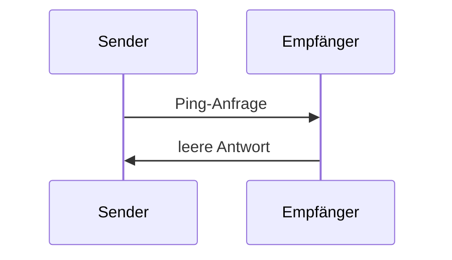

<Info>**Protokollrevision**: 2024-11-05</Info>

Der Model Context Protocol umfasst einen optionalen Ping-Mechanismus, mit dem beide Parteien überprüfen können, ob ihr Gegenüber weiterhin reagiert und die Verbindung noch besteht.

<div id="overview">
  ## Überblick
</div>

Die Ping-Funktion wird über ein einfaches Anfrage-/Antwortmuster umgesetzt. Sowohl der Client als auch der Server können einen Ping auslösen, indem sie eine `ping`-Anfrage senden.

<div id="message-format">
  ## Nachrichtenformat
</div>

Eine Ping-Anfrage ist eine standardkonforme JSON-RPC-Anfrage ohne Parameter:

```json
{
  "jsonrpc": "2.0",
  "id": "123",
  "method": "ping"
}
```

<div id="behavior-requirements">
  ## Verhaltensanforderungen
</div>

1. Der Empfänger **MUSS** umgehend mit einer leeren Antwort reagieren:

```json
{
  "jsonrpc": "2.0",
  "id": "123",
  "result": {}
}
```

2. Geht innerhalb eines angemessenen Timeout-Zeitraums keine Antwort ein, **KANN** der Sender:
   - Die Verbindung als inaktiv betrachten
   - Die Verbindung beenden
   - Verfahren zum erneuten Verbindungsaufbau durchführen

<div id="usage-patterns">
  ## Nutzungsmuster
</div>



<div id="implementation-considerations">
  ## Überlegungen zur Implementierung
</div>

- Implementierungen SOLLTEN periodisch Pings senden, um die Verbindungsintegrität zu prüfen
- Die Ping-Frequenz SOLLTE konfigurierbar sein
- Timeouts SOLLTEN der jeweiligen Netzwerkumgebung angemessen sein
- Übermäßiges Pingen SOLLTE vermieden werden, um den Netzwerk-Overhead zu reduzieren

<div id="error-handling">
  ## Fehlerbehandlung
</div>

- Timeouts **SOLLTEN** als Verbindungsfehler behandelt werden
- Mehrere fehlgeschlagene Pings **KÖNNEN** einen Verbindungsneustart auslösen
- Implementierungen **SOLLTEN** Ping-Fehler zu Diagnosezwecken protokollieren