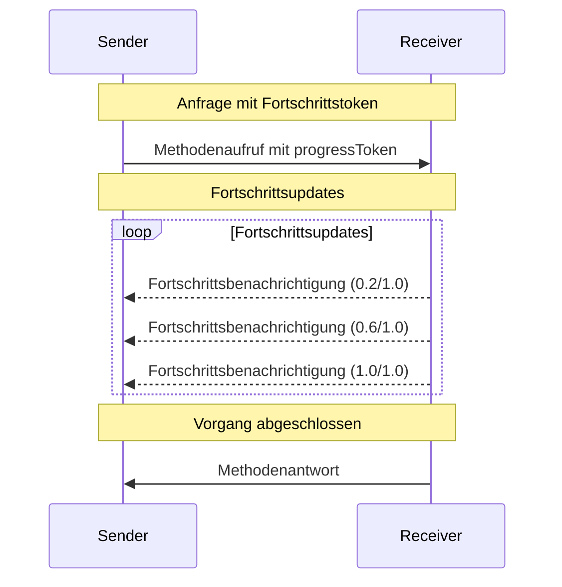

<Info>**Protokollrevision**: 2024-11-05</Info>

Der Model Context Protocol (MCP) unterstützt optionales Fortschritts-Tracking für langlaufende
Operationen über Benachrichtigungen. Beide Seiten können Fortschrittsbenachrichtigungen senden, um
Aktualisierungen zum Status von Operationen bereitzustellen.

<div id="progress-flow">
  ## Fortschrittsablauf
</div>

Wenn eine Partei Fortschrittsaktualisierungen für eine Anfrage _erhalten_ möchte, fügt sie ein
`progressToken` in die Anfrage-Metadaten ein.

- Fortschrittstokens **MÜSSEN** ein String- oder Integer-Wert sein
- Fortschrittstokens können vom Absender auf beliebige Weise gewählt werden, **MÜSSEN** aber über
  alle aktiven Anfragen hinweg eindeutig sein.

```json
{
  "jsonrpc": "2.0",
  "id": 1,
  "method": "some_method",
  "params": {
    "_meta": {
      "progressToken": "abc123"
    }
  }
}
```

Der Empfänger **KANN** dann Fortschrittsbenachrichtigungen senden, die Folgendes enthalten:

- Das ursprüngliche Fortschrittstoken
- Den aktuellen bisherigen Fortschrittswert
- Einen optionalen „total“-Wert

```json
{
  "jsonrpc": "2.0",
  "method": "notifications/progress",
  "params": {
    "progressToken": "abc123",
    "progress": 50,
    "total": 100
  }
}
```

- Der `progress`-Wert **MUSS** mit jeder Benachrichtigung zunehmen, selbst wenn der Gesamtwert
  unbekannt ist.
- Die Werte `progress` und `total` **KÖNNEN** Gleitkommazahlen sein.

<div id="behavior-requirements">
  ## Verhaltensanforderungen
</div>

1. Fortschrittsbenachrichtigungen **MÜSSEN** nur auf Tokens verweisen, die:
   - In einer aktiven Anfrage bereitgestellt wurden
   - Mit einem laufenden Vorgang verknüpft sind

2. Empfänger von Fortschrittsanforderungen **DÜRFEN**:
   - Sich dafür entscheiden, keine Fortschrittsbenachrichtigungen zu senden
   - Benachrichtigungen in einer beliebigen, für sie geeigneten Frequenz senden
   - Den Gesamtwert weglassen, wenn er unbekannt ist



<div id="implementation-notes">
  ## Implementierungshinweise
</div>

- Sender und Empfänger **SOLLTEN** aktive Fortschritts-Token verfolgen
- Beide Parteien **SOLLTEN** eine Ratebegrenzung implementieren, um Flooding zu verhindern
- Fortschrittsbenachrichtigungen **MÜSSEN** nach Abschluss enden