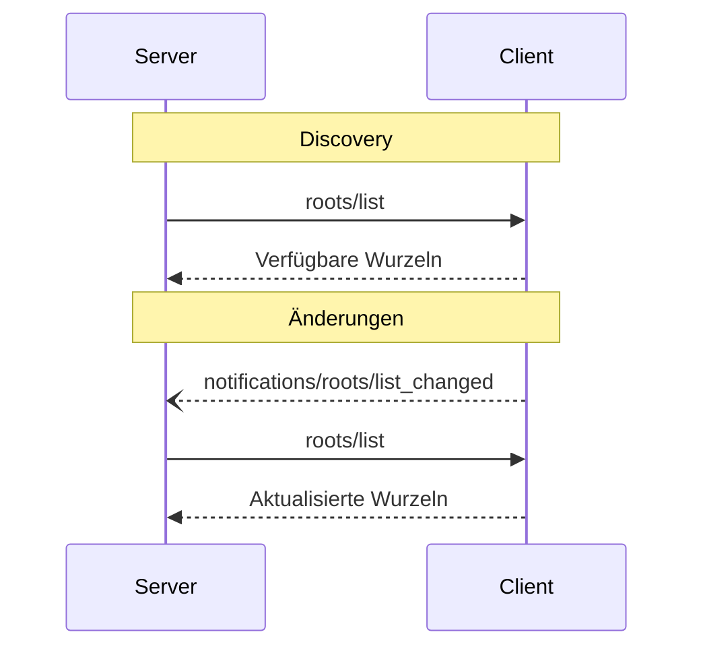

<Info>**Protokollrevision**: 2024-11-05</Info>

Das Model Context Protocol (MCP) bietet eine standardisierte Möglichkeit für Clients, „Wurzeln“ des Dateisystems für Server bereitzustellen. Wurzeln definieren die Bereiche, innerhalb derer Server im Dateisystem arbeiten dürfen, und machen deutlich, auf welche Verzeichnisse und Dateien sie Zugriff haben. Server können von unterstützenden Clients die Liste der Wurzeln anfordern und Benachrichtigungen erhalten, wenn sich diese Liste ändert.

<div id="user-interaction-model">
  ## Benutzerinteraktionsmodell
</div>

Wurzeln in MCP werden typischerweise über Konfigurationsoberflächen für Arbeitsbereiche oder Projekte bereitgestellt.

Implementierungen könnten beispielsweise einen Auswahldialog für Arbeitsbereiche/Projekte anbieten, der Nutzerinnen und Nutzern ermöglicht, die Verzeichnisse und Dateien auszuwählen, auf die der Server Zugriff haben soll. Dies kann mit einer automatischen Erkennung von Arbeitsbereichen anhand von Versionskontrollsystemen oder Projektdateien kombiniert werden.

Implementierungen sind jedoch frei, Wurzeln über beliebige Interaktionsmuster offenzulegen, die ihren Anforderungen entsprechen—das Protokoll selbst schreibt kein spezifisches Benutzerinteraktionsmodell vor.

<div id="capabilities">
  ## Fähigkeiten
</div>

Clients, die Wurzeln unterstützen, **MÜSSEN** während der
[Initialisierung](/de/specification/2024-11-05/basic/lifecycle#initialization) die Fähigkeit `roots` deklarieren:

```json
{
  "capabilities": {
    "roots": {
      "listChanged": true
    }
  }
}
```

`listChanged` gibt an, ob der Client Benachrichtigungen auslöst, wenn sich die Liste der Wurzeln
ändert.

<div id="protocol-messages">
  ## Protokollnachrichten
</div>

<div id="listing-roots">
  ### Auflisten von Wurzeln
</div>

Um Wurzeln abzurufen, senden Server eine `roots/list`-Anfrage:

**Anfrage:**

```json
{
  "jsonrpc": "2.0",
  "id": 1,
  "method": "roots/list"
}
```

**Antwort:**

```json
{
  "jsonrpc": "2.0",
  "id": 1,
  "result": {
    "roots": [
      {
        "uri": "file:///home/user/projects/myproject",
        "name": "Mein Projekt"
      }
    ]
  }
}
```

<div id="root-list-changes">
  ### Änderungen der Wurzelliste
</div>

Wenn sich Wurzeln ändern, MÜSSEN Clients, die `listChanged` unterstützen, eine Benachrichtigung senden:

```json
{
  "jsonrpc": "2.0",
  "method": "notifications/roots/list_changed"
}
```

<div id="message-flow">
  ## Nachrichtenfluss
</div>



<div id="data-types">
  ## Datentypen
</div>

<div id="root">
  ### Wurzel
</div>

Eine Wurzeldefinition umfasst:

* `uri`: Eindeutiger Bezeichner für die Wurzel. Dies **MUSS** in der aktuellen
  Spezifikation eine `file://`-URI sein.
* `name`: Optionaler, menschenlesbarer Name für Anzeigezwecke.

Beispielwurzeln für verschiedene Anwendungsfälle:

<div id="project-directory">
  #### Projektverzeichnis
</div>

```json
{
  "uri": "file:///home/user/projects/myproject",
  "name": "Mein Projekt"
}
```

<div id="multiple-repositories">
  #### Mehrere Repositories
</div>

```json
[
  {
    "uri": "file:///home/user/repos/frontend",
    "name": "Frontend-Repository"
  },
  {
    "uri": "file:///home/user/repos/backend",
    "name": "Backend-Repository"
  }
]
```

<div id="error-handling">
  ## Fehlerbehandlung
</div>

Clients **SOLLTEN** standardisierte JSON-RPC-Fehler für gängige Fehlerszenarien zurückgeben:

* Client unterstützt Roots nicht: `-32601` (Methode nicht gefunden)
* Interne Fehler: `-32603`

Beispiel für einen Fehler:

```json
{
  "jsonrpc": "2.0",
  "id": 1,
  "error": {
    "code": -32601,
    "message": "Roots not supported",
    "data": {
      "reason": "Client does not have roots capability"
    }
  }
}
```

<div id="security-considerations">
  ## Sicherheitserwägungen
</div>

1. Clients **MÜSSEN**:
   * Nur Wurzeln mit passenden Berechtigungen freigeben
   * Alle Wurzel-URIs validieren, um Pfad­Traversal zu verhindern
   * Angemessene Zugriffskontrollen implementieren
   * Die Zugänglichkeit der Wurzeln überwachen

2. Server **SOLLEN**:
   * Fälle behandeln, in denen Wurzeln nicht mehr verfügbar sind
   * Wurzelgrenzen während der Operationen respektieren
   * Alle Pfade gegen die bereitgestellten Wurzeln validieren

<div id="implementation-guidelines">
  ## Implementierungsrichtlinien
</div>

1. Clients **SOLLTEN**:
   * Nutzer um Zustimmung bitten, bevor Wurzeln gegenüber Servern offengelegt werden
   * Klare Benutzeroberflächen für die Verwaltung von Wurzeln bereitstellen
   * Die Zugänglichkeit von Wurzeln prüfen, bevor sie offengelegt werden
   * Auf Änderungen an Wurzeln überwachen

2. Server **SOLLTEN**:
   * Vor der Verwendung auf die Wurzeln-Fähigkeit prüfen
   * Änderungen an der Wurzelliste robust handhaben
   * Wurzelgrenzen bei Operationen respektieren
   * Wurzelinformationen angemessen zwischenspeichern