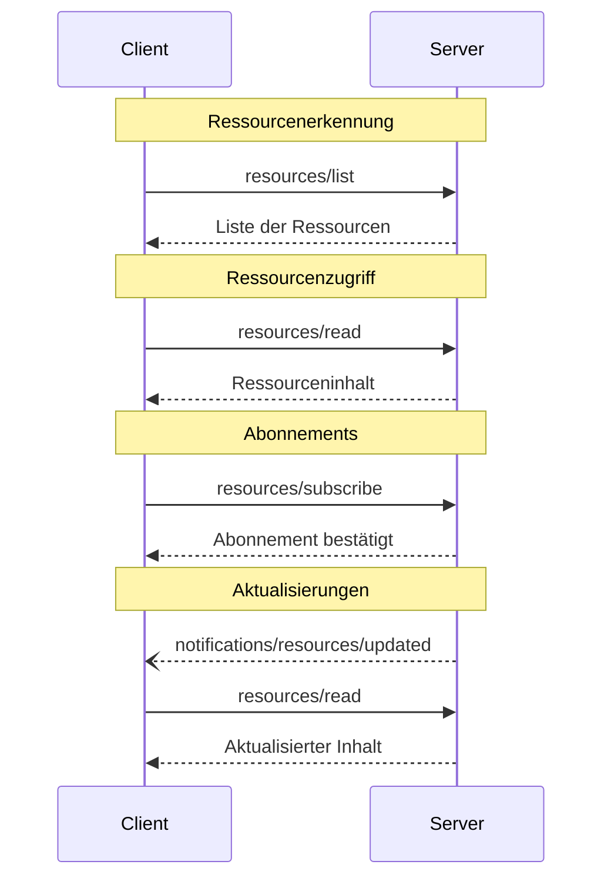

<Info>**Protokollrevision**: 2024-11-05</Info>

Das Model Context Protocol (MCP) bietet eine standardisierte Möglichkeit für Server, Ressourcen gegenüber Clients offenzulegen. Ressourcen ermöglichen es Servern, Daten bereitzustellen, die Sprachmodellen Kontext liefern, etwa Dateien, Datenbankschemata oder anwendungsspezifische Informationen. Jede Ressource wird eindeutig durch eine [URI](https://datatracker.ietf.org/doc/html/rfc3986) identifiziert.

<div id="user-interaction-model">
  ## Benutzerinteraktionsmodell
</div>

Ressourcen im MCP sind **anwendungsgetrieben** konzipiert; Host-Anwendungen
bestimmen, wie Kontext entsprechend ihren Anforderungen eingebunden wird.

Anwendungen könnten beispielsweise:

* Ressourcen über UI-Elemente zur expliziten Auswahl in einer Baum- oder Listenansicht bereitstellen
* Nutzenden erlauben, verfügbare Ressourcen zu durchsuchen und zu filtern
* Eine automatische Kontexteinbindung implementieren, basierend auf Heuristiken oder der Auswahl des KI-Modells


Implementierungen sind jedoch frei, Ressourcen über beliebige Interaktionsmuster bereitzustellen, die
ihren Anforderungen entsprechen—das Protokoll selbst schreibt kein spezifisches Benutzerinteraktionsmodell vor.

<div id="capabilities">
  ## Fähigkeiten
</div>

Server, die Ressourcen unterstützen, **MÜSSEN** die Fähigkeit `resources` deklarieren:

```json
{
  "capabilities": {
    "resources": {
      "subscribe": true,
      "listChanged": true
    }
  }
}
```

Die Fähigkeit unterstützt zwei optionale Funktionen:

* `subscribe`: ob der Client Änderungen an einzelnen Ressourcen abonnieren kann.
* `listChanged`: ob der Server Benachrichtigungen ausgibt, wenn sich die Liste der verfügbaren Ressourcen ändert.

Sowohl `subscribe` als auch `listChanged` sind optional—Server können keine, eine oder beide unterstützen:

```json
{
  "capabilities": {
    "resources": {} // Neither feature supported
  }
}
```

```json
{
  "capabilities": {
    "resources": {
      "subscribe": true // Only subscriptions supported
    }
  }
}
```

```json
{
  "capabilities": {
    "resources": {
      "listChanged": true // Only list change notifications supported
    }
  }
}
```

<div id="protocol-messages">
  ## Protokollmeldungen
</div>

<div id="listing-resources">
  ### Ressourcen auflisten
</div>

Um verfügbare Ressourcen zu ermitteln, senden Clients eine `resources/list`-Anfrage. Dieser Vorgang
unterstützt
[Paginierung](/de/specification/2024-11-05/server/utilities/pagination).

**Anfrage:**

```json
{
  "jsonrpc": "2.0",
  "id": 1,
  "method": "resources/list",
  "params": {
    "cursor": "optional-cursor-value"
  }
}
```

**Antwort:**

```json
{
  "jsonrpc": "2.0",
  "id": 1,
  "result": {
    "resources": [
      {
        "uri": "file:///project/src/main.rs",
        "name": "main.rs",
        "description": "Zentraler Einstiegspunkt der Anwendung",
        "mimeType": "text/x-rust"
      }
    ],
    "nextCursor": "next-page-cursor"
  }
}
```

<div id="reading-resources">
  ### Ressourcen lesen
</div>

Um den Inhalt von Ressourcen abzurufen, senden Clients eine `resources/read`-Anfrage:

**Anfrage:**

```json
{
  "jsonrpc": "2.0",
  "id": 2,
  "method": "resources/read",
  "params": {
    "uri": "file:///project/src/main.rs"
  }
}
```

**Antwort:**

```json
{
  "jsonrpc": "2.0",
  "id": 2,
  "result": {
    "contents": [
      {
        "uri": "file:///project/src/main.rs",
        "mimeType": "text/x-rust",
        "text": "fn main() {\n    println!(\"Hello world!\");\n}"
      }
    ]
  }
}
```

<div id="resource-templates">
  ### Ressourcenvorlagen
</div>

Ressourcenvorlagen ermöglichen es Servern, parametrisierte Ressourcen mittels
[URI-Vorlagen](https://datatracker.ietf.org/doc/html/rfc6570) bereitzustellen. Argumente können über
[die Completion-API](/de/specification/2024-11-05/server/utilities/completion) automatisch vervollständigt werden.

**Anfrage:**

```json
{
  "jsonrpc": "2.0",
  "id": 3,
  "method": "resources/templates/list"
}
```

**Antwort:**

```json
{
  "jsonrpc": "2.0",
  "id": 3,
  "result": {
    "resourceTemplates": [
      {
        "uriTemplate": "file:///{path}",
        "name": "Project Files",
        "description": "Zugriff auf Dateien im Projektverzeichnis",
        "mimeType": "application/octet-stream"
      }
    ]
  }
}
```

<div id="list-changed-notification">
  ### Benachrichtigung über geänderte Liste
</div>

Wenn sich die Liste der verfügbaren Ressourcen ändert, sollten Server, die die Fähigkeit `listChanged` deklariert haben, eine Benachrichtigung senden:

```json
{
  "jsonrpc": "2.0",
  "method": "notifications/resources/list_changed"
}
```

<div id="subscriptions">
  ### Abonnements
</div>

Das Protokoll unterstützt optionale Abonnements für Änderungen an Ressourcen. Clients können bestimmte Ressourcen abonnieren und Benachrichtigungen erhalten, wenn sie geändert werden:

**Abonnement-Anfrage:**

```json
{
  "jsonrpc": "2.0",
  "id": 4,
  "method": "resources/subscribe",
  "params": {
    "uri": "file:///project/src/main.rs"
  }
}
```

**Aktualisierungs-Benachrichtigung:**

```json
{
  "jsonrpc": "2.0",
  "method": "notifications/resources/updated",
  "params": {
    "uri": "file:///project/src/main.rs"
  }
}
```

<div id="message-flow">
  ## Nachrichtenfluss
</div>



<div id="data-types">
  ## Datentypen
</div>

<div id="resource">
  ### Ressource
</div>

Eine Ressourcen-Definition umfasst:

* `uri`: Eindeutiger Bezeichner der Ressource
* `name`: Lesbarer Name für Menschen
* `description`: Optionale Beschreibung
* `mimeType`: Optionaler MIME-Typ

<div id="resource-contents">
  ### Ressourceninhalte
</div>

Ressourcen können entweder Text- oder Binärdaten enthalten:

<div id="text-content">
  #### Textinhalt
</div>

```json
{
  "uri": "file:///example.txt",
  "mimeType": "text/plain",
  "text": "Ressourceninhalt"
}
```

<div id="binary-content">
  #### Binärinhalt
</div>

```json
{
  "uri": "file:///example.png",
  "mimeType": "image/png",
  "blob": "base64-encoded-data"
}
```

<div id="common-uri-schemes">
  ## Übliche URI-Schemata
</div>

Das Protokoll definiert mehrere standardisierte URI-Schemata. Diese Liste ist nicht
abschließend—Implementierungen können jederzeit zusätzliche, benutzerdefinierte URI-Schemata verwenden.

<div id="https">
  ### https://
</div>

Wird verwendet, um eine im Web verfügbare Ressource darzustellen.

Server **SOLLTEN** dieses Schema nur verwenden, wenn der Client die Ressource eigenständig direkt aus dem Web abrufen und laden kann – das heißt, er muss die Ressource nicht über den MCP-Server lesen.

Für andere Anwendungsfälle **SOLLTEN** Server ein anderes URI-Schema bevorzugen oder ein eigenes definieren, selbst wenn der Server die Inhalte der Ressource selbst über das Internet herunterlädt.

<div id="file">
  ### file://
</div>

Wird verwendet, um Ressourcen zu identifizieren, die sich wie ein Dateisystem verhalten. Die Ressourcen müssen jedoch nicht einem tatsächlichen physischen Dateisystem entsprechen.

MCP-Server **KÖNNEN** file://-Ressourcen mit einem
[XDG-MIME-Typ](https://specifications.freedesktop.org/shared-mime-info-spec/0.14/ar01s02.html#id-1.3.14),
etwa `inode/directory`, kennzeichnen, um nicht reguläre Dateien (wie Verzeichnisse) darzustellen, die ansonsten keinen standardisierten MIME-Typ haben.

<div id="git">
  ### git://
</div>

Integration mit Git-Versionskontrolle.

<div id="error-handling">
  ## Fehlerbehandlung
</div>

Server **SOLLTEN** für gängige Fehlerfälle standardmäßige JSON-RPC-Fehler zurückgeben:

* Ressource nicht gefunden: `-32002`
* Interner Fehler: `-32603`

Beispiel für einen Fehler:

```json
{
  "jsonrpc": "2.0",
  "id": 5,
  "error": {
    "code": -32002,
    "message": "Resource not found",
    "data": {
      "uri": "file:///nonexistent.txt"
    }
  }
}
```

<div id="security-considerations">
  ## Sicherheitshinweise
</div>

1. Server **MÜSSEN** alle Ressourcen-URIs validieren
2. Zugriffskontrollen **SOLLEN** für vertrauliche Ressourcen implementiert werden
3. Binärdaten **MÜSSEN** ordnungsgemäß kodiert werden
4. Berechtigungen für Ressourcen **SOLLEN** vor Operationen überprüft werden