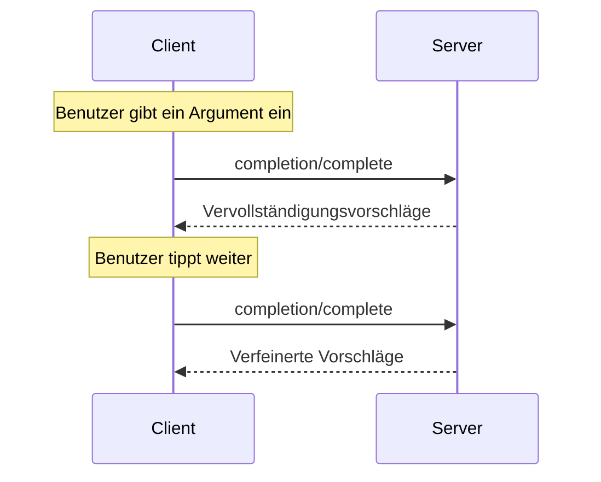

<Info>**Protokollrevision**: 2024-11-05</Info>

Das Model Context Protocol (MCP) bietet eine standardisierte Möglichkeit für Server,
Argument-Autovervollständigungen für Prompts und Ressourcen-URIs bereitzustellen. Dies ermöglicht
umfangreiche, IDE-ähnliche Nutzererlebnisse, bei denen Benutzer beim Eingeben von Argumentwerten
kontextuelle Vorschläge erhalten.

<div id="user-interaction-model">
  ## Benutzerinteraktionsmodell
</div>

Completion im Model Context Protocol (MCP) ist darauf ausgelegt, interaktive Nutzererlebnisse zu unterstützen, die der Codevervollständigung in IDEs ähneln.

Beispielsweise können Anwendungen während der Eingabe Vorschläge in einem Dropdown- oder Popup-Menü anzeigen, mit der Möglichkeit, die verfügbaren Optionen zu filtern und auszuwählen.

Implementierungen sind jedoch frei, Completion über jedes Interface-Muster bereitzustellen, das ihren Anforderungen entspricht&mdash;das Protokoll selbst schreibt kein spezifisches Benutzerinteraktionsmodell vor.

<div id="protocol-messages">
  ## Protokollnachrichten
</div>

<div id="requesting-completions">
  ### Anfordern von Vervollständigungen
</div>

Um Vervollständigungsvorschläge zu erhalten, senden Clients eine `completion/complete`-Anfrage, in der über einen Referenztyp angegeben wird,
was vervollständigt werden soll:

**Anfrage:**

```json
{
  "jsonrpc": "2.0",
  "id": 1,
  "method": "completion/complete",
  "params": {
    "ref": {
      "type": "ref/prompt",
      "name": "code_review"
    },
    "argument": {
      "name": "language",
      "value": "py"
    }
  }
}
```

**Antwort:**

```json
{
  "jsonrpc": "2.0",
  "id": 1,
  "result": {
    "completion": {
      "values": ["python", "pytorch", "pyside"],
      "total": 10,
      "hasMore": true
    }
  }
}
```

<div id="reference-types">
  ### Referenztypen
</div>

Das Protokoll unterstützt zwei Arten von Completion-Referenzen:

| Typ            | Beschreibung                         | Beispiel                                            |
| -------------- | ------------------------------------ | --------------------------------------------------- |
| `ref/prompt`   | Verweist auf einen Prompt anhand des Namens | `{"type": "ref/prompt", "name": "code_review"}`     |
| `ref/resource` | Verweist auf eine Ressourcen-URI     | `{"type": "ref/resource", "uri": "file:///{path}"}` |

<div id="completion-results">
  ### Completion-Ergebnisse
</div>

Server geben ein nach Relevanz sortiertes Array von Completion-Werten zurück, mit:

- Maximal 100 Einträgen pro Antwort
- Optionaler Gesamtzahl der verfügbaren Treffer
- Boolean, der angibt, ob weitere Ergebnisse vorhanden sind

<div id="message-flow">
  ## Nachrichtenfluss
</div>



<div id="data-types">
  ## Datentypen
</div>

<div id="completerequest">
  ### CompleteRequest
</div>

- `ref`: Eine `PromptReference` oder `ResourceReference`
- `argument`: Objekt mit:
  - `name`: Argumentname
  - `value`: Aktueller Wert

<div id="completeresult">
  ### CompleteResult
</div>

- `completion`: Objekt mit:
  - `values`: Array mit Vorschlägen (max. 100)
  - `total`: Optionale Gesamtanzahl der Übereinstimmungen
  - `hasMore`: Kennzeichen, ob weitere Ergebnisse vorhanden sind

<div id="implementation-considerations">
  ## Implementierungsaspekte
</div>

1. Server **SOLLTEN**:
   - Vorschläge nach Relevanz sortiert zurückgeben
   - Fuzzy-Matching, wo sinnvoll, implementieren
   - Anfragen für Vervollständigungen ratebegrenzen
   - Alle Eingaben validieren

2. Clients **SOLLTEN**:
   - Rasch aufeinanderfolgende Vervollständigungsanfragen entprellen
   - Ergebnisse von Vervollständigungen, wo sinnvoll, zwischenspeichern
   - Fehlende oder unvollständige Ergebnisse robust behandeln

<div id="security">
  ## Sicherheit
</div>

Implementierungen **MÜSSEN**:

- Alle Completion-Eingaben validieren
- Angemessenes Rate-Limiting implementieren
- Den Zugriff auf sensible Vorschläge kontrollieren
- Informationsoffenlegung durch Completions verhindern