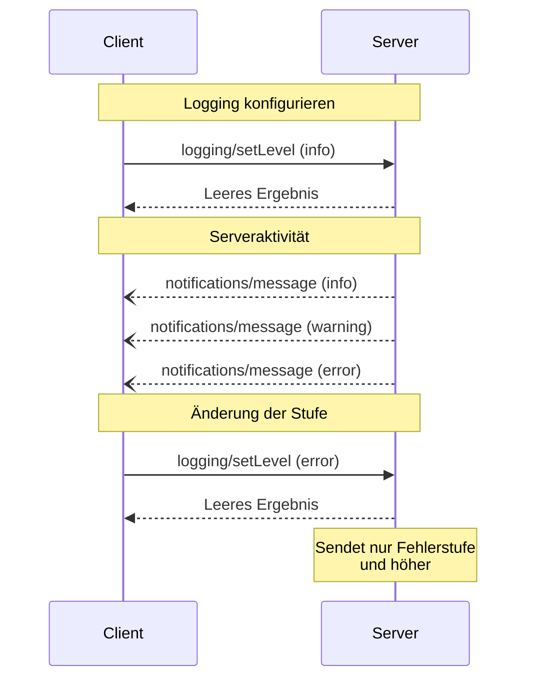

<Info>**Protokollrevision**: 2024-11-05</Info>

Das Model Context Protocol (MCP) bietet einen standardisierten Weg, damit Server strukturierte Protokollmeldungen an Clients senden können. Clients können die Protokollierungs-Detailtiefe steuern, indem sie minimale Protokollstufen festlegen. Server senden dabei Benachrichtigungen mit Schweregrad, optionalen Logger-Namen und beliebigen JSON-serialisierbaren Daten.

<div id="user-interaction-model">
  ## Benutzerinteraktionsmodell
</div>

Implementierungen können das Logging über jedes geeignete Schnittstellenmuster bereitstellen, das ihren Anforderungen entspricht&mdash;das Protokoll selbst schreibt kein bestimmtes Benutzerinteraktionsmodell vor.

<div id="capabilities">
  ## Fähigkeiten
</div>

Server, die Benachrichtigungen mit Protokollmeldungen ausgeben, **MÜSSEN** die Fähigkeit `logging` deklarieren:

```json
{
  "capabilities": {
    "logging": {}
  }
}
```

<div id="log-levels">
  ## Protokollstufen
</div>

Das Protokoll folgt den standardmäßigen Syslog-Schweregraden gemäß
[RFC 5424](https://datatracker.ietf.org/doc/html/rfc5424#section-6.2.1):

| Stufe     | Beschreibung                      | Beispielanwendungsfall        |
| --------- | --------------------------------- | ----------------------------- |
| debug     | Detaillierte Debug-Informationen  | Funktions-Ein-/Austritt       |
| info      | Allgemeine Informationsmeldungen  | Fortschrittsmeldungen zu Vorgängen |
| notice    | Normale, aber bedeutsame Ereignisse | Konfigurationsänderungen    |
| warning   | Warnzustände                      | Nutzung veralteter Funktionen |
| error     | Fehlerzustände                    | Fehlschläge von Vorgängen     |
| critical  | Kritische Zustände                | Ausfälle von Systemkomponenten |
| alert     | Es muss sofort gehandelt werden   | Erkannte Datenkorruption      |
| emergency | System ist unbenutzbar            | Vollständiger Systemausfall   |

<div id="protocol-messages">
  ## Protokollnachrichten
</div>

<div id="setting-log-level">
  ### Protokollebene festlegen
</div>

Um die minimale Protokollebene zu konfigurieren, **KÖNNEN** Clients eine `logging/setLevel`-Anfrage senden:

**Anfrage:**

```json
{
  "jsonrpc": "2.0",
  "id": 1,
  "method": "logging/setLevel",
  "params": {
    "level": "info"
  }
}
```

<div id="log-message-notifications">
  ### Protokollnachrichten-Benachrichtigungen
</div>

Server senden Protokollnachrichten über `notifications/message`-Benachrichtigungen:

```json
{
  "jsonrpc": "2.0",
  "method": "notifications/message",
  "params": {
    "level": "error",
    "logger": "database",
    "data": {
      "error": "Connection failed",
      "details": {
        "host": "localhost",
        "port": 5432
      }
    }
  }
}
```

<div id="message-flow">
  ## Nachrichtenfluss
</div>



<div id="error-handling">
  ## Fehlerbehandlung
</div>

Server **SOLLTEN** für gängige Fehlerfälle standardisierte JSON-RPC-Fehler zurückgeben:

- Ungültige Logstufe: `-32602` (Invalid params)
- Konfigurationsfehler: `-32603` (Internal error)

<div id="implementation-considerations">
  ## Überlegungen zur Implementierung
</div>

1. Server **SOLLTEN**:
   - Protokollmeldungen ratebegrenzen
   - Relevanten Kontext im Datenfeld angeben
   - Konsistente Logger-Namen verwenden
   - Sensible Informationen entfernen

2. Clients **DÜRFEN**:
   - Protokollmeldungen in der UI anzeigen
   - Filterung/Suche für Protokolle implementieren
   - Schweregrade visuell darstellen
   - Protokollmeldungen dauerhaft speichern

<div id="security">
  ## Sicherheit
</div>

1. Protokolleinträge **DÜRFEN NICHT** Folgendes enthalten:
   - Anmeldedaten oder Geheimnisse
   - Personenbezogene Daten
   - Interne Systemdetails, die Angriffe begünstigen könnten

2. Implementierungen **SOLLEN**:
   - Nachrichten ratebegrenzen
   - Alle Datenfelder validieren
   - Den Zugriff auf Protokolle steuern
   - Auf sensible Inhalte überwachen