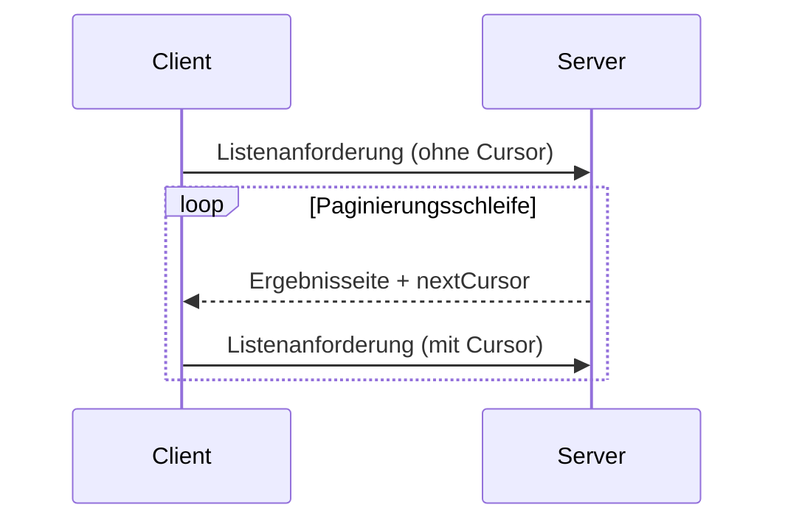

<Info>**Protokollrevision**: 2024-11-05</Info>

Das Model Context Protocol (MCP) unterstützt die Paginierung von Listenoperationen, die
große Ergebnismengen zurückgeben können. Paginierung ermöglicht es Servern, Ergebnisse in kleineren
Portionen statt alle auf einmal bereitzustellen.

Paginierung ist besonders wichtig bei Verbindungen zu externen Diensten über das
Internet, aber auch für lokale Integrationen nützlich, um Leistungsprobleme mit großen
Datensätzen zu vermeiden.

<div id="pagination-model">
  ## Paginierungsmodell
</div>

Die Paginierung in MCP verwendet einen undurchsichtigen, cursorbasierten Ansatz statt nummerierter Seiten.

- Der **Cursor** ist ein undurchsichtiger String-Token, der eine Position in der Ergebnismenge darstellt
- Die **Seitengröße** wird vom Server festgelegt, und Clients **DÜRFEN NICHT** von einer festen Seitengröße ausgehen

<div id="response-format">
  ## Antwortformat
</div>

Die Paginierung beginnt, wenn der Server eine **Antwort** sendet, die Folgendes enthält:

- Die aktuelle Seite mit Ergebnissen
- Ein optionales `nextCursor`-Feld, sofern weitere Ergebnisse vorhanden sind

```json
{
  "jsonrpc": "2.0",
  "id": "123",
  "result": {
    "resources": [...],
    "nextCursor": "eyJwYWdlIjogM30="
  }
}
```

<div id="request-format">
  ## Anfrageformat
</div>

Nachdem ein Cursor empfangen wurde, kann der Client die Paginierung _fortsetzen_, indem er eine Anfrage stellt, die diesen Cursor enthält:

```json
{
  "jsonrpc": "2.0",
  "method": "resources/list",
  "params": {
    "cursor": "eyJwYWdlIjogMn0="
  }
}
```

<div id="pagination-flow">
  ## Paginierungsablauf
</div>



<div id="operations-supporting-pagination">
  ## Operationen mit Unterstützung für Seitennummerierung
</div>

Die folgenden MCP-Operationen unterstützen Seitennummerierung:

- `resources/list` - Verfügbare Ressourcen anzeigen
- `resources/templates/list` - Ressourcenvorlagen anzeigen
- `prompts/list` - Verfügbare Prompts anzeigen
- `tools/list` - Verfügbare Werkzeuge anzeigen

<div id="implementation-guidelines">
  ## Implementierungsrichtlinien
</div>

1. Server **SOLLTEN**:
   - Stabile Cursor bereitstellen
   - Ungültige Cursor robust behandeln

2. Clients **SOLLTEN**:
   - Ein fehlendes `nextCursor` als Ende der Ergebnisse interpretieren
   - Sowohl paginierte als auch nicht paginierte Abläufe unterstützen

3. Clients **MÜSSEN** Cursor als undurchsichtige Token behandeln:
   - Keine Annahmen über das Format von Cursoren treffen
   - Nicht versuchen, Cursor zu parsen oder zu verändern
   - Cursor nicht über Sitzungen hinweg beibehalten

<div id="error-handling">
  ## Fehlerbehandlung
</div>

Ungültige Cursor **SOLLTEN** zu einem Fehler mit dem Code -32602 (Ungültige Parameter) führen.