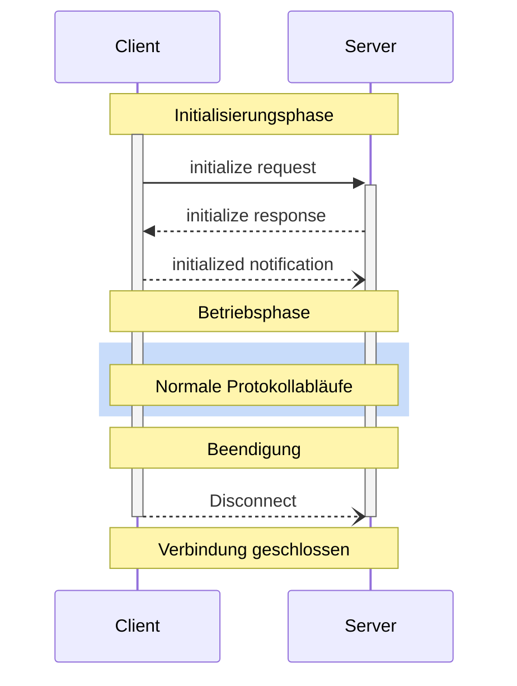

<Info>**Protokollrevision**: 2025-03-26</Info>

Das Model Context Protocol (MCP) definiert einen klaren Lebenszyklus für Client-Server-Verbindungen, der eine korrekte Fähigkeitsaushandlung und Zustandsverwaltung gewährleistet.

1. **Initialisierung**: Fähigkeitsaushandlung und Vereinbarung der Protokollversion
2. **Betrieb**: Normale Protokollkommunikation
3. **Beendigung**: Ordnungsgemäße Beendigung der Verbindung



<div id="lifecycle-phases">
  ## Phasen des Lebenszyklus
</div>

<div id="initialization">
  ### Initialisierung
</div>

Die Initialisierungsphase **MUSS** die erste Interaktion zwischen Client und Server sein.
Während dieser Phase stellen Client und Server:

* die Kompatibilität der Protokollversion fest,
* verhandeln ihre Fähigkeiten und
* teilen Implementierungsdetails.

Der Client **MUSS** diese Phase einleiten, indem er eine `initialize`-Anfrage sendet, die Folgendes enthält:

* Unterstützte Protokollversion
* Client-Fähigkeiten
* Informationen zur Client-Implementierung

```json
{
  "jsonrpc": "2.0",
  "id": 1,
  "method": "initialize",
  "params": {
    "protocolVersion": "2025-03-26",
    "capabilities": {
      "roots": {
        "listChanged": true
      },
      "sampling": {}
    },
    "clientInfo": {
      "name": "ExampleClient",
      "version": "1.0.0"
    }
  }
}
```

Die `initialize`-Anfrage **DARF NICHT** Teil eines JSON-RPC-
[Batch](https://www.jsonrpc.org/specification#batch) sein, da andere Anfragen und Benachrichtigungen
erst nach Abschluss der Initialisierung möglich sind. Dies ermöglicht außerdem die Abwärtskompatibilität
mit früheren Protokollversionen, die JSON-RPC-Batches nicht ausdrücklich unterstützen.

Der Server **MUSS** mit seinen eigenen Fähigkeiten und Informationen antworten:

```json
{
  "jsonrpc": "2.0",
  "id": 1,
  "result": {
    "protocolVersion": "2025-03-26",
    "capabilities": {
      "logging": {},
      "prompts": {
        "listChanged": true
      },
      "resources": {
        "subscribe": true,
        "listChanged": true
      },
      "tools": {
        "listChanged": true
      }
    },
    "serverInfo": {
      "name": "ExampleServer",
      "version": "1.0.0"
    },
    "instructions": "Optionale Anweisungen für den Client"
  }
}
```

Nach erfolgreicher Initialisierung **MUSS** der Client eine `initialized`-Benachrichtigung senden,
um anzuzeigen, dass er bereit ist, den normalen Betrieb aufzunehmen:

```json
{
  "jsonrpc": "2.0",
  "method": "notifications/initialized"
}
```

* Der Client **SOLLTE KEINE** anderen Anfragen als
  [Pings](/de/specification/2025-03-26/basic/utilities/ping) senden, bevor der Server auf die
  `initialize`-Anfrage geantwortet hat.
* Der Server **SOLLTE KEINE** anderen Anfragen als
  [Pings](/de/specification/2025-03-26/basic/utilities/ping) und
  [Logging](/de/specification/2025-03-26/server/utilities/logging) senden, bevor die `initialized`-
  Benachrichtigung empfangen wurde.

<div id="version-negotiation">
  #### Versionsaushandlung
</div>

In der `initialize`-Anfrage **MUSS** der Client eine von ihm unterstützte Protokollversion senden.
Dies **SOLLTE** die *neueste* vom Client unterstützte Version sein.

Wenn der Server die angeforderte Protokollversion unterstützt, **MUSS** er mit derselben
Version antworten. Andernfalls **MUSS** der Server mit einer anderen Protokollversion antworten, die er
unterstützt. Dies **SOLLTE** die *neueste* vom Server unterstützte Version sein.

Wenn der Client die Version in der Antwort des Servers nicht unterstützt, **SOLLTE** er
die Verbindung trennen.

<div id="capability-negotiation">
  #### Fähigkeitsaushandlung
</div>

Die Fähigkeiten von Client und Server legen fest, welche optionalen Protokollfunktionen während der Sitzung verfügbar sind.

Wesentliche Fähigkeiten sind:

| Kategorie | Fähigkeit     | Beschreibung                                                                                 |
| --------- | ------------- | -------------------------------------------------------------------------------------------- |
| Client    | `roots`       | Möglichkeit, Dateisystem-[Wurzeln](/de/specification/2025-03-26/client/roots) bereitzustellen   |
| Client    | `sampling`    | Unterstützung von LLM-[Sampling](/de/specification/2025-03-26/client/sampling)-Anfragen         |
| Client    | `experimental`| Beschreibt die Unterstützung für nicht standardisierte experimentelle Funktionen             |
| Server    | `prompts`     | Stellt [Prompt-Vorlagen](/de/specification/2025-03-26/server/prompts) bereit                    |
| Server    | `resources`   | Stellt lesbare [Ressourcen](/de/specification/2025-03-26/server/resources) bereit               |
| Server    | `tools`       | Stellt aufrufbare [Werkzeuge](/de/specification/2025-03-26/server/tools) bereit                 |
| Server    | `logging`     | Gibt strukturierte [Log-Nachrichten](/de/specification/2025-03-26/server/utilities/logging) aus |
| Server    | `completions` | Unterstützt Argument-[Autovervollständigung](/de/specification/2025-03-26/server/utilities/completion) |
| Server    | `experimental`| Beschreibt die Unterstützung für nicht standardisierte experimentelle Funktionen             |

Fähigkeitsobjekte können Unterfähigkeiten beschreiben, etwa:

* `listChanged`: Unterstützung für Benachrichtigungen über Listenänderungen (für Prompts, Ressourcen und Werkzeuge)
* `subscribe`: Unterstützung für das Abonnieren von Änderungen einzelner Elemente (nur Ressourcen)

<div id="operation">
  ### Betrieb
</div>

Während der Betriebsphase tauschen Client und Server Nachrichten gemäß den
vereinbarten Fähigkeiten aus.

Beide Parteien **SOLLTEN**:

* Die vereinbarte Protokollversion einhalten
* Nur Fähigkeiten verwenden, die erfolgreich vereinbart wurden

<div id="shutdown">
  ### Herunterfahren
</div>

Während der Herunterfahrphase beendet eine Seite (in der Regel der Client) die Protokollverbindung ordnungsgemäß. Es sind keine spezifischen Herunterfahrnachrichten definiert – stattdessen sollte der zugrunde liegende Transportmechanismus verwendet werden, um die Beendigung der Verbindung zu signalisieren:

<div id="stdio">
  #### stdio
</div>

Für den stdio-[Transport](/de/specification/2025-03-26/basic/transports) SOLLTE der Client die Beendigung wie folgt einleiten:

1. Zuerst den Eingabestream zum Kindprozess (dem Server) schließen
2. Auf das Beenden des Servers warten oder `SIGTERM` senden, wenn der Server nicht innerhalb einer angemessenen Zeit beendet
3. `SIGKILL` senden, wenn der Server nicht innerhalb einer angemessenen Zeit nach `SIGTERM` beendet

Der Server DARF die Beendigung einleiten, indem er seinen Ausgabestream zum Client schließt und sich beendet.

<div id="http">
  #### HTTP
</div>

Für HTTP-[Transporte](/de/specification/2025-03-26/basic/transports) wird das Herunterfahren durch das Schließen der zugehörigen HTTP-Verbindung(en) signalisiert.

<div id="timeouts">
  ## Timeouts
</div>

Implementierungen **SOLLTEN** Timeouts für alle gesendeten Anfragen festlegen, um hängende
Verbindungen und Ressourcenerschöpfung zu verhindern. Wenn innerhalb des Timeout-Zeitraums
keine Erfolgs- oder Fehlermeldung für die Anfrage eingeht, **SOLLTE** der Absender eine
[Abbruchbenachrichtigung](/de/specification/2025-03-26/basic/utilities/cancellation) für diese Anfrage senden und aufhören,
auf eine Antwort zu warten.

SDKs und andere Middleware **SOLLTEN** erlauben, diese Timeouts pro Anfrage zu
konfigurieren.

Implementierungen **DÜRFEN** den Timeout-Zähler zurücksetzen, wenn sie eine zur Anfrage
gehörige [Fortschrittsbenachrichtigung](/de/specification/2025-03-26/basic/utilities/progress) erhalten, da dies bedeutet, dass tatsächlich gearbeitet wird.
Implementierungen **SOLLTEN** jedoch stets ein maximales Timeout erzwingen, unabhängig von
Fortschrittsbenachrichtigungen, um die Auswirkungen eines fehlverhaltenden Clients oder Servers zu
begrenzen.

<div id="error-handling">
  ## Fehlerbehandlung
</div>

Implementierungen **SOLLTEN** auf die folgenden Fehlerfälle vorbereitet sein:

* Protokollversionsinkompatibilität
* Fehlgeschlagene Fähigkeitsaushandlung
* Anfrage-[Timeouts](#timeouts)

Beispiel für einen Initialisierungsfehler:

```json
{
  "jsonrpc": "2.0",
  "id": 1,
  "error": {
    "code": -32602,
    "message": "Unsupported protocol version",
    "data": {
      "supported": ["2024-11-05"],
      "requested": "1.0.0"
    }
  }
}
```