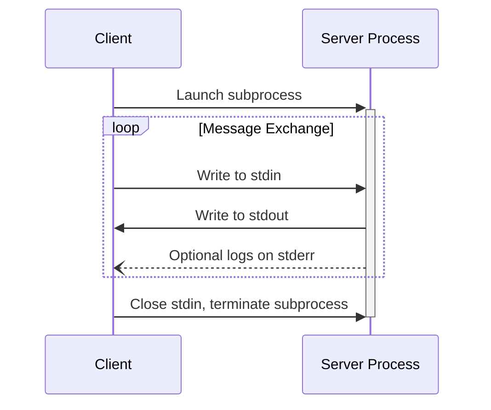
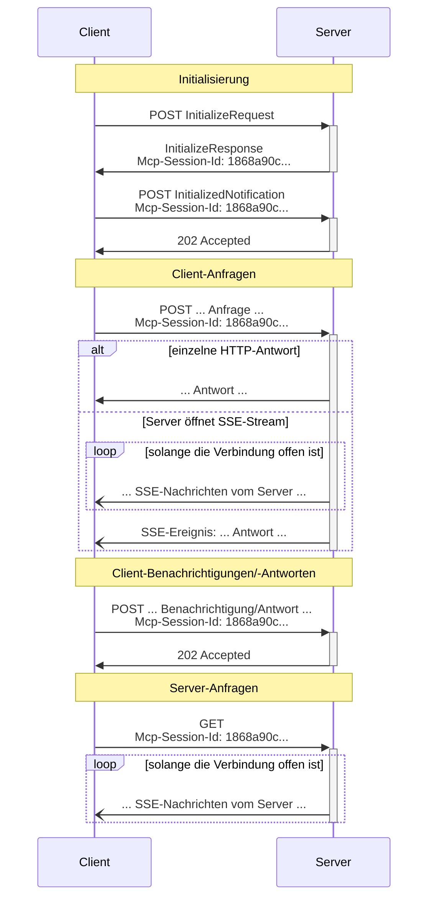

<Info>**Protokollrevision**: 2025-03-26</Info>

MCP verwendet JSON-RPC zur Kodierung von Nachrichten. JSON-RPC-Nachrichten **MÜSSEN** in UTF-8 kodiert sein.

Das Protokoll definiert derzeit zwei standardisierte Transportmechanismen für die Client-Server-
Kommunikation:

1. [stdio](#stdio), Kommunikation über Standard-Ein- und -Ausgabe
2. [Streamable HTTP](#streamable-http)

Clients **SOLLEN** nach Möglichkeit stdio unterstützen.

Es ist auch möglich, dass Clients und Server
[benutzerdefinierte Transporte](#custom-transports) in pluggabler Form implementieren.

  ## stdio

Im **stdio**-Transport:

* Der Client startet den MCP-Server als Unterprozess.
* Der Server liest JSON-RPC-Nachrichten von seiner Standardeingabe (`stdin`) und sendet Nachrichten
  an seine Standardausgabe (`stdout`).
* Nachrichten können JSON-RPC-Anfragen, Benachrichtigungen, Antworten – oder ein JSON-RPC-
  [Batch](https://www.jsonrpc.org/specification#batch), das eine oder mehrere Anfragen
  und/oder Benachrichtigungen enthält, sein.
* Nachrichten werden durch Zeilenumbrüche getrennt und **DÜRFEN KEINE** eingebetteten Zeilenumbrüche enthalten.
* Der Server **DARF** UTF-8-Zeichenketten zu seinem Standardfehlerausgabekanal (`stderr`) für Protokollierungszwecke schreiben. Clients **DÜRFEN** diese Protokollierung erfassen, weiterleiten oder ignorieren.
* Der Server **DARF NICHTS** auf seine `stdout` schreiben, das keine gültige MCP-Nachricht ist.
* Der Client **DARF NICHTS** an die `stdin` des Servers schreiben, das keine gültige MCP-
  Nachricht ist.

  ## Streamable HTTP

<Info>
  Dies ersetzt den [HTTP+SSE-Transport](/de/specification/2024-11-05/basic/transports#http-with-sse) aus der Protokollversion 2024-11-05. Siehe den Leitfaden zur [Abwärtskompatibilität](#backwards-compatibility) unten.
</Info>

Beim **Streamable HTTP**-Transport läuft der Server als eigenständiger Prozess, der mehrere Client-Verbindungen handhaben kann. Dieser Transport verwendet HTTP-POST- und GET-Anfragen. Der Server kann optional
[Server-Sent Events](https://en.wikipedia.org/wiki/Server-sent_events) (SSE) nutzen, um mehrere Servernachrichten zu streamen. Dies ermöglicht einfache MCP-Server ebenso wie funktionsreichere Server mit Unterstützung für Streaming sowie Benachrichtigungen und Anfragen vom Server an den Client.

Der Server **MUSS** einen einzelnen HTTP-Endpunktpfad bereitstellen (im Folgenden als **MCP-Endpunkt** bezeichnet), der sowohl POST- als auch GET-Methoden unterstützt. Beispielsweise könnte dies eine URL wie `https://example.com/mcp` sein.

  #### Sicherheitswarnung

Bei der Implementierung des Streamable HTTP-Transports:

1. Server **MÜSSEN** den `Origin`-Header bei allen eingehenden Verbindungen prüfen, um DNS-Rebinding-Angriffe zu verhindern
2. Im lokalen Betrieb SOLLTEN Server ausschließlich an localhost (127.0.0.1) und nicht an alle Netzwerkschnittstellen (0.0.0.0) binden
3. Server SOLLTEN für alle Verbindungen eine geeignete Authentifizierung implementieren

Ohne diese Schutzmaßnahmen könnten Angreifer DNS-Rebinding ausnutzen, um von entfernten Websites aus mit lokalen MCP-Servern zu interagieren.

  ### Senden von Nachrichten an den Server

Jede vom Client gesendete JSON-RPC-Nachricht **MUSS** eine neue HTTP-POST-Anfrage an den
MCP-Endpunkt sein.

1. Der Client **MUSS** HTTP POST verwenden, um JSON-RPC-Nachrichten an den MCP-Endpunkt zu senden.
2. Der Client **MUSS** einen `Accept`-Header einschließen, der sowohl `application/json` als auch
   `text/event-stream` als unterstützte Medientypen aufführt.
3. Der Body der POST-Anfrage **MUSS** einer der folgenden sein:
   * Eine einzelne JSON-RPC-*Request*, *Notification* oder *Response*
   * Ein Array, das [Batching](https://www.jsonrpc.org/specification#batch) von einer oder mehreren
     *Requests und/oder Notifications* enthält
   * Ein Array, das [Batching](https://www.jsonrpc.org/specification#batch) von einer oder mehreren
     *Responses* enthält
4. Wenn die Eingabe ausschließlich aus (beliebig vielen) JSON-RPC-*Responses* oder
   *Notifications* besteht:
   * Wenn der Server die Eingabe akzeptiert, **MUSS** der Server den HTTP-Statuscode 202
     Accepted ohne Body zurückgeben.
   * Wenn der Server die Eingabe nicht akzeptieren kann, **MUSS** er einen HTTP-Fehlerstatuscode
     zurückgeben (z. B. 400 Bad Request). Der HTTP-Antwort-Body **KANN** eine JSON-RPC-*Error
     Response* ohne `id` enthalten.
5. Wenn die Eingabe eine beliebige Anzahl von JSON-RPC-*Requests* enthält, **MUSS** der Server entweder
   `Content-Type: text/event-stream` zurückgeben, um einen SSE-Stream zu starten, oder
   `Content-Type: application/json`, um ein JSON-Objekt zurückzugeben. Der Client **MUSS**
   beide Fälle unterstützen.
6. Wenn der Server einen SSE-Stream initiiert:
   * Der SSE-Stream **SOLLTE** schließlich eine JSON-RPC-*Response* für jede im POST-Body
     gesendete JSON-RPC-*Request* enthalten. Diese *Responses* **KÖNNEN**
     [gebatcht](https://www.jsonrpc.org/specification#batch) werden.
   * Der Server **KANN** JSON-RPC-*Requests* und *Notifications* senden, bevor er eine
     JSON-RPC-*Response* sendet. Diese Nachrichten **SOLLTEN** sich auf die ursprüngliche Client-
     *Request* beziehen. Diese *Requests* und *Notifications* **KÖNNEN**
     [gebatcht](https://www.jsonrpc.org/specification#batch) werden.
   * Der Server **SOLLTE NICHT** den SSE-Stream schließen, bevor eine JSON-RPC-*Response*
     für jede empfangene JSON-RPC-*Request* gesendet wurde, es sei denn, die [Session](#session-management)
     läuft ab.
   * Nachdem alle JSON-RPC-*Responses* gesendet wurden, **SOLLTE** der Server den SSE-
     Stream schließen.
   * Eine Trennung **KANN** jederzeit auftreten (z. B. aufgrund von Netzwerkbedingungen).
     Daher:
     * Eine Trennung **SOLLTE NICHT** als Abbruch der Anfrage durch den Client interpretiert werden.
     * Zum Abbrechen **SOLLTE** der Client ausdrücklich eine MCP-`CancelledNotification` senden.
     * Um Nachrichtenverlust aufgrund einer Trennung zu vermeiden, **KANN** der Server den Stream
       [wiederaufnahmefähig](#resumability-and-redelivery) machen.

  ### Auf Nachrichten vom Server lauschen

1. Der Client **KANN** einen HTTP-GET an den MCP-Endpunkt ausführen. Dies kann verwendet werden, um einen
   SSE-Stream zu öffnen, der es dem Server ermöglicht, mit dem Client zu kommunizieren, ohne dass der Client zuvor
   Daten per HTTP-POST sendet.
2. Der Client **MUSS** einen `Accept`-Header hinzufügen, der `text/event-stream` als
   unterstützten Medientyp aufführt.
3. Der Server **MUSS** entweder `Content-Type: text/event-stream` als Antwort auf
   diesen HTTP-GET zurückgeben oder andernfalls HTTP 405 Method Not Allowed zurückgeben, was darauf hinweist, dass der Server
   an diesem Endpunkt keinen SSE-Stream anbietet.
4. Falls der Server einen SSE-Stream initiiert:
   * Der Server **KANN** JSON-RPC-*Requests* und *Benachrichtigungen* über den Stream senden. Diese
     *Requests* und *Benachrichtigungen* **KÖNNEN**
     [gebatcht](https://www.jsonrpc.org/specification#batch) werden.
   * Diese Nachrichten **SOLLTEN** unabhängig von einem gleichzeitig laufenden JSON-RPC-
     *Request* des Clients sein.
   * Der Server **DARF NICHT** eine JSON-RPC-*Response* über den Stream senden, **es sei denn**, er
     [setzt](#resumability-and-redelivery) einen mit einer vorherigen Client-
     Anfrage verknüpften Stream fort.
   * Der Server **KANN** den SSE-Stream jederzeit schließen.
   * Der Client **KANN** den SSE-Stream jederzeit schließen.

  ### Mehrere Verbindungen

1. Der Client **KANN** gleichzeitig mit mehreren SSE-Streams verbunden bleiben.
2. Der Server **MUSS** jede seiner JSON-RPC-Nachrichten nur über einen der verbundenen
   Streams senden; das heißt, er **DARF NICHT** dieselbe Nachricht über mehrere Streams verbreiten.
   * Das Risiko eines Nachrichtenverlusts **KANN** gemindert werden, indem der Stream
     [wiederaufnehmbar](#resumability-and-redelivery) gestaltet wird.

  ### Wiederaufnahme und erneute Zustellung

Um das Fortsetzen unterbrochener Verbindungen und die erneute Zustellung von Nachrichten zu unterstützen, die sonst verloren gehen könnten:

1. Server **DÜRFEN** ihren SSE-Ereignissen ein `id`-Feld anhängen, wie im
   [SSE-Standard](https://html.spec.whatwg.org/multipage/server-sent-events.html#event-stream-interpretation) beschrieben.
   * Falls vorhanden, **MUSS** die ID global eindeutig über alle Streams innerhalb dieser
     [Sitzung](#session-management) sein — oder über alle Streams mit diesem spezifischen Client, wenn keine Sitzungsverwaltung verwendet wird.
2. Wenn der Client nach einer unterbrochenen Verbindung fortsetzen möchte, **SOLLTE** er eine HTTP-
   GET-Anfrage an den MCP-Endpunkt stellen und den
   [`Last-Event-ID`](https://html.spec.whatwg.org/multipage/server-sent-events.html#the-last-event-id-header)-
   Header einbeziehen, um die zuletzt empfangene Ereignis-ID anzugeben.
   * Der Server **DARF** diesen Header verwenden, um Nachrichten erneut zu übertragen, die nach der letzten Ereignis-ID gesendet worden wären, *auf dem Stream, der getrennt wurde*, und den Stream von diesem Punkt an fortzusetzen.
   * Der Server **DARF NICHT** Nachrichten erneut übertragen, die über einen anderen Stream zugestellt worden wären.

Mit anderen Worten: Diese Ereignis-IDs sollten von Servern *pro Stream* vergeben werden, um als Cursor innerhalb dieses speziellen Streams zu dienen.

  ### Sitzungsverwaltung

Eine MCP-„Sitzung“ besteht aus logisch zusammenhängenden Interaktionen zwischen einem Client und einem Server und beginnt mit der [Initialisierungsphase](/de/specification/2025-03-26/basic/lifecycle). Zur Unterstützung von Servern, die zustandsbehaftete Sitzungen etablieren möchten:

1. Ein Server, der den Streamable-HTTP-Transport verwendet, **KANN** zur Initialisierung eine Sitzungs-ID vergeben, indem er sie im `Mcp-Session-Id`-Header der HTTP-Antwort mit dem `InitializeResult` zurückgibt.
   * Die Sitzungs-ID **SOLLTE** global eindeutig und kryptografisch sicher sein (z. B. eine sicher generierte UUID, ein JWT oder ein kryptografischer Hash).
   * Die Sitzungs-ID **MUSS** ausschließlich sichtbare ASCII-Zeichen enthalten (Bereich 0x21 bis 0x7E).
2. Wenn der Server während der Initialisierung eine `Mcp-Session-Id` zurückgibt, **MÜSSEN** Clients, die den Streamable-HTTP-Transport verwenden, diese in allen nachfolgenden HTTP-Anfragen im `Mcp-Session-Id`-Header mitführen.
   * Server, die eine Sitzungs-ID erfordern, **SOLLTEN** auf Anfragen ohne `Mcp-Session-Id`-Header (außer der Initialisierung) mit HTTP 400 Bad Request antworten.
3. Der Server **KANN** die Sitzung jederzeit beenden; danach **MUSS** er auf Anfragen, die diese Sitzungs-ID enthalten, mit HTTP 404 Not Found antworten.
4. Wenn ein Client als Antwort auf eine Anfrage mit `Mcp-Session-Id` HTTP 404 erhält, **MUSS** er eine neue Sitzung starten, indem er eine neue `InitializeRequest` ohne Sitzungs-ID sendet.
5. Clients, die eine bestimmte Sitzung nicht mehr benötigen (z. B. weil der Benutzer die Client-Anwendung verlässt), **SOLLTEN** ein HTTP DELETE an den MCP-Endpunkt mit dem `Mcp-Session-Id`-Header senden, um die Sitzung explizit zu beenden.
   * Der Server **KANN** auf diese Anfrage mit HTTP 405 Method Not Allowed antworten und damit anzeigen, dass der Server das Beenden von Sitzungen durch Clients nicht erlaubt.

  ### Sequenzdiagramm

  ### Abwärtskompatibilität

Clients und Server können die Abwärtskompatibilität mit dem veralteten [HTTP+SSE-Transport](/de/specification/2024-11-05/basic/transports#http-with-sse) (seit Protokollversion 2024-11-05) wie folgt sicherstellen:

**Server**, die ältere Clients unterstützen möchten, sollten:

* Weiterhin sowohl die SSE- als auch die POST-Endpunkte des alten Transports hosten, zusätzlich zum
  neuen „MCP-Endpunkt“, der für den Streamable HTTP-Transport definiert ist.
  * Es ist auch möglich, den alten POST-Endpunkt und den neuen MCP-Endpunkt zu kombinieren, dies kann jedoch unnötige Komplexität mit sich bringen.

**Clients**, die ältere Server unterstützen möchten, sollten:

1. Eine MCP-Server-URL vom Benutzer akzeptieren, die entweder auf einen Server mit dem
   alten oder dem neuen Transport verweisen kann.
2. Versuchen, eine `InitializeRequest` mit POST an die Server-URL zu senden, mit einem `Accept`-Header wie
   oben definiert:
   * Wenn dies gelingt, kann der Client davon ausgehen, dass der Server den neuen
     Streamable HTTP-Transport unterstützt.
   * Wenn dies mit einem HTTP-4xx-Statuscode fehlschlägt (z. B. 405 Method Not Allowed oder 404 Not Found):
     * Eine GET-Anfrage an die Server-URL stellen, in der Erwartung, dass dadurch ein SSE-Stream geöffnet
       wird und ein `endpoint`-Event als erstes Ereignis zurückgegeben wird.
     * Wenn das `endpoint`-Event eintrifft, kann der Client davon ausgehen, dass es sich um einen Server handelt, der den
       alten HTTP+SSE-Transport verwendet, und sollte diesen Transport für die gesamte nachfolgende
       Kommunikation nutzen.

  ## Benutzerdefinierte Transporte

Clients und Server **DÜRFEN** zusätzliche benutzerdefinierte Transportmechanismen implementieren, um ihren spezifischen Anforderungen gerecht zu werden. Das Protokoll ist transportagnostisch und kann über jeden Kommunikationskanal implementiert werden, der bidirektionalen Nachrichtenaustausch unterstützt.

Implementierende, die benutzerdefinierte Transporte unterstützen, **MÜSSEN** sicherstellen, dass sie das JSON-RPC-Nachrichtenformat und die von MCP definierten Anforderungen an den Lebenszyklus einhalten. Benutzerdefinierte Transporte **SOLLEN** ihre spezifischen Verfahren zur Verbindungsherstellung und zum Nachrichtenaustausch dokumentieren, um die Interoperabilität zu erleichtern.