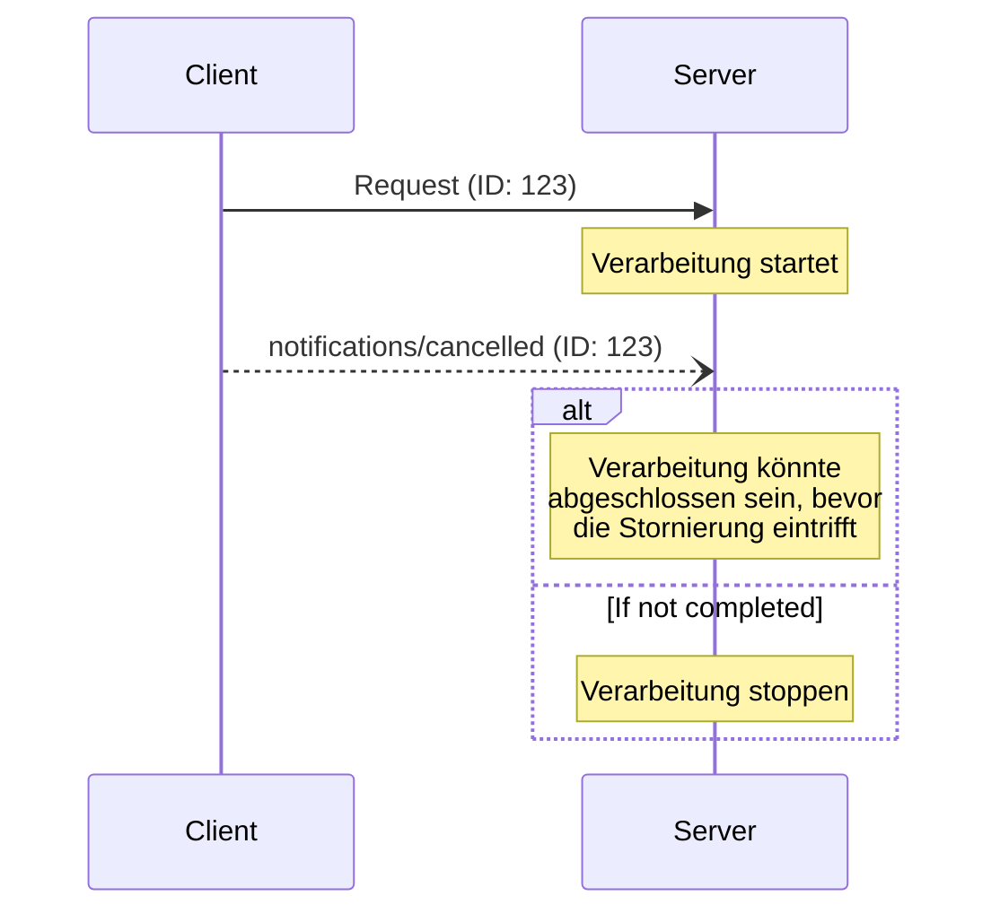

<Info>**Protokollrevision**: 2025-03-26</Info>

Das Model Context Protocol (MCP) unterstützt die optionale Stornierung laufender Anfragen
per Benachrichtigung. Beide Seiten können eine Stornierungsbenachrichtigung senden, um
anzuzeigen, dass eine zuvor gestellte Anfrage beendet werden soll.

<div id="cancellation-flow">
  ## Abbruchablauf
</div>

Wenn eine Partei eine laufende Anfrage abbrechen möchte, sendet sie eine `notifications/cancelled`-Benachrichtigung mit:

- Der ID der zu stornierenden Anfrage
- Einer optionalen Begründung, die protokolliert oder angezeigt werden kann

```json
{
  "jsonrpc": "2.0",
  "method": "notifications/cancelled",
  "params": {
    "requestId": "123",
    "reason": "User requested cancellation"
  }
}
```

<div id="behavior-requirements">
  ## Verhaltensanforderungen
</div>

1. Abbruchbenachrichtigungen **MÜSSEN** nur auf Anfragen verweisen, die:
   - Zuvor in derselben Richtung gesendet wurden
   - Voraussichtlich noch in Bearbeitung sind
2. Die `initialize`-Anfrage **DARF NICHT** von Clients abgebrochen werden
3. Empfänger von Abbruchbenachrichtigungen **SOLLEN**:
   - Die Verarbeitung der abgebrochenen Anfrage stoppen
   - Zugehörige Ressourcen freigeben
   - Keine Antwort auf die abgebrochene Anfrage senden
4. Empfänger **DÜRFEN** Abbruchbenachrichtigungen ignorieren, wenn:
   - Die referenzierte Anfrage unbekannt ist
   - Die Verarbeitung bereits abgeschlossen ist
   - Die Anfrage nicht abgebrochen werden kann
5. Der Absender der Abbruchbenachrichtigung **SOLLTE** jede Antwort auf die
   Anfrage ignorieren, die anschließend eintrifft

<div id="timing-considerations">
  ## Zeitliche Aspekte
</div>

Aufgrund von Netzwerklatenzen können Stornierungsbenachrichtigungen erst eintreffen, nachdem die Bearbeitung der Anfrage
bereits abgeschlossen ist – und möglicherweise nachdem schon eine Antwort gesendet wurde.

Beide Parteien **MÜSSEN** diese Race-Conditions robust handhaben:



<div id="implementation-notes">
  ## Hinweise zur Implementierung
</div>

- Beide Parteien SOLLTEN Abbruchgründe zu Debugging-Zwecken protokollieren
- Anwendungs-UIs SOLLTEN anzeigen, wenn eine Abbruchanforderung vorliegt

<div id="error-handling">
  ## Fehlerbehandlung
</div>

Ungültige Abbruch-Benachrichtigungen **SOLLTEN** ignoriert werden:

- Unbekannte Anforderungs-IDs
- Bereits abgeschlossene Anforderungen
- Fehlformatierte Benachrichtigungen

Dies bewahrt den „Fire-and-Forget“-Charakter von Benachrichtigungen und lässt zugleich
Race-Conditions in asynchroner Kommunikation zu.