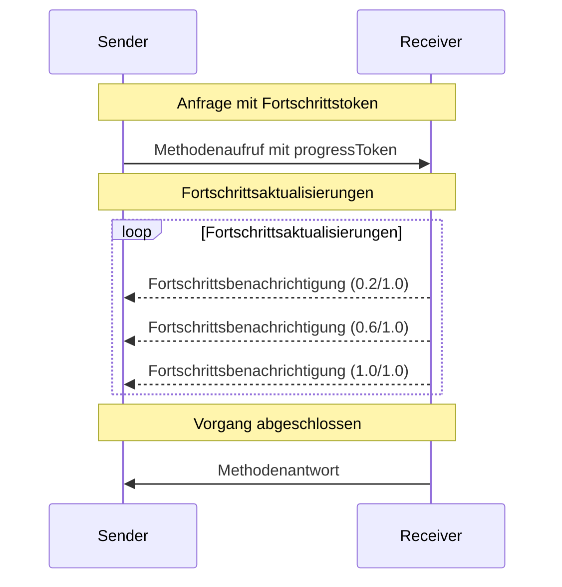

<Info>**Protokollrevision**: 2025-03-26</Info>

Das Model Context Protocol (MCP) unterstützt optionales Fortschritts-Tracking für langlaufende
Operationen über Benachrichtigungen. Beide Seiten können Fortschrittsbenachrichtigungen senden, um
Aktualisierungen zum Status von Operationen bereitzustellen.

<div id="progress-flow">
  ## Fortschrittsablauf
</div>

Wenn eine Partei Fortschrittsaktualisierungen für eine Anfrage erhalten möchte, fügt sie ein
`progressToken` in die Anfrage-Metadaten ein.

- Fortschrittstoken **MÜSSEN** ein Zeichenketten- oder Ganzzahlenwert sein
- Fortschrittstoken können vom Sender auf beliebige Weise gewählt werden, **MÜSSEN** jedoch
  über alle aktiven Anfragen hinweg eindeutig sein.

```json
{
  "jsonrpc": "2.0",
  "id": 1,
  "method": "some_method",
  "params": {
    "_meta": {
      "progressToken": "abc123"
    }
  }
}
```

Der Empfänger **KANN** dann Fortschrittsbenachrichtigungen senden, die Folgendes enthalten:

- Das ursprüngliche Fortschrittstoken
- Den aktuellen bisherigen Fortschrittswert
- Einen optionalen „total“-Wert
- Einen optionalen „message“-Wert

```json
{
  "jsonrpc": "2.0",
  "method": "notifications/progress",
  "params": {
    "progressToken": "abc123",
    "progress": 50,
    "total": 100,
    "message": "Reticulating splines..."
  }
}
```

- Der `progress`-Wert **MUSS** mit jeder Benachrichtigung zunehmen, selbst wenn die Gesamtmenge
  unbekannt ist.
- Die Werte `progress` und `total` **KÖNNEN** Gleitkommazahlen sein.
- Das Feld `message` **SOLLTE** relevante, gut lesbare Informationen zum Fortschritt liefern.

<div id="behavior-requirements">
  ## Verhaltensanforderungen
</div>

1. Fortschrittsbenachrichtigungen **MÜSSEN** nur auf Token verweisen, die:
   - In einer aktiven Anfrage bereitgestellt wurden
   - Mit einem laufenden Vorgang verknüpft sind

2. Empfänger von Fortschrittsanfragen **DÜRFEN**:
   - Sich entscheiden, keine Fortschrittsbenachrichtigungen zu senden
   - Benachrichtigungen in einer von ihnen als angemessen erachteten Frequenz senden
   - Den Gesamtwert weglassen, wenn er unbekannt ist



<div id="implementation-notes">
  ## Implementierungshinweise
</div>

- Sender und Empfänger **SOLLEN** aktive Fortschrittstoken nachverfolgen
- Beide Parteien **SOLLEN** eine Ratenbegrenzung implementieren, um Überflutung zu verhindern
- Fortschrittsbenachrichtigungen **MÜSSEN** nach Abschluss beendet werden