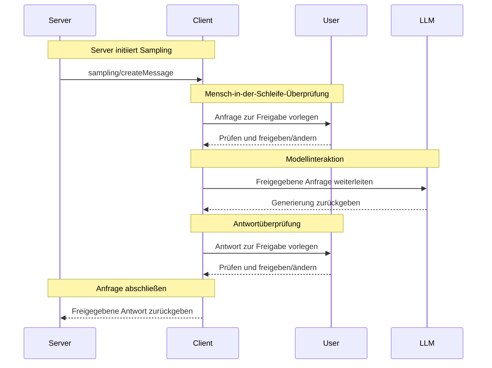

<Info>**Protokollrevision**: 2025-03-26</Info>

Das Model Context Protocol (MCP) bietet eine standardisierte Möglichkeit für Server, über Clients LLM-Sampling („Completions“ oder „Generations“) von Sprachmodellen anzufordern. Dieser Ablauf ermöglicht es Clients, die Kontrolle über den Modellenzugriff, die Modellauswahl und die -berechtigungen zu behalten, während Server KI-Funktionen nutzen können—ohne dass Server-API-Schlüssel erforderlich sind. Server können text-, audio- oder bildbasierte Interaktionen anfordern und optional Kontext von MCP-Servern in ihre Prompts einbeziehen.

<div id="user-interaction-model">
  ## Benutzerinteraktionsmodell
</div>

Sampling in MCP ermöglicht es Servern, agentische Verhaltensweisen zu implementieren, indem LLM-Aufrufe *verschachtelt* innerhalb anderer MCP-Serverfunktionen stattfinden können.

Implementierungen können Sampling über jedes Schnittstellenmuster bereitstellen, das ihren Anforderungen entspricht—das Protokoll selbst schreibt kein spezifisches Benutzerinteraktionsmodell vor.

<Warning>
  Aus Gründen von Trust &amp; Safety sowie Sicherheit **SOLLTE** stets ein Mensch eingebunden sein, der Sampling-Anfragen ablehnen kann.

  Anwendungen **SOLLEN**:

  * Eine UI bereitstellen, die das Prüfen von Sampling-Anfragen einfach und intuitiv macht
  * Nutzenden erlauben, Prompts vor dem Senden anzusehen und zu bearbeiten
  * Generierte Antworten vor der Auslieferung zur Prüfung vorlegen
</Warning>

<div id="capabilities">
  ## Fähigkeiten
</div>

Clients, die Sampling unterstützen, **MÜSSEN** während der
[Initialisierung](/de/specification/2025-03-26/basic/lifecycle#initialization) die Fähigkeit `sampling` deklarieren:

```json
{
  "capabilities": {
    "sampling": {}
  }
}
```

<div id="protocol-messages">
  ## Protokollnachrichten
</div>

<div id="creating-messages">
  ### Nachrichten erstellen
</div>

Um eine Generierung durch ein Sprachmodell anzufordern, senden Server eine `sampling/createMessage`-Anfrage:

**Anfrage:**

```json
{
  "jsonrpc": "2.0",
  "id": 1,
  "method": "sampling/createMessage",
  "params": {
    "messages": [
      {
        "role": "user",
        "content": {
          "type": "text",
          "text": "What is the capital of France?"
        }
      }
    ],
    "modelPreferences": {
      "hints": [
        {
          "name": "claude-3-sonnet"
        }
      ],
      "intelligencePriority": 0.8,
      "speedPriority": 0.5
    },
    "systemPrompt": "You are a helpful assistant.",
    "maxTokens": 100
  }
}
```

**Antwort:**

```json
{
  "jsonrpc": "2.0",
  "id": 1,
  "result": {
    "role": "assistant",
    "content": {
      "type": "text",
      "text": "The capital of France is Paris."
    },
    "model": "claude-3-sonnet-20240307",
    "stopReason": "endTurn"
  }
}
```

<div id="message-flow">
  ## Nachrichtenfluss
</div>



<div id="data-types">
  ## Datentypen
</div>

<div id="messages">
  ### Nachrichten
</div>

Sampling-Nachrichten können Folgendes enthalten:

<div id="text-content">
  #### Textinhalt
</div>

```json
{
  "type": "text",
  "text": "Nachrichteninhalt"
}
```

<div id="image-content">
  #### Bildinhalt
</div>

```json
{
  "type": "image",
  "data": "base64-encoded-image-data",
  "mimeType": "image/jpeg"
}
```

<div id="audio-content">
  #### Audiomaterial
</div>

```json
{
  "type": "audio",
  "data": "base64-encoded-audio-data",
  "mimeType": "audio/wav"
}
```

<div id="model-preferences">
  ### Modellpräferenzen
</div>

Die Modellauswahl in MCP erfordert eine sorgfältige Abstraktion, da Server und Clients
unterschiedliche KI-Anbieter mit jeweils eigenen Modellportfolios nutzen können. Ein Server
kann nicht einfach ein bestimmtes Modell namentlich anfordern, da der Client möglicherweise
keinen Zugriff auf genau dieses Modell hat oder es vorzieht, ein entsprechendes Modell eines
anderen Anbieters zu verwenden.

Um dies zu lösen, implementiert MCP ein Präferenzsystem, das abstrakte Prioritäten für
Fähigkeiten mit optionalen Modellhinweisen kombiniert:

<div id="capability-priorities">
  #### Prioritäten für Fähigkeiten
</div>

Server geben ihre Anforderungen über drei normalisierte Prioritätswerte (0–1) an:

* `costPriority`: Wie wichtig ist die Kostensenkung? Höhere Werte bevorzugen günstigere Modelle.
* `speedPriority`: Wie wichtig ist geringe Latenz? Höhere Werte bevorzugen schnellere Modelle.
* `intelligencePriority`: Wie wichtig sind erweiterte Fähigkeiten? Höhere Werte bevorzugen
  leistungsfähigere Modelle.

<div id="model-hints">
  #### Modellhinweise
</div>

Während Prioritäten bei der Modellauswahl nach Eigenschaften helfen, ermöglichen `hints` Servern,
konkret bestimmte Modelle oder Modellfamilien vorzuschlagen:

* Hinweise werden als Teilzeichenfolgen behandelt, die flexibel mit Modellnamen übereinstimmen können
* Mehrere Hinweise werden in der Reihenfolge der Präferenz ausgewertet
* Clients **DÜRFEN** Hinweise auf gleichwertige Modelle verschiedener Anbieter abbilden
* Hinweise sind unverbindlich—die endgültige Modellauswahl trifft der Client

Zum Beispiel:

```json
{
  "hints": [
    { "name": "claude-3-sonnet" }, // Modelle der Sonnet-Klasse bevorzugen
    { "name": "claude" } // Andernfalls auf ein beliebiges Claude-Modell zurückfallen
  ],
  "costPriority": 0.3, // Kosten sind weniger wichtig
  "speedPriority": 0.8, // Geschwindigkeit ist sehr wichtig
  "intelligencePriority": 0.5 // Mittlere Anforderungsstufe an die Fähigkeiten
}
```

Der Client verarbeitet diese Präferenzen, um ein geeignetes Modell aus den verfügbaren
Optionen auszuwählen. Hat der Client beispielsweise keinen Zugriff auf Claude-Modelle, aber auf Gemini,
könnte er den Sonnet-Hinweis aufgrund ähnlicher Fähigkeiten auf `gemini-1.5-pro` abbilden.

<div id="error-handling">
  ## Fehlerbehandlung
</div>

Clients **SOLLTEN** für gängige Fehlerszenarien Fehler zurückgeben:

Beispiel für einen Fehler:

```json
{
  "jsonrpc": "2.0",
  "id": 1,
  "error": {
    "code": -1,
    "message": "User rejected sampling request"
  }
}
```

<div id="security-considerations">
  ## Sicherheitshinweise
</div>

1. Clients **SOLLTEN** Zustimmungs­prüfungen durch Benutzer implementieren
2. Beide Parteien **SOLLTEN** Nachrichteninhalte validieren
3. Clients **SOLLTEN** Hinweise zu Modellpräferenzen berücksichtigen
4. Clients **SOLLTEN** Ratenbegrenzungen implementieren
5. Beide Parteien **MÜSSEN** sensible Daten angemessen behandeln