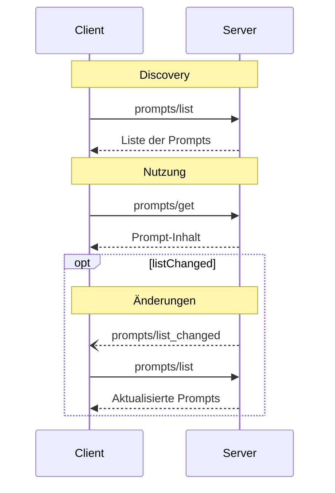

<Info>**Protokollrevision**: 2025-03-26</Info>

Das Model Context Protocol (MCP) stellt eine standardisierte Möglichkeit bereit, mit der Server Prompt‑Vorlagen für Clients verfügbar machen können. Prompts ermöglichen es Servern, strukturierte Nachrichten und Anweisungen für die Interaktion mit Sprachmodellen bereitzustellen. Clients können verfügbare Prompts entdecken, deren Inhalte abrufen und Parameter angeben, um sie zu konfigurieren.

<div id="user-interaction-model">
  ## Benutzerinteraktionsmodell
</div>

Prompts sind so gestaltet, dass sie **vom Benutzer gesteuert** werden. Das bedeutet, dass sie von Servern für Clients bereitgestellt werden, damit Benutzer sie gezielt zur Verwendung auswählen können.

In der Regel werden Prompts über vom Benutzer initiierte Befehle in der Benutzeroberfläche ausgelöst, was es den Benutzern ermöglicht, verfügbare Prompts auf natürliche Weise zu entdecken und aufzurufen.

Zum Beispiel als Slash-Befehle:


Implementierende sind jedoch frei, Prompts über jedes Interface-Muster bereitzustellen, das ihren Anforderungen entspricht—das Protokoll selbst schreibt kein spezifisches Benutzerinteraktionsmodell vor.

<div id="capabilities">
  ## Fähigkeiten
</div>

Server, die Prompts unterstützen, **MÜSSEN** während der
[Initialisierung](/de/specification/2025-03-26/basic/lifecycle#initialization) die Fähigkeit `prompts` deklarieren:

```json
{
  "capabilities": {
    "prompts": {
      "listChanged": true
    }
  }
}
```

`listChanged` gibt an, ob der Server Benachrichtigungen ausgibt, wenn sich die Liste der
verfügbaren Prompts ändert.

<div id="protocol-messages">
  ## Protokollnachrichten
</div>

<div id="listing-prompts">
  ### Auflisten von Prompts
</div>

Um verfügbare Prompts abzurufen, senden Clients eine `prompts/list`-Anfrage. Dieser Vorgang
unterstützt [Seitennummerierung](/de/specification/2025-03-26/server/utilities/pagination).

**Anfrage:**

```json
{
  "jsonrpc": "2.0",
  "id": 1,
  "method": "prompts/list",
  "params": {
    "cursor": "optional-cursor-value"
  }
}
```

**Antwort:**

```json
{
  "jsonrpc": "2.0",
  "id": 1,
  "result": {
    "prompts": [
      {
        "name": "code_review",
        "description": "Fordert das LLM auf, die Codequalität zu analysieren und Verbesserungen vorzuschlagen",
        "arguments": [
          {
            "name": "code",
            "description": "Der zu überprüfende Code",
            "required": true
          }
        ]
      }
    ],
    "nextCursor": "next-page-cursor"
  }
}
```

<div id="getting-a-prompt">
  ### Abrufen eines Prompts
</div>

Um ein bestimmtes Prompt abzurufen, senden Clients eine `prompts/get`-Anfrage. Argumente können über [die Completion-API](/de/specification/2025-03-26/server/utilities/completion) automatisch vervollständigt werden.

**Anfrage:**

```json
{
  "jsonrpc": "2.0",
  "id": 2,
  "method": "prompts/get",
  "params": {
    "name": "code_review",
    "arguments": {
      "code": "def hello():\n    print('world')"
    }
  }
}
```

**Antwort:**

```json
{
  "jsonrpc": "2.0",
  "id": 2,
  "result": {
    "description": "Code-Review-Prompt",
    "messages": [
      {
        "role": "user",
        "content": {
          "type": "text",
          "text": "Please review this Python code:\ndef hello():\n    print('world')"
        }
      }
    ]
  }
}
```

<div id="list-changed-notification">
  ### Benachrichtigung bei Listenänderung
</div>

Wenn sich die Liste der verfügbaren Prompts ändert, **SOLLEN** Server, die die Fähigkeit `listChanged` deklariert haben, eine Benachrichtigung senden:

```json
{
  "jsonrpc": "2.0",
  "method": "notifications/prompts/list_changed"
}
```

<div id="message-flow">
  ## Nachrichtenfluss
</div>



<div id="data-types">
  ## Datentypen
</div>

<div id="prompt">
  ### Prompt
</div>

Eine Prompt-Definition umfasst:

* `name`: Eindeutiger Bezeichner für den Prompt
* `description`: Optionale, menschenlesbare Beschreibung
* `arguments`: Optionale Liste von Argumenten zur Anpassung

<div id="promptmessage">
  ### PromptMessage
</div>

Nachrichten in einem Prompt können Folgendes enthalten:

* `role`: Entweder „user“ oder „assistant“, um den Sprecher anzugeben
* `content`: Einer der folgenden Inhaltstypen:

<div id="text-content">
  #### Textinhalt
</div>

Textinhalt steht für reine Textnachrichten:

```json
{
  "type": "text",
  "text": "The text content of the message"
}
```

Dies ist der am häufigsten verwendete Inhaltstyp für Interaktionen in natürlicher Sprache.

<div id="image-content">
  #### Bildinhalt
</div>

Bildinhalt ermöglicht das Einbinden visueller Informationen in Nachrichten:

```json
{
  "type": "image",
  "data": "base64-encoded-image-data",
  "mimeType": "image/png"
}
```

Die Bilddaten **MÜSSEN** Base64-codiert sein und einen gültigen MIME-Typ enthalten. Dies ermöglicht
multimodale Interaktionen, bei denen visueller Kontext wichtig ist.

<div id="audio-content">
  #### Audioinhalte
</div>

Audioinhalte ermöglichen das Einbinden von Audioinformationen in Nachrichten:

```json
{
  "type": "audio",
  "data": "base64-encoded-audio-data",
  "mimeType": "audio/wav"
}
```

Die Audiodaten MÜSSEN Base64-codiert sein und einen gültigen MIME-Typ enthalten. Dies ermöglicht
multimodale Interaktionen, bei denen der Audiokontext wichtig ist.

<div id="embedded-resources">
  #### Eingebettete Ressourcen
</div>

Eingebettete Ressourcen ermöglichen das direkte Referenzieren serverseitiger Ressourcen in Nachrichten:

```json
{
  "type": "resource",
  "resource": {
    "uri": "resource://example",
    "mimeType": "text/plain",
    "text": "Resource content"
  }
}
```

Ressourcen können entweder Text oder binäre (Blob-)Daten enthalten und **MÜSSEN** Folgendes umfassen:

* Eine gültige Ressourcen-URI
* Den passenden MIME-Typ
* Entweder Textinhalt oder base64-codierte Blob-Daten

Eingebettete Ressourcen ermöglichen es Prompts, serververwaltete Inhalte wie
Dokumentation, Codebeispiele oder andere Referenzmaterialien nahtlos direkt in den Gesprächsablauf
einzubinden.

<div id="error-handling">
  ## Fehlerbehandlung
</div>

Server **SOLLTEN** standardisierte JSON-RPC-Fehler für häufige Fehlerszenarien zurückgeben:

* Ungültiger Prompt-Name: `-32602` (Ungültige Parameter)
* Fehlende erforderliche Argumente: `-32602` (Ungültige Parameter)
* Interne Fehler: `-32603` (Interner Fehler)

<div id="implementation-considerations">
  ## Überlegungen zur Implementierung
</div>

1. Server **SOLLTEN** Prompt-Argumente vor der Verarbeitung überprüfen
2. Clients **SOLLTEN** Paginierung für große Promptlisten unterstützen
3. Beide Seiten **SOLLTEN** die Fähigkeitsaushandlung berücksichtigen

<div id="security">
  ## Sicherheit
</div>

Implementierungen **MÜSSEN** sämtliche Prompt-Eingaben und -Ausgaben sorgfältig validieren, um Injektionsangriffe oder unbefugten Zugriff auf Ressourcen zu verhindern.