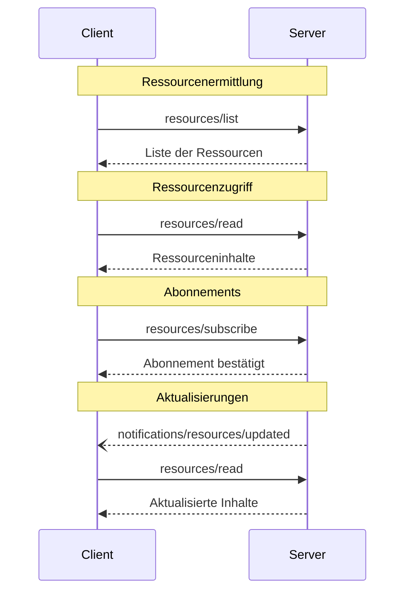

<Info>**Protokollrevision**: 2025-03-26</Info>

Das Model Context Protocol (MCP) bietet eine standardisierte Möglichkeit für Server, Ressourcen gegenüber Clients offenzulegen. Ressourcen ermöglichen es Servern, Daten bereitzustellen, die Sprachmodellen Kontext liefern, etwa Dateien, Datenbankschemata oder anwendungsspezifische Informationen. Jede Ressource wird eindeutig durch eine [URI](https://datatracker.ietf.org/doc/html/rfc3986) identifiziert.

<div id="user-interaction-model">
  ## Benutzerinteraktionsmodell
</div>

Ressourcen im MCP sind **anwendungsgetrieben** konzipiert; Host-Anwendungen
entscheiden je nach Bedarf, wie Kontext eingebunden wird.

Beispielsweise könnten Anwendungen:

* Ressourcen über UI-Elemente zur gezielten Auswahl in einer Baum- oder Listenansicht bereitstellen
* Nutzenden ermöglichen, verfügbare Ressourcen zu durchsuchen und zu filtern
* Eine automatische Kontexteinbindung implementieren, basierend auf Heuristiken oder der Auswahl des KI-Modells


Implementierungen können Ressourcen jedoch über jedes Interface-Muster bereitstellen, das
ihren Anforderungen entspricht—das Protokoll selbst schreibt kein bestimmtes Benutzerinteraktionsmodell vor.

<div id="capabilities">
  ## Fähigkeiten
</div>

Server, die Ressourcen unterstützen, **MÜSSEN** die Fähigkeit `resources` deklarieren:

```json
{
  "capabilities": {
    "resources": {
      "subscribe": true,
      "listChanged": true
    }
  }
}
```

Diese Fähigkeit unterstützt zwei optionale Merkmale:

* `subscribe`: ob der Client Änderungen an einzelnen Ressourcen abonnieren kann, um benachrichtigt zu werden.
* `listChanged`: ob der Server Benachrichtigungen sendet, wenn sich die Liste der verfügbaren Ressourcen ändert.

Sowohl `subscribe` als auch `listChanged` sind optional—Server können keines von beiden, eines von beiden oder beide unterstützen:

```json
{
  "capabilities": {
    "resources": {} // Neither feature supported
  }
}
```

```json
{
  "capabilities": {
    "resources": {
      "subscribe": true // Only subscriptions supported
    }
  }
}
```

```json
{
  "capabilities": {
    "resources": {
      "listChanged": true // Only list change notifications supported
    }
  }
}
```

<div id="protocol-messages">
  ## Protokollnachrichten
</div>

<div id="listing-resources">
  ### Ressourcen auflisten
</div>

Um verfügbare Ressourcen zu ermitteln, senden Clients eine `resources/list`-Anfrage. Dieser Vorgang
unterstützt [Seitennummerierung](/de/specification/2025-03-26/server/utilities/pagination).

**Anfrage:**

```json
{
  "jsonrpc": "2.0",
  "id": 1,
  "method": "resources/list",
  "params": {
    "cursor": "optional-cursor-value"
  }
}
```

**Antwort:**

```json
{
  "jsonrpc": "2.0",
  "id": 1,
  "result": {
    "resources": [
      {
        "uri": "file:///project/src/main.rs",
        "name": "main.rs",
        "description": "Primärer Einstiegspunkt der Anwendung",
        "mimeType": "text/x-rust"
      }
    ],
    "nextCursor": "next-page-cursor"
  }
}
```

<div id="reading-resources">
  ### Ressourcen lesen
</div>

Um den Inhalt von Ressourcen abzurufen, senden Clients eine `resources/read`-Anfrage:

**Anfrage:**

```json
{
  "jsonrpc": "2.0",
  "id": 2,
  "method": "resources/read",
  "params": {
    "uri": "file:///project/src/main.rs"
  }
}
```

**Antwort:**

```json
{
  "jsonrpc": "2.0",
  "id": 2,
  "result": {
    "contents": [
      {
        "uri": "file:///project/src/main.rs",
        "mimeType": "text/x-rust",
        "text": "fn main() {\n    println!(\"Hello world!\");\n}"
      }
    ]
  }
}
```

<div id="resource-templates">
  ### Ressourcen-Vorlagen
</div>

Ressourcen-Vorlagen ermöglichen es Servern, parametrisierte Ressourcen über
[URI-Vorlagen](https://datatracker.ietf.org/doc/html/rfc6570) bereitzustellen. Argumente können
über [die Completion-API](/de/specification/2025-03-26/server/utilities/completion) automatisch vervollständigt werden.

**Anfrage:**

```json
{
  "jsonrpc": "2.0",
  "id": 3,
  "method": "resources/templates/list"
}
```

**Antwort:**

```json
{
  "jsonrpc": "2.0",
  "id": 3,
  "result": {
    "resourceTemplates": [
      {
        "uriTemplate": "file:///{path}",
        "name": "Project Files",
        "description": "Access files in the project directory",
        "mimeType": "application/octet-stream"
      }
    ]
  }
}
```

<div id="list-changed-notification">
  ### Benachrichtigung über geänderte Liste
</div>

Wenn sich die Liste der verfügbaren Ressourcen ändert, **SOLLEN** Server, die die Fähigkeit `listChanged` deklariert haben, eine Benachrichtigung senden:

```json
{
  "jsonrpc": "2.0",
  "method": "notifications/resources/list_changed"
}
```

<div id="subscriptions">
  ### Abonnements
</div>

Das Protokoll unterstützt optionale Abonnements für Änderungen an Ressourcen. Clients können sich auf bestimmte Ressourcen abonnieren und Benachrichtigungen erhalten, wenn diese geändert werden:

**Abonnement-Anfrage:**

```json
{
  "jsonrpc": "2.0",
  "id": 4,
  "method": "resources/subscribe",
  "params": {
    "uri": "file:///project/src/main.rs"
  }
}
```

**Aktualisierungsbenachrichtigung:**

```json
{
  "jsonrpc": "2.0",
  "method": "notifications/resources/updated",
  "params": {
    "uri": "file:///project/src/main.rs"
  }
}
```

<div id="message-flow">
  ## Nachrichtenfluss
</div>



<div id="data-types">
  ## Datentypen
</div>

<div id="resource">
  ### Ressource
</div>

Eine Ressourcendefinition enthält:

* `uri`: Eindeutige Kennung der Ressource
* `name`: Menschlich lesbarer Name
* `description`: Optionale Beschreibung
* `mimeType`: Optionaler MIME-Typ
* `size`: Optionale Größe in Bytes

<div id="resource-contents">
  ### Ressourceninhalte
</div>

Ressourcen können entweder Text- oder Binärdaten enthalten:

<div id="text-content">
  #### Textinhalt
</div>

```json
{
  "uri": "file:///example.txt",
  "mimeType": "text/plain",
  "text": "Ressourceninhalt"
}
```

<div id="binary-content">
  #### Binärinhalt
</div>

```json
{
  "uri": "file:///example.png",
  "mimeType": "image/png",
  "blob": "base64-encoded-data"
}
```

<div id="common-uri-schemes">
  ## Gängige URI-Schemata
</div>

Das Protokoll definiert mehrere Standard-URI-Schemata. Diese Liste ist nicht vollständig—Implementierungen können jederzeit zusätzliche, benutzerdefinierte URI-Schemata verwenden.

<div id="https">
  ### https://
</div>

Wird verwendet, um eine im Web verfügbare Ressource darzustellen.

Server **SOLLEN** dieses Schema nur verwenden, wenn der Client die Ressource eigenständig direkt aus dem Web abrufen und laden kann – das heißt, er muss die Ressource nicht über den MCP-Server lesen.

Für andere Anwendungsfälle **SOLLEN** Server vorzugsweise ein anderes URI-Schema verwenden oder ein eigenes definieren, selbst wenn der Server die Ressourceninhalte seinerseits über das Internet herunterladen wird.

<div id="file">
  ### file://
</div>

Wird verwendet, um Ressourcen zu identifizieren, die sich wie ein Dateisystem verhalten. Die Ressourcen müssen jedoch nicht einem tatsächlichen physischen Dateisystem entsprechen.

MCP-Server **KÖNNEN** file://-Ressourcen mit einem
[XDG-MIME-Typ](https://specifications.freedesktop.org/shared-mime-info-spec/0.14/ar01s02.html#id-1.3.14),
wie `inode/directory`, kennzeichnen, um nicht reguläre Dateien (z. B. Verzeichnisse) darzustellen, die andernfalls keinen standardisierten MIME-Typ haben.

<div id="git">
  ### git://
</div>

Integration mit der Git-Versionsverwaltung.

<div id="error-handling">
  ## Fehlerbehandlung
</div>

Server **SOLLTEN** für gängige Fehlerfälle standardisierte JSON-RPC-Fehler zurückgeben:

* Ressource nicht gefunden: `-32002`
* Interner Fehler: `-32603`

Beispiel für einen Fehler:

```json
{
  "jsonrpc": "2.0",
  "id": 5,
  "error": {
    "code": -32002,
    "message": "Resource not found",
    "data": {
      "uri": "file:///nonexistent.txt"
    }
  }
}
```

<div id="security-considerations">
  ## Sicherheitshinweise
</div>

1. Server **MÜSSEN** alle Ressourcen-URIs validieren
2. Zugriffskontrollen **SOLLTEN** für sensible Ressourcen implementiert werden
3. Binärdaten **MÜSSEN** ordnungsgemäß kodiert werden
4. Berechtigungen für Ressourcen **SOLLTEN** vor Vorgängen geprüft werden