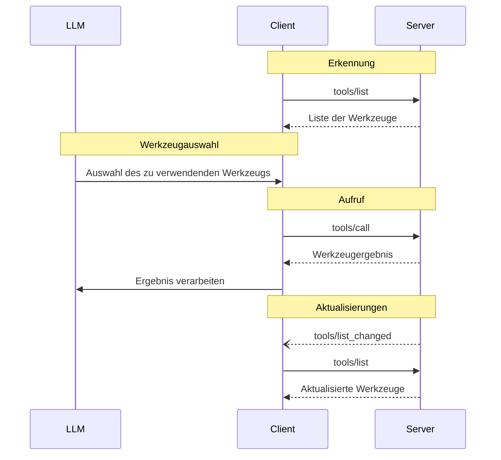

<Info>**Protokollrevision**: 2025-03-26</Info>

Das Model Context Protocol (MCP) ermöglicht es Servern, Werkzeuge bereitzustellen, die von
Sprachmodellen aufgerufen werden können. Werkzeuge erlauben es Modellen, mit externen Systemen zu interagieren, etwa durch das Abfragen von
Datenbanken, das Aufrufen von APIs oder das Ausführen von Berechnungen. Jedes Werkzeug ist eindeutig durch
einen Namen identifiziert und enthält Metadaten, die sein Schema beschreiben.

<div id="user-interaction-model">
  ## Benutzerinteraktionsmodell
</div>

Werkzeuge in MCP sind so konzipiert, dass sie **modellgesteuert** sind. Das bedeutet, dass das Sprachmodell
Werkzeuge basierend auf seinem kontextuellen Verständnis und den
Prompts der Nutzenden automatisch erkennen und aufrufen kann.

Implementierungen können jedoch Werkzeuge über jedes Schnittstellenmuster bereitstellen, das
ihren Anforderungen entspricht—das Protokoll selbst schreibt kein bestimmtes Benutzer-
interaktionsmodell vor.

<Warning>
  Aus Gründen von Vertrauen &amp; Sicherheit und Schutz **SOLLTE** stets
  ein Mensch eingebunden sein, der die Möglichkeit hat, Werkzeugaufrufe abzulehnen.

  Anwendungen **SOLLTEN**:

  * Eine Benutzeroberfläche bereitstellen, die klar macht, welche Werkzeuge dem KI-Modell zur Verfügung stehen
  * Klare visuelle Indikatoren anzeigen, wenn Werkzeuge aufgerufen werden
  * Bestätigungsaufforderungen für Vorgänge präsentieren, um sicherzustellen, dass eine Person im
    Ablauf eingebunden ist
</Warning>

<div id="capabilities">
  ## Fähigkeiten
</div>

Server, die Werkzeuge unterstützen, **MÜSSEN** die Fähigkeit `tools` deklarieren:

```json
{
  "capabilities": {
    "tools": {
      "listChanged": true
    }
  }
}
```

`listChanged` gibt an, ob der Server Benachrichtigungen ausgibt, wenn sich die Liste der verfügbaren Werkzeuge ändert.

<div id="protocol-messages">
  ## Protokollnachrichten
</div>

<div id="listing-tools">
  ### Werkzeuge auflisten
</div>

Um verfügbare Werkzeuge zu entdecken, senden Clients eine `tools/list`-Anfrage. Dieser Vorgang unterstützt
[Paginierung](/de/specification/2025-03-26/server/utilities/pagination).

**Anfrage:**

```json
{
  "jsonrpc": "2.0",
  "id": 1,
  "method": "tools/list",
  "params": {
    "cursor": "optional-cursor-value"
  }
}
```

**Antwort:**

```json
{
  "jsonrpc": "2.0",
  "id": 1,
  "result": {
    "tools": [
      {
        "name": "get_weather",
        "description": "Aktuelle Wetterinformationen für einen Ort abrufen",
        "inputSchema": {
          "type": "object",
          "properties": {
            "location": {
              "type": "string",
              "description": "Stadtname oder Postleitzahl"
            }
          },
          "required": ["location"]
        }
      }
    ],
    "nextCursor": "next-page-cursor"
  }
}
```

<div id="calling-tools">
  ### Aufruf von Werkzeugen
</div>

Um ein Werkzeug aufzurufen, senden Clients eine `tools/call`-Anfrage:

**Anfrage:**

```json
{
  "jsonrpc": "2.0",
  "id": 2,
  "method": "tools/call",
  "params": {
    "name": "get_weather",
    "arguments": {
      "location": "New York"
    }
  }
}
```

**Antwort:**

```json
{
  "jsonrpc": "2.0",
  "id": 2,
  "result": {
    "content": [
      {
        "type": "text",
        "text": "Aktuelles Wetter in New York:\nTemperatur: 72 °F\nWetterlage: Teilweise bewölkt"
      }
    ],
    "isError": false
  }
}
```

<div id="list-changed-notification">
  ### Benachrichtigung über geänderte Liste
</div>

Wenn sich die Liste der verfügbaren Werkzeuge ändert, **SOLLEN** Server, die die Fähigkeit `listChanged` deklariert haben, eine Benachrichtigung senden:

```json
{
  "jsonrpc": "2.0",
  "method": "notifications/tools/list_changed"
}
```

<div id="message-flow">
  ## Nachrichtenfluss
</div>



<div id="data-types">
  ## Datentypen
</div>

<div id="tool">
  ### Werkzeug
</div>

Eine Werkzeugdefinition umfasst:

* `name`: Eindeutiger Bezeichner des Werkzeugs
* `description`: Menschlich lesbare Beschreibung der Funktionalität
* `inputSchema`: JSON-Schema, das die erwarteten Parameter definiert
* `annotations`: Optionale Eigenschaften, die das Verhalten des Werkzeugs beschreiben

<Warning>
  Aus Gründen der Vertrauens- und Betriebssicherheit **MÜSSEN** Clients
  Werkzeug-Annotationen als nicht vertrauenswürdig betrachten, es sei denn, sie stammen von vertrauenswürdigen Servern.
</Warning>

<div id="tool-result">
  ### Werkzeugergebnis
</div>

Werkzeugergebnisse können mehrere Inhaltselemente unterschiedlicher Typen enthalten:

<div id="text-content">
  #### Textinhalt
</div>

```json
{
  "type": "text",
  "text": "Tool-Ergebnistext"
}
```

<div id="image-content">
  #### Bildinhalt
</div>

```json
{
  "type": "image",
  "data": "base64-encoded-data",
  "mimeType": "image/png"
}
```

<div id="audio-content">
  #### Audioinhalt
</div>

```json
{
  "type": "audio",
  "data": "base64-encoded-audio-data",
  "mimeType": "audio/wav"
}
```

<div id="embedded-resources">
  #### Eingebettete Ressourcen
</div>

[Resources](/de/specification/2025-03-26/server/resources) **KÖNNEN** eingebettet werden, um zusätzlichen Kontext
oder Daten bereitzustellen – hinter einer URI, die vom Client abonniert oder später erneut abgerufen werden kann:

```json
{
  "type": "resource",
  "resource": {
    "uri": "resource://example",
    "mimeType": "text/plain",
    "text": "Resource content"
  }
}
```

<div id="error-handling">
  ## Fehlerbehandlung
</div>

Werkzeuge verwenden zwei Mechanismen zur Fehlerberichterstattung:

1. **Protokollfehler**: Standard-JSON-RPC-Fehler für Probleme wie:
   * Unbekannte Werkzeuge
   * Ungültige Argumente
   * Serverfehler

2. **Fehler bei der Werkzeugausführung**: In den Werkzeugergebnissen mit `isError: true` gemeldet:
   * API-Fehler
   * Ungültige Eingabedaten
   * Fehler in der Geschäftslogik

Beispiel für einen Protokollfehler:

```json
{
  "jsonrpc": "2.0",
  "id": 3,
  "error": {
    "code": -32602,
    "message": "Unknown tool: invalid_tool_name"
  }
}
```

Beispiel für einen Fehler bei der Werkzeugausführung:

```json
{
  "jsonrpc": "2.0",
  "id": 4,
  "result": {
    "content": [
      {
        "type": "text",
        "text": "Failed to fetch weather data: API rate limit exceeded"
      }
    ],
    "isError": true
  }
}
```

<div id="security-considerations">
  ## Sicherheitshinweise
</div>

1. Server **MÜSSEN**:
   * Alle Werkzeugeingaben validieren
   * Angemessene Zugriffskontrollen implementieren
   * Aufrufe von Werkzeugen rate-limitieren
   * Werkzeugausgaben bereinigen

2. Clients **SOLLEN**:
   * Bei sensiblen Operationen eine Benutzerbestätigung einholen
   * Die Werkzeugeingaben dem Benutzer vor dem Aufruf des Servers anzeigen, um böswillige oder
     versehentliche Datenexfiltration zu vermeiden
   * Werkzeugergebnisse validieren, bevor sie an das LLM übergeben werden
   * Timeouts für Werkzeugaufrufe implementieren
   * Werkzeugnutzung zu Prüfzwecken protokollieren