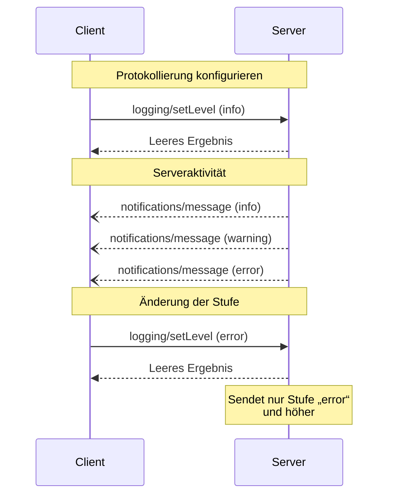

<Info>**Protokollrevision**: 2025-03-26</Info>

Das Model Context Protocol (MCP) stellt eine standardisierte Möglichkeit bereit, mit der Server
strukturierte Protokollmeldungen an Clients senden können. Clients können die Ausführlichkeit der Protokollierung steuern, indem sie
minimale Protokollstufen festlegen. Server senden Benachrichtigungen mit Schweregraden,
optionalem Loggernamen und beliebigen JSON-serialisierbaren Daten.

<div id="user-interaction-model">
  ## Benutzerinteraktionsmodell
</div>

Implementierungen können Protokollierung über jedes Schnittstellenmuster bereitstellen, das ihren Anforderungen entspricht – das Protokoll selbst schreibt kein spezifisches Benutzerinteraktionsmodell vor.

<div id="capabilities">
  ## Fähigkeiten
</div>

Server, die Benachrichtigungen über Protokollmeldungen ausgeben, **MÜSSEN** die Fähigkeit `logging` deklarieren:

```json
{
  "capabilities": {
    "logging": {}
  }
}
```

<div id="log-levels">
  ## Protokollstufen
</div>

Das Protokoll folgt den standardmäßigen Syslog-Schweregraden gemäß
[RFC 5424](https://datatracker.ietf.org/doc/html/rfc5424#section-6.2.1):

| Stufe     | Beschreibung                     | Beispielanwendungsfall     |
| --------- | -------------------------------- | -------------------------- |
| debug     | Detaillierte Debug-Informationen | Funktions-Ein-/Austrittspunkte |
| info      | Allgemeine Informationsmeldungen | Fortschrittsmeldungen zu Vorgängen |
| notice    | Normale, aber bedeutende Ereignisse | Konfigurationsänderungen   |
| warning   | Warnbedingungen                  | Nutzung veralteter Funktionen |
| error     | Fehlerbedingungen                | Fehlgeschlagene Vorgänge   |
| critical  | Kritische Bedingungen            | Ausfälle von Systemkomponenten |
| alert     | Es muss sofort gehandelt werden  | Datenbeschädigung erkannt  |
| emergency | System ist unbenutzbar           | Vollständiger Systemausfall |

<div id="protocol-messages">
  ## Protokollmeldungen
</div>

<div id="setting-log-level">
  ### Protokollebene festlegen
</div>

Um die minimale Protokollebene zu konfigurieren, DÜRfen Clients eine `logging/setLevel`-Anfrage senden:

**Anfrage:**

```json
{
  "jsonrpc": "2.0",
  "id": 1,
  "method": "logging/setLevel",
  "params": {
    "level": "info"
  }
}
```

<div id="log-message-notifications">
  ### Protokollnachrichten-Benachrichtigungen
</div>

Server senden Protokollnachrichten über `notifications/message`-Benachrichtigungen:

```json
{
  "jsonrpc": "2.0",
  "method": "notifications/message",
  "params": {
    "level": "error",
    "logger": "database",
    "data": {
      "error": "Connection failed",
      "details": {
        "host": "localhost",
        "port": 5432
      }
    }
  }
}
```

<div id="message-flow">
  ## Nachrichtenfluss
</div>



<div id="error-handling">
  ## Fehlerbehandlung
</div>

Server **SOLLTEN** für gängige Fehlerfälle standardisierte JSON-RPC-Fehler zurückgeben:

- Ungültige Protokollstufe: `-32602` (Ungültige Parameter)
- Konfigurationsfehler: `-32603` (Interner Fehler)

<div id="implementation-considerations">
  ## Implementierungsüberlegungen
</div>

1. Server **SOLLEN**:
   - Protokollmeldungen begrenzen (Rate-Limit)
   - Relevanten Kontext im Datenfeld hinzufügen
   - Einheitliche Logger-Namen verwenden
   - Sensible Informationen entfernen

2. Clients **DÜRFEN**:
   - Protokollmeldungen in der UI anzeigen
   - Filterung/Suche für Protokolle implementieren
   - Den Schweregrad visuell darstellen
   - Protokollmeldungen dauerhaft speichern

<div id="security">
  ## Sicherheit
</div>

1. Protokollnachrichten **DÜRFEN NICHT** Folgendes enthalten:
   - Anmeldedaten oder Geheimnisse
   - Personenbezogene Daten
   - Interne Systemdetails, die Angriffe begünstigen könnten

2. Implementierungen **SOLLTEN**:
   - Nachrichten mit einer Ratebegrenzung versehen
   - Alle Datenfelder validieren
   - Den Zugriff auf Protokolle kontrollieren
   - Auf sensible Inhalte überwachen