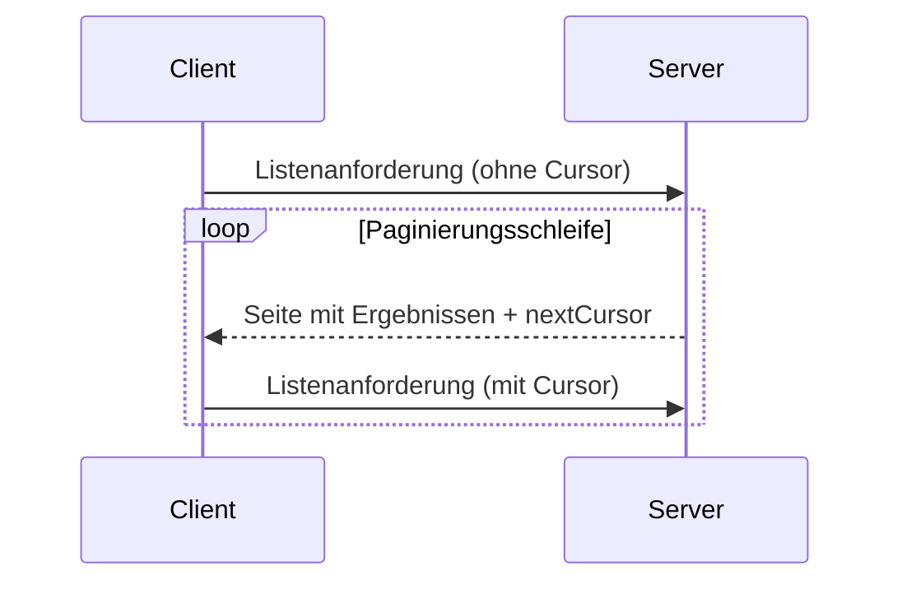

<Info>**Protokollrevision**: 2025-03-26</Info>

Das Model Context Protocol (MCP) unterstützt die Paginierung von Listenvorgängen, die
große Ergebnismengen zurückgeben können. Durch Paginierung können Server Ergebnisse in kleineren
Teilmengen statt auf einmal bereitstellen.

Paginierung ist besonders wichtig bei der Anbindung externer Dienste über das
Internet, aber auch für lokale Integrationen nützlich, um Leistungsprobleme mit großen
Datensätzen zu vermeiden.

<div id="pagination-model">
  ## Paginierungsmodell
</div>

Die Paginierung in MCP verwendet einen Cursor-basierten Ansatz mit intransparenten Tokens statt nummerierter Seiten.

- Der **Cursor** ist ein intransparentes Zeichenfolgen-Token, das eine Position in der Ergebnismenge darstellt
- Die **Seitengröße** wird vom Server festgelegt; Clients **DÜRFEN NICHT** von einer festen Seitengröße ausgehen

<div id="response-format">
  ## Antwortformat
</div>

Die Paginierung beginnt, wenn der Server eine **Antwort** sendet, die Folgendes enthält:

- Die aktuelle Ergebnisseite
- Ein optionales Feld `nextCursor`, falls weitere Ergebnisse vorhanden sind

```json
{
  "jsonrpc": "2.0",
  "id": "123",
  "result": {
    "resources": [...],
    "nextCursor": "eyJwYWdlIjogM30="
  }
}
```

<div id="request-format">
  ## Anforderungsformat
</div>

Nachdem ein Cursor empfangen wurde, kann der Client die Paginierung _fortsetzen_, indem er eine Anforderung
unter Angabe dieses Cursors stellt:

```json
{
  "jsonrpc": "2.0",
  "method": "resources/list",
  "params": {
    "cursor": "eyJwYWdlIjogMn0="
  }
}
```

<div id="pagination-flow">
  ## Paginierungsablauf
</div>



<div id="operations-supporting-pagination">
  ## Operationen mit Paginierungsunterstützung
</div>

Die folgenden MCP-Operationen unterstützen Paginierung:

- `resources/list` - Verfügbare Ressourcen auflisten
- `resources/templates/list` - Ressourcen-Vorlagen auflisten
- `prompts/list` - Verfügbare Prompts auflisten
- `tools/list` - Verfügbare Werkzeuge auflisten

<div id="implementation-guidelines">
  ## Implementierungsrichtlinien
</div>

1. Server **SOLLTEN**:
   - Stabile Cursor bereitstellen
   - Ungültige Cursor robust und freundlich handhaben

2. Clients **SOLLTEN**:
   - Ein fehlendes `nextCursor` als Ende der Ergebnisse interpretieren
   - Sowohl paginierte als auch nicht paginierte Abläufe unterstützen

3. Clients **MÜSSEN** Cursor als inhaltlich undurchsichtige Tokens behandeln:
   - Keine Annahmen über das Cursor-Format treffen
   - Cursor nicht parsen oder verändern
   - Cursor nicht über Sitzungen hinweg speichern

<div id="error-handling">
  ## Fehlerbehandlung
</div>

Ungültige Cursors **SOLLTEN** zu einem Fehler mit dem Code -32602 (Ungültige Parameter) führen.