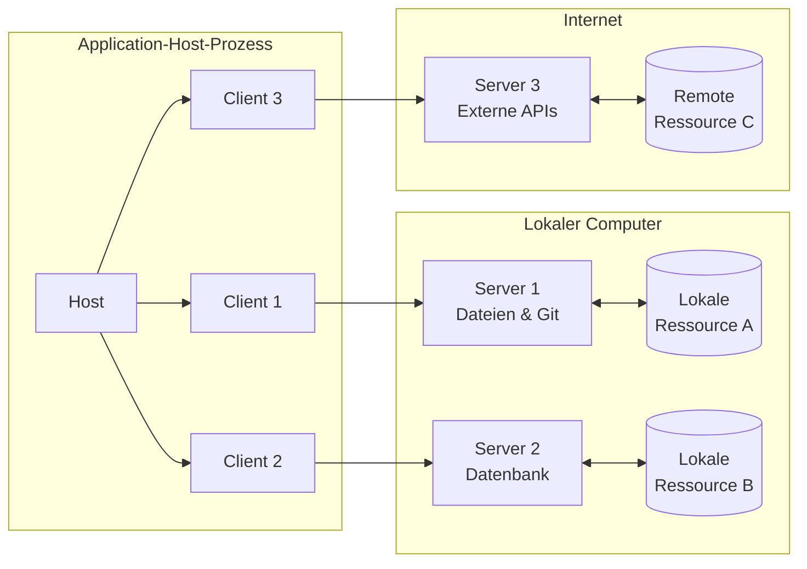
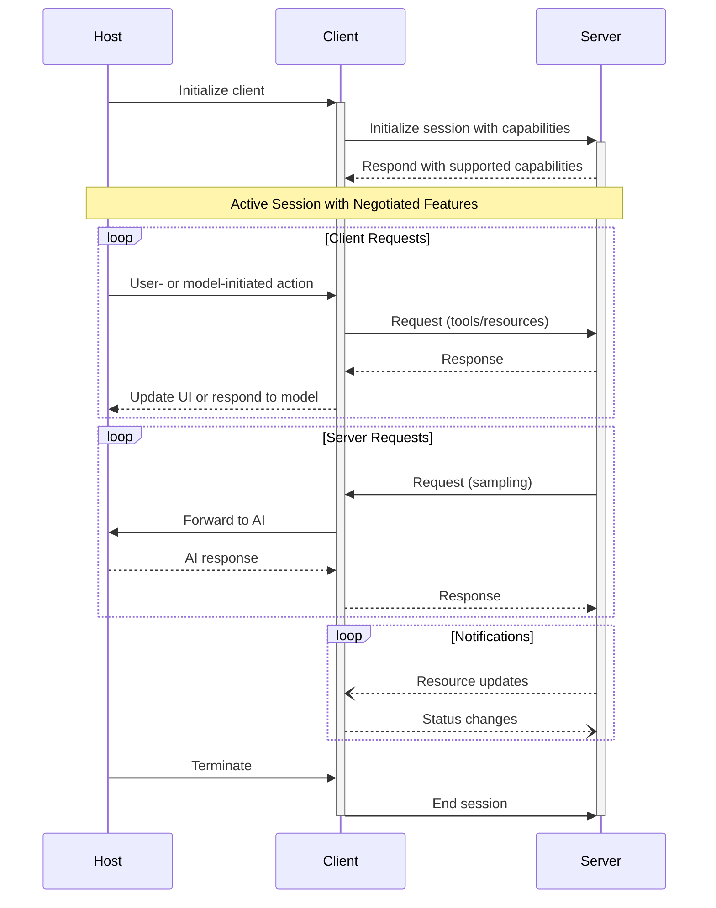

Das Model Context Protocol (MCP) folgt einer Client-Host-Server-Architektur, in der jeder Host mehrere Client-Instanzen ausführen kann. Diese Architektur ermöglicht es Nutzerinnen und Nutzern, KI-Funktionen über Anwendungen hinweg zu integrieren, und wahrt dabei klare Sicherheitsgrenzen sowie eine saubere Trennung der Verantwortlichkeiten. Auf Basis von JSON-RPC 2.0 bietet MCP ein zustandsbehaftetes Sitzungsprotokoll, das sich auf den Austausch von Kontext und die Koordinierung des Samplings zwischen Clients und Servern konzentriert.

  ## Zentrale Komponenten

  ### Host

Der Host-Prozess fungiert als Container und Koordinator:

* Erstellt und verwaltet mehrere Client-Instanzen
* Steuert Verbindungsberechtigungen und Lebenszyklus der Clients
* Setzt Sicherheitsrichtlinien und Einwilligungsanforderungen durch
* Trifft Entscheidungen zur Benutzerautorisierung
* Koordiniert die AI/LLM-Integration und das Sampling
* Verwaltet die Kontextaggregation über Clients hinweg

  ### Clients

Jeder Client wird vom Host erstellt und hält eine isolierte Serververbindung aufrecht:

* Stellt eine zustandsbehaftete Sitzung pro Server her
* Übernimmt Protokollaushandlung und Fähigkeitsaustausch
* Leitet Protokollnachrichten bidirektional weiter
* Verwaltet Abonnements und Benachrichtigungen
* Wahrte Sicherheitsgrenzen zwischen Servern

Eine Host-Anwendung erstellt und verwaltet mehrere Clients, wobei jeder Client eine 1:1-Beziehung zu einem bestimmten Server hat.

  ### Server

Server stellen spezialisierte Kontexte und Fähigkeiten bereit:

* Stellen Ressourcen, Werkzeuge und Prompts über MCP-Primitiven bereit
* Arbeiten unabhängig mit klar abgegrenzten Verantwortlichkeiten
* Fordern Sampling über Client-Schnittstellen an
* Müssen Sicherheitsvorgaben einhalten
* Können lokale Prozesse oder Remote-Dienste sein

  ## Designgrundsätze

MCP basiert auf mehreren zentralen Designgrundsätzen, die seine Architektur und
Implementierung prägen:

1. **Server sollten äußerst einfach zu erstellen sein**
   * Host-Anwendungen übernehmen komplexe Orchestrierungsaufgaben
   * Server konzentrieren sich auf spezifische, klar definierte Fähigkeiten
   * Einfache Schnittstellen minimieren den Implementierungsaufwand
   * Eine klare Trennung ermöglicht wartbaren Code

2. **Server sollten hochgradig komponierbar sein**
   * Jeder Server bietet fokussierte Funktionalität in Isolation
   * Mehrere Server lassen sich nahtlos kombinieren
   * Ein gemeinsames Protokoll ermöglicht Interoperabilität
   * Modulares Design unterstützt Erweiterbarkeit

3. **Server sollten weder die gesamte Unterhaltung lesen noch in andere
   Server „hineinsehen“ können**
   * Server erhalten nur die notwendigen Kontextinformationen
   * Der vollständige Gesprächsverlauf verbleibt beim Host
   * Jede Serververbindung wahrt Isolation
   * Interaktionen zwischen Servern werden vom Host gesteuert
   * Der Host-Prozess erzwingt Sicherheitsgrenzen

4. **Funktionen können schrittweise zu Servern und Clients hinzugefügt werden**
   * Das Kernprotokoll stellt die minimal erforderliche Funktionalität bereit
   * Zusätzliche Fähigkeiten können bei Bedarf ausgehandelt werden
   * Server und Clients entwickeln sich unabhängig weiter
   * Das Protokoll ist auf zukünftige Erweiterbarkeit ausgelegt
   * Abwärtskompatibilität wird beibehalten

  ## Fähigkeitsaushandlung

Das Model Context Protocol verwendet ein fähigkeitsbasiertes Aushandlungssystem, bei dem Clients und
Server während der Initialisierung ihre unterstützten Funktionen ausdrücklich deklarieren. Fähigkeiten
bestimmen, welche Protokollfunktionen und -primitiven während einer Sitzung verfügbar sind.

* Server deklarieren Fähigkeiten wie Ressourcenabonnements, Werkzeugunterstützung und Prompt-
  Vorlagen
* Clients deklarieren Fähigkeiten wie Sampling-Unterstützung und Benachrichtigungsverarbeitung
* Beide Parteien müssen die deklarierten Fähigkeiten während der gesamten Sitzung einhalten
* Zusätzliche Fähigkeiten können über Erweiterungen des Protokolls ausgehandelt werden

Jede Fähigkeit schaltet spezifische Protokollfunktionen für die Nutzung während der Sitzung frei. Zum
Beispiel:

* Implementierte [Serverfunktionen](/de/specification/2025-06-18/server) müssen in den
  Fähigkeiten des Servers angegeben werden
* Das Senden von Benachrichtigungen zu Ressourcenabonnements erfordert, dass der Server
  Abonnementunterstützung deklariert
* Das Ausführen von Werkzeugen erfordert, dass der Server Werkzeug-Fähigkeiten deklariert
* [Sampling](/de/specification/2025-06-18/client) erfordert, dass der Client Unterstützung in seinen
  Fähigkeiten deklariert

Diese Fähigkeitsaushandlung stellt sicher, dass Clients und Server ein klares Verständnis der
unterstützten Funktionalität haben und gleichzeitig die Erweiterbarkeit des Protokolls gewahrt bleibt.