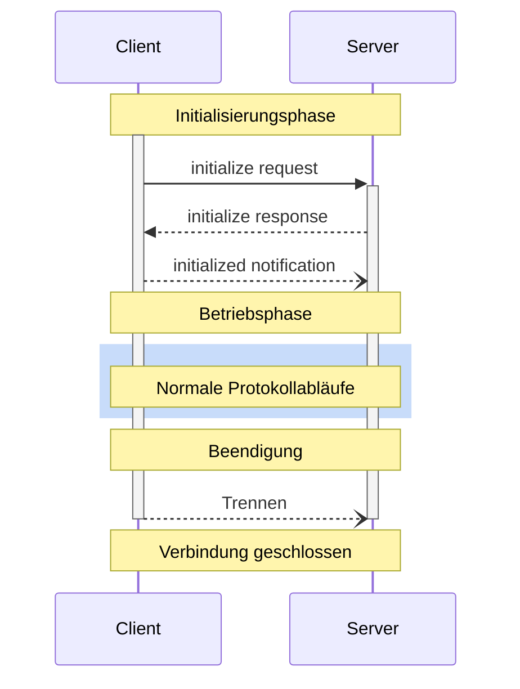

<div id="enable-section-numbers" />

<Info>**Protokollrevision**: 2025-06-18</Info>

Das Model Context Protocol (MCP) definiert einen klaren Lebenszyklus für Client-Server-
Verbindungen, der eine korrekte Fähigkeitsaushandlung und Zustandsverwaltung sicherstellt.

1. **Initialisierung**: Fähigkeitsaushandlung und Vereinbarung der Protokollversion
2. **Betrieb**: Normale Protokollkommunikation
3. **Beendigung**: Ordnungsgemäßes Herunterfahren der Verbindung



<div id="lifecycle-phases">
  ## Phasen des Lebenszyklus
</div>

<div id="initialization">
  ### Initialisierung
</div>

Die Initialisierungsphase **MUSS** die erste Interaktion zwischen Client und Server sein.
Während dieser Phase:

* Stellen Client und Server die Kompatibilität der Protokollversion fest
* Handeln Fähigkeiten aus
* Teilen Implementierungsdetails

Der Client **MUSS** diese Phase einleiten, indem er eine `initialize`-Anfrage sendet, die Folgendes enthält:

* Unterstützte Protokollversion
* Client-Fähigkeiten
* Informationen zur Client-Implementierung

```json
{
  "jsonrpc": "2.0",
  "id": 1,
  "method": "initialize",
  "params": {
    "protocolVersion": "2024-11-05",
    "capabilities": {
      "roots": {
        "listChanged": true
      },
      "sampling": {},
      "elicitation": {}
    },
    "clientInfo": {
      "name": "ExampleClient",
      "title": "Example Client Display Name",
      "version": "1.0.0"
    }
  }
}
```

Der Server **MUSS** mit seinen eigenen Fähigkeiten und Informationen antworten:

```json
{
  "jsonrpc": "2.0",
  "id": 1,
  "result": {
    "protocolVersion": "2024-11-05",
    "capabilities": {
      "logging": {},
      "prompts": {
        "listChanged": true
      },
      "resources": {
        "subscribe": true,
        "listChanged": true
      },
      "tools": {
        "listChanged": true
      }
    },
    "serverInfo": {
      "name": "ExampleServer",
      "title": "Example Server Display Name",
      "version": "1.0.0"
    },
    "instructions": "Optionale Anweisungen für den Client"
  }
}
```

Nach erfolgreicher Initialisierung **MUSS** der Client eine `initialized`-Benachrichtigung senden,
um anzuzeigen, dass er bereit ist, mit dem normalen Betrieb zu beginnen:

```json
{
  "jsonrpc": "2.0",
  "method": "notifications/initialized"
}
```

* Der Client **SOLLTE KEINE** anderen Anfragen als
  [Pings](/de/specification/2025-06-18/basic/utilities/ping) senden, bevor der Server auf die
  `initialize`-Anfrage geantwortet hat.
* Der Server **SOLLTE KEINE** anderen Anfragen als
  [Pings](/de/specification/2025-06-18/basic/utilities/ping) und
  [Logging](/de/specification/2025-06-18/server/utilities/logging) senden, bevor die `initialized`-
  Benachrichtigung eingegangen ist.

<div id="version-negotiation">
  #### Versionsaushandlung
</div>

Im `initialize`-Request **MUSS** der Client eine von ihm unterstützte Protokollversion senden.
Dies **SOLLTE** die *neueste* vom Client unterstützte Version sein.

Unterstützt der Server die angeforderte Protokollversion, **MUSS** er mit derselben
Version antworten. Andernfalls **MUSS** der Server mit einer anderen von ihm unterstützten
Protokollversion antworten. Dies **SOLLTE** die *neueste* vom Server unterstützte Version sein.

Unterstützt der Client die Version in der Antwort des Servers nicht, **SOLLTE** er
die Verbindung trennen.

<Note>
  Bei Verwendung von HTTP **MUSS** der Client den HTTP-Header `MCP-Protocol-Version: <protocol-version>` bei allen nachfolgenden Anfragen an den MCP-Server
  mitgeben.
  Details finden Sie im Abschnitt [Protocol Version Header in Transports](/de/specification/2025-06-18/basic/transports#protocol-version-header).
</Note>

<div id="capability-negotiation">
  #### Fähigkeitsaushandlung
</div>

Die Fähigkeiten von Client und Server legen fest, welche optionalen Protokollfunktionen während der Sitzung verfügbar sind.

Wichtige Fähigkeiten sind:

| Kategorie | Fähigkeit      | Beschreibung                                                                               |
| --------- | -------------- | ------------------------------------------------------------------------------------------ |
| Client    | `roots`        | Möglichkeit, Dateisystem-[Wurzeln](/de/specification/2025-06-18/client/roots) bereitzustellen |
| Client    | `sampling`     | Unterstützung für LLM-[Sampling](/de/specification/2025-06-18/client/sampling)-Anfragen      |
| Client    | `elicitation`  | Unterstützung für Server-[Elicitierung](/de/specification/2025-06-18/client/elicitation)-Anfragen |
| Client    | `experimental` | Beschreibt die Unterstützung nicht standardisierter experimenteller Funktionen             |
| Server    | `prompts`      | Bietet [Prompt-Vorlagen](/de/specification/2025-06-18/server/prompts)                        |
| Server    | `resources`    | Stellt lesbare [Ressourcen](/de/specification/2025-06-18/server/resources) bereit            |
| Server    | `tools`        | Stellt aufrufbare [Werkzeuge](/de/specification/2025-06-18/server/tools) bereit              |
| Server    | `logging`      | Gibt strukturierte [Log-Meldungen](/de/specification/2025-06-18/server/utilities/logging) aus |
| Server    | `completions`  | Unterstützt Argument-[Autovervollständigung](/de/specification/2025-06-18/server/utilities/completion) |
| Server    | `experimental` | Beschreibt die Unterstützung nicht standardisierter experimenteller Funktionen             |

Fähigkeitsobjekte können Unterfähigkeiten beschreiben wie:

* `listChanged`: Unterstützung für Benachrichtigungen über Listenänderungen (für Prompts, Ressourcen und
  Werkzeuge)
* `subscribe`: Unterstützung für das Abonnieren von Änderungen einzelner Elemente (nur Ressourcen)

<div id="operation">
  ### Betrieb
</div>

Während der Betriebsphase tauschen Client und Server Nachrichten entsprechend den
vereinbarten Fähigkeiten aus.

Beide Parteien **MÜSSEN**:

* Die vereinbarte Protokollversion einhalten
* Nur Fähigkeiten verwenden, die erfolgreich vereinbart wurden

<div id="shutdown">
  ### Herunterfahren
</div>

Während der Herunterfahrensphase beendet eine Seite (in der Regel der Client) die Protokollverbindung ordnungsgemäß. Es sind keine spezifischen Herunterfahren-Nachrichten definiert—stattdessen sollte der zugrunde liegende Transportmechanismus verwendet werden, um die Beendigung der Verbindung zu signalisieren:

<div id="stdio">
  #### stdio
</div>

Für den stdio-[Transport](/de/specification/2025-06-18/basic/transports) sollte der Client die
Beendigung wie folgt einleiten:

1. Zuerst den Eingabestream zum Kindprozess (dem Server) schließen
2. Auf das Beenden des Servers warten oder `SIGTERM` senden, wenn der Server nicht innerhalb einer angemessenen Zeit beendet
3. `SIGKILL` senden, wenn der Server nicht innerhalb einer angemessenen Zeit nach `SIGTERM` beendet

Der Server darf die Beendigung einleiten, indem er seinen Ausgabestream zum Client schließt und
sich beendet.

<div id="http">
  #### HTTP
</div>

Für HTTP-[Transporte](/de/specification/2025-06-18/basic/transports) wird das Herunterfahren durch das Schließen der zugehörigen HTTP-Verbindungen angezeigt.

<div id="timeouts">
  ## Timeouts
</div>

Implementierungen **SOLLTEN** Timeouts für alle gesendeten Anfragen festlegen, um hängende
Verbindungen und Ressourcenerschöpfung zu verhindern. Wenn für die Anfrage innerhalb des Timeout-Zeitraums keine Erfolgs- oder Fehlermeldung
eingegangen ist, **SOLLTE** der Sender eine [Abbruchbenachrichtigung](/de/specification/2025-06-18/basic/utilities/cancellation) für diese Anfrage senden und aufhören,
auf eine Antwort zu warten.

SDKs und andere Middleware **SOLLTEN** ermöglichen, diese Timeouts pro Anfrage zu konfigurieren.

Implementierungen **DÜRFEN** den Timeout-Zähler zurücksetzen, wenn eine zur Anfrage gehörige [Fortschrittsbenachrichtigung](/de/specification/2025-06-18/basic/utilities/progress) empfangen wird, da dies
darauf hindeutet, dass tatsächlich Arbeit ausgeführt wird. Implementierungen **SOLLTEN** jedoch stets
ein maximales Timeout erzwingen, unabhängig von Fortschrittsbenachrichtigungen, um die Auswirkungen eines
fehlverhaltenden Clients oder Servers zu begrenzen.

<div id="error-handling">
  ## Fehlerbehandlung
</div>

Implementierungen SOLLTEN auf die folgenden Fehlerfälle vorbereitet sein:

* Protokollversionsinkompatibilität
* Fehlgeschlagene Aushandlung erforderlicher Fähigkeiten
* Anfragen mit [Timeouts](#timeouts)

Beispiel für einen Initialisierungsfehler:

```json
{
  "jsonrpc": "2.0",
  "id": 1,
  "error": {
    "code": -32602,
    "message": "Unsupported protocol version",
    "data": {
      "supported": ["2024-11-05"],
      "requested": "1.0.0"
    }
  }
}
```