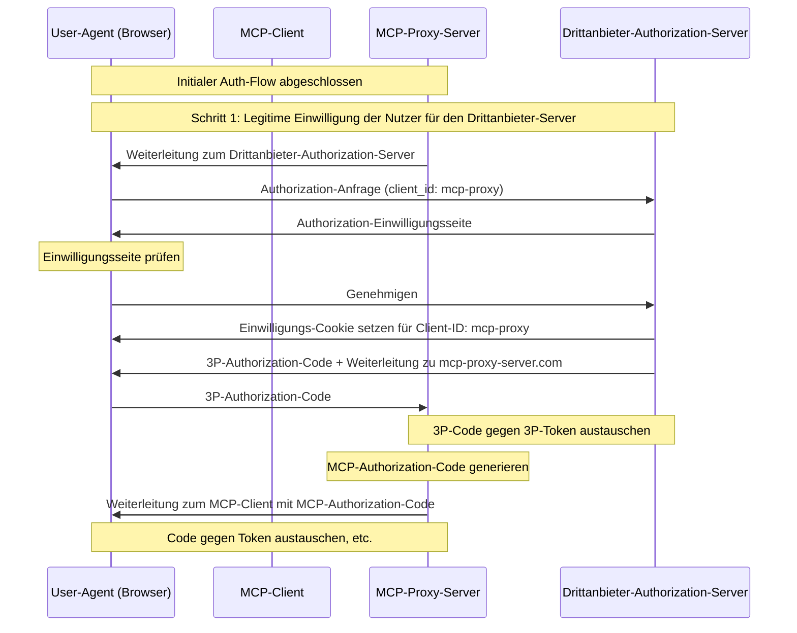
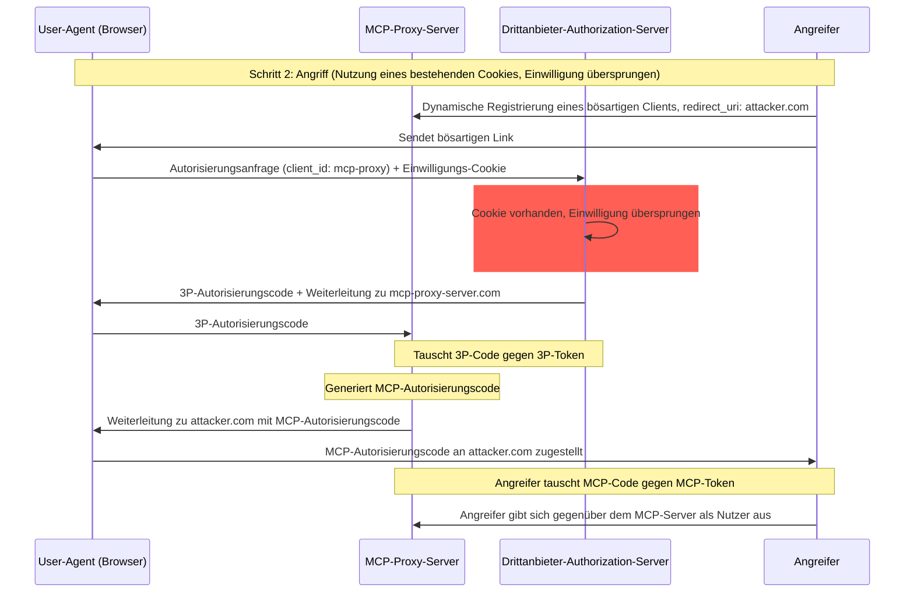
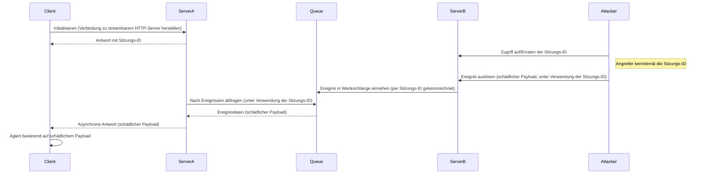
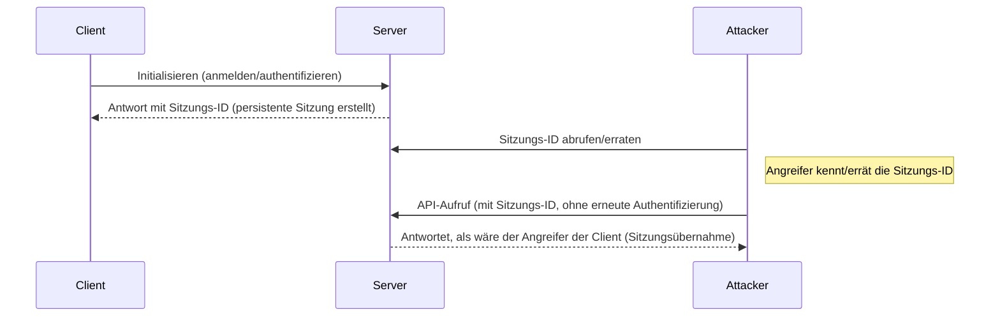

  ## Einführung

  ### Zweck und Anwendungsbereich

Dieses Dokument stellt Sicherheitsaspekte für das Model Context Protocol (MCP) bereit und ergänzt die MCP-Autorisierungsspezifikation. Es benennt Sicherheitsrisiken, Angriffsvektoren und bewährte Verfahren, die spezifisch für MCP-Implementierungen sind.

Die Hauptzielgruppe dieses Dokuments sind Entwicklerinnen und Entwickler, die MCP-Autorisierungsabläufe implementieren, Betreiber von MCP-Servern sowie Sicherheitsfachleute, die MCP-basierte Systeme beurteilen. Dieses Dokument sollte zusammen mit der MCP-Autorisierungsspezifikation und den [OAuth 2.0 Security Best Practices](https://datatracker.ietf.org/doc/html/rfc9700) gelesen werden.

  ## Angriffe und Gegenmaßnahmen

Dieser Abschnitt enthält eine detaillierte Beschreibung von Angriffen auf MCP-Implementierungen sowie möglichen Gegenmaßnahmen.

  ### Confused-Deputy-Problem

Angreifer können MCP-Server ausnutzen, die als Proxy für andere Ressourcenserver fungieren, und so Schwachstellen nach dem Muster des [„Confused Deputy“](https://en.wikipedia.org/wiki/Confused_deputy_problem) erzeugen.

  #### Terminologie

**MCP-Proxy-Server**
: Ein MCP-Server, der MCP-Clients mit Drittanbieter-APIs verbindet, MCP-Funktionen bereitstellt, dabei Operationen delegiert und gegenüber dem Drittanbieter-API-Server als einzelner OAuth-Client auftritt.

**Autorisierungsserver eines Drittanbieters**
: Autorisierungsserver, der die Drittanbieter-API schützt. Er unterstützt möglicherweise keine dynamische Clientregistrierung, wodurch der MCP-Proxy für alle Anfragen eine statische Client-ID verwenden muss.

**Drittanbieter-API**
: Der geschützte Ressourcenserver, der die eigentliche API-Funktionalität bereitstellt. Der Zugriff auf diese API erfordert Token, die vom Autorisierungsserver des Drittanbieters ausgegeben werden.

**Statische Client-ID**
: Ein fester OAuth-2.0-Clientbezeichner, den der MCP-Proxy-Server bei der Kommunikation mit dem Autorisierungsserver des Drittanbieters verwendet. Diese Client-ID bezieht sich auf den MCP-Server, der als Client gegenüber der Drittanbieter-API agiert. Sie ist für alle Interaktionen zwischen MCP-Server und Drittanbieter-API identisch, unabhängig davon, welcher MCP-Client die Anfrage initiiert hat.

  #### Architektur und Angriffswege

  ##### Normale OAuth-Proxy-Nutzung (bewahrt die Einwilligung der Nutzer)

  ##### Bösartige Nutzung eines OAuth-Proxys (überspringt Benutzereinwilligung)

  #### Angriffsbeschreibung

Wenn ein MCP-Proxy-Server eine statische Client-ID zur Authentifizierung bei einem Drittanbieter-Autorisierungsserver verwendet, der keine dynamische Client-Registrierung unterstützt, wird der folgende Angriff möglich:

1. Ein Benutzer authentifiziert sich regulär über den MCP-Proxy-Server, um auf die Drittanbieter-API zuzugreifen
2. Während dieses Flows setzt der Drittanbieter-Autorisierungsserver ein Cookie im User-Agent, das die Zustimmung für die statische Client-ID anzeigt
3. Ein Angreifer sendet dem Benutzer später einen bösartigen Link mit einer manipulierten Autorisierungsanfrage, die eine bösartige Redirect-URI zusammen mit einer neu dynamisch registrierten Client-ID enthält
4. Wenn der Benutzer auf den Link klickt, hat sein Browser noch das Consent-Cookie aus der vorherigen legitimen Anfrage
5. Der Drittanbieter-Autorisierungsserver erkennt das Cookie und überspringt den Zustimmungsbildschirm
6. Der MCP-Autorisierungscode wird an den Server des Angreifers umgeleitet (angegeben in der manipulierten redirect&#95;uri während der dynamischen Client-Registrierung)
7. Der Angreifer tauscht den gestohlenen Autorisierungscode ohne die ausdrückliche Zustimmung des Benutzers gegen Zugriffstoken für den MCP-Server ein
8. Der Angreifer hat nun Zugriff auf die Drittanbieter-API als kompromittierter Benutzer

  #### Abmilderung

MCP-Proxy-Server, die statische Client-IDs verwenden, **MÜSSEN** für jeden dynamisch registrierten Client die Zustimmung der Nutzer einholen, bevor sie Anfragen an Autorisierungsserver von Drittanbietern weiterleiten (die möglicherweise zusätzliche Zustimmung erfordern).

  ### Token-Passthrough

„Token-Passthrough“ ist ein Anti-Pattern, bei dem ein MCP-Server Token von einem MCP-Client akzeptiert, ohne zu prüfen, ob die Token ordnungsgemäß *für den MCP-Server* ausgestellt wurden, und sie unverändert an die nachgelagerte API weiterreicht.

  #### Risiken

Token-Passthrough ist in der [Authorization-Spezifikation](/de/specification/2025-06-18/basic/authorization) ausdrücklich verboten, da es eine Reihe von Sicherheitsrisiken mit sich bringt, darunter:

* **Umgehung von Sicherheitskontrollen**
  * Der MCP-Server oder nachgelagerte APIs könnten wichtige Sicherheitskontrollen wie Rate-Limiting, Request-Validierung oder Traffic-Überwachung implementieren, die von der Token-Audience oder anderen Berechtigungsmerkmalen abhängen. Wenn Clients Tokens direkt bei den nachgelagerten APIs verwenden können, ohne dass der MCP-Server sie ordnungsgemäß validiert oder sicherstellt, dass die Tokens für den richtigen Dienst ausgestellt wurden, umgehen sie diese Kontrollen.
* **Verantwortlichkeit und Audit-Trail-Probleme**
  * Der MCP-Server kann MCP-Clients nicht identifizieren oder voneinander unterscheiden, wenn Clients mit einem upstream-ausgestellten Access-Token aufrufen, das für den MCP-Server möglicherweise intransparent ist.
  * Die Protokolle des nachgelagerten Resource-Servers können Anfragen zeigen, die scheinbar aus einer anderen Quelle mit einer anderen Identität stammen, statt vom MCP-Server, der die Tokens tatsächlich weiterleitet.
  * Beide Faktoren erschweren Vorfalluntersuchungen, Kontrollen und Audits.
  * Gibt der MCP-Server Tokens weiter, ohne deren Claims (z. B. Rollen, Berechtigungen oder Audience) oder andere Metadaten zu validieren, kann ein böswilliger Akteur mit einem gestohlenen Token den Server als Proxy für Datenexfiltration missbrauchen.
* **Probleme mit Vertrauensgrenzen**
  * Der nachgelagerte Resource-Server vertraut bestimmten Entitäten. Dieses Vertrauen kann Annahmen über Herkunft oder Muster des Clientverhaltens umfassen. Wird diese Vertrauensgrenze verletzt, kann dies zu unerwarteten Problemen führen.
  * Wenn das Token von mehreren Diensten ohne ordnungsgemäße Validierung akzeptiert wird, kann ein Angreifer, der einen Dienst kompromittiert, das Token nutzen, um auf andere verbundene Dienste zuzugreifen.
* **Risiko zukünftiger Kompatibilität**
  * Selbst wenn ein MCP-Server heute als „reiner Proxy“ startet, könnte er später Sicherheitskontrollen hinzufügen müssen. Eine von Anfang an sauber getrennte Token-Audience erleichtert die Weiterentwicklung des Sicherheitsmodells.

  #### Abmilderung

MCP-Server **DÜRFEN KEINE** Token akzeptieren, die nicht ausdrücklich für den MCP-Server ausgestellt wurden.

  ### Session-Hijacking

Session-Hijacking ist ein Angriffsvektor, bei dem ein Client vom Server eine Sitzungs-ID erhält und eine unbefugte Partei dieselbe Sitzungs-ID abfangen und verwenden kann, um den ursprünglichen Client zu imitieren und in dessen Namen unbefugte Aktionen durchzuführen.

  #### Session-Hijack-Prompt-Injection

  #### Sitzungsübernahme durch Identitäts­vortäuschung

  #### Angriffsbeschreibung

Wenn Sie mehrere zustandsbehaftete HTTP-Server haben, die MCP-Anfragen verarbeiten, sind die folgenden Angriffsvektoren möglich:

**Sitzungskapern durch Prompt-Injection**

1. Der Client verbindet sich mit **Server A** und erhält eine Sitzungs-ID.

2. Der Angreifer erlangt eine bestehende Sitzungs-ID und sendet ein bösartiges Ereignis an **Server B** mit dieser Sitzungs-ID.
   * Wenn ein Server [Neuzustellung/wiederaufnehmbare Streams](/de/specification/2025-06-18/basic/transports#resumability-and-redelivery) unterstützt, kann das absichtliche Beenden der Anfrage vor Empfang der Antwort dazu führen, dass sie vom ursprünglichen Client über die GET-Anfrage für Server-Sent Events wiederaufgenommen wird.
   * Wenn ein bestimmter Server Server-Sent Events als Folge eines Tool-Aufrufs wie `notifications/tools/list_changed` initiiert, bei dem es möglich ist, die vom Server angebotenen Werkzeuge zu beeinflussen, könnte ein Client schließlich Werkzeuge vorfinden, von denen er nicht wusste, dass sie aktiviert waren.

3. **Server B** stellt das Ereignis (verknüpft mit der Sitzungs-ID) in eine gemeinsame Warteschlange.

4. **Server A** fragt die Warteschlange mithilfe der Sitzungs-ID nach Ereignissen ab und ruft die bösartige Nutzlast ab.

5. **Server A** sendet die bösartige Nutzlast als asynchrone oder wiederaufgenommene Antwort an den Client.

6. Der Client empfängt und verarbeitet die bösartige Nutzlast, was zu einer potenziellen Kompromittierung führt.

**Sitzungskapern durch Identitätsvortäuschung**

1. Der MCP-Client authentifiziert sich beim MCP-Server und erzeugt eine persistente Sitzungs-ID.
2. Der Angreifer erlangt die Sitzungs-ID.
3. Der Angreifer führt Aufrufe an den MCP-Server unter Verwendung der Sitzungs-ID durch.
4. Der MCP-Server prüft keine zusätzliche Autorisierung und behandelt den Angreifer als legitimen Benutzer, was unbefugten Zugriff oder unbefugte Aktionen ermöglicht.

  #### Maßnahmen

Um Sitzungsübernahmen und Event-Injection-Angriffe zu verhindern, sollten die folgenden Maßnahmen umgesetzt werden:

MCP-Server, die Autorisierung implementieren, **MÜSSEN** alle eingehenden Anfragen verifizieren.
MCP-Server **DÜRFEN** Sitzungen **NICHT** für die Authentifizierung verwenden.

MCP-Server **MÜSSEN** sichere, nichtdeterministische Sitzungs-IDs verwenden.
Generierte Sitzungs-IDs (z. B. UUIDs) **SOLLTEN** mit kryptografisch sicheren Zufallszahlengeneratoren erzeugt werden. Vermeiden Sie vorhersagbare oder sequentielle Sitzungskennungen, die von Angreifern erraten werden könnten. Das Rotieren oder automatische Ablaufsetzen von Sitzungs-IDs kann das Risiko zusätzlich reduzieren.

MCP-Server **SOLLTEN** Sitzungs-IDs an benutzerspezifische Informationen binden.
Wenn sitzungsbezogene Daten gespeichert oder übertragen werden (z. B. in einer Warteschlange), kombinieren Sie die Sitzungs-ID mit Informationen, die für den autorisierten Benutzer eindeutig sind, etwa dessen interne Benutzer-ID. Verwenden Sie ein Schlüsselformat wie `<user_id>:<session_id>`. So wird sichergestellt, dass selbst wenn ein Angreifer eine Sitzungs-ID errät, er keinen anderen Benutzer imitieren kann, da die Benutzer-ID aus dem Benutzertoken abgeleitet und nicht vom Client bereitgestellt wird.

MCP-Server können optional zusätzliche eindeutige Kennungen nutzen.