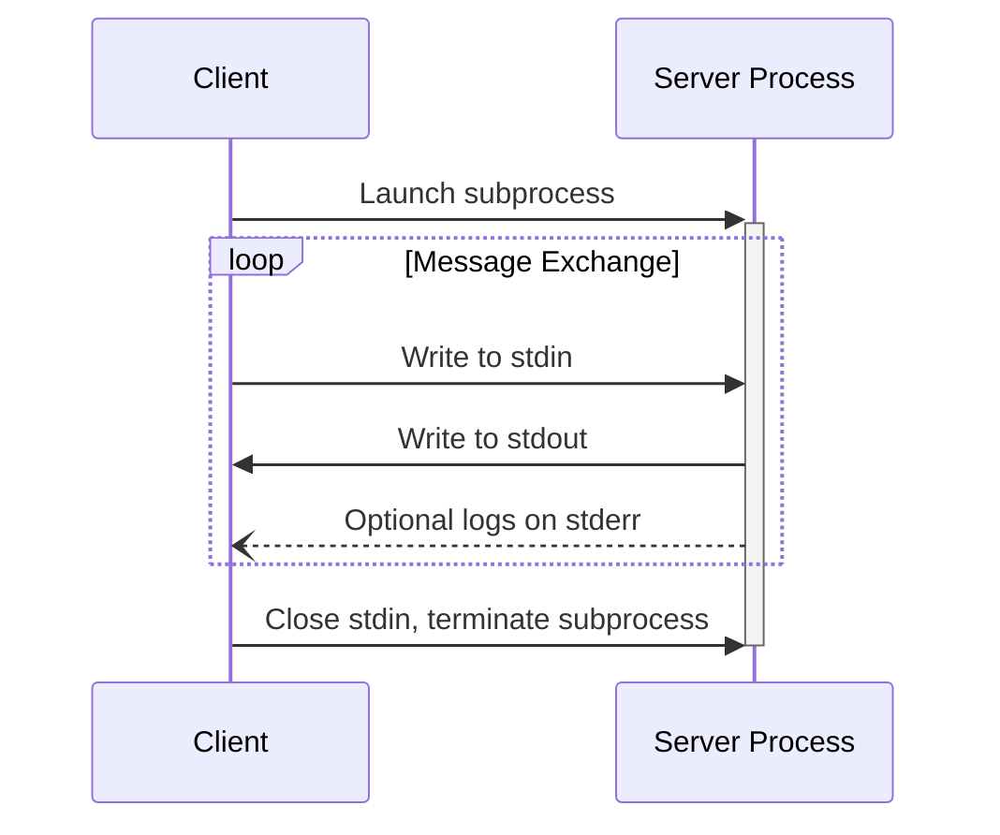
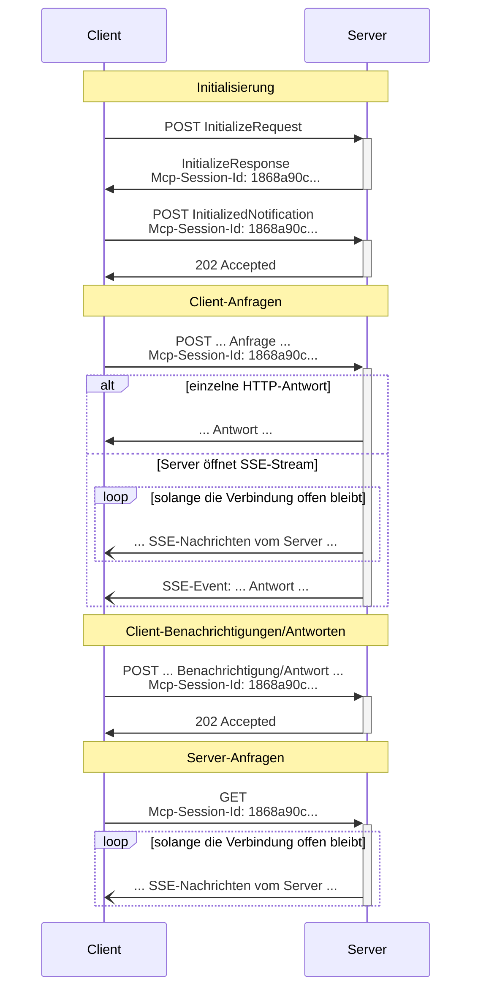

<Info>**Protokollrevision**: 2025-06-18</Info>

MCP verwendet JSON-RPC zur Kodierung von Nachrichten. JSON-RPC-Nachrichten **MÜSSEN** in UTF-8 kodiert sein.

Das Protokoll definiert derzeit zwei standardisierte Transportmechanismen für die Kommunikation zwischen Client und Server:

1. [stdio](#stdio), Kommunikation über Standardeingabe und -ausgabe
2. [Streambares HTTP](#streamable-http)

Clients **SOLLTEN** stdio nach Möglichkeit unterstützen.

Clients und Server können außerdem
[benutzerdefinierte Transporte](#custom-transports) in modularer Form implementieren.

  ## stdio

Im **stdio**-Transport:

* Der Client startet den MCP-Server als Unterprozess.
* Der Server liest JSON-RPC-Nachrichten aus seiner Standardeingabe (`stdin`) und sendet Nachrichten
  an seine Standardausgabe (`stdout`).
* Nachrichten sind einzelne JSON-RPC-Anfragen, Benachrichtigungen oder Antworten.
* Nachrichten werden durch Zeilenumbrüche getrennt und dürfen keine eingebetteten Zeilenumbrüche enthalten.
* Der Server darf UTF-8-Zeichenketten zu seiner Standardfehlerausgabe (`stderr`) für Protokollierungszwecke schreiben. Clients dürfen diese Protokollierung erfassen, weiterleiten oder ignorieren.
* Der Server darf nichts an seine `stdout` schreiben, das keine gültige MCP-Nachricht ist.
* Der Client darf nichts an die `stdin` des Servers schreiben, das keine gültige MCP-
  Nachricht ist.

  ## Streambares HTTP

<Info>
  Dies ersetzt den [HTTP+SSE-
  Transport](/de/specification/2024-11-05/basic/transports#http-with-sse) aus der
  Protokollversion 2024-11-05. Siehe den Leitfaden zur [Abwärtskompatibilität](#backwards-compatibility)
  unten.
</Info>

Beim Transport **Streambares HTTP** läuft der Server als eigenständiger Prozess, der
mehrere Client-Verbindungen verarbeiten kann. Dieser Transport verwendet HTTP-POST- und -GET-Anfragen.
Der Server kann optional
[Server-Sent Events](https://en.wikipedia.org/wiki/Server-sent_events) (SSE) verwenden, um
mehrere Servernachrichten zu streamen. Dies ermöglicht einfache MCP-Server ebenso wie funktionsreichere
Server, die Streaming sowie Server-zu-Client-Benachrichtigungen und -Anfragen unterstützen.

Der Server **MUSS** einen einzelnen HTTP-Endpunktpfad bereitstellen (im Folgenden als
**MCP-Endpunkt** bezeichnet), der sowohl POST- als auch GET-Methoden unterstützt. Dies könnte beispielsweise eine
URL wie `https://example.com/mcp` sein.

  #### Sicherheitswarnung

Beim Implementieren des Transports „Streambares HTTP“:

1. Server **MÜSSEN** den `Origin`-Header bei allen eingehenden Verbindungen prüfen, um DNS-Rebinding-Angriffe zu verhindern.
2. Bei lokalem Betrieb SOLLTEN Server nur an localhost (127.0.0.1) gebunden sein und nicht an alle Netzwerkschnittstellen (0.0.0.0).
3. Server SOLLTEN für alle Verbindungen eine ordnungsgemäße Authentifizierung implementieren.

Ohne diese Schutzmaßnahmen könnten Angreifer DNS-Rebinding nutzen, um von entfernten Websites aus mit lokalen MCP-Servern zu interagieren.

  ### Senden von Nachrichten an den Server

Jede vom Client gesendete JSON-RPC-Nachricht **MUSS** eine neue HTTP-POST-Anforderung an den
MCP-Endpunkt sein.

1. Der Client **MUSS** HTTP POST verwenden, um JSON-RPC-Nachrichten an den MCP-Endpunkt zu senden.
2. Der Client **MUSS** einen `Accept`-Header angeben, der sowohl `application/json` als auch
   `text/event-stream` als unterstützte Inhaltstypen aufführt.
3. Der Rumpf der POST-Anforderung **MUSS** eine einzelne JSON-RPC-*request*, *notification* oder *response* enthalten.
4. Wenn die Eingabe eine JSON-RPC-*response* oder *notification* ist:
   * Wenn der Server die Eingabe akzeptiert, **MUSS** der Server den HTTP-Statuscode 202
     Accepted ohne Rumpf zurückgeben.
   * Wenn der Server die Eingabe nicht akzeptieren kann, **MUSS** er einen HTTP-Fehlerstatuscode
     zurückgeben (z. B. 400 Bad Request). Der HTTP-Antwortkörper **KANN** eine JSON-RPC-*error
     response* ohne `id` enthalten.
5. Wenn die Eingabe eine JSON-RPC-*request* ist, **MUSS** der Server entweder
   `Content-Type: text/event-stream` zurückgeben, um einen SSE-Stream zu initiieren, oder
   `Content-Type: application/json`, um ein JSON-Objekt zurückzugeben. Der Client **MUSS**
   beide Fälle unterstützen.
6. Wenn der Server einen SSE-Stream initiiert:
   * Der SSE-Stream **SOLLTE** schließlich eine JSON-RPC-*response* auf die
     im POST-Rumpf gesendete JSON-RPC-*request* enthalten.
   * Der Server **KANN** JSON-RPC-*requests* und *notifications* senden, bevor er die
     JSON-RPC-*response* sendet. Diese Nachrichten **SOLLTEN** sich auf die auslösende Client-
     *request* beziehen.
   * Der Server **SOLLTE NICHT** den SSE-Stream schließen, bevor die JSON-RPC-*response*
     für die empfangene JSON-RPC-*request* gesendet wurde, es sei denn, die [Sitzung](#session-management)
     läuft ab.
   * Nachdem die JSON-RPC-*response* gesendet wurde, **SOLLTE** der Server den SSE-
     Stream schließen.
   * Eine Trennung der Verbindung **KANN** jederzeit auftreten (z. B. aufgrund von Netzwerkbedingungen).
     Daher gilt:
     * Eine Trennung **SOLLTE NICHT** als Abbruch der Anfrage durch den Client interpretiert werden.
     * Zum Abbrechen **SOLLTE** der Client ausdrücklich eine MCP-`CancelledNotification` senden.
     * Um Nachrichtenverlust durch eine Trennung zu vermeiden, **KANN** der Server den Stream
       [wiederaufnehmbar](#resumability-and-redelivery) machen.

  ### Auf Nachrichten vom Server lauschen

1. Der Client **KANN** einen HTTP-GET an den MCP-Endpunkt ausführen. Dies kann verwendet werden, um einen
   SSE-Stream zu öffnen, sodass der Server mit dem Client kommunizieren kann, ohne dass der Client zuvor
   Daten per HTTP-POST sendet.
2. Der Client **MUSS** einen `Accept`-Header einschließen, der `text/event-stream` als
   unterstützten Medientyp angibt.
3. Der Server **MUSS** entweder `Content-Type: text/event-stream` als Antwort auf
   diesen HTTP-GET zurückgeben oder andernfalls HTTP 405 Method Not Allowed zurückgeben, was anzeigt, dass der Server
   an diesem Endpunkt keinen SSE-Stream anbietet.
4. Falls der Server einen SSE-Stream initiiert:
   * Der Server **KANN** JSON-RPC-*Requests* und *Benachrichtigungen* über den Stream senden.
   * Diese Nachrichten **SOLLEN** in keinem Zusammenhang mit einem gleichzeitig laufenden JSON-RPC-
     *Request* des Clients stehen.
   * Der Server **DARF NICHT** eine JSON-RPC-*Response* über den Stream senden **außer**
     beim [Fortsetzen](#resumability-and-redelivery) eines mit einer vorherigen Client-
     Anfrage verbundenen Streams.
   * Der Server **KANN** den SSE-Stream jederzeit schließen.
   * Der Client **KANN** den SSE-Stream jederzeit schließen.

  ### Mehrere Verbindungen

1. Der Client **DARF** gleichzeitig mit mehreren SSE-Streams verbunden bleiben.
2. Der Server **MUSS** jede seiner JSON-RPC-Nachrichten nur über einen der verbundenen
   Streams senden; das heißt, er **DARF NICHT** dieselbe Nachricht über mehrere Streams verbreiten.
   * Das Risiko eines Nachrichtenverlusts **KANN** verringert werden, indem der Stream
     [wiederaufnehmbar](#resumability-and-redelivery) gemacht wird.

  ### Wiederaufnahme und erneute Zustellung

Um das Fortsetzen unterbrochener Verbindungen und die erneute Zustellung von Nachrichten zu unterstützen, die sonst verloren gehen könnten:

1. Server **KÖNNEN** ihren SSE-Ereignissen ein `id`-Feld hinzufügen, wie im
   [SSE-Standard](https://html.spec.whatwg.org/multipage/server-sent-events.html#event-stream-interpretation) beschrieben.
   * Falls vorhanden, MUSS die ID **global eindeutig** über alle Streams innerhalb dieser
     [Sitzung](#session-management) sein — oder über alle Streams mit diesem spezifischen Client, wenn keine Sitzungsverwaltung verwendet wird.
2. Wenn der Client nach einer unterbrochenen Verbindung fortsetzen möchte, **SOLLTE** er eine HTTP-
   GET-Anfrage an den MCP-Endpunkt senden und den
   [`Last-Event-ID`](https://html.spec.whatwg.org/multipage/server-sent-events.html#the-last-event-id-header)-Header
   einfügen, um die zuletzt empfangene Ereignis-ID anzugeben.
   * Der Server **KANN** diesen Header verwenden, um Nachrichten erneut zu senden, die nach der letzten Ereignis-ID gesendet worden wären, *auf dem Stream, der getrennt wurde*, und den Stream ab diesem Punkt fortzusetzen.
   * Der Server **DARF NICHT** Nachrichten erneut senden, die auf einem anderen Stream zugestellt worden wären.

Mit anderen Worten: Diese Ereignis-IDs sollten von Servern *pro Stream* vergeben werden, um als Cursor innerhalb dieses jeweiligen Streams zu dienen.

  ### Sitzungsverwaltung

Eine MCP-„Sitzung“ besteht aus logisch zusammenhängenden Interaktionen zwischen einem Client und einem
Server und beginnt mit der [Initialisierungsphase](/de/specification/2025-06-18/basic/lifecycle). Zur Unterstützung
von Servern, die zustandsbehaftete Sitzungen etablieren möchten:

1. Ein Server, der den Transport Streambares HTTP verwendet, **KANN** zur
   Initialisierung eine Sitzungs-ID zuweisen, indem er sie in den `Mcp-Session-Id`-Header der HTTP-
   Antwort mit dem `InitializeResult` aufnimmt.
   * Die Sitzungs-ID **SOLLTE** global eindeutig und kryptografisch sicher sein (z. B. eine
     sicher generierte UUID, ein JWT oder ein kryptografischer Hash).
   * Die Sitzungs-ID **MUSS** nur sichtbare ASCII-Zeichen enthalten (Bereich 0x21 bis
     0x7E).
2. Wenn während der Initialisierung eine `Mcp-Session-Id` vom Server zurückgegeben wird, **MÜSSEN** Clients, die
   den Transport Streambares HTTP verwenden, diese in den `Mcp-Session-Id`-Header bei
   all ihren nachfolgenden HTTP-Anfragen aufnehmen.
   * Server, die eine Sitzungs-ID erfordern, **SOLLTEN** auf Anfragen ohne
     `Mcp-Session-Id`-Header (außer der Initialisierung) mit HTTP 400 Bad Request antworten.
3. Der Server **KANN** die Sitzung jederzeit beenden; danach **MUSS** er auf
   Anfragen mit dieser Sitzungs-ID mit HTTP 404 Not Found antworten.
4. Wenn ein Client als Antwort auf eine Anfrage mit
   `Mcp-Session-Id` ein HTTP 404 erhält, **MUSS** er eine neue Sitzung starten, indem er eine neue `InitializeRequest`
   ohne angehängte Sitzungs-ID sendet.
5. Clients, die eine bestimmte Sitzung nicht mehr benötigen (z. B. weil der Nutzer die
   Client-Anwendung verlässt), **SOLLTEN** ein HTTP DELETE an den MCP-Endpunkt mit dem
   `Mcp-Session-Id`-Header senden, um die Sitzung ausdrücklich zu beenden.
   * Der Server **KANN** auf diese Anfrage mit HTTP 405 Method Not Allowed antworten
     und damit anzeigen, dass der Server es Clients nicht erlaubt, Sitzungen zu beenden.

  ### Sequenzdiagramm

  ### Protokollversions-Header

Bei Verwendung von HTTP MUSS der Client den HTTP-Header `MCP-Protocol-Version: <protocol-version>` in allen nachfolgenden Anfragen an den MCP-Server einfügen, damit der MCP-Server basierend auf der MCP-Protokollversion antworten kann.

Zum Beispiel: `MCP-Protocol-Version: 2025-06-18`

Die vom Client gesendete Protokollversion SOLLTE der [während der Initialisierung ausgehandelten](/de/specification/2025-06-18/basic/lifecycle#version-negotiation) entsprechen.

Zur Wahrung der Abwärtskompatibilität gilt: Wenn der Server keinen `MCP-Protocol-Version`-Header erhält und keine andere Möglichkeit hat, die Version zu identifizieren – etwa indem er sich auf die während der Initialisierung ausgehandelte Protokollversion stützt – SOLLTE der Server die Protokollversion `2025-03-26` annehmen.

Wenn der Server eine Anfrage mit einer ungültigen oder nicht unterstützten `MCP-Protocol-Version` erhält, MUSS er mit `400 Bad Request` antworten.

  ### Abwärtskompatibilität

Clients und Server können die Abwärtskompatibilität mit dem veralteten [HTTP+SSE-
Transport](/de/specification/2024-11-05/basic/transports#http-with-sse) (aus
Protokollversion 2024-11-05) wie folgt aufrechterhalten:

**Server**, die ältere Clients unterstützen möchten, sollten:

* Sowohl die SSE- als auch die POST-Endpunkte des alten Transports weiterhin bereitstellen, zusätzlich zu dem
  neuen „MCP-Endpunkt“, der für den Transport „Streambares HTTP“ definiert ist.
  * Es ist auch möglich, den alten POST-Endpunkt und den neuen MCP-Endpunkt zu kombinieren, dies kann jedoch
    unnötige Komplexität mit sich bringen.

**Clients**, die ältere Server unterstützen möchten, sollten:

1. Vom Benutzer eine MCP-Server-URL entgegennehmen, die entweder auf einen Server mit dem
   alten oder dem neuen Transport verweisen kann.
2. Versuchen, eine `InitializeRequest` an die Server-URL zu senden (POST), mit einem `Accept`-Header wie
   oben definiert:
   * Wenn dies gelingt, kann der Client davon ausgehen, dass es sich um einen Server handelt, der den Transport
     „Streambares HTTP“ unterstützt.
   * Wenn dies mit einem HTTP-Statuscode aus dem 4xx-Bereich fehlschlägt (z. B. 405 Method Not Allowed oder 404 Not
     Found):
     * Eine GET-Anfrage an die Server-URL senden, in der Erwartung, dass dadurch ein SSE-Stream geöffnet wird
       und ein `endpoint`-Ereignis als erstes Ereignis zurückgegeben wird.
     * Wenn das `endpoint`-Ereignis eintrifft, kann der Client davon ausgehen, dass es sich um einen Server handelt, der
       den alten HTTP+SSE-Transport verwendet, und sollte diesen Transport für die gesamte weitere
       Kommunikation nutzen.

  ## Benutzerdefinierte Transporte

Clients und Server **KÖNNEN** zusätzliche benutzerdefinierte Transportmechanismen implementieren, um ihren spezifischen Anforderungen gerecht zu werden. Das Protokoll ist transportunabhängig und kann über jeden Kommunikationskanal implementiert werden, der einen bidirektionalen Nachrichtenaustausch unterstützt.

Implementierende, die sich für die Unterstützung benutzerdefinierter Transporte entscheiden, **MÜSSEN** sicherstellen, dass das JSON-RPC-2.0-Nachrichtenformat und die von MCP definierten Anforderungen an den Lebenszyklus beibehalten werden. Benutzerdefinierte Transporte **SOLLTEN** ihre spezifischen Verfahren für Verbindungsaufbau und Nachrichtenaustausch dokumentieren, um die Interoperabilität zu fördern.