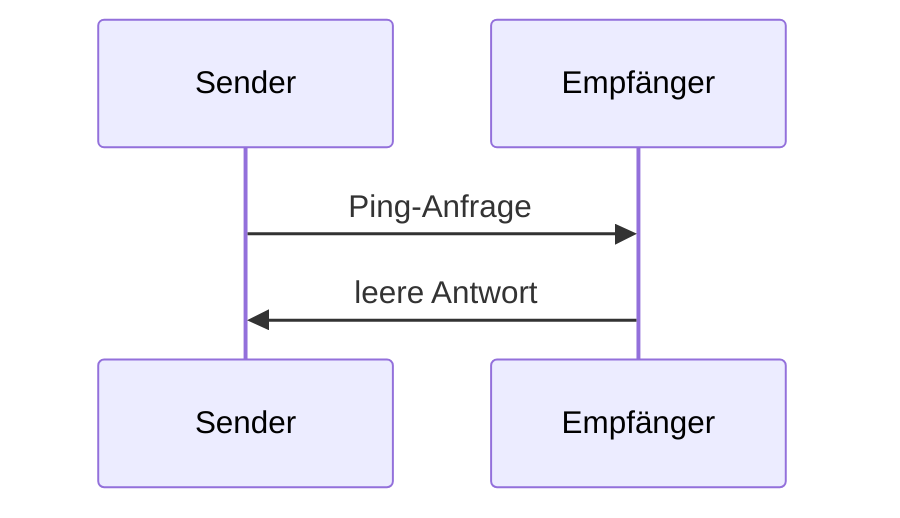

<div id="enable-section-numbers" />

<Info>**Protokollrevision**: 2025-06-18</Info>

Das Model Context Protocol (MCP) umfasst einen optionalen Ping-Mechanismus, mit dem beide Seiten überprüfen können, ob ihr Gegenüber noch reagiert und die Verbindung besteht.

<div id="overview">
  ## Übersicht
</div>

Die Ping-Funktion wird über ein einfaches Anfrage-/Antwortmuster umgesetzt. Sowohl der Client als auch der Server können einen Ping auslösen, indem sie eine `ping`-Anfrage senden.

<div id="message-format">
  ## Nachrichtenformat
</div>

Eine Ping-Anfrage ist eine normale JSON-RPC-2.0-Anfrage ohne Parameter:

```json
{
  "jsonrpc": "2.0",
  "id": "123",
  "method": "ping"
}
```

<div id="behavior-requirements">
  ## Verhaltensanforderungen
</div>

1. Der Empfänger MUSS umgehend mit einer leeren Antwort reagieren:

```json
{
  "jsonrpc": "2.0",
  "id": "123",
  "result": {}
}
```

2. Wenn innerhalb eines angemessenen Zeitlimits keine Antwort eingeht, DARF der Absender:
   - Die Verbindung als inaktiv betrachten
   - Die Verbindung beenden
   - Einen erneuten Verbindungsaufbau versuchen

<div id="usage-patterns">
  ## Nutzungsmuster
</div>



<div id="implementation-considerations">
  ## Hinweise zur Implementierung
</div>

- Implementierungen **SOLLEN** in regelmäßigen Abständen Pings senden, um die Verbindungsgesundheit zu prüfen
- Die Ping-Frequenz **SOLLTE** konfigurierbar sein
- Timeouts **SOLLEN** an die Gegebenheiten der Netzwerkumgebung angepasst sein
- Übermäßiges Pingen **SOLLTE** vermieden werden, um den Netzwerk-Overhead zu verringern

<div id="error-handling">
  ## Fehlerbehandlung
</div>

- Timeouts **SOLLTEN** als Verbindungsfehler behandelt werden
- Mehrere fehlgeschlagene Pings **KÖNNEN** einen Verbindungs-Reset auslösen
- Implementierungen **SOLLTEN** Ping-Fehlschläge zu Diagnosezwecken protokollieren