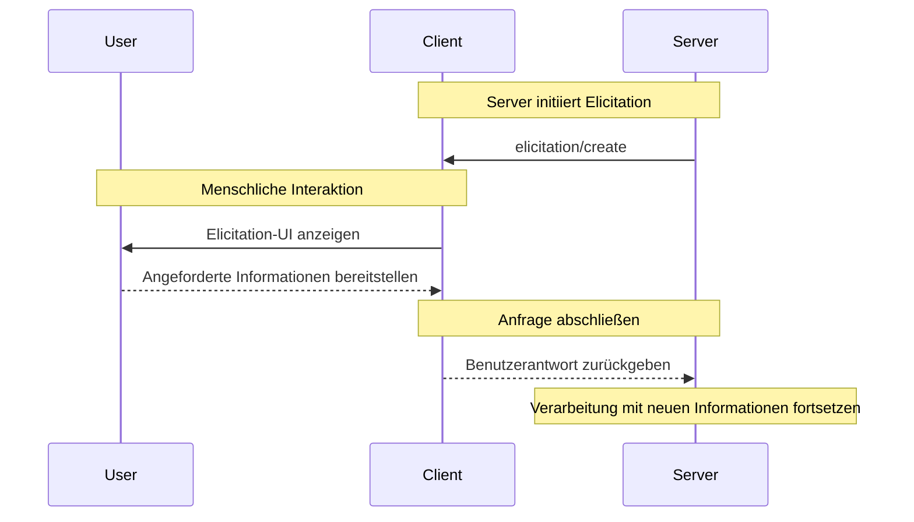

<div id="enable-section-numbers" />

<Info>**Protokollrevision**: 2025-06-18</Info>

<Note>
  Elicitation wurde in dieser Version der MCP-Spezifikation neu eingeführt; das Design kann sich in zukünftigen Protokollversionen weiterentwickeln.
</Note>

Das Model Context Protocol (MCP) bietet eine standardisierte Möglichkeit für Server, während Interaktionen über den Client zusätzliche Informationen von Nutzenden anzufordern. Dieser Ablauf ermöglicht es Clients, die Kontrolle über Nutzerinteraktionen und den Datenaustausch zu behalten, während Server die benötigten Informationen dynamisch erfassen können.
Server fordern mit JSON-Schemata strukturierte Daten von Nutzenden an, um Antworten zu validieren.

<div id="user-interaction-model">
  ## Benutzerinteraktionsmodell
</div>

Elicitation in MCP ermöglicht es Servern, interaktive Workflows zu implementieren, indem Benutzereingaben *verschachtelt* innerhalb anderer MCP-Serverfunktionen angefordert werden können.

Implementierungen können Elicitation über jedes Interface- bzw. Interaktionsmuster bereitstellen, das ihren Anforderungen entspricht—das Protokoll selbst schreibt kein spezifisches Benutzerinteraktionsmodell vor.

<Warning>
  Im Interesse von Trust &amp; Safety sowie Sicherheit:

  * Server **DÜRFEN NICHT** Elicitation verwenden, um sensible Informationen anzufordern.

  Anwendungen **SOLLEN**:

  * Eine Benutzeroberfläche bereitstellen, die klar erkennen lässt, welcher Server Informationen anfordert
  * Nutzerinnen und Nutzern ermöglichen, ihre Antworten vor dem Senden zu überprüfen und zu bearbeiten
  * Die Privatsphäre der Nutzerinnen und Nutzer respektieren und klare Optionen zum Ablehnen und Abbrechen bereitstellen
</Warning>

<div id="capabilities">
  ## Fähigkeiten
</div>

Clients, die Elicitation unterstützen, **MÜSSEN** während der
[Initialisierung](/de/specification/2025-06-18/basic/lifecycle#initialization) die Fähigkeit `elicitation` deklarieren:

```json
{
  "capabilities": {
    "elicitation": {}
  }
}
```

<div id="protocol-messages">
  ## Protokollmeldungen
</div>

<div id="creating-elicitation-requests">
  ### Erstellen von Elicitation-Anforderungen
</div>

Um Informationen von einem Benutzer anzufordern, senden Server eine `elicitation/create`-Anforderung:

<div id="simple-text-request">
  #### Einfache Textanforderung
</div>

**Anforderung:**

```json
{
  "jsonrpc": "2.0",
  "id": 1,
  "method": "elicitation/create",
  "params": {
    "message": "Please provide your GitHub username",
    "requestedSchema": {
      "type": "object",
      "properties": {
        "name": {
          "type": "string"
        }
      },
      "required": ["name"]
    }
  }
}
```

**Antwort:**

```json
{
  "jsonrpc": "2.0",
  "id": 1,
  "result": {
    "action": "accept",
    "content": {
      "name": "octocat"
    }
  }
}
```

<div id="structured-data-request">
  #### Strukturierte Datenanforderung
</div>

**Anfrage:**

```json
{
  "jsonrpc": "2.0",
  "id": 2,
  "method": "elicitation/create",
  "params": {
    "message": "Bitte geben Sie Ihre Kontaktinformationen an",
    "requestedSchema": {
      "type": "object",
      "properties": {
        "name": {
          "type": "string",
          "description": "Ihr vollständiger Name"
        },
        "email": {
          "type": "string",
          "format": "email",
          "description": "Ihre E-Mail-Adresse"
        },
        "age": {
          "type": "number",
          "minimum": 18,
          "description": "Ihr Alter"
        }
      },
      "required": ["name", "email"]
    }
  }
}
```

**Antwort:**

```json
{
  "jsonrpc": "2.0",
  "id": 2,
  "result": {
    "action": "accept",
    "content": {
      "name": "Monalisa Octocat",
      "email": "octocat@github.com",
      "age": 30
    }
  }
}
```

**Beispiel einer Ablehnungsantwort:**

```json
{
  "jsonrpc": "2.0",
  "id": 2,
  "result": {
    "action": "decline"
  }
}
```

**Beispiel einer Abbruchantwort:**

```json
{
  "jsonrpc": "2.0",
  "id": 2,
  "result": {
    "action": "cancel"
  }
}
```

<div id="message-flow">
  ## Nachrichtenfluss
</div>



<div id="request-schema">
  ## Anfrageschema
</div>

Das Feld `requestedSchema` ermöglicht Servern, die Struktur der erwarteten Antwort mit einer eingeschränkten Teilmenge von JSON Schema zu definieren. Um die Implementierung für Clients zu vereinfachen, sind Elicitation-Schemata auf flache Objekte mit ausschließlich primitiven Eigenschaften beschränkt:

```json
"requestedSchema": {
  "type": "object",
  "properties": {
    "propertyName": {
      "type": "string",
      "title": "Anzeigename",
      "description": "Beschreibung der Eigenschaft"
    },
    "anotherProperty": {
      "type": "number",
      "minimum": 0,
      "maximum": 100
    }
  },
  "required": ["propertyName"]
}
```

<div id="supported-schema-types">
  ### Unterstützte Schema-Typen
</div>

Das Schema ist auf diese primitiven Typen beschränkt:

1. **String-Schema**

   ```json
   {
     "type": "string",
     "title": "Display Name",
     "description": "Description text",
     "minLength": 3,
     "maxLength": 50,
     "format": "email" // Supported: "email", "uri", "date", "date-time"
   }
   ```

   Unterstützte Formate: `email`, `uri`, `date`, `date-time`

2. **Number-Schema**

   ```json
   {
     "type": "number", // oder "integer"
     "title": "Display Name",
     "description": "Description text",
     "minimum": 0,
     "maximum": 100
   }
   ```

3. **Boolean-Schema**

   ```json
   {
     "type": "boolean",
     "title": "Display Name",
     "description": "Description text",
     "default": false
   }
   ```

4. **Enum-Schema**
   ```json
   {
     "type": "string",
     "title": "Display Name",
     "description": "Description text",
     "enum": ["option1", "option2", "option3"],
     "enumNames": ["Option 1", "Option 2", "Option 3"]
   }
   ```

Clients können dieses Schema verwenden, um:

1. Geeignete Eingabeformulare zu generieren
2. Benutzereingaben vor dem Senden zu validieren
3. Nutzerinnen und Nutzern bessere Hilfestellung zu bieten

Beachten Sie, dass komplexe verschachtelte Strukturen, Arrays von Objekten und andere erweiterte Funktionen von JSON Schema absichtlich nicht unterstützt werden, um die Implementierung von Clients zu vereinfachen.

<div id="response-actions">
  ## Antwortaktionen
</div>

Elicitation-Antworten verwenden ein Drei-Aktionen-Modell, um verschiedene Benutzeraktionen klar zu unterscheiden:

```json
{
  "jsonrpc": "2.0",
  "id": 1,
  "result": {
    "action": "accept", // oder "decline" oder "cancel"
    "content": {
      "propertyName": "value",
      "anotherProperty": 42
    }
  }
}
```

Die drei Antwortaktionen sind:

1. **Akzeptieren** (`action: "accept"`): Benutzer hat ausdrücklich zugestimmt und Daten übermittelt
   * Das Feld `content` enthält die übermittelten Daten, die dem angeforderten Schema entsprechen
   * Beispiel: Benutzer hat auf „Submit“, „OK“, „Confirm“ usw. geklickt

2. **Ablehnen** (`action: "decline"`): Benutzer hat die Anfrage ausdrücklich abgelehnt
   * Das Feld `content` wird in der Regel weggelassen
   * Beispiel: Benutzer hat auf „Reject“, „Decline“, „No“ usw. geklickt

3. **Abbrechen** (`action: "cancel"`): Benutzer hat ohne ausdrückliche Auswahl geschlossen
   * Das Feld `content` wird in der Regel weggelassen
   * Beispiel: Benutzer hat den Dialog geschlossen, außerhalb geklickt, Escape gedrückt usw.

Server sollten jeden Status angemessen behandeln:

* **Akzeptieren**: Übermittelte Daten verarbeiten
* **Ablehnen**: Explizite Ablehnung behandeln (z. B. Alternativen anbieten)
* **Abbrechen**: Abbruch behandeln (z. B. später erneut nachfragen)

<div id="security-considerations">
  ## Sicherheitsüberlegungen
</div>

1. Server **DÜRFEN NICHT** sensible Informationen über Elicitation anfordern
2. Clients **SOLLEN** Mechanismen zur Benutzerfreigabe implementieren
3. Beide Parteien **SOLLEN** Elicitation-Inhalte gegen das bereitgestellte Schema validieren
4. Clients **SOLLEN** eindeutig anzeigen, welcher Server Informationen anfordert
5. Clients **SOLLEN** Nutzern jederzeit ermöglichen, Elicitation-Anfragen abzulehnen
6. Clients **SOLLEN** Rate-Limiting implementieren
7. Clients **SOLLEN** Elicitation-Anfragen so präsentieren, dass klar ist, welche Informationen warum angefordert werden