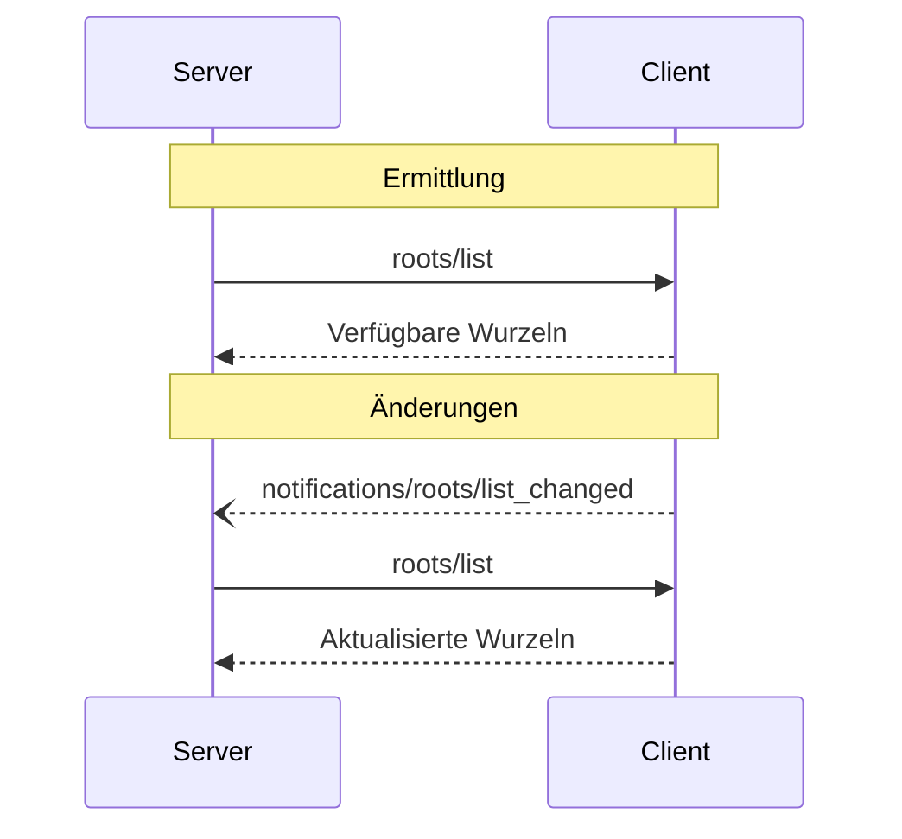

<div id="enable-section-numbers" />

<Info>**Protokollrevision**: 2025-06-18</Info>

Das Model Context Protocol (MCP) bietet eine standardisierte Möglichkeit für Clients, Servern Dateisystem‑„Wurzeln“ bereitzustellen. Wurzeln definieren die Bereiche, in denen Server im Dateisystem agieren dürfen, und machen damit klar, auf welche Verzeichnisse und Dateien sie Zugriff haben. Server können die Liste der Wurzeln von unterstützenden Clients anfordern und Benachrichtigungen erhalten, wenn sich diese Liste ändert.

<div id="user-interaction-model">
  ## Benutzerinteraktionsmodell
</div>

Wurzeln in MCP werden typischerweise über Arbeitsbereichs- oder Projektkonfigurationsoberflächen bereitgestellt.

Beispielsweise könnten Implementierungen einen Arbeitsbereichs-/Projektauswähler anbieten, der es Nutzerinnen und Nutzern ermöglicht, Verzeichnisse und Dateien auszuwählen, auf die der Server zugreifen darf. Dies lässt sich mit einer automatischen Erkennung von Arbeitsbereichen aus Versionskontrollsystemen oder Projektdateien kombinieren.

Implementierungen sind jedoch frei, Wurzeln über beliebige Schnittstellenmuster bereitzustellen, die ihren Anforderungen entsprechen—das Protokoll selbst schreibt kein bestimmtes Benutzerinteraktionsmodell vor.

<div id="capabilities">
  ## Fähigkeiten
</div>

Clients, die Wurzeln unterstützen, **MÜSSEN** während der
[Initialisierung](/de/specification/2025-06-18/basic/lifecycle#initialization) die Fähigkeit `roots` deklarieren:

```json
{
  "capabilities": {
    "roots": {
      "listChanged": true
    }
  }
}
```

`listChanged` gibt an, ob der Client Benachrichtigungen ausgibt, wenn sich die Liste der Wurzeln
ändert.

<div id="protocol-messages">
  ## Protokollnachrichten
</div>

<div id="listing-roots">
  ### Auflisten von Wurzeln
</div>

Um Wurzeln abzurufen, senden Server eine `roots/list`-Anfrage:

**Anfrage:**

```json
{
  "jsonrpc": "2.0",
  "id": 1,
  "method": "roots/list"
}
```

**Antwort:**

```json
{
  "jsonrpc": "2.0",
  "id": 1,
  "result": {
    "roots": [
      {
        "uri": "file:///home/user/projects/myproject",
        "name": "My Project"
      }
    ]
  }
}
```

<div id="root-list-changes">
  ### Änderungen an der Wurzelliste
</div>

Wenn sich die Wurzeln ändern, müssen Clients, die `listChanged` unterstützen, eine Benachrichtigung senden:

```json
{
  "jsonrpc": "2.0",
  "method": "notifications/roots/list_changed"
}
```

<div id="message-flow">
  ## Nachrichtenfluss
</div>



<div id="data-types">
  ## Datentypen
</div>

<div id="root">
  ### Wurzel
</div>

Eine Wurzeldefinition umfasst:

* `uri`: Eindeutiger Bezeichner für die Wurzel. Dieser **MUSS** in der aktuellen
  Spezifikation eine `file://`-URI sein.
* `name`: Optionaler, menschenlesbarer Name für Anzeigezwecke.

Beispielwurzeln für verschiedene Anwendungsfälle:

<div id="project-directory">
  #### Projektverzeichnis
</div>

```json
{
  "uri": "file:///home/user/projects/myproject",
  "name": "My Project"
}
```

<div id="multiple-repositories">
  #### Mehrere Repositories
</div>

```json
[
  {
    "uri": "file:///home/user/repos/frontend",
    "name": "Frontend-Repository"
  },
  {
    "uri": "file:///home/user/repos/backend",
    "name": "Backend-Repository"
  }
]
```

<div id="error-handling">
  ## Fehlerbehandlung
</div>

Clients **SOLLTEN** standardisierte JSON-RPC-Fehler für gängige Fehlerfälle zurückgeben:

* Client unterstützt Wurzeln nicht: `-32601` (Methode nicht gefunden)
* Interne Fehler: `-32603`

Beispiel für einen Fehler:

```json
{
  "jsonrpc": "2.0",
  "id": 1,
  "error": {
    "code": -32601,
    "message": "Roots not supported",
    "data": {
      "reason": "Client does not have roots capability"
    }
  }
}
```

<div id="security-considerations">
  ## Sicherheitsaspekte
</div>

1. Clients **MÜSSEN**:
   * Nur Wurzeln mit passenden Berechtigungen freigeben
   * Alle Root-URIs validieren, um Path Traversal zu verhindern
   * Angemessene Zugriffskontrollen implementieren
   * Die Zugänglichkeit der Wurzeln überwachen

2. Server **SOLLTEN**:
   * Fälle behandeln, in denen Wurzeln nicht mehr verfügbar sind
   * Wurzelgrenzen während der Operationen respektieren
   * Alle Pfade gegen die bereitgestellten Wurzeln validieren

<div id="implementation-guidelines">
  ## Implementierungsrichtlinien
</div>

1. Clients **SOLLTEN**:
   * Benutzer um Zustimmung bitten, bevor Wurzeln gegenüber Servern offengelegt werden
   * Klare Benutzeroberflächen für die Verwaltung von Wurzeln bereitstellen
   * Die Zugänglichkeit von Wurzeln prüfen, bevor sie offengelegt werden
   * Auf Änderungen an Wurzeln überwachen

2. Server **SOLLTEN**:
   * Vor der Nutzung auf die Wurzeln-Fähigkeit prüfen
   * Änderungen an der Wurzelliste robust/umsichtig behandeln
   * Grenzen von Wurzeln bei Operationen respektieren
   * Informationen zu Wurzeln angemessen zwischenspeichern