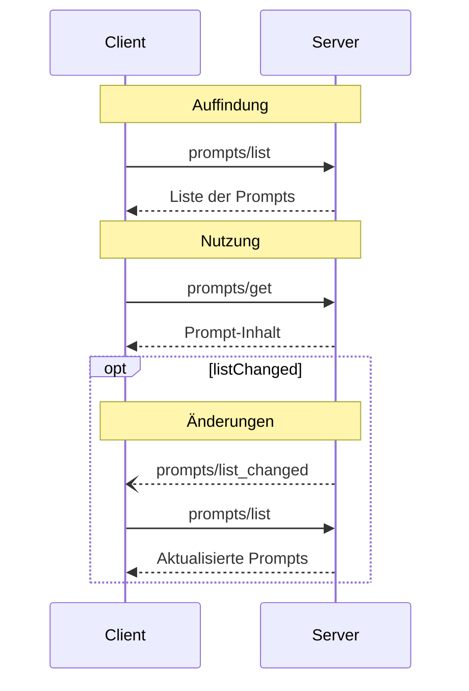

<div id="enable-section-numbers" />

<Info>**Protokollrevision**: 2025-06-18</Info>

Das Model Context Protocol (MCP) stellt eine standardisierte Möglichkeit bereit, mit der Server Prompts
für Clients verfügbar machen können. Prompts ermöglichen es Servern, strukturierte Nachrichten und
Anweisungen für die Interaktion mit Sprachmodellen bereitzustellen. Clients können verfügbare
Prompts entdecken, deren Inhalte abrufen und Argumente angeben, um sie anzupassen.

<div id="user-interaction-model">
  ## Benutzerinteraktionsmodell
</div>

Prompts sind so konzipiert, dass sie **vom Nutzer gesteuert** werden. Das bedeutet, sie werden von Servern für Clients bereitgestellt, damit Nutzer sie gezielt zur Verwendung auswählen können.

In der Regel werden Prompts durch vom Nutzer initiierte Befehle in der Benutzeroberfläche ausgelöst, wodurch Nutzer verfügbare Prompts auf natürliche Weise entdecken und aufrufen können.

Zum Beispiel als Slash-Befehle:


Implementierende sind jedoch frei, Prompts über beliebige Interaktionsmuster bereitzustellen, die ihren Anforderungen entsprechen – das Protokoll selbst schreibt kein bestimmtes Benutzerinteraktionsmodell vor.

<div id="capabilities">
  ## Fähigkeiten
</div>

Server, die Prompts unterstützen, **MÜSSEN** während der
[Initialisierung](/de/specification/2025-06-18/basic/lifecycle#initialization) die Fähigkeit `prompts` deklarieren:

```json
{
  "capabilities": {
    "prompts": {
      "listChanged": true
    }
  }
}
```

`listChanged` gibt an, ob der Server Benachrichtigungen ausgibt, wenn sich die Liste der
verfügbaren Prompts ändert.

<div id="protocol-messages">
  ## Protokollnachrichten
</div>

<div id="listing-prompts">
  ### Prompts auflisten
</div>

Um verfügbare Prompts abzurufen, senden Clients eine `prompts/list`-Anfrage. Dieser Vorgang
unterstützt [Paginierung](/de/specification/2025-06-18/server/utilities/pagination).

**Anfrage:**

```json
{
  "jsonrpc": "2.0",
  "id": 1,
  "method": "prompts/list",
  "params": {
    "cursor": "optional-cursor-value"
  }
}
```

**Antwort:**

```json
{
  "jsonrpc": "2.0",
  "id": 1,
  "result": {
    "prompts": [
      {
        "name": "code_review",
        "title": "Code-Review anfordern",
        "description": "Fordert das LLM auf, die Codequalität zu analysieren und Verbesserungen vorzuschlagen",
        "arguments": [
          {
            "name": "code",
            "description": "Der zu überprüfende Code",
            "required": true
          }
        ]
      }
    ],
    "nextCursor": "next-page-cursor"
  }
}
```

<div id="getting-a-prompt">
  ### Abrufen eines Prompts
</div>

Um einen bestimmten Prompt abzurufen, senden Clients eine `prompts/get`-Anfrage. Argumente können über [die Completion-API](/de/specification/2025-06-18/server/utilities/completion) automatisch vervollständigt werden.

**Anfrage:**

```json
{
  "jsonrpc": "2.0",
  "id": 2,
  "method": "prompts/get",
  "params": {
    "name": "code_review",
    "arguments": {
      "code": "def hello():\n    print('world')"
    }
  }
}
```

**Antwort:**

```json
{
  "jsonrpc": "2.0",
  "id": 2,
  "result": {
    "description": "Code-Review-Prompt",
    "messages": [
      {
        "role": "user",
        "content": {
          "type": "text",
          "text": "Please review this Python code:\ndef hello():\n    print('world')"
        }
      }
    ]
  }
}
```

<div id="list-changed-notification">
  ### Benachrichtigung bei Listenänderung
</div>

Wenn sich die Liste der verfügbaren Prompts ändert, sollten Server, die die Fähigkeit `listChanged` deklariert haben, eine Benachrichtigung senden:

```json
{
  "jsonrpc": "2.0",
  "method": "notifications/prompts/list_changed"
}
```

<div id="message-flow">
  ## Nachrichtenfluss
</div>



<div id="data-types">
  ## Datentypen
</div>

<div id="prompt">
  ### Prompt
</div>

Eine Prompt-Definition umfasst:

* `name`: Eindeutiger Bezeichner für das Prompt
* `title`: Optionale, menschenlesbare Bezeichnung des Prompts für Anzeigezwecke.
* `description`: Optionale, menschenlesbare Beschreibung
* `arguments`: Optionale Liste von Argumenten zur Anpassung

<div id="promptmessage">
  ### PromptMessage
</div>

Nachrichten in einem Prompt können Folgendes enthalten:

* `role`: Entweder „user“ oder „assistant“, um den/die Sprecher:in anzugeben
* `content`: Einer der folgenden Inhaltstypen:

<Note>
  Alle Inhaltstypen in Prompt-Nachrichten unterstützen optionale
  [Anmerkungen](/de/specification/2025-06-18/server/resources#annotations) mit
  Metadaten zur Zielgruppe, Priorität und den Änderungszeiten.
</Note>

<div id="text-content">
  #### Textinhalt
</div>

Textinhalt steht für einfache Textnachrichten:

```json
{
  "type": "text",
  "text": "The text content of the message"
}
```

Dies ist der am häufigsten verwendete Inhaltstyp für Interaktionen in natürlicher Sprache.

<div id="image-content">
  #### Bildinhalt
</div>

Bildinhalt ermöglicht das Einbinden visueller Informationen in Nachrichten:

```json
{
  "type": "image",
  "data": "base64-encoded-image-data",
  "mimeType": "image/png"
}
```

Die Bilddaten **MÜSSEN** Base64-codiert sein und einen gültigen MIME-Typ enthalten. Dies ermöglicht
multimodale Interaktionen, bei denen visueller Kontext wichtig ist.

<div id="audio-content">
  #### Audioinhalte
</div>

Audioinhalte ermöglichen das Einbinden von Audioinformationen in Nachrichten:

```json
{
  "type": "audio",
  "data": "base64-encoded-audio-data",
  "mimeType": "audio/wav"
}
```

Die Audiodaten MÜSSEN base64-codiert sein und einen gültigen MIME-Typ enthalten. Dies ermöglicht
multimodale Interaktionen, bei denen der Audiokontext wichtig ist.

<div id="embedded-resources">
  #### Eingebettete Ressourcen
</div>

Eingebettete Ressourcen ermöglichen das direkte Referenzieren serverseitiger Ressourcen in Nachrichten:

```json
{
  "type": "resource",
  "resource": {
    "uri": "resource://example",
    "name": "example",
    "title": "My Example Resource",
    "mimeType": "text/plain",
    "text": "Resource content"
  }
}
```

Ressourcen können entweder Text- oder Binärdaten (Blob) enthalten und **MÜSSEN** Folgendes enthalten:

* Eine gültige Ressourcen-URI
* Den passenden MIME-Typ
* Entweder Textinhalt oder Base64-codierte Blob-Daten

Eingebettete Ressourcen ermöglichen es Prompts, serververwaltete Inhalte wie
Dokumentation, Codebeispiele oder andere Referenzmaterialien nahtlos in den Gesprächsfluss
einzubinden.

<div id="error-handling">
  ## Fehlerbehandlung
</div>

Server **sollten** für gängige Fehlerfälle standardisierte JSON-RPC-Fehler zurückgeben:

* Ungültiger Prompt-Name: `-32602` (Invalid params)
* Fehlende erforderliche Argumente: `-32602` (Invalid params)
* Interne Fehler: `-32603` (Internal error)

<div id="implementation-considerations">
  ## Implementierungsaspekte
</div>

1. Server **SOLLTEN** Prompt-Argumente vor der Verarbeitung prüfen
2. Clients **SOLLTEN** bei großen Prompt-Listen die Seitennavigation (Pagination) unterstützen
3. Beide Seiten **SOLLTEN** die Fähigkeitenaushandlung beachten

<div id="security">
  ## Sicherheit
</div>

Implementierungen MÜSSEN alle Prompt-Ein- und -Ausgaben sorgfältig validieren, um Injection-Angriffe oder unbefugten Zugriff auf Ressourcen zu verhindern.