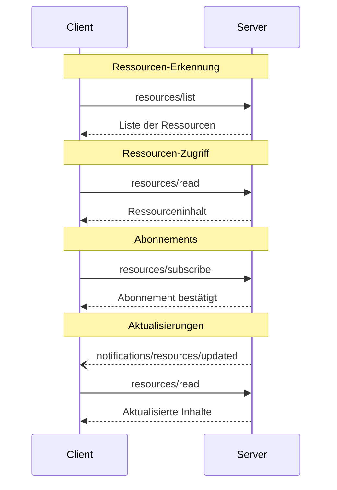

<div id="enable-section-numbers" />

<Info>**Protokollrevision**: 2025-06-18</Info>

Das Model Context Protocol (MCP) bietet eine standardisierte Möglichkeit, mit der Server
Ressourcen für Clients bereitstellen können. Ressourcen ermöglichen es Servern, Daten bereitzustellen,
die Sprachmodellen Kontext liefern, etwa Dateien, Datenbankschemata oder anwendungsspezifische Informationen.
Jede Ressource ist eindeutig durch eine
[URI](https://datatracker.ietf.org/doc/html/rfc3986) identifiziert.

<div id="user-interaction-model">
  ## Benutzerinteraktionsmodell
</div>

Ressourcen im MCP sind **anwendungsgetrieben** konzipiert; Host-Anwendungen
entscheiden, wie sie je nach Bedarf Kontext einbinden.

Beispielsweise könnten Anwendungen:

* Ressourcen über UI-Elemente zur expliziten Auswahl in einer Baum- oder Listenansicht bereitstellen
* Nutzerinnen und Nutzern erlauben, verfügbare Ressourcen zu durchsuchen und zu filtern
* Eine automatische Kontexteinbindung implementieren, basierend auf Heuristiken oder der Auswahl des KI-Modells


Implementierungen können Ressourcen jedoch über jedes Interaktionsmuster bereitstellen, das
ihren Anforderungen entspricht—das Protokoll selbst schreibt kein spezifisches Benutzerinteraktionsmodell vor.

<div id="capabilities">
  ## Fähigkeiten
</div>

Server, die Ressourcen unterstützen, **MÜSSEN** die Fähigkeit `resources` deklarieren:

```json
{
  "capabilities": {
    "resources": {
      "subscribe": true,
      "listChanged": true
    }
  }
}
```

Diese Fähigkeit unterstützt zwei optionale Funktionen:

* `subscribe`: ob der Client Änderungen an einzelnen Ressourcen abonnieren kann, um benachrichtigt zu werden.
* `listChanged`: ob der Server Benachrichtigungen sendet, wenn sich die Liste der verfügbaren Ressourcen ändert.

Sowohl `subscribe` als auch `listChanged` sind optional — Server können keines, eines oder beide unterstützen:

```json
{
  "capabilities": {
    "resources": {} // Neither feature supported
  }
}
```

```json
{
  "capabilities": {
    "resources": {
      "subscribe": true // Only subscriptions supported
    }
  }
}
```

```json
{
  "capabilities": {
    "resources": {
      "listChanged": true // Only list change notifications supported
    }
  }
}
```

<div id="protocol-messages">
  ## Protokollnachrichten
</div>

<div id="listing-resources">
  ### Ressourcen auflisten
</div>

Um verfügbare Ressourcen zu ermitteln, senden Clients eine `resources/list`-Anfrage. Dieser Vorgang
unterstützt [Seitennavigation](/de/specification/2025-06-18/server/utilities/pagination).

**Anfrage:**

```json
{
  "jsonrpc": "2.0",
  "id": 1,
  "method": "resources/list",
  "params": {
    "cursor": "optional-cursor-value"
  }
}
```

**Antwort:**

```json
{
  "jsonrpc": "2.0",
  "id": 1,
  "result": {
    "resources": [
      {
        "uri": "file:///project/src/main.rs",
        "name": "main.rs",
        "title": "Rust-Anwendung: Hauptdatei",
        "description": "Primärer Einstiegspunkt der Anwendung",
        "mimeType": "text/x-rust"
      }
    ],
    "nextCursor": "next-page-cursor"
  }
}
```

<div id="reading-resources">
  ### Ressourcen lesen
</div>

Um Ressourcengehalte abzurufen, senden Clients eine `resources/read`-Anfrage:

**Anfrage:**

```json
{
  "jsonrpc": "2.0",
  "id": 2,
  "method": "resources/read",
  "params": {
    "uri": "file:///project/src/main.rs"
  }
}
```

**Antwort:**

```json
{
  "jsonrpc": "2.0",
  "id": 2,
  "result": {
    "contents": [
      {
        "uri": "file:///project/src/main.rs",
        "name": "main.rs",
        "title": "Hauptdatei der Rust-Anwendung",
        "mimeType": "text/x-rust",
        "text": "fn main() {\n    println!(\"Hello world!\");\n}"
      }
    ]
  }
}
```

<div id="resource-templates">
  ### Ressourcen-Vorlagen
</div>

Ressourcen-Vorlagen ermöglichen es Servern, parametrisierte Ressourcen mithilfe von
[URI-Vorlagen](https://datatracker.ietf.org/doc/html/rfc6570) bereitzustellen. Argumente können
über [die Completion-API](/de/specification/2025-06-18/server/utilities/completion) automatisch vervollständigt werden.

**Anfrage:**

```json
{
  "jsonrpc": "2.0",
  "id": 3,
  "method": "resources/templates/list"
}
```

**Antwort:**

```json
{
  "jsonrpc": "2.0",
  "id": 3,
  "result": {
    "resourceTemplates": [
      {
        "uriTemplate": "file:///{path}",
        "name": "Project Files",
        "title": "📁 Project Files",
        "description": "Access files in the project directory",
        "mimeType": "application/octet-stream"
      }
    ]
  }
}
```

<div id="list-changed-notification">
  ### Benachrichtigung bei Listenänderung
</div>

Wenn sich die Liste der verfügbaren Ressourcen ändert, sollten Server, die die Fähigkeit `listChanged` deklariert haben, eine Benachrichtigung senden:

```json
{
  "jsonrpc": "2.0",
  "method": "notifications/resources/list_changed"
}
```

<div id="subscriptions">
  ### Abonnements
</div>

Das Protokoll unterstützt optionale Abonnements für Änderungen an Ressourcen. Clients können bestimmte Ressourcen abonnieren und Benachrichtigungen erhalten, wenn diese sich ändern:

**Abonnementanfrage:**

```json
{
  "jsonrpc": "2.0",
  "id": 4,
  "method": "resources/subscribe",
  "params": {
    "uri": "file:///project/src/main.rs"
  }
}
```

**Aktualisierungsbenachrichtigung:**

```json
{
  "jsonrpc": "2.0",
  "method": "notifications/resources/updated",
  "params": {
    "uri": "file:///project/src/main.rs",
    "title": "Hauptdatei der Rust-Anwendung"
  }
}
```

<div id="message-flow">
  ## Nachrichtenfluss
</div>



<div id="data-types">
  ## Datentypen
</div>

<div id="resource">
  ### Ressource
</div>

Eine Ressourcendefinition umfasst:

* `uri`: Eindeutiger Bezeichner der Ressource
* `name`: Name der Ressource.
* `title`: Optionaler, menschenlesbarer Anzeigename der Ressource.
* `description`: Optionale Beschreibung
* `mimeType`: Optionaler MIME-Typ
* `size`: Optionale Größe in Bytes

<div id="resource-contents">
  ### Inhalt von Ressourcen
</div>

Ressourcen können entweder Text- oder Binärdaten enthalten:

<div id="text-content">
  #### Textinhalt
</div>

```json
{
  "uri": "file:///example.txt",
  "name": "example.txt",
  "title": "Textdatei-Beispiel",
  "mimeType": "text/plain",
  "text": "Ressourceninhalt"
}
```

<div id="binary-content">
  #### Binäre Inhalte
</div>

```json
{
  "uri": "file:///example.png",
  "name": "example.png",
  "title": "Beispielbild",
  "mimeType": "image/png",
  "blob": "Base64-kodierte Daten"
}
```

<div id="annotations">
  ### Annotationen
</div>

Ressourcen, Ressourcenvorlagen und Inhaltsblöcke unterstützen optionale Annotationen, die Clients Hinweise geben, wie die Ressource verwendet oder dargestellt werden soll:

* **`audience`**: Ein Array, das die vorgesehene(n) Zielgruppe(n) für diese Ressource angibt. Gültige Werte sind `"user"` und `"assistant"`. Zum Beispiel weist `["user", "assistant"]` auf Inhalte hin, die für beide nützlich sind.
* **`priority`**: Eine Zahl von 0,0 bis 1,0, die die Wichtigkeit dieser Ressource angibt. Ein Wert von 1 bedeutet „am wichtigsten“ (faktisch erforderlich), während 0 „am wenigsten wichtig“ (vollständig optional) bedeutet.
* **`lastModified`**: Ein Zeitstempel im ISO-8601-Format, der angibt, wann die Ressource zuletzt geändert wurde (z. B. `"2025-01-12T15:00:58Z"`).

Beispiel für eine Ressource mit Annotationen:

```json
{
  "uri": "file:///project/README.md",
  "name": "README.md",
  "title": "Project Documentation",
  "mimeType": "text/markdown",
  "annotations": {
    "audience": ["user"],
    "priority": 0.8,
    "lastModified": "2025-01-12T15:00:58Z"
  }
}
```

Clients können diese Annotationen verwenden, um:

* Ressourcen nach ihrer vorgesehenen Zielgruppe zu filtern
* zu priorisieren, welche Ressourcen in den Kontext aufgenommen werden
* Änderungszeiten anzuzeigen oder nach Aktualität zu sortieren

<div id="common-uri-schemes">
  ## Gängige URI-Schemata
</div>

Das Protokoll definiert mehrere standardisierte URI-Schemata. Diese Liste ist nicht abschließend—Implementierungen können jederzeit zusätzliche, benutzerdefinierte URI-Schemata verwenden.

<div id="https">
  ### https://
</div>

Wird verwendet, um eine im Web verfügbare Ressource zu repräsentieren.

Server **SOLLTEN** dieses Schema nur verwenden, wenn der Client die Ressource eigenständig direkt aus dem Web abrufen und laden kann – das heißt, sie nicht über den MCP-Server lesen muss.

Für andere Anwendungsfälle **SOLLTEN** Server ein anderes URI-Schema bevorzugen oder ein benutzerdefiniertes definieren, selbst wenn der Server die Inhalte der Ressource selbst aus dem Internet herunterlädt.

<div id="file">
  ### file://
</div>

Wird verwendet, um Ressourcen zu identifizieren, die sich wie ein Dateisystem verhalten. Die Ressourcen müssen jedoch nicht einem tatsächlichen physischen Dateisystem entsprechen.

MCP-Server **KÖNNEN** file://-Ressourcen mit einem
[XDG-MIME-Typ](https://specifications.freedesktop.org/shared-mime-info-spec/0.14/ar01s02.html#id-1.3.14),
wie `inode/directory`, kennzeichnen, um nicht reguläre Dateien (etwa Verzeichnisse) darzustellen, die ansonsten keinen standardisierten MIME-Typ besitzen.

<div id="git">
  ### git://
</div>

Integration mit der Git-Versionsverwaltung.

<div id="custom-uri-schemes">
  ### Benutzerdefinierte URI-Schemata
</div>

Benutzerdefinierte URI-Schemata **MÜSSEN** mit [RFC3986](https://datatracker.ietf.org/doc/html/rfc3986) übereinstimmen und dabei die obigen Hinweise berücksichtigen.

<div id="error-handling">
  ## Fehlerbehandlung
</div>

Server **SOLLTEN** für gängige Fehlerfälle standardisierte JSON-RPC-Fehler zurückgeben:

* Ressource nicht gefunden: `-32002`
* Interner Fehler: `-32603`

Beispiel für eine Fehlermeldung:

```json
{
  "jsonrpc": "2.0",
  "id": 5,
  "error": {
    "code": -32002,
    "message": "Resource not found",
    "data": {
      "uri": "file:///nonexistent.txt"
    }
  }
}
```

<div id="security-considerations">
  ## Sicherheitshinweise
</div>

1. Server **MÜSSEN** alle Ressourcen-URIs validieren
2. Zugriffskontrollen **SOLLTEN** für sensible Ressourcen implementiert werden
3. Binärdaten **MÜSSEN** ordnungsgemäß codiert werden
4. Ressourcenberechtigungen **SOLLTEN** vor Ausführungen geprüft werden