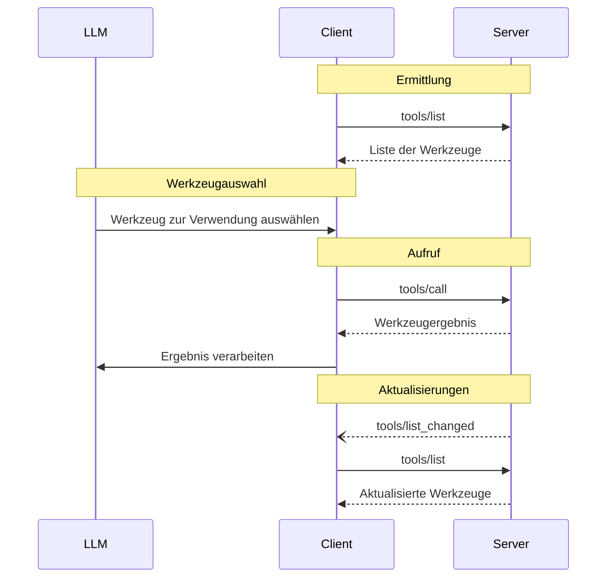

<div id="enable-section-numbers" />

<Info>**Protokollrevision**: 2025-06-18</Info>

Das Model Context Protocol (MCP) ermöglicht Servern, Werkzeuge bereitzustellen, die von Sprachmodellen aufgerufen werden können. Werkzeuge erlauben es Modellen, mit externen Systemen zu interagieren, etwa Datenbanken abzufragen, APIs aufzurufen oder Berechnungen durchzuführen. Jedes Werkzeug ist eindeutig durch einen Namen identifiziert und enthält Metadaten, die sein Schema beschreiben.

<div id="user-interaction-model">
  ## Benutzerinteraktionsmodell
</div>

Werkzeuge im Model Context Protocol (MCP) sind so ausgelegt, dass sie **modellgesteuert** sind. Das bedeutet, dass das Sprachmodell Werkzeuge automatisch anhand seines Kontextverständnisses und der Prompts der Nutzer entdecken und aufrufen kann.

Implementierungen können Werkzeuge jedoch über jedes Interface-Muster bereitstellen, das ihren Anforderungen entspricht—das Protokoll selbst schreibt kein spezifisches Benutzerinteraktionsmodell vor.

<Warning>
  Aus Gründen von Trust &amp; Safety sowie Sicherheit **SOLLTE** stets ein Mensch eingebunden sein, der die Möglichkeit hat, Werkzeugaufrufe abzulehnen.

  Anwendungen **SOLLEN**:

  * Eine UI bereitstellen, die klar macht, welche Werkzeuge dem KI-Modell zur Verfügung stehen
  * Deutliche visuelle Hinweise einblenden, wenn Werkzeuge aufgerufen werden
  * Bestätigungs-Prompts für Vorgänge anzeigen, um sicherzustellen, dass ein Mensch eingebunden ist
</Warning>

<div id="capabilities">
  ## Fähigkeiten
</div>

Server, die Werkzeuge unterstützen, **MÜSSEN** die Fähigkeit `tools` deklarieren:

```json
{
  "capabilities": {
    "tools": {
      "listChanged": true
    }
  }
}
```

`listChanged` gibt an, ob der Server Benachrichtigungen ausgibt, wenn sich die Liste der verfügbaren Werkzeuge ändert.

<div id="protocol-messages">
  ## Protokollnachrichten
</div>

<div id="listing-tools">
  ### Auflisten von Werkzeugen
</div>

Um verfügbare Werkzeuge zu ermitteln, senden Clients eine `tools/list`-Anfrage. Dieser Vorgang unterstützt
[Paginierung](/de/specification/2025-06-18/server/utilities/pagination).

**Anfrage:**

```json
{
  "jsonrpc": "2.0",
  "id": 1,
  "method": "tools/list",
  "params": {
    "cursor": "optional-cursor-value"
  }
}
```

**Antwort:**

```json
{
  "jsonrpc": "2.0",
  "id": 1,
  "result": {
    "tools": [
      {
        "name": "get_weather",
        "title": "Anbieter für Wetterinformationen",
        "description": "Aktuelle Wetterinformationen für einen Ort abrufen",
        "inputSchema": {
          "type": "object",
          "properties": {
            "location": {
              "type": "string",
              "description": "Stadtname oder Postleitzahl"
            }
          },
          "required": ["location"]
        }
      }
    ],
    "nextCursor": "next-page-cursor"
  }
}
```

<div id="calling-tools">
  ### Werkzeuge aufrufen
</div>

Um ein Werkzeug aufzurufen, senden Clients eine `tools/call`-Anfrage:

**Anfrage:**

```json
{
  "jsonrpc": "2.0",
  "id": 2,
  "method": "tools/call",
  "params": {
    "name": "get_weather",
    "arguments": {
      "location": "New York"
    }
  }
}
```

**Antwort:**

```json
{
  "jsonrpc": "2.0",
  "id": 2,
  "result": {
    "content": [
      {
        "type": "text",
        "text": "Aktuelles Wetter in New York:\nTemperatur: 72°F\nBedingungen: Teilweise bewölkt"
      }
    ],
    "isError": false
  }
}
```

<div id="list-changed-notification">
  ### Benachrichtigung über Listenänderungen
</div>

Wenn sich die Liste der verfügbaren Werkzeuge ändert, sollten Server, die die Fähigkeit `listChanged` deklariert haben, eine Benachrichtigung senden:

```json
{
  "jsonrpc": "2.0",
  "method": "notifications/tools/list_changed"
}
```

<div id="message-flow">
  ## Nachrichtenfluss
</div>



<div id="data-types">
  ## Datentypen
</div>

<div id="tool">
  ### Werkzeug
</div>

Eine Werkzeugdefinition umfasst:

* `name`: Eindeutiger Bezeichner für das Werkzeug
* `title`: Optionaler, menschenlesbarer Name des Werkzeugs für Anzeigezwecke
* `description`: Menschenlesbare Beschreibung der Funktionalität
* `inputSchema`: JSON Schema, das die erwarteten Parameter definiert
* `outputSchema`: Optionales JSON Schema, das die erwartete Ausgabestruktur definiert
* `annotations`: Optionale Eigenschaften, die das Verhalten des Werkzeugs beschreiben

<Warning>
  Aus Gründen der Vertrauenswürdigkeit und Sicherheit MÜSSEN Clients
  Tool-Annotationen als nicht vertrauenswürdig behandeln, sofern sie nicht von vertrauenswürdigen Servern stammen.
</Warning>

<div id="tool-result">
  ### Werkzeugergebnis
</div>

Werkzeugergebnisse können [**strukturierten**](#structured-content) oder **unstrukturierten** Inhalt enthalten.

**Unstrukturierter** Inhalt wird im Feld `content` eines Ergebnisses zurückgegeben und kann mehrere Inhaltselemente unterschiedlicher Typen enthalten:

<Note>
  Alle Inhaltstypen (Text, Bild, Audio, Ressourcenlinks und eingebettete Ressourcen)
  unterstützen optionale
  [Annotationen](/de/specification/2025-06-18/server/resources#annotations), die
  Metadaten zu Zielgruppe, Priorität und Änderungszeiten bereitstellen. Dies ist dasselbe
  Annotationsformat, das von Ressourcen und Prompts verwendet wird.
</Note>

<div id="text-content">
  #### Textinhalt
</div>

```json
{
  "type": "text",
  "text": "Werkzeug-Ergebnis"
}
```

<div id="image-content">
  #### Bildinhalt
</div>

```json
{
  "type": "image",
  "data": "base64-encoded-data",
  "mimeType": "image/png"
  "annotations": {
    "audience": ["user"],
    "priority": 0.9
  }

}
```

Dieses Beispiel zeigt die Verwendung einer optionalen Annotation.

<div id="audio-content">
  #### Audioinhalt
</div>

```json
{
  "type": "audio",
  "data": "base64-encoded-audio-data",
  "mimeType": "audio/wav"
}
```

<div id="resource-links">
  #### Ressourcenlinks
</div>

Ein Werkzeug **KANN** Links zu [Ressourcen](/de/specification/2025-06-18/server/resources) zurückgeben, um zusätzlichen Kontext
oder Daten bereitzustellen. In diesem Fall gibt das Werkzeug eine URI zurück, die vom Client abonniert oder abgerufen werden kann:

```json
{
  "type": "resource_link",
  "uri": "file:///project/src/main.rs",
  "name": "main.rs",
  "description": "Primary application entry point",
  "mimeType": "text/x-rust",
  "annotations": {
    "audience": ["assistant"],
    "priority": 0.9
  }
}
```

Ressourcenlinks unterstützen dieselben [Ressourcen-Annotationen](/de/specification/2025-06-18/server/resources#annotations) wie reguläre Ressourcen und helfen Clients dabei zu verstehen, wie sie zu verwenden sind.

<Info>
  Von Werkzeugen zurückgegebene Ressourcenlinks sind nicht zwingend in den Ergebnissen
  einer `resources/list`-Anfrage enthalten.
</Info>

<div id="embedded-resources">
  #### Eingebettete Ressourcen
</div>

[Ressourcen](/de/specification/2025-06-18/server/resources) **KÖNNEN** eingebettet werden, um zusätzlichen Kontext
oder Daten über ein geeignetes [URI-Schema](de/./resources#common-uri-schemes) bereitzustellen. Server, die eingebettete Ressourcen verwenden, **SOLLTEN** die Fähigkeit `resources` implementieren:

```json
{
  "type": "resource",
  "resource": {
    "uri": "file:///project/src/main.rs",
    "title": "Project Rust Main File",
    "mimeType": "text/x-rust",
    "text": "fn main() {\n    println!(\"Hello world!\");\n}",
    "annotations": {
      "audience": ["user", "assistant"],
      "priority": 0.7,
      "lastModified": "2025-05-03T14:30:00Z"
    }
  }
}
```

Eingebettete Ressourcen unterstützen dieselben [Ressourcen-Annotationen](/de/specification/2025-06-18/server/resources#annotations) wie reguläre Ressourcen, um Clients dabei zu unterstützen, sie korrekt zu verwenden.

<div id="structured-content">
  #### Strukturierte Inhalte
</div>

**Strukturierte** Inhalte werden als JSON-Objekt im Feld `structuredContent` eines Ergebnisses zurückgegeben.

Zur Wahrung der Abwärtskompatibilität SOLLTE ein Werkzeug, das strukturierte Inhalte zurückgibt, zusätzlich das serialisierte JSON in einem TextContent-Block zurückgeben.

<div id="output-schema">
  #### Ausgabeschema
</div>

Werkzeuge können auch ein Ausgabeschema zur Validierung strukturierter Ergebnisse bereitstellen.
Wenn ein Ausgabeschema bereitgestellt wird:

* Server **MÜSSEN** strukturierte Ergebnisse liefern, die diesem Schema entsprechen.
* Clients **SOLLEN** strukturierte Ergebnisse gegen dieses Schema validieren.

Beispiel-Werkzeug mit Ausgabeschema:

```json
{
  "name": "get_weather_data",
  "title": "Weather Data Retriever",
  "description": "Get current weather data for a location",
  "inputSchema": {
    "type": "object",
    "properties": {
      "location": {
        "type": "string",
        "description": "City name or zip code"
      }
    },
    "required": ["location"]
  },
  "outputSchema": {
    "type": "object",
    "properties": {
      "temperature": {
        "type": "number",
        "description": "Temperature in celsius"
      },
      "conditions": {
        "type": "string",
        "description": "Weather conditions description"
      },
      "humidity": {
        "type": "number",
        "description": "Humidity percentage"
      }
    },
    "required": ["temperature", "conditions", "humidity"]
  }
}
```

Beispiel für eine gültige Antwort dieses Werkzeugs:

```json
{
  "jsonrpc": "2.0",
  "id": 5,
  "result": {
    "content": [
      {
        "type": "text",
        "text": "{\"temperature\": 22.5, \"conditions\": \"Partly cloudy\", \"humidity\": 65}"
      }
    ],
    "structuredContent": {
      "temperature": 22.5,
      "conditions": "Partly cloudy",
      "humidity": 65
    }
  }
}
```

Die Bereitstellung eines Ausgabeschemas hilft Clients und LLMs, strukturierte Werkzeugausgaben zu verstehen und korrekt zu verarbeiten, indem sie:

* strikte Schema-Validierung von Antworten ermöglicht
* Typinformationen für eine bessere Integration mit Programmiersprachen bereitstellt
* Clients und LLMs beim korrekten Parsen und Nutzen der zurückgegebenen Daten unterstützt
* zu besserer Dokumentation und Entwicklererfahrung beiträgt

<div id="error-handling">
  ## Fehlerbehandlung
</div>

Werkzeuge verwenden zwei Mechanismen zur Fehlerberichterstattung:

1. **Protokollfehler**: Standard-JSON-RPC-Fehler für Probleme wie:
   * Unbekannte Werkzeuge
   * Ungültige Argumente
   * Serverfehler

2. **Fehler bei der Werkzeugausführung**: Gemeldet in Werkzeugergebnissen mit `isError: true`:
   * API-Fehler
   * Ungültige Eingabedaten
   * Fehler in der Geschäftslogik

Beispiel für einen Protokollfehler:

```json
{
  "jsonrpc": "2.0",
  "id": 3,
  "error": {
    "code": -32602,
    "message": "Unknown tool: invalid_tool_name"
  }
}
```

Beispiel für einen Fehler bei der Werkzeugausführung:

```json
{
  "jsonrpc": "2.0",
  "id": 4,
  "result": {
    "content": [
      {
        "type": "text",
        "text": "Failed to fetch weather data: API rate limit exceeded"
      }
    ],
    "isError": true
  }
}
```

<div id="security-considerations">
  ## Sicherheitsaspekte
</div>

1. Server **MÜSSEN**:
   * Alle Eingaben für Werkzeuge validieren
   * Angemessene Zugriffskontrollen implementieren
   * Aufrufe von Werkzeugen mit Ratenbegrenzung versehen
   * Ausgaben von Werkzeugen bereinigen

2. Clients **SOLLEN**:
   * Bei sensiblen Aktionen eine Nutzerbestätigung einholen
   * Eingaben für Werkzeuge dem Nutzer vor dem Serveraufruf anzeigen, um bösartige oder
     versehentliche Datenexfiltration zu vermeiden
   * Ergebnisse von Werkzeugen validieren, bevor sie an das LLM weitergegeben werden
   * Timeouts für Werkzeugaufrufe implementieren
   * die Nutzung von Werkzeugen zu Prüf- und Audit-Zwecken protokollieren