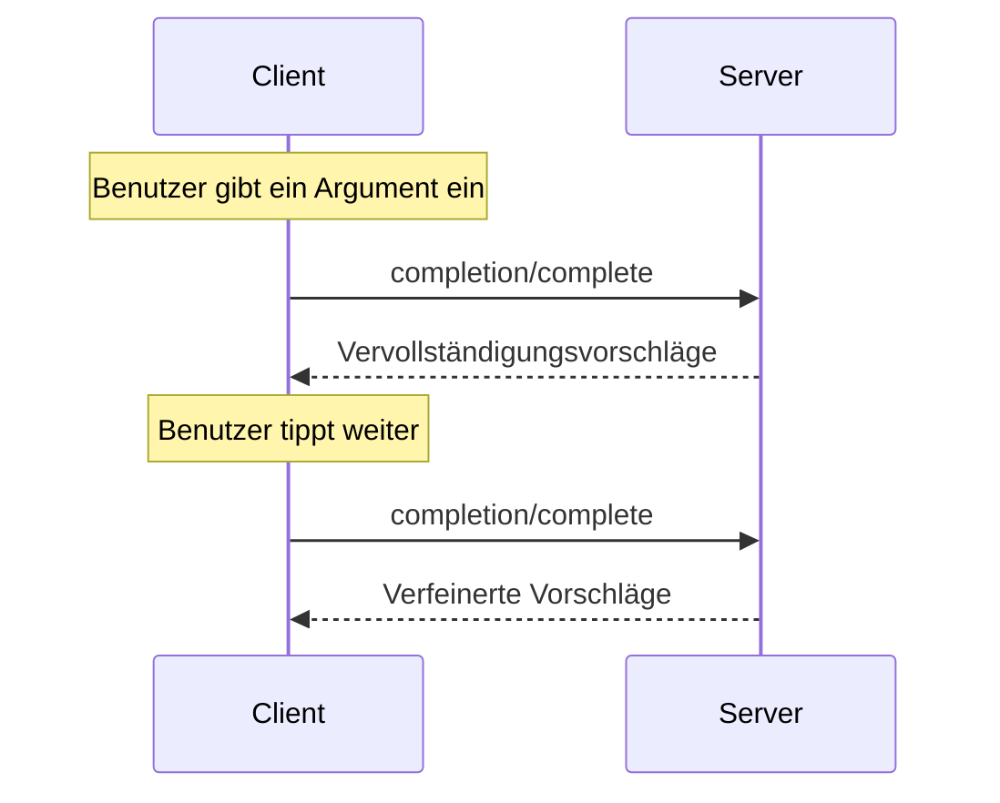

<div id="enable-section-numbers" />

<Info>**Protokollrevision**: 2025-06-18</Info>

Das Model Context Protocol (MCP) stellt einen standardisierten Weg bereit, damit Server Autovervollständigungsvorschläge für Argumente in Prompts und Ressourcen-URIs anbieten können. Dadurch werden umfassende, IDE-ähnliche Benutzererlebnisse möglich, bei denen Nutzer kontextbezogene Vorschläge erhalten, während sie Argumentwerte eingeben.

<div id="user-interaction-model">
  ## Benutzerinteraktionsmodell
</div>

Completion im MCP ist darauf ausgelegt, interaktive Nutzererlebnisse ähnlich der Codevervollständigung in IDEs zu unterstützen.

Anwendungen können beispielsweise Vervollständigungsvorschläge in einem Dropdown- oder Popup-Menü anzeigen, während Nutzer tippen, mit der Möglichkeit, verfügbare Optionen zu filtern und auszuwählen.

Implementierungen sind jedoch frei, Completion über jedes Interaktionsmuster bereitzustellen, das ihren Anforderungen entspricht — das Protokoll selbst schreibt kein spezifisches Benutzerinteraktionsmodell vor.

<div id="capabilities">
  ## Fähigkeiten
</div>

Server, die Completions unterstützen, **MÜSSEN** die Fähigkeit `completions` deklarieren:

```json
{
  "capabilities": {
    "completions": {}
  }
}
```

<div id="protocol-messages">
  ## Protokollnachrichten
</div>

<div id="requesting-completions">
  ### Abrufen von Vervollständigungen
</div>

Um Vervollständigungsvorschläge zu erhalten, senden Clients eine `completion/complete`-Anfrage und geben über einen Referenztyp an, was vervollständigt werden soll:

**Anfrage:**

```json
{
  "jsonrpc": "2.0",
  "id": 1,
  "method": "completion/complete",
  "params": {
    "ref": {
      "type": "ref/prompt",
      "name": "code_review"
    },
    "argument": {
      "name": "language",
      "value": "py"
    }
  }
}
```

**Antwort:**

```json
{
  "jsonrpc": "2.0",
  "id": 1,
  "result": {
    "completion": {
      "values": ["python", "pytorch", "pyside"],
      "total": 10,
      "hasMore": true
    }
  }
}
```

Bei Prompts oder URI-Vorlagen mit mehreren Argumenten sollten Clients vorherige Vervollständigungen im Objekt `context.arguments` einschließen, um Kontext für nachfolgende Anfragen bereitzustellen.

**Anfrage:**

```json
{
  "jsonrpc": "2.0",
  "id": 1,
  "method": "completion/complete",
  "params": {
    "ref": {
      "type": "ref/prompt",
      "name": "code_review"
    },
    "argument": {
      "name": "framework",
      "value": "fla"
    },
    "context": {
      "arguments": {
        "language": "python"
      }
    }
  }
}
```

**Antwort:**

```json
{
  "jsonrpc": "2.0",
  "id": 1,
  "result": {
    "completion": {
      "values": ["flask"],
      "total": 1,
      "hasMore": false
    }
  }
}
```

<div id="reference-types">
  ### Referenztypen
</div>

Das Protokoll unterstützt zwei Arten von Abschlussreferenzen:

| Typ            | Beschreibung                         | Beispiel                                             |
| -------------- | ------------------------------------ | ---------------------------------------------------- |
| `ref/prompt`   | Verweist auf einen Prompt per Name   | `{"type": "ref/prompt", "name": "code_review"}`     |
| `ref/resource` | Verweist auf eine Ressourcen-URI     | `{"type": "ref/resource", "uri": "file:///{path}"}` |

<div id="completion-results">
  ### Completion-Ergebnisse
</div>

Server geben ein nach Relevanz sortiertes Array von Completion-Werten zurück, mit:

- Maximal 100 Einträgen pro Antwort
- Optionaler Angabe der Gesamtzahl verfügbarer Treffer
- Booleschem Wert, der angibt, ob weitere Ergebnisse vorhanden sind

<div id="message-flow">
  ## Nachrichtenfluss
</div>



<div id="data-types">
  ## Datentypen
</div>

<div id="completerequest">
  ### CompleteRequest
</div>

- `ref`: Eine `PromptReference` oder `ResourceReference`
- `argument`: Objekt mit:
  - `name`: Argumentname
  - `value`: Aktueller Wert
- `context`: Objekt mit:
  - `arguments`: Eine Abbildung bereits aufgelöster Argumentnamen auf ihre Werte.

<div id="completeresult">
  ### CompleteResult
</div>

- `completion`: Objekt mit:
  - `values`: Array von Vorschlägen (max. 100)
  - `total`: Optionale Gesamtzahl der Treffer
  - `hasMore`: Hinweis auf weitere Ergebnisse

<div id="error-handling">
  ## Fehlerbehandlung
</div>

Server **SOLLTEN** standardisierte JSON-RPC-Fehler für gängige Fehlerfälle zurückgeben:

- Methode nicht gefunden: `-32601` (Funktionalität nicht unterstützt)
- Ungültiger Prompt-Name: `-32602` (Ungültige Parameter)
- Fehlende erforderliche Argumente: `-32602` (Ungültige Parameter)
- Interner Fehler: `-32603` (Interner Fehler)

<div id="implementation-considerations">
  ## Implementierungsüberlegungen
</div>

1. Server **SOLLTEN**:
   - Vorschläge nach Relevanz sortiert zurückgeben
   - Fuzzy-Matching dort implementieren, wo es sinnvoll ist
   - Abschlussanfragen mit einer Rate Limitierung versehen
   - Alle Eingaben validieren

2. Clients **SOLLTEN**:
   - Schnelle Abschlussanfragen entprellen (debouncen)
   - Abschlussergebnisse dort zwischenspeichern, wo es sinnvoll ist
   - Fehlende oder teilweise Ergebnisse robust behandeln

<div id="security">
  ## Sicherheit
</div>

Implementierungen MÜSSEN:

- Alle Completion-Eingaben validieren
- Angemessenes Rate-Limiting implementieren
- Den Zugriff auf sensible Vorschläge steuern
- Offenlegung von Informationen durch Completions verhindern