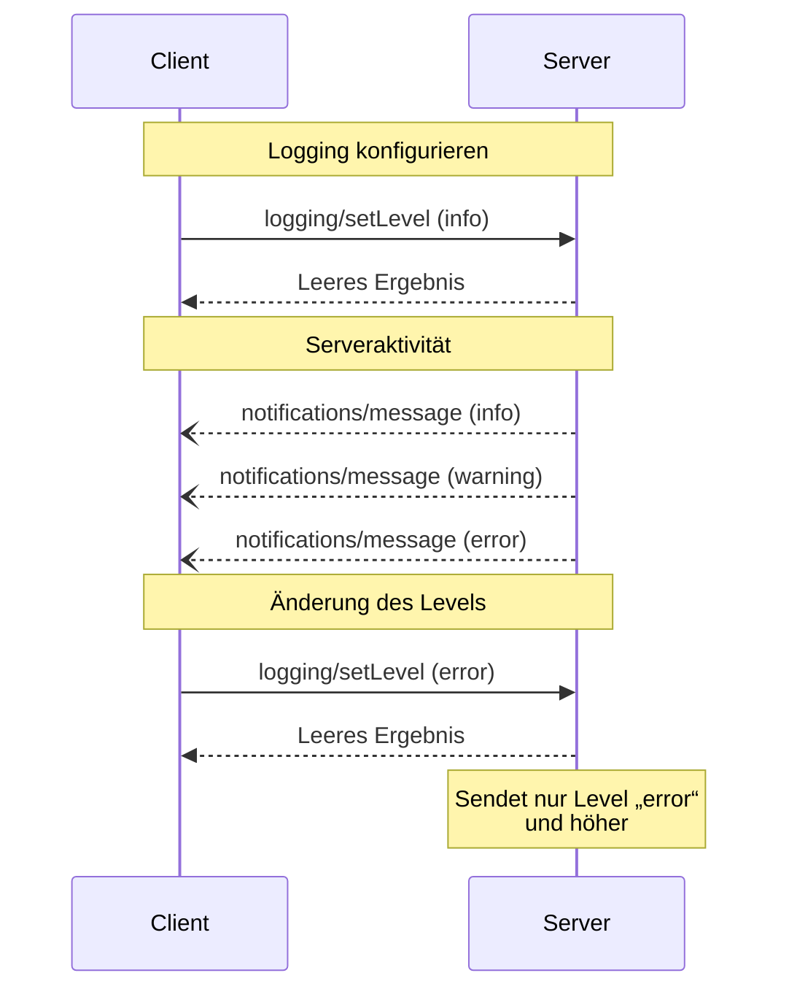

<div id="enable-section-numbers" />

<Info>**Protokollrevision**: 2025-06-18</Info>

Das Model Context Protocol (MCP) bietet eine standardisierte Möglichkeit für Server, strukturierte Protokollmeldungen an Clients zu senden. Clients können die Protokollausgabe steuern, indem sie minimale Protokollstufen festlegen. Server senden dabei Benachrichtigungen mit Schweregraden, optionalen Loggernamen und beliebigen JSON-serialisierbaren Daten.

<div id="user-interaction-model">
  ## Modell der Benutzerinteraktion
</div>

Implementierungen können das Logging über jedes Schnittstellenmuster bereitstellen, das ihren
Bedürfnissen entspricht—das Protokoll selbst schreibt kein bestimmtes Modell der Benutzerinteraktion vor.

<div id="capabilities">
  ## Fähigkeiten
</div>

Server, die Benachrichtigungen mit Protokollmeldungen ausgeben, **MÜSSEN** die Fähigkeit `logging` deklarieren:

```json
{
  "capabilities": {
    "logging": {}
  }
}
```

<div id="log-levels">
  ## Protokollstufen
</div>

Das Protokoll folgt den standardmäßigen Syslog-Schweregraden gemäß
[RFC 5424](https://datatracker.ietf.org/doc/html/rfc5424#section-6.2.1):

| Stufe     | Beschreibung                       | Beispielanwendungsfall        |
| --------- | ---------------------------------- | ----------------------------- |
| debug     | Detaillierte Debug-Informationen   | Funktions-Ein-/Austritt       |
| info      | Allgemeine Informationsmeldungen   | Fortschrittsmeldungen         |
| notice    | Normale, aber wichtige Ereignisse  | Konfigurationsänderungen      |
| warning   | Warnzustände                       | Nutzung veralteter Funktionen |
| error     | Fehlerzustände                     | Fehlgeschlagene Vorgänge      |
| critical  | Kritische Zustände                 | Ausfälle von Systemkomponenten|
| alert     | Es muss sofort gehandelt werden    | Datenkorruption erkannt       |
| emergency | System ist unbenutzbar             | Vollständiger Systemausfall   |

<div id="protocol-messages">
  ## Protokollnachrichten
</div>

<div id="setting-log-level">
  ### Protokollebene festlegen
</div>

Um die minimale Protokollebene zu konfigurieren, **KÖNNEN** Clients eine `logging/setLevel`-Anfrage senden:

**Anfrage:**

```json
{
  "jsonrpc": "2.0",
  "id": 1,
  "method": "logging/setLevel",
  "params": {
    "level": "info"
  }
}
```

<div id="log-message-notifications">
  ### Benachrichtigungen zu Protokollmeldungen
</div>

Server senden Protokollmeldungen über `notifications/message`-Benachrichtigungen:

```json
{
  "jsonrpc": "2.0",
  "method": "notifications/message",
  "params": {
    "level": "error",
    "logger": "database",
    "data": {
      "error": "Connection failed",
      "details": {
        "host": "localhost",
        "port": 5432
      }
    }
  }
}
```

<div id="message-flow">
  ## Nachrichtenfluss
</div>



<div id="error-handling">
  ## Fehlerbehandlung
</div>

Server **SOLLTEN** standardmäßige JSON-RPC-Fehler für gängige Fehlerszenarien zurückgeben:

- Ungültige Loglevel-Angabe: `-32602` (Ungültige Parameter)
- Konfigurationsfehler: `-32603` (Interner Fehler)

<div id="implementation-considerations">
  ## Implementierungsaspekte
</div>

1. Server **SOLLTEN**:
   - Protokollnachrichten rate-limitieren
   - Relevanten Kontext im Datenfeld angeben
   - Konsistente Logger-Namen verwenden
   - Sensible Informationen entfernen

2. Clients **KÖNNEN**:
   - Protokollnachrichten in der UI anzeigen
   - Filterung/Suche für Protokolle implementieren
   - Schweregrade visuell darstellen
   - Protokollnachrichten dauerhaft speichern

<div id="security">
  ## Sicherheit
</div>

1. Protokollnachrichten **DÜRFEN NICHT** Folgendes enthalten:
   - Zugangsdaten oder Geheimnisse
   - Personenbezogene Daten
   - Interne Systemdetails, die Angriffe begünstigen könnten

2. Implementierungen **SOLLTEN**:
   - Nachrichten rate-limitieren
   - Alle Datenfelder validieren
   - Den Zugriff auf Protokolle kontrollieren
   - Auf sensible Inhalte überwachen