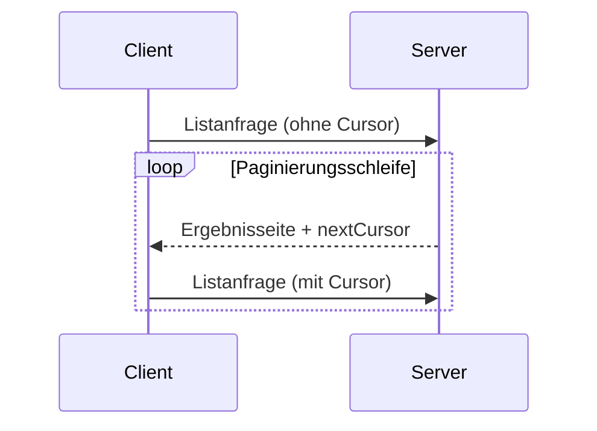

<div id="enable-section-numbers" />

<Info>**Protokollrevision**: 2025-06-18</Info>

Das Model Context Protocol (MCP) unterstützt die Seitennummerierung für Listenoperationen, die
große Ergebnismengen zurückgeben können. Dadurch können Server Ergebnisse in kleineren Teilen
statt auf einmal bereitstellen.

Seitennummerierung ist besonders wichtig bei Verbindungen zu externen Diensten über das
Internet, aber auch für lokale Integrationen nützlich, um Leistungsprobleme bei großen
Datensätzen zu vermeiden.

<div id="pagination-model">
  ## Paginierungsmodell
</div>

Die Paginierung in MCP verwendet einen undurchsichtigen, cursorbasierten Ansatz statt nummerierter Seiten.

- Der **Cursor** ist ein undurchsichtiger String-Token, der eine Position in der Ergebnismenge repräsentiert
- Die **Seitengröße** wird vom Server bestimmt, und Clients **DÜRFEN NICHT** von einer festen Seitengröße ausgehen

<div id="response-format">
  ## Antwortformat
</div>

Die Paginierung beginnt, sobald der Server eine **Antwort** sendet, die Folgendes enthält:

- Die aktuelle Ergebnisseite
- Ein optionales `nextCursor`-Feld, falls weitere Ergebnisse vorhanden sind

```json
{
  "jsonrpc": "2.0",
  "id": "123",
  "result": {
    "resources": [...],
    "nextCursor": "eyJwYWdlIjogM30="
  }
}
```

<div id="request-format">
  ## Anforderungsformat
</div>

Nachdem ein Cursor empfangen wurde, kann der Client die Paginierung _fortsetzen_, indem er eine Anfrage unter Einbeziehung dieses Cursors stellt:

```json
{
  "jsonrpc": "2.0",
  "method": "resources/list",
  "params": {
    "cursor": "eyJwYWdlIjogMn0="
  }
}
```

<div id="pagination-flow">
  ## Ablauf der Paginierung
</div>



<div id="operations-supporting-pagination">
  ## Operationen mit Unterstützung für die Seitennummerierung
</div>

Die folgenden MCP-Operationen unterstützen Seitennummerierung:

- `resources/list` - Verfügbare Ressourcen auflisten
- `resources/templates/list` - Ressourcen-Vorlagen auflisten
- `prompts/list` - Verfügbare Prompts auflisten
- `tools/list` - Verfügbare Werkzeuge auflisten

<div id="implementation-guidelines">
  ## Implementierungsrichtlinien
</div>

1. Server **SOLLEN**:
   - Stabile Cursor bereitstellen
   - Ungültige Cursor robust/fehlertolerant behandeln

2. Clients **SOLLEN**:
   - Ein fehlendes `nextCursor` als Ende der Ergebnisse behandeln
   - Sowohl paginierte als auch nicht paginierte Abläufe unterstützen

3. Clients **MÜSSEN** Cursor als undurchsichtige Token behandeln:
   - Keine Annahmen über das Cursorformat treffen
   - Cursor nicht zu parsen oder zu verändern versuchen
   - Cursor nicht über Sitzungen hinweg speichern

<div id="error-handling">
  ## Fehlerbehandlung
</div>

Ungültige Cursor **SOLLTEN** zu einem Fehler mit dem Code -32602 (Ungültige Parameter) führen.