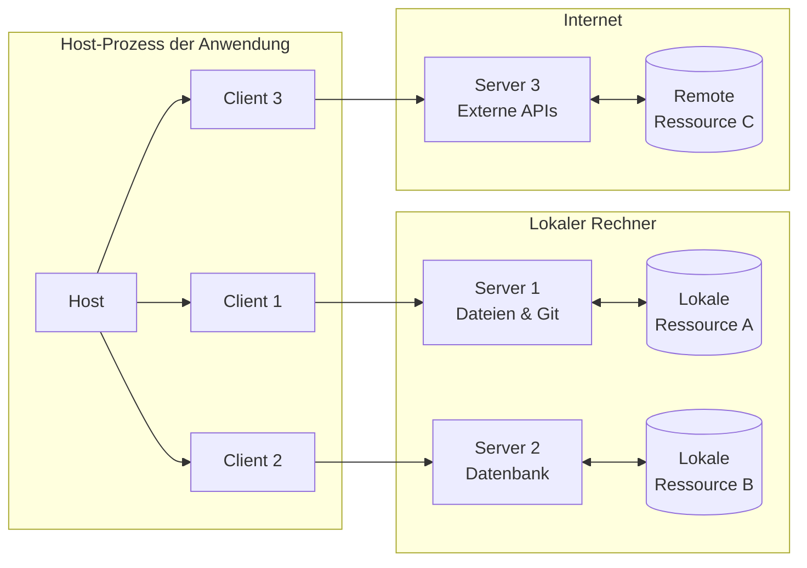
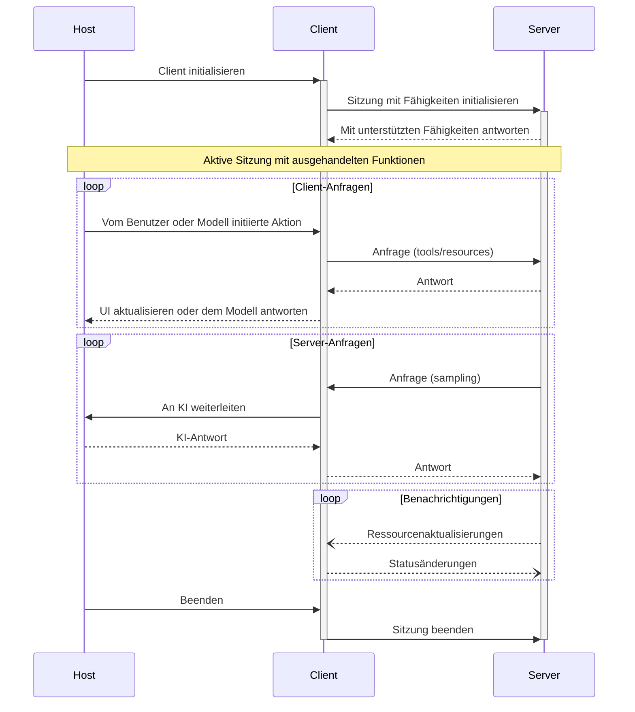

Das Model Context Protocol (MCP) folgt einer Client-Host-Server-Architektur, in der jeder Host mehrere Client-Instanzen betreiben kann. Diese Architektur ermöglicht es Nutzenden, KI-Funktionen anwendungsübergreifend zu integrieren, während klare Sicherheitsgrenzen gewahrt und Verantwortlichkeiten sauber getrennt werden. Auf Basis von JSON-RPC 2.0 bietet MCP ein zustandsbehaftetes Sitzungsprotokoll, das auf den Austausch von Kontext und die Koordination des Sampling zwischen Clients und Servern ausgerichtet ist.

  ## Zentrale Komponenten

  ### Host

Der Host-Prozess fungiert als Container und Koordinator:

* Erstellt und verwaltet mehrere Client-Instanzen
* Steuert Berechtigungen und Lebenszyklus von Client-Verbindungen
* Setzt Sicherheitsrichtlinien und Einwilligungsanforderungen durch
* Trifft Entscheidungen zur Benutzerautorisierung
* Koordiniert die Integration von KI/LLM sowie das Sampling
* Verwaltet die Aggregation von Kontexten über Clients hinweg

  ### Clients

Jeder Client wird vom MCP-Host erstellt und hält eine isolierte Serververbindung aufrecht:

* Stellt eine zustandsbehaftete Sitzung pro Server her
* Handhabt die Fähigkeitsaushandlung und den Austausch unterstützter Funktionen
* Leitet Protokollnachrichten bidirektional weiter
* Verwaltet Abonnements und Benachrichtigungen
* Gewährleistet Sicherheitsgrenzen zwischen Servern

Eine Host-Anwendung erstellt und verwaltet mehrere Clients, wobei jeder Client eine 1:1-Beziehung zu einem bestimmten Server hat.

  ### Server

Server stellen spezialisierte Kontexte und Fähigkeiten bereit:

* Stellen Ressourcen, Werkzeuge und Prompts über MCP-Primitiven bereit
* Arbeiten eigenständig mit klar abgegrenzten Verantwortlichkeiten
* Fordern Sampling über Client-Schnittstellen an
* Müssen Sicherheitsvorgaben einhalten
* Können lokale Prozesse oder entfernte Dienste sein

  ## Designprinzipien

MCP basiert auf mehreren zentralen Designprinzipien, die seine Architektur und
Implementierung leiten:

1. **Server sollten extrem einfach zu entwickeln sein**
   * Host-Anwendungen übernehmen die komplexe Orchestrierung
   * Server fokussieren sich auf spezifische, klar definierte Fähigkeiten
   * Einfache Schnittstellen minimieren den Implementierungsaufwand
   * Klare Trennung ermöglicht gut wartbaren Code

2. **Server sollten hochgradig komponierbar sein**
   * Jeder Server bietet fokussierte Funktionalität in Isolation
   * Mehrere Server lassen sich nahtlos kombinieren
   * Ein gemeinsames Protokoll ermöglicht Interoperabilität
   * Modulares Design unterstützt Erweiterbarkeit

3. **Server sollten weder den gesamten Gesprächsverlauf lesen können noch in andere
   Server „hineinsehen“**
   * Server erhalten nur die notwendigen Kontextinformationen
   * Der vollständige Gesprächsverlauf verbleibt beim Host
   * Jede Serververbindung bleibt isoliert
   * Interaktionen zwischen Servern werden vom Host gesteuert
   * Der Host-Prozess erzwingt Sicherheitsgrenzen

4. **Funktionen können schrittweise zu Servern und Clients hinzugefügt werden**
   * Das Kernprotokoll stellt die minimal erforderliche Funktionalität bereit
   * Zusätzliche Fähigkeiten können bei Bedarf ausgehandelt werden
   * Server und Clients entwickeln sich unabhängig weiter
   * Das Protokoll ist für zukünftige Erweiterungen ausgelegt
   * Abwärtskompatibilität bleibt erhalten

  ## Fähigkeitsaushandlung

Das Model Context Protocol verwendet ein fähigkeitsbasiertes Aushandlungssystem, bei dem Clients und
Server während der Initialisierung ihre unterstützten Funktionen explizit angeben. Die deklarierten
Fähigkeiten legen fest, welche Protokollfunktionen und -primitiven während einer Sitzung verfügbar sind.

* Server geben Fähigkeiten wie Ressourcensubscriptions, Werkzeugunterstützung und Prompt-
  Vorlagen an
* Clients geben Fähigkeiten wie Sampling-Unterstützung und Benachrichtigungsverarbeitung an
* Beide Parteien müssen die deklarierten Fähigkeiten während der gesamten Sitzung einhalten
* Zusätzliche Fähigkeiten können über Erweiterungen des Protokolls ausgehandelt werden

Jede Fähigkeit schaltet spezifische Protokollfunktionen für die Nutzung während der Sitzung frei. Zum
Beispiel:

* Implementierte [Serverfunktionen](/de/specification/draft/server) müssen in den
  Fähigkeiten des Servers angekündigt werden
* Das Senden von Benachrichtigungen zu Ressourcensubscriptions erfordert, dass der Server
  Subscription-Unterstützung deklariert
* Die Werkzeugausführung erfordert, dass der Server Werkzeugfähigkeiten deklariert
* [Sampling](/de/specification/draft/client) erfordert, dass der Client Unterstützung in seinen
  Fähigkeiten deklariert

Diese Fähigkeitsaushandlung stellt sicher, dass Clients und Server ein klares Verständnis der
unterstützten Funktionalität haben und gleichzeitig die Erweiterbarkeit des Protokolls gewahrt bleibt.