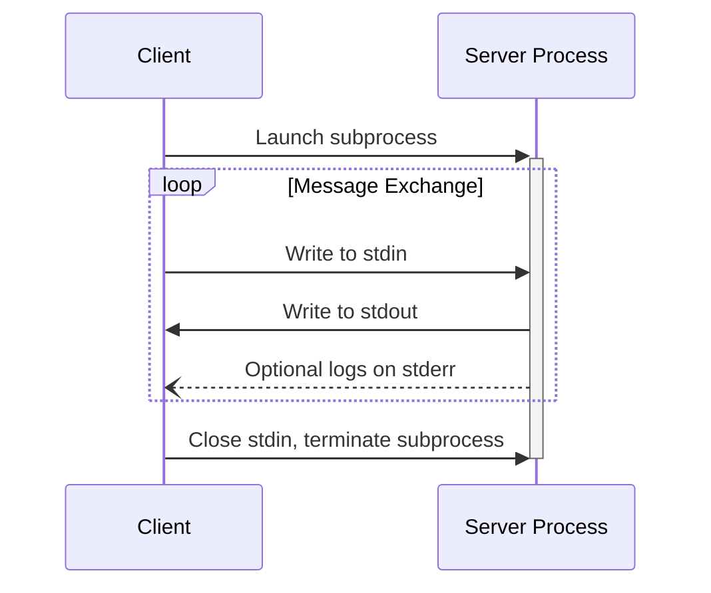
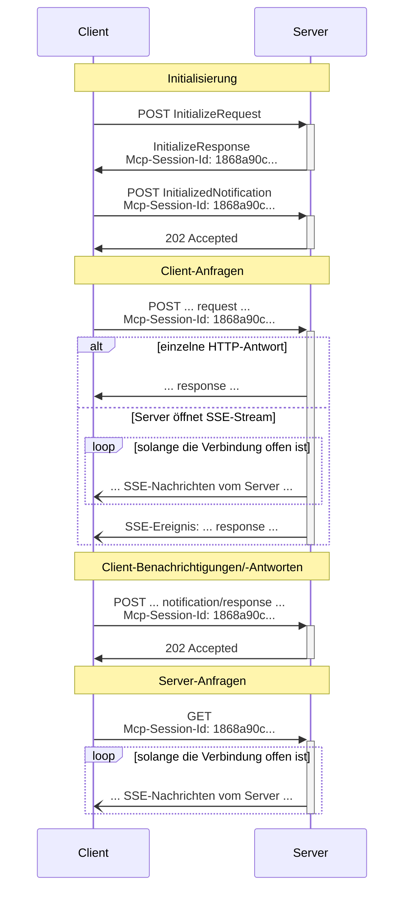

<Info>**Protokollrevision**: Entwurf</Info>

MCP verwendet JSON-RPC zur Kodierung von Nachrichten. JSON-RPC-Nachrichten **MÜSSEN** in UTF-8 codiert sein.

Das Protokoll definiert derzeit zwei standardisierte Transportmechanismen für die Client-Server-Kommunikation:

1. [stdio](#stdio), Kommunikation über Standard-Eingabe und Standard-Ausgabe
2. [Streamable HTTP](#streamable-http)

Clients **SOLLEN** stdio nach Möglichkeit unterstützen.

Es ist auch möglich, dass Clients und Server [benutzerdefinierte Transporte](#custom-transports) in pluggabler Form implementieren.

  ## stdio

Im **stdio**-Transport:

* Der Client startet den MCP-Server als Unterprozess.
* Der Server liest JSON-RPC-2.0-Nachrichten von seiner Standardeingabe (`stdin`) und sendet Nachrichten
  an seine Standardausgabe (`stdout`).
* Nachrichten sind einzelne JSON-RPC-Anfragen, Benachrichtigungen oder Antworten.
* Nachrichten werden durch Zeilenumbrüche getrennt und **DÜRFEN KEINE** eingebetteten Zeilenumbrüche enthalten.
* Der Server **DARF** UTF-8-Zeichenketten zu seiner Standardfehlerausgabe (`stderr`) für Protokollierungszwecke schreiben. Clients **DÜRFEN** diese Protokollierung erfassen, weiterleiten oder ignorieren.
* Der Server **DARF NICHT** irgendetwas auf `stdout` schreiben, das keine gültige MCP-Nachricht ist.
* Der Client **DARF NICHT** irgendetwas an das `stdin` des Servers schreiben, das keine gültige MCP-
  Nachricht ist.

  ## Streamable HTTP

<Info>
  Dies ersetzt den [HTTP+SSE-Transport](/de/specification/2024-11-05/basic/transports#http-with-sse) aus der Protokollversion 2024-11-05. Siehe unten den Leitfaden zur [Rückwärtskompatibilität](#backwards-compatibility).
</Info>

Beim **Streamable HTTP**-Transport läuft der Server als eigenständiger Prozess, der mehrere Client-Verbindungen bedienen kann. Dieser Transport verwendet HTTP-POST- und -GET-Anfragen. Server können optional
[Server-Sent Events](https://en.wikipedia.org/wiki/Server-sent_events) (SSE) nutzen, um mehrere Servernachrichten zu streamen. Dies ermöglicht einfache MCP-Server ebenso wie funktionsreichere Server, die Streaming sowie Server-zu-Client-Benachrichtigungen und -Anfragen unterstützen.

Der Server **MUSS** einen einzelnen HTTP-Endpunktpfad bereitstellen (nachfolgend als **MCP-Endpunkt** bezeichnet), der sowohl POST- als auch GET-Methoden unterstützt. Beispielsweise könnte dies eine URL wie `https://example.com/mcp` sein.

  #### Sicherheitswarnung

Bei der Implementierung des Streamable HTTP-Transports:

1. Server **MÜSSEN** den `Origin`-Header bei allen eingehenden Verbindungen prüfen, um DNS-Rebinding-Angriffe zu verhindern.
2. Bei lokalem Betrieb SOLLTEN Server nur an localhost (127.0.0.1) gebunden werden statt an alle Netzwerkschnittstellen (0.0.0.0).
3. Server SOLLTEN für alle Verbindungen eine ordnungsgemäße Authentifizierung implementieren.

Ohne diese Schutzmaßnahmen könnten Angreifer DNS Rebinding nutzen, um von entfernten Websites aus mit lokalen MCP-Servern zu interagieren.

  ### Senden von Nachrichten an den Server

Jede vom Client gesendete JSON-RPC-Nachricht **MUSS** eine neue HTTP-POST-Anfrage an den
MCP-Endpunkt sein.

1. Der Client **MUSS** HTTP POST verwenden, um JSON-RPC-Nachrichten an den MCP-Endpunkt zu senden.
2. Der Client **MUSS** einen `Accept`-Header angeben, der sowohl `application/json` als auch
   `text/event-stream` als unterstützte Inhaltstypen enthält.
3. Der Rumpf der POST-Anfrage **MUSS** genau eine JSON-RPC-*request*, *notification* oder *response* enthalten.
4. Wenn die Eingabe eine JSON-RPC-*response* oder *notification* ist:
   * Wenn der Server die Eingabe akzeptiert, **MUSS** der Server den HTTP-Statuscode 202
     Accepted ohne Rumpf zurückgeben.
   * Wenn der Server die Eingabe nicht akzeptieren kann, **MUSS** er einen HTTP-Fehlerstatuscode
     zurückgeben (z. B. 400 Bad Request). Der HTTP-Antwortkörper **KANN** aus einer JSON-RPC-*error
     response* bestehen, die keine `id` enthält.
5. Wenn die Eingabe eine JSON-RPC-*request* ist, **MUSS** der Server entweder
   `Content-Type: text/event-stream` zurückgeben, um einen SSE-Stream zu initiieren, oder
   `Content-Type: application/json`, um ein einzelnes JSON-Objekt zurückzugeben. Der Client **MUSS**
   beide Fälle unterstützen.
6. Wenn der Server einen SSE-Stream initiiert:
   * Der SSE-Stream **SOLLTE** schließlich eine JSON-RPC-*response* für die
     im POST-Rumpf gesendete JSON-RPC-*request* enthalten.
   * Der Server **KANN** JSON-RPC-*requests* und *notifications* senden, bevor er die
     JSON-RPC-*response* sendet. Diese Nachrichten **SOLLTEN** sich auf die auslösende Client-
     *request* beziehen.
   * Der Server **SOLLTE NICHT** den SSE-Stream schließen, bevor er die JSON-RPC-*response*
     für die empfangene JSON-RPC-*request* gesendet hat, es sei denn, die [Session](#session-management)
     läuft ab.
   * Nachdem die JSON-RPC-*response* gesendet wurde, **SOLLTE** der Server den SSE-Stream schließen.
   * Eine Trennung der Verbindung **KANN** jederzeit auftreten (z. B. aufgrund von Netzwerkbedingungen).
     Daher:
     * Eine Trennung **SOLLTE NICHT** als Abbruch der Anfrage durch den Client interpretiert werden.
     * Zum Abbrechen **SOLLTE** der Client ausdrücklich eine MCP-`CancelledNotification` senden.
     * Um Nachrichtenverlust durch Verbindungsabbrüche zu vermeiden, **KANN** der Server den Stream
       [wiederaufnehmbar](#resumability-and-redelivery) machen.

  ### Auf Nachrichten vom Server lauschen

1. Der Client **KANN** eine HTTP-GET-Anfrage an den MCP-Endpunkt senden. Dies kann verwendet werden, um einen
   SSE-Stream zu öffnen, sodass der Server mit dem Client kommunizieren kann, ohne dass der Client zuvor
   Daten per HTTP-POST sendet.
2. Der Client **MUSS** einen `Accept`-Header einschließen, der `text/event-stream` als
   unterstützten Medientyp aufführt.
3. Der Server **MUSS** entweder `Content-Type: text/event-stream` als Antwort auf
   diese HTTP-GET-Anfrage zurückgeben oder andernfalls HTTP 405 Method Not Allowed, was darauf hinweist, dass der Server
   an diesem Endpunkt keinen SSE-Stream anbietet.
4. Wenn der Server einen SSE-Stream initiiert:
   * Der Server **KANN** JSON-RPC-*Requests* und *Benachrichtigungen* über den Stream senden.
   * Diese Nachrichten **SOLLEN** in keinem Zusammenhang mit einem gleichzeitig laufenden JSON-RPC-
     *Request* des Clients stehen.
   * Der Server **DARF KEINE** JSON-RPC-*Response* über den Stream senden, **es sei denn**, er
     [nimmt](#resumability-and-redelivery) einen mit einer früheren Client-Anfrage
     verknüpften Stream wieder auf.
   * Der Server **KANN** den SSE-Stream jederzeit schließen.
   * Der Client **KANN** den SSE-Stream jederzeit schließen.

  ### Mehrere Verbindungen

1. Der Client **DARF** gleichzeitig mit mehreren SSE-Streams verbunden bleiben.
2. Der Server **MUSS** jede seiner JSON-RPC-Nachrichten genau über einen der verbundenen
   Streams senden; das heißt, er **DARF NICHT** dieselbe Nachricht über mehrere Streams verbreiten.
   * Das Risiko eines Nachrichtenverlusts **KANN** verringert werden, indem der Stream
     [wiederaufnehmbar](#resumability-and-redelivery) gemacht wird.

  ### Wiederaufnahme und erneute Zustellung

Um das Fortsetzen unterbrochener Verbindungen und die erneute Zustellung von Nachrichten zu unterstützen, die andernfalls verloren gehen könnten:

1. Server **KÖNNEN** ihren SSE-Events ein `id`-Feld hinzufügen, wie im
   [SSE-Standard](https://html.spec.whatwg.org/multipage/server-sent-events.html#event-stream-interpretation) beschrieben.
   * Falls vorhanden, **MUSS** die ID global eindeutig über alle Streams innerhalb dieser
     [Sitzung](#session-management) sein — oder über alle Streams mit diesem spezifischen Client, wenn keine Sitzungsverwaltung verwendet wird.
2. Wenn der Client nach einer unterbrochenen Verbindung fortsetzen möchte, **SOLLTE** er eine HTTP-
   GET-Anfrage an den MCP-Endpunkt senden und den
   [`Last-Event-ID`](https://html.spec.whatwg.org/multipage/server-sent-events.html#the-last-event-id-header)-
   Header hinzufügen, um die letzte empfangene Ereignis-ID anzugeben.
   * Der Server **KANN** diesen Header verwenden, um Nachrichten erneut zu senden, die nach der letzten Ereignis-ID gesendet worden wären, *auf dem Stream, der getrennt wurde*, und den Stream von diesem Punkt an fortzusetzen.
   * Der Server **DARF NICHT** Nachrichten erneut senden, die auf einem anderen Stream zugestellt worden wären.

Anders ausgedrückt sollten diese Ereignis-IDs von Servern *pro Stream* vergeben werden, um als Cursor innerhalb dieses jeweiligen Streams zu dienen.

  ### Sitzungsverwaltung

Eine MCP-„Sitzung“ besteht aus logisch zusammenhängenden Interaktionen zwischen einem Client und einem
Server und beginnt mit der [Initialisierungsphase](/de/specification/draft/basic/lifecycle). Zur Unterstützung von
Servern, die zustandsbehaftete Sitzungen einrichten möchten:

1. Ein Server, der den Streamable HTTP-Transport verwendet, **KANN** zur
   Initialisierung eine Sitzungs-ID vergeben, indem er sie in einem `Mcp-Session-Id`-Header der HTTP-
   Antwort mit dem `InitializeResult` zurückgibt.
   * Die Sitzungs-ID **SOLLTE** global eindeutig und kryptografisch sicher sein (z. B. eine
     sicher generierte UUID, ein JWT oder ein kryptografischer Hash).
   * Die Sitzungs-ID **MUSS** ausschließlich sichtbare ASCII-Zeichen enthalten (Bereich 0x21 bis
     0x7E).
2. Wenn während der Initialisierung eine `Mcp-Session-Id` vom Server zurückgegeben wird, **MÜSSEN** Clients, die
   den Streamable HTTP-Transport verwenden, diese in den `Mcp-Session-Id`-Header
   all ihrer nachfolgenden HTTP-Anfragen aufnehmen.
   * Server, die eine Sitzungs-ID erfordern, **SOLLEN** auf Anfragen ohne
     `Mcp-Session-Id`-Header (außer der Initialisierung) mit HTTP 400 Bad Request antworten.
3. Der Server **KANN** die Sitzung jederzeit beenden; danach **MUSS** er auf Anfragen,
   die diese Sitzungs-ID enthalten, mit HTTP 404 Not Found antworten.
4. Wenn ein Client als Antwort auf eine Anfrage mit
   `Mcp-Session-Id` einen HTTP 404 erhält, **MUSS** er eine neue Sitzung starten, indem er eine neue `InitializeRequest`
   ohne Sitzungs-ID sendet.
5. Clients, die eine bestimmte Sitzung nicht mehr benötigen (z. B. weil der Nutzer die
   Client-Anwendung verlässt), **SOLLEN** ein HTTP DELETE an den MCP-Endpunkt mit dem
   `Mcp-Session-Id`-Header senden, um die Sitzung explizit zu beenden.
   * Der Server **KANN** auf diese Anfrage mit HTTP 405 Method Not Allowed antworten
     und damit anzeigen, dass der Server das Beenden von Sitzungen durch Clients nicht erlaubt.

  ### Sequenzdiagramm

  ### Protokollversions-Header

Bei Verwendung von HTTP MUSS der Client den HTTP-Header `MCP-Protocol-Version: <protocol-version>` in allen nachfolgenden Anfragen an den MCP-Server senden, damit der MCP-Server entsprechend der MCP-Protokollversion antworten kann.

Zum Beispiel: `MCP-Protocol-Version: 2025-06-18`

Die vom Client gesendete Protokollversion SOLLTE der [während der Initialisierung ausgehandelten](/de/specification/draft/basic/lifecycle#version-negotiation) entsprechen.

Zur Abwärtskompatibilität gilt: Wenn der Server keinen `MCP-Protocol-Version`-Header erhält und keine andere Möglichkeit hat, die Version zu identifizieren – etwa indem er sich auf die während der Initialisierung ausgehandelte Protokollversion stützt –, SOLLTE der Server die Protokollversion `2025-03-26` annehmen.

Erhält der Server eine Anfrage mit einer ungültigen oder nicht unterstützten `MCP-Protocol-Version`, MUSS er mit `400 Bad Request` antworten.

  ### Abwärtskompatibilität

Clients und Server können die Abwärtskompatibilität mit dem veralteten [HTTP+SSE-Transport](/de/specification/2024-11-05/basic/transports#http-with-sse) (seit
Protokollversion 2024-11-05) wie folgt aufrechterhalten:

**Server**, die ältere Clients unterstützen möchten, sollten:

* Sowohl die SSE- als auch die POST-Endpunkte des alten Transports weiterhin hosten, parallel zu dem
  neuen „MCP-Endpunkt“, der für den Streamable HTTP-Transport definiert ist.
  * Es ist auch möglich, den alten POST-Endpunkt und den neuen MCP-Endpunkt zu kombinieren, dies kann jedoch
    unnötige Komplexität mit sich bringen.

**Clients**, die ältere Server unterstützen möchten, sollten:

1. Eine MCP-Server-URL vom Benutzer akzeptieren, die entweder auf einen Server mit
   altem oder neuem Transport verweisen kann.
2. Versuchen, eine `InitializeRequest` per POST an die Server-URL zu senden, mit einem `Accept`-Header wie
   oben definiert:
   * Wenn dies gelingt, kann der Client davon ausgehen, dass es sich um einen Server handelt, der den neuen
     Streamable HTTP-Transport unterstützt.
   * Wenn dies mit einem HTTP-Statuscode aus dem 4xx-Bereich fehlschlägt (z. B. 405 Method Not Allowed oder 404 Not
     Found):
     * Eine GET-Anfrage an die Server-URL senden, in der Erwartung, dass dadurch ein SSE-Stream geöffnet wird
       und ein `endpoint`-Event als erstes Ereignis zurückgegeben wird.
     * Wenn das `endpoint`-Event eintrifft, kann der Client davon ausgehen, dass dies ein Server ist, der den
       alten HTTP+SSE-Transport verwendet, und sollte diesen Transport für alle weiteren
       Kommunikationsvorgänge nutzen.

  ## Benutzerdefinierte Transporte

Clients und Server **DÜRFEN** zusätzliche benutzerdefinierte Transportmechanismen implementieren, um ihren spezifischen Anforderungen gerecht zu werden. Das Protokoll ist transportagnostisch und kann über jeden Kommunikationskanal implementiert werden, der bidirektionalen Nachrichtenaustausch unterstützt.

Implementierende, die sich dafür entscheiden, benutzerdefinierte Transporte zu unterstützen, **MÜSSEN** sicherstellen, dass sie das JSON-RPC-2.0-Nachrichtenformat und die von MCP definierten Anforderungen an den Lebenszyklus beibehalten. Benutzerdefinierte Transporte **SOLLTEN** ihre konkreten Verfahren zur Verbindungsaufnahme und zum Nachrichtenaustausch dokumentieren, um die Interoperabilität zu fördern.