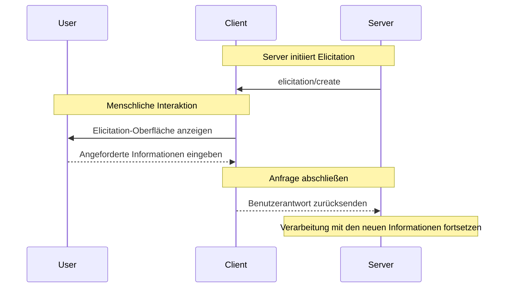

<div id="enable-section-numbers" />

<Info>**Protokollrevision**: Entwurf</Info>

<Note>
  Elicitation wurde in dieser Version der MCP-Spezifikation neu eingeführt, und das Design kann sich in zukünftigen Protokollversionen weiterentwickeln.
</Note>

Das Model Context Protocol (MCP) bietet eine standardisierte Möglichkeit für Server, während Interaktionen über den Client zusätzliche Informationen von Nutzerinnen und Nutzern anzufordern. Dieser Ablauf ermöglicht es Clients, die Kontrolle über Nutzerinteraktionen und die Weitergabe von Daten zu behalten, während Server die notwendigen Informationen dynamisch erfassen können.
Server fordern mit JSON-Schemas strukturierte Daten von Nutzerinnen und Nutzern an, um Antworten zu validieren.

<div id="user-interaction-model">
  ## Benutzerinteraktionsmodell
</div>

Elicitation in MCP ermöglicht es Servern, interaktive Workflows umzusetzen, indem Benutzereingaben *verschachtelt* innerhalb anderer MCP-Serverfunktionen angefordert werden können.

Implementierungen können Elicitation über jedes geeignete Schnittstellenmuster bereitstellen—das Protokoll selbst schreibt kein spezifisches Benutzerinteraktionsmodell vor.

<Warning>
  Aus Gründen von Vertrauen und Sicherheit:

  * Server **DÜRFEN NICHT** Elicitation verwenden, um nach sensiblen Informationen zu fragen.

  Anwendungen **SOLLTEN**:

  * Eine Benutzeroberfläche bereitstellen, die klar erkennbar macht, welcher Server Informationen anfordert
  * Nutzerinnen und Nutzern ermöglichen, ihre Antworten vor dem Senden zu überprüfen und zu ändern
  * Die Privatsphäre der Nutzerinnen und Nutzer respektieren und klare Optionen zum Ablehnen und Abbrechen anbieten
</Warning>

<div id="capabilities">
  ## Fähigkeiten
</div>

Clients, die Elicitation unterstützen, **MÜSSEN** während der
[Initialisierung](/de/specification/draft/basic/lifecycle#initialization) die Fähigkeit `elicitation` deklarieren:

```json
{
  "capabilities": {
    "elicitation": {}
  }
}
```

<div id="protocol-messages">
  ## Protokollnachrichten
</div>

<div id="creating-elicitation-requests">
  ### Erstellen von Elicitation-Anfragen
</div>

Um Informationen von einem Nutzer anzufordern, senden Server eine `elicitation/create`-Anfrage:

<div id="simple-text-request">
  #### Einfache Textanforderung
</div>

**Anfrage:**

```json
{
  "jsonrpc": "2.0",
  "id": 1,
  "method": "elicitation/create",
  "params": {
    "message": "Please provide your GitHub username",
    "requestedSchema": {
      "type": "object",
      "properties": {
        "name": {
          "type": "string"
        }
      },
      "required": ["name"]
    }
  }
}
```

**Antwort:**

```json
{
  "jsonrpc": "2.0",
  "id": 1,
  "result": {
    "action": "accept",
    "content": {
      "name": "octocat"
    }
  }
}
```

<div id="structured-data-request">
  #### Anforderung strukturierter Daten
</div>

**Anfrage:**

```json
{
  "jsonrpc": "2.0",
  "id": 2,
  "method": "elicitation/create",
  "params": {
    "message": "Please provide your contact information",
    "requestedSchema": {
      "type": "object",
      "properties": {
        "name": {
          "type": "string",
          "description": "Ihr vollständiger Name"
        },
        "email": {
          "type": "string",
          "format": "email",
          "description": "Ihre E‑Mail-Adresse"
        },
        "age": {
          "type": "number",
          "minimum": 18,
          "description": "Ihr Alter"
        }
      },
      "required": ["name", "email"]
    }
  }
}
```

**Antwort:**

```json
{
  "jsonrpc": "2.0",
  "id": 2,
  "result": {
    "action": "accept",
    "content": {
      "name": "Monalisa Octocat",
      "email": "octocat@github.com",
      "age": 30
    }
  }
}
```

**Beispiel für eine Ablehnungsantwort:**

```json
{
  "jsonrpc": "2.0",
  "id": 2,
  "result": {
    "action": "decline"
  }
}
```

**Beispiel für eine Abbruchantwort:**

```json
{
  "jsonrpc": "2.0",
  "id": 2,
  "result": {
    "action": "cancel"
  }
}
```

<div id="message-flow">
  ## Nachrichtenfluss
</div>



<div id="request-schema">
  ## Anfrageschema
</div>

Das Feld `requestedSchema` ermöglicht Servern, die Struktur der erwarteten Antwort mit einem eingeschränkten Teil von JSON Schema festzulegen. Um die Benutzererfahrung im Client zu vereinfachen, sind Elicitation-Schemata auf flache Objekte mit ausschließlich primitiven Eigenschaften beschränkt:

```json
"requestedSchema": {
  "type": "object",
  "properties": {
    "propertyName": {
      "type": "string",
      "title": "Anzeigename",
      "description": "Beschreibung der Eigenschaft"
    },
    "anotherProperty": {
      "type": "number",
      "minimum": 0,
      "maximum": 100
    }
  },
  "required": ["propertyName"]
}
```

<div id="supported-schema-types">
  ### Unterstützte Schematypen
</div>

Das Schema ist auf folgende primitive Typen beschränkt:

1. **String-Schema**

   ```json
   {
     "type": "string",
     "title": "Display Name",
     "description": "Description text",
     "minLength": 3,
     "maxLength": 50,
     "pattern": "^[A-Za-z]+$",
     "format": "email",
     "default": "user@example.com"
   }
   ```

   Unterstützte Formate: `email`, `uri`, `date`, `date-time`

2. **Number-Schema**

   ```json
   {
     "type": "number", // oder "integer"
     "title": "Display Name",
     "description": "Description text",
     "minimum": 0,
     "maximum": 100,
     "default": 50
   }
   ```

3. **Boolean-Schema**

   ```json
   {
     "type": "boolean",
     "title": "Display Name",
     "description": "Description text",
     "default": false
   }
   ```

4. **Enum-Schema**
   ```json
   {
     "type": "string",
     "title": "Display Name",
     "description": "Description text",
     "enum": ["option1", "option2", "option3"],
     "enumNames": ["Option 1", "Option 2", "Option 3"],
     "default": "option1"
   }
   ```

Clients können dieses Schema verwenden, um:

1. Geeignete Eingabeformulare zu generieren
2. Benutzereingaben vor dem Senden zu validieren
3. Nutzerinnen und Nutzern bessere Orientierung zu geben

Alle primitiven Typen unterstützen optionale Standardwerte, um sinnvolle Ausgangswerte bereitzustellen. Clients, die Standardwerte unterstützen, SOLLTEN Formularfelder mit diesen Werten vorab ausfüllen.

Beachten Sie, dass komplex verschachtelte Strukturen, Arrays von Objekten und andere erweiterte JSON‑Schema-Funktionen bewusst nicht unterstützt werden, um die Nutzererfahrung im Client zu vereinfachen.

<div id="response-actions">
  ## Antwortaktionen
</div>

Elicitation-Antworten verwenden ein Drei-Aktionen-Modell, um unterschiedliche Benutzeraktionen klar zu unterscheiden:

```json
{
  "jsonrpc": "2.0",
  "id": 1,
  "result": {
    "action": "accept", // oder "decline" oder "cancel"
    "content": {
      "propertyName": "value",
      "anotherProperty": 42
    }
  }
}
```

Die drei Antwortaktionen sind:

1. **Accept** (`action: "accept"`): Der Benutzer hat ausdrücklich zugestimmt und mit Daten eingereicht
   * Das Feld `content` enthält die eingereichten Daten, die dem angeforderten Schema entsprechen
   * Beispiel: Der Benutzer klickte auf „Submit“, „OK“, „Confirm“ usw.

2. **Decline** (`action: "decline"`): Der Benutzer hat die Anfrage ausdrücklich abgelehnt
   * Das Feld `content` wird in der Regel weggelassen
   * Beispiel: Der Benutzer klickte auf „Reject“, „Decline“, „No“ usw.

3. **Cancel** (`action: "cancel"`): Der Benutzer hat ohne ausdrückliche Auswahl abgebrochen
   * Das Feld `content` wird in der Regel weggelassen
   * Beispiel: Der Benutzer schloss den Dialog, klickte außerhalb, drückte Escape usw.

Server sollten jeden Zustand entsprechend behandeln:

* **Accept**: Eingereichte Daten verarbeiten
* **Decline**: Explizite Ablehnung behandeln (z. B. Alternativen anbieten)
* **Cancel**: Abbruch behandeln (z. B. später erneut nachfragen)

<div id="security-considerations">
  ## Sicherheitsaspekte
</div>

1. Server **DÜRFEN KEINESFALLS** sensible Informationen über Elicitation anfordern
2. Clients **SOLLTEN** Benutzerfreigaben implementieren
3. Beide Parteien **SOLLTEN** Elicitation-Inhalte anhand des bereitgestellten Schemas validieren
4. Clients **SOLLTEN** eindeutig anzeigen, welcher Server Informationen anfordert
5. Clients **SOLLTEN** Nutzern ermöglichen, Elicitation-Anfragen jederzeit abzulehnen
6. Clients **SOLLTEN** Rate Limiting implementieren
7. Clients **SOLLTEN** Elicitation-Anfragen so darstellen, dass klar ist, welche Informationen angefordert werden und warum