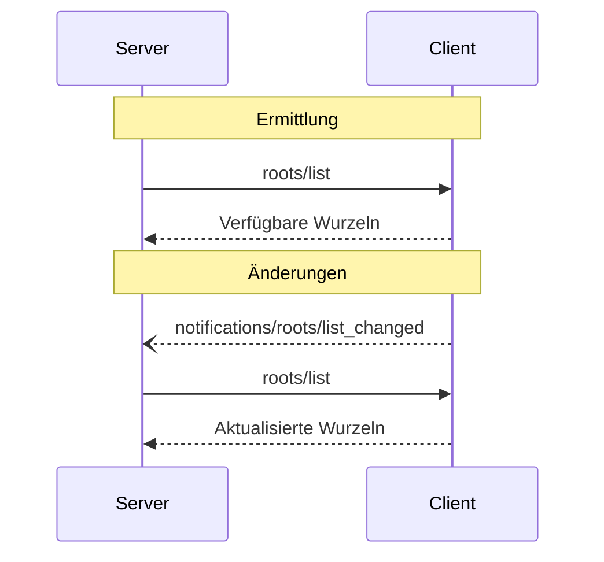

<div id="enable-section-numbers" />

<Info>**Protokollrevision**: Entwurf</Info>

Das Model Context Protocol (MCP) stellt eine standardisierte Methode bereit, mit der Clients
Servern Dateisystem-„Wurzeln“ zur Verfügung stellen. Wurzeln definieren die Grenzen, innerhalb derer
Server im Dateisystem arbeiten dürfen, und machen klar, auf welche Verzeichnisse und Dateien sie
Zugriff haben. Server können von unterstützenden Clients die Liste der Wurzeln anfordern und
Benachrichtigungen erhalten, wenn sich diese Liste ändert.

<div id="user-interaction-model">
  ## Benutzerinteraktionsmodell
</div>

Wurzeln im MCP werden typischerweise über Konfigurationsoberflächen für Arbeitsbereiche oder Projekte bereitgestellt.

Beispielsweise könnten Implementierungen einen Auswahldialog für Arbeitsbereiche/Projekte anbieten, der es Nutzerinnen und Nutzern ermöglicht,
Verzeichnisse und Dateien auszuwählen, auf die der Server zugreifen darf. Dies kann mit
automatischer Erkennung von Arbeitsbereichen anhand von Versionskontrollsystemen oder Projektdateien kombiniert werden.

Implementierungen sind jedoch frei, Wurzeln über jedes Interaktionsmuster bereitzustellen, das
ihren Anforderungen entspricht — das Protokoll selbst schreibt kein spezifisches Benutzerinteraktionsmodell vor.

<div id="capabilities">
  ## Fähigkeiten
</div>

Clients, die Wurzeln unterstützen, **MÜSSEN** die `roots`-Fähigkeit während der
[Initialisierung](/de/specification/draft/basic/lifecycle#initialization) deklarieren:

```json
{
  "capabilities": {
    "roots": {
      "listChanged": true
    }
  }
}
```

`listChanged` gibt an, ob der Client Benachrichtigungen sendet, wenn sich die Liste der Wurzeln
ändert.

<div id="protocol-messages">
  ## Protokollnachrichten
</div>

<div id="listing-roots">
  ### Wurzeln auflisten
</div>

Um Wurzeln abzurufen, senden Server eine `roots/list`-Anfrage:

**Anfrage:**

```json
{
  "jsonrpc": "2.0",
  "id": 1,
  "method": "roots/list"
}
```

**Antwort:**

```json
{
  "jsonrpc": "2.0",
  "id": 1,
  "result": {
    "roots": [
      {
        "uri": "file:///home/user/projects/myproject",
        "name": "My Project"
      }
    ]
  }
}
```

<div id="root-list-changes">
  ### Änderungen an der Wurzelliste
</div>

Wenn sich die Wurzeln ändern, müssen Clients, die `listChanged` unterstützen, eine Benachrichtigung senden:

```json
{
  "jsonrpc": "2.0",
  "method": "notifications/roots/list_changed"
}
```

<div id="message-flow">
  ## Nachrichtenfluss
</div>



<div id="data-types">
  ## Datentypen
</div>

<div id="root">
  ### Wurzel
</div>

Eine Wurzeldefinition umfasst:

* `uri`: Eindeutiger Bezeichner für die Wurzel. In der aktuellen Spezifikation **MUSS** dies eine `file://`-URI sein.
* `name`: Optionaler, menschenlesbarer Name für Anzeigezwecke.

Beispielwurzeln für verschiedene Anwendungsfälle:

<div id="project-directory">
  #### Projektverzeichnis
</div>

```json
{
  "uri": "file:///home/user/projects/myproject",
  "name": "My Project"
}
```

<div id="multiple-repositories">
  #### Mehrere Repositories
</div>

```json
[
  {
    "uri": "file:///home/user/repos/frontend",
    "name": "Frontend-Repository"
  },
  {
    "uri": "file:///home/user/repos/backend",
    "name": "Backend-Repository"
  }
]
```

<div id="error-handling">
  ## Fehlerbehandlung
</div>

Clients **SOLLTEN** für gängige Fehlerfälle standardisierte JSON-RPC-Fehler zurückgeben:

* Client unterstützt Wurzeln nicht: `-32601` (Methode nicht gefunden)
* Interne Fehler: `-32603`

Beispielfehler:

```json
{
  "jsonrpc": "2.0",
  "id": 1,
  "error": {
    "code": -32601,
    "message": "Roots not supported",
    "data": {
      "reason": "Client does not have roots capability"
    }
  }
}
```

<div id="security-considerations">
  ## Sicherheitshinweise
</div>

1. Clients **MÜSSEN**:
   * Nur Wurzeln mit geeigneten Berechtigungen freigeben
   * Alle Wurzel-URIs validieren, um Pfadtraversalen zu verhindern
   * Angemessene Zugriffskontrollen implementieren
   * Die Zugänglichkeit der Wurzeln überwachen

2. Server **SOLLEN**:
   * Fälle behandeln, in denen Wurzeln nicht mehr verfügbar sind
   * Grenzen der Wurzeln bei Operationen respektieren
   * Alle Pfade anhand der bereitgestellten Wurzeln validieren

<div id="implementation-guidelines">
  ## Implementierungsrichtlinien
</div>

1. Clients **SOLLEN**:
   * Nutzer um Zustimmung bitten, bevor Wurzeln an Server übermittelt werden
   * Klare Benutzeroberflächen für die Verwaltung von Wurzeln bereitstellen
   * Die Zugänglichkeit der Wurzeln vor der Offenlegung prüfen
   * Auf Änderungen an Wurzeln überwachen

2. Server **SOLLEN**:
   * Vor der Nutzung auf die Wurzeln-Fähigkeit prüfen
   * Änderungen an der Wurzelliste robust handhaben
   * Wurzelgrenzen bei Operationen respektieren
   * Informationen zu Wurzeln angemessen zwischenspeichern