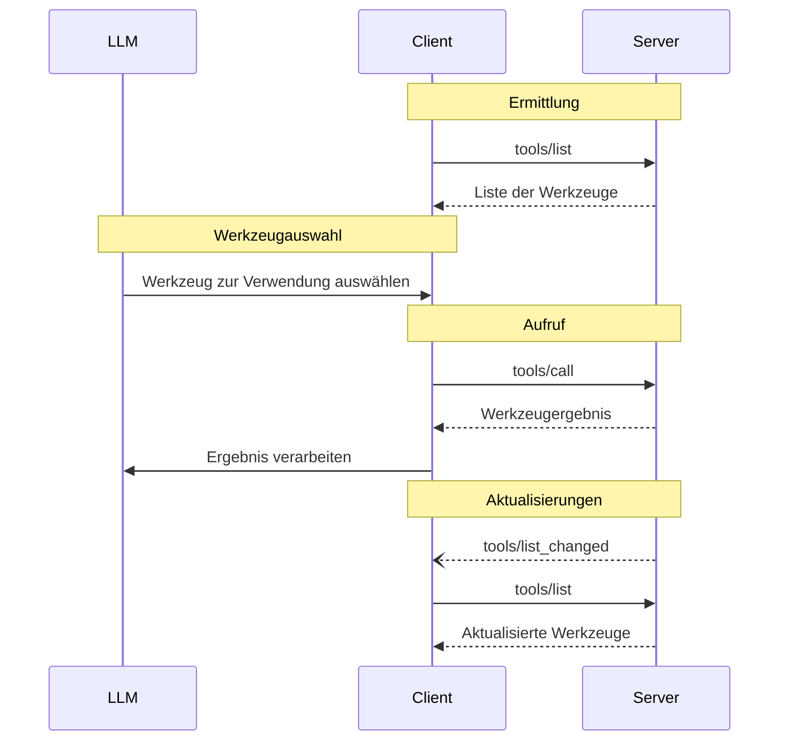

<div id="enable-section-numbers" />

<Info>**Protokollrevision**: Entwurf</Info>

Das Model Context Protocol (MCP) ermöglicht es Servern, Werkzeuge offenzulegen, die von Sprachmodellen aufgerufen werden können. Werkzeuge erlauben es Modellen, mit externen Systemen zu interagieren, etwa indem sie Datenbanken abfragen, APIs aufrufen oder Berechnungen durchführen. Jedes Werkzeug ist eindeutig durch einen Namen identifiziert und enthält Metadaten, die sein Schema beschreiben.

<div id="user-interaction-model">
  ## Benutzerinteraktionsmodell
</div>

Werkzeuge im MCP sind so konzipiert, dass sie **modellgesteuert** sind. Das bedeutet, dass das Sprachmodell Werkzeuge basierend auf seinem kontextuellen Verständnis und den Prompts des Nutzers automatisch entdecken und aufrufen kann.

Implementierungen sind jedoch frei, Werkzeuge über jedes Interface-Muster bereitzustellen, das ihren Anforderungen entspricht—das Protokoll selbst schreibt kein spezifisches Benutzerinteraktionsmodell vor.

<Warning>
  Aus Gründen von Trust &amp; Safety sowie Sicherheit sollte **immer** ein Mensch in den Prozess eingebunden sein, der die Möglichkeit hat, Werkzeugaufrufe abzulehnen.

  Anwendungen **sollten**:

  * Eine UI bereitstellen, die klar macht, welche Werkzeuge dem KI-Modell zur Verfügung stehen
  * Deutliche visuelle Indikatoren einfügen, wenn Werkzeuge aufgerufen werden
  * Bestätigungsprompts für Vorgänge anzeigen, um sicherzustellen, dass ein Mensch eingebunden ist
</Warning>

<div id="capabilities">
  ## Fähigkeiten
</div>

Server, die Werkzeuge unterstützen, **MÜSSEN** die Fähigkeit `tools` deklarieren:

```json
{
  "capabilities": {
    "tools": {
      "listChanged": true
    }
  }
}
```

`listChanged` gibt an, ob der Server Benachrichtigungen auslöst, wenn sich die Liste der
verfügbaren Werkzeuge ändert.

<div id="protocol-messages">
  ## Protokollnachrichten
</div>

<div id="listing-tools">
  ### Werkzeuge auflisten
</div>

Um verfügbare Werkzeuge zu ermitteln, senden Clients eine `tools/list`-Anfrage. Dieser Vorgang unterstützt
[Seitennummerierung](/de/specification/draft/server/utilities/pagination).

**Anfrage:**

```json
{
  "jsonrpc": "2.0",
  "id": 1,
  "method": "tools/list",
  "params": {
    "cursor": "optional-cursor-value"
  }
}
```

**Antwort:**

```json
{
  "jsonrpc": "2.0",
  "id": 1,
  "result": {
    "tools": [
      {
        "name": "get_weather",
        "title": "Weather Information Provider",
        "description": "Abrufen aktueller Wetterinformationen für einen Ort",
        "inputSchema": {
          "type": "object",
          "properties": {
            "location": {
              "type": "string",
              "description": "Stadtname oder Postleitzahl"
            }
          },
          "required": ["location"]
        },
        "icons": [
          {
            "src": "https://example.com/weather-icon.png",
            "mimeType": "image/png",
            "sizes": "48x48"
          }
        ]
      }
    ],
    "nextCursor": "next-page-cursor"
  }
}
```

<div id="calling-tools">
  ### Aufrufen von Werkzeugen
</div>

Um ein Werkzeug aufzurufen, senden Clients eine `tools/call`-Anfrage:

**Anfrage:**

```json
{
  "jsonrpc": "2.0",
  "id": 2,
  "method": "tools/call",
  "params": {
    "name": "get_weather",
    "arguments": {
      "location": "New York"
    }
  }
}
```

**Antwort:**

```json
{
  "jsonrpc": "2.0",
  "id": 2,
  "result": {
    "content": [
      {
        "type": "text",
        "text": "Aktuelles Wetter in New York:\nTemperatur: 72°F\nWetterlage: Teilweise bewölkt"
      }
    ],
    "isError": false
  }
}
```

<div id="list-changed-notification">
  ### Benachrichtigung über geänderte Liste
</div>

Wenn sich die Liste der verfügbaren Werkzeuge ändert, SOLLTEN Server, die die Fähigkeit `listChanged` deklariert haben, eine Benachrichtigung senden:

```json
{
  "jsonrpc": "2.0",
  "method": "notifications/tools/list_changed"
}
```

<div id="message-flow">
  ## Nachrichtenfluss
</div>



<div id="data-types">
  ## Datentypen
</div>

<div id="tool">
  ### Werkzeug
</div>

Eine Werkzeugdefinition umfasst:

* `name`: Eindeutiger Bezeichner für das Werkzeug
* `title`: Optionaler, menschenlesbarer Name des Werkzeugs für Anzeigezwecke
* `description`: Menschenlesbare Beschreibung der Funktionalität
* `inputSchema`: JSON Schema, das die erwarteten Parameter definiert
* `outputSchema`: Optionales JSON Schema, das die erwartete Ausgabestruktur definiert
* `annotations`: Optionale Eigenschaften, die das Werkzeugverhalten beschreiben

<Warning>
  Aus Gründen der Vertrauenswürdigkeit, Sicherheit und des Schutzes **MÜSSEN** Clients
  Tool-Annotationen als nicht vertrauenswürdig behandeln, es sei denn, sie stammen von vertrauenswürdigen Servern.
</Warning>

<div id="tool-result">
  ### Werkzeugergebnis
</div>

Werkzeugergebnisse können [**strukturierten**](#structured-content) oder **unstrukturierten** Inhalt enthalten.

**Unstrukturierter** Inhalt wird im Feld `content` eines Ergebnisses zurückgegeben und kann mehrere Inhaltelemente verschiedener Typen enthalten:

<Note>
  Alle Inhaltstypen (Text, Bild, Audio, Ressourcen-Links und eingebettete Ressourcen)
  unterstützen optionale
  [Annotationen](/de/specification/draft/server/resources#annotations), die
  Metadaten zu Zielgruppe, Priorität und Änderungszeiten bereitstellen. Dies ist dasselbe
  Annotationsformat, das von Ressourcen und Prompts verwendet wird.
</Note>

<div id="text-content">
  #### Textinhalt
</div>

```json
{
  "type": "text",
  "text": "Werkzeug-Ergebnis-Text"
}
```

<div id="image-content">
  #### Bildinhalt
</div>

```json
{
  "type": "image",
  "data": "base64-encoded-data",
  "mimeType": "image/png",
  "annotations": {
    "audience": ["user"],
    "priority": 0.9
  }
}
```

<div id="audio-content">
  #### Audioinhalt
</div>

```json
{
  "type": "audio",
  "data": "base64-encoded-audio-data",
  "mimeType": "audio/wav"
}
```

<div id="resource-links">
  #### Ressourcenlinks
</div>

Ein Werkzeug **KANN** Links zu [Ressourcen](/de/specification/draft/server/resources) zurückgeben, um zusätzlichen Kontext
oder Daten bereitzustellen. In diesem Fall gibt das Werkzeug eine URI zurück, die der Client abonnieren oder abrufen kann:

```json
{
  "type": "resource_link",
  "uri": "file:///project/src/main.rs",
  "name": "main.rs",
  "description": "Primary application entry point",
  "mimeType": "text/x-rust"
}
```

Ressourcenlinks unterstützen dieselben [Ressourcen-Annotationen](/de/specification/draft/server/resources#annotations) wie reguläre Ressourcen und helfen Clients zu verstehen, wie sie zu verwenden sind.

<Info>
  Von Werkzeugen zurückgegebene Ressourcenlinks sind nicht zwangsläufig in den Ergebnissen
  einer `resources/list`-Anfrage enthalten.
</Info>

<div id="embedded-resources">
  #### Eingebettete Ressourcen
</div>

[Ressourcen](/de/specification/draft/server/resources) **KÖNNEN** eingebettet werden, um zusätzlichen Kontext
oder Daten über ein geeignetes [URI-Schema](de/./resources#common-uri-schemes) bereitzustellen. Server, die eingebettete Ressourcen verwenden, **SOLLTEN** die Fähigkeit `resources` implementieren:

```json
{
  "type": "resource",
  "resource": {
    "uri": "file:///project/src/main.rs",
    "title": "Rust-Hauptdatei des Projekts",
    "mimeType": "text/x-rust",
    "text": "fn main() {\n    println!(\"Hello world!\");\n}",
    "annotations": {
      "audience": ["user", "assistant"],
      "priority": 0.7,
      "lastModified": "2025-05-03T14:30:00Z"
    }
  }
}
```

Eingebettete Ressourcen unterstützen dieselben [Ressourcen-Annotationen](/de/specification/draft/server/resources#annotations) wie reguläre Ressourcen und helfen Clients so dabei, deren Verwendung zu verstehen.

<div id="structured-content">
  #### Strukturierte Inhalte
</div>

**Strukturierte** Inhalte werden als JSON-Objekt im Feld `structuredContent` eines Ergebnisses zurückgegeben.

Zur Wahrung der Abwärtskompatibilität SOLLTE ein Werkzeug, das strukturierte Inhalte zurückgibt, zusätzlich das serialisierte JSON in einem TextContent-Block zurückgeben.

<div id="output-schema">
  #### Ausgabeschema
</div>

Werkzeuge können auch ein Ausgabeschema zur Validierung strukturierter Ergebnisse bereitstellen.
Wenn ein Ausgabeschema bereitgestellt wird:

* Server **MÜSSEN** strukturierte Ergebnisse liefern, die diesem Schema entsprechen.
* Clients **SOLLTEN** strukturierte Ergebnisse gegen dieses Schema validieren.

Beispielwerkzeug mit Ausgabeschema:

```json
{
  "name": "get_weather_data",
  "title": "Weather Data Retriever",
  "description": "Get current weather data for a location",
  "inputSchema": {
    "type": "object",
    "properties": {
      "location": {
        "type": "string",
        "description": "City name or zip code"
      }
    },
    "required": ["location"]
  },
  "outputSchema": {
    "type": "object",
    "properties": {
      "temperature": {
        "type": "number",
        "description": "Temperature in Celsius"
      },
      "conditions": {
        "type": "string",
        "description": "Description der Wetterbedingungen"
      },
      "humidity": {
        "type": "number",
        "description": "Luftfeuchtigkeit in Prozent"
      }
    },
    "required": ["temperature", "conditions", "humidity"]
  }
}
```

Beispiel für eine gültige Antwort auf dieses Werkzeug:

```json
{
  "jsonrpc": "2.0",
  "id": 5,
  "result": {
    "content": [
      {
        "type": "text",
        "text": "{\"temperature\": 22.5, \"conditions\": \"Partly cloudy\", \"humidity\": 65}"
      }
    ],
    "structuredContent": {
      "temperature": 22.5,
      "conditions": "Partly cloudy",
      "humidity": 65
    }
  }
}
```

Die Bereitstellung eines Ausgabeschemas hilft Clients und LLMs, strukturierte Werkzeugausgaben zu verstehen und korrekt zu verarbeiten, indem sie:

* eine strikte Validierung von Antworten gegen das Schema ermöglichen
* Typinformationen für eine bessere Integration in Programmiersprachen bereitstellen
* Clients und LLMs dabei unterstützen, die zurückgegebenen Daten korrekt zu parsen und zu nutzen
* eine bessere Dokumentation und Developer Experience unterstützen

<div id="error-handling">
  ## Fehlerbehandlung
</div>

Werkzeuge verwenden zwei Mechanismen zur Fehlermeldung:

1. **Protokollfehler**: Standard-JSON-RPC-Fehler bei Problemen wie:
   * Unbekannte Werkzeuge
   * Ungültige Argumente
   * Serverfehler

2. **Fehler bei der Werkzeugausführung**: Im Werkzeugergebnis mit `isError: true` gemeldet:
   * API-Fehler
   * Ungültige Eingabedaten
   * Fehler in der Geschäftslogik

Beispiel für einen Protokollfehler:

```json
{
  "jsonrpc": "2.0",
  "id": 3,
  "error": {
    "code": -32602,
    "message": "Unknown tool: invalid_tool_name"
  }
}
```

Beispiel für einen Fehler bei der Werkzeugausführung:

```json
{
  "jsonrpc": "2.0",
  "id": 4,
  "result": {
    "content": [
      {
        "type": "text",
        "text": "Fehler beim Abrufen der Wetterdaten: API-Ratenlimit überschritten"
      }
    ],
    "isError": true
  }
}
```

<div id="security-considerations">
  ## Sicherheitsaspekte
</div>

1. Server **MÜSSEN**:
   * Alle Werkzeugeingaben validieren
   * Angemessene Zugriffskontrollen implementieren
   * Aufrufe von Werkzeugen begrenzen (Rate Limiting)
   * Werkzeugausgaben bereinigen

2. Clients **SOLLEN**:
   * Bei sensiblen Vorgängen eine Bestätigung durch die Nutzerin/den Nutzer anfordern
   * Werkzeugeingaben vor dem Aufruf des Servers anzeigen, um böswillige oder
     versehentliche Datenexfiltration zu vermeiden
   * Werkzeugergebnisse validieren, bevor sie an das LLM übergeben werden
   * Timeouts für Werkzeugaufrufe implementieren
   * Die Nutzung von Werkzeugen zu Audit-Zwecken protokollieren