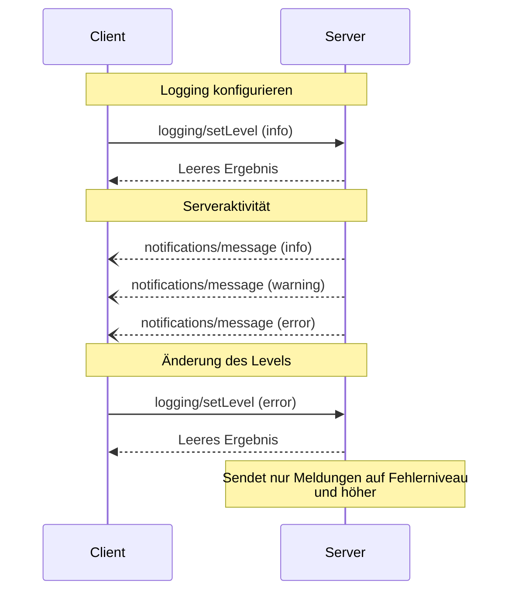

<div id="enable-section-numbers" />

<Info>**Protokollrevision**: Entwurf</Info>

Das Model Context Protocol (MCP) bietet eine standardisierte Möglichkeit für Server, strukturierte Protokollmeldungen an Clients zu senden. Clients können die Protokollierungs‑Detailtiefe steuern, indem sie minimale Protokollstufen festlegen. Server senden Benachrichtigungen mit Schweregraden, optionalen Loggernamen und beliebigen JSON‑serialisierbaren Daten.

<div id="user-interaction-model">
  ## Modell der Benutzerinteraktion
</div>

Implementierungen können das Logging über jedes Schnittstellenmuster bereitstellen, das ihren Anforderungen entspricht – das Protokoll selbst schreibt kein bestimmtes Modell der Benutzerinteraktion vor.

<div id="capabilities">
  ## Fähigkeiten
</div>

Server, die Benachrichtigungen zu Protokollmeldungen ausgeben, **MÜSSEN** die Fähigkeit `logging` deklarieren:

```json
{
  "capabilities": {
    "logging": {}
  }
}
```

<div id="log-levels">
  ## Protokollstufen
</div>

Das Protokoll folgt den standardmäßigen Syslog-Schweregraden gemäß
[RFC 5424](https://datatracker.ietf.org/doc/html/rfc5424#section-6.2.1):

| Stufe     | Beschreibung                     | Beispielanwendung           |
| --------- | -------------------------------- | --------------------------- |
| debug     | Detaillierte Debug-Informationen | Funktions-Ein-/Austritt     |
| info      | Allgemeine Informationsmeldungen | Fortschrittsmeldungen       |
| notice    | Normale, aber bedeutende Ereignisse | Konfigurationsänderungen    |
| warning   | Warnzustände                     | Verwendung veralteter Funktionen |
| error     | Fehlerzustände                   | Fehlgeschlagene Operationen |
| critical  | Kritische Zustände               | Ausfälle von Systemkomponenten |
| alert     | Es muss sofort gehandelt werden  | Datenbeschädigung erkannt   |
| emergency | System ist unbrauchbar           | Vollständiger Systemausfall |

<div id="protocol-messages">
  ## Protokollnachrichten
</div>

<div id="setting-log-level">
  ### Protokollebene festlegen
</div>

Um die minimale Protokollebene zu konfigurieren, **KÖNNEN** Clients eine `logging/setLevel`-Anfrage senden:

**Anfrage:**

```json
{
  "jsonrpc": "2.0",
  "id": 1,
  "method": "logging/setLevel",
  "params": {
    "level": "info"
  }
}
```

<div id="log-message-notifications">
  ### Protokollnachrichten-Benachrichtigungen
</div>

Server senden Protokollnachrichten über `notifications/message`-Benachrichtigungen:

```json
{
  "jsonrpc": "2.0",
  "method": "notifications/message",
  "params": {
    "level": "error",
    "logger": "database",
    "data": {
      "error": "Connection failed",
      "details": {
        "host": "localhost",
        "port": 5432
      }
    }
  }
}
```

<div id="message-flow">
  ## Nachrichtenfluss
</div>



<div id="error-handling">
  ## Fehlerbehandlung
</div>

Server **SOLLEN** für gängige Fehlerszenarien standardisierte JSON-RPC-Fehler zurückgeben:

- Ungültige Log-Stufe: `-32602` (Ungültige Parameter)
- Konfigurationsfehler: `-32603` (Interner Fehler)

<div id="implementation-considerations">
  ## Hinweise zur Implementierung
</div>

1. Server **SOLLTEN**:
   - Protokollnachrichten ratebegrenzen
   - Relevanten Kontext im Datenfeld angeben
   - Konsistente Logger-Namen verwenden
   - Sensible Informationen entfernen

2. Clients **KÖNNEN**:
   - Protokollnachrichten in der UI anzeigen
   - Filterung und Suche für Protokolle implementieren
   - Den Schweregrad visuell darstellen
   - Protokollnachrichten dauerhaft speichern

<div id="security">
  ## Sicherheit
</div>

1. Protokolleinträge **DÜRFEN NICHT** Folgendes enthalten:
   - Anmeldedaten oder Geheimnisse
   - Personenbezogene Daten
   - Interne Systemdetails, die Angriffe erleichtern könnten

2. Implementierungen **SOLLTEN**:
   - Nachrichten ratenbegrenzen
   - Alle Datenfelder validieren
   - Den Protokollzugriff kontrollieren
   - Auf sensible Inhalte überwachen