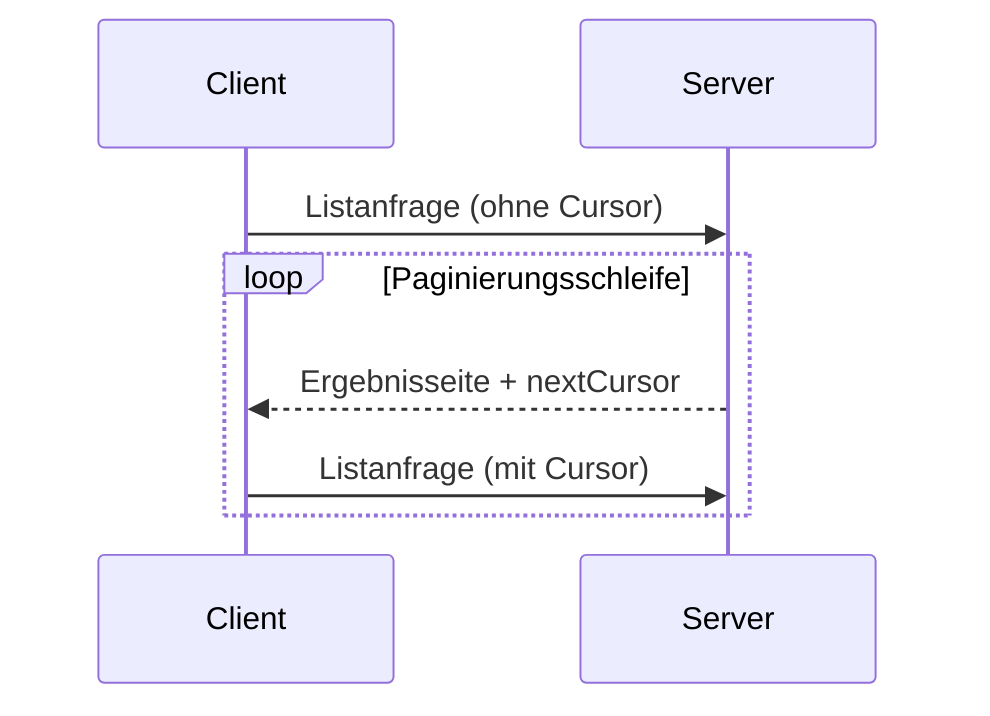

<div id="enable-section-numbers" />

<Info>**Protokollrevision**: Entwurf</Info>

Das Model Context Protocol (MCP) unterstützt die Paginierung von Listenvorgängen, die
große Ergebnismengen zurückgeben können. Paginierung ermöglicht es Servern, Ergebnisse in kleineren
Teilmengen statt auf einmal bereitzustellen.

Paginierung ist besonders wichtig bei Verbindungen zu externen Diensten über das
Internet, aber auch für lokale Integrationen nützlich, um Leistungsprobleme mit großen
Datensätzen zu vermeiden.

<div id="pagination-model">
  ## Paginierungsmodell
</div>

Die Paginierung in MCP verwendet einen undurchsichtigen, cursorbasierten Ansatz anstelle nummerierter Seiten.

- Der **Cursor** ist ein undurchsichtiger String-Token, der eine Position in der Ergebnismenge darstellt
- Die **Seitengröße** wird vom Server festgelegt, und Clients **DÜRFEN NICHT** von einer festen Seitengröße ausgehen

<div id="response-format">
  ## Antwortformat
</div>

Die Paginierung beginnt, wenn der Server eine **Antwort** sendet, die Folgendes enthält:

- Die aktuelle Seite der Ergebnisse
- Ein optionales `nextCursor`-Feld, wenn weitere Ergebnisse vorhanden sind

```json
{
  "jsonrpc": "2.0",
  "id": "123",
  "result": {
    "resources": [...],
    "nextCursor": "eyJwYWdlIjogM30="
  }
}
```

<div id="request-format">
  ## Anforderungsformat
</div>

Nachdem der Client einen Cursor erhalten hat, kann er die Paginierung _fortsetzen_, indem er eine Anfrage stellt,
die diesen Cursor enthält:

```json
{
  "jsonrpc": "2.0",
  "method": "resources/list",
  "params": {
    "cursor": "eyJwYWdlIjogMn0="
  }
}
```

<div id="pagination-flow">
  ## Ablauf der Paginierung
</div>



<div id="operations-supporting-pagination">
  ## Vorgänge mit Unterstützung für Paginierung
</div>

Die folgenden MCP-Vorgänge unterstützen die Paginierung:

- `resources/list` - Verfügbare Ressourcen auflisten
- `resources/templates/list` - Ressourcen-URI-Vorlagen auflisten
- `prompts/list` - Verfügbare Prompts auflisten
- `tools/list` - Verfügbare Werkzeuge auflisten

<div id="implementation-guidelines">
  ## Implementierungsrichtlinien
</div>

1. Server **SOLLTEN**:
   - Stabile Cursor bereitstellen
   - Ungültige Cursor robust behandeln

2. Clients **SOLLTEN**:
   - Ein fehlendes `nextCursor` als Ende der Ergebnisse interpretieren
   - Sowohl paginierte als auch nicht paginierte Abläufe unterstützen

3. Clients **MÜSSEN** Cursor als undurchsichtige Token behandeln:
   - Keine Annahmen über das Cursorformat treffen
   - Cursor nicht zu parsen oder zu verändern versuchen
   - Cursor nicht über Sitzungen hinweg beibehalten

<div id="error-handling">
  ## Fehlerbehandlung
</div>

Ungültige Cursor **SOLLTEN** zu einem Fehler mit dem Code -32602 (ungültige Parameter) führen.