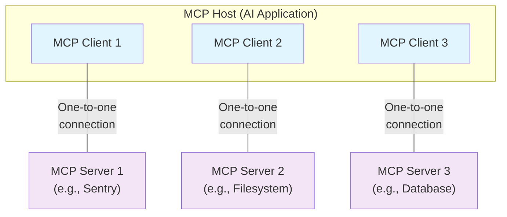

Esta descripción general del Protocolo de Contexto de Modelo (MCP) aborda su [alcance](#scope) y [conceptos fundamentales](#concepts-of-mcp), y ofrece un [ejemplo](#example) que demuestra cada concepto fundamental.

Como los SDK de MCP abstraen muchas tareas, es probable que la mayoría de los desarrolladores encuentren más útil la sección del [protocolo de la capa de datos](#data-layer-protocol). Allí se explica cómo los Servidores MCP pueden aportar contexto a una aplicación de IA.

Para obtener detalles específicos de implementación, consulta la documentación de tu [SDK específico del lenguaje](/es/docs/sdk).

<div id="scope">
  ## Alcance
</div>

El Protocolo de Contexto de Modelo (MCP) incluye los siguientes proyectos:

* [Especificación de MCP](https://modelcontextprotocol.io/specification/latest): Una especificación de MCP que detalla los requisitos de implementación para clientes y servidores.
* [SDK de MCP](/es/docs/sdk): SDK para distintos lenguajes de programación que implementan MCP.
* **Herramientas de desarrollo de MCP**: Herramientas para desarrollar Servidores MCP y Clientes MCP, incluido el [Inspector de MCP](https://github.com/modelcontextprotocol/inspector)
* [Implementaciones de referencia de Servidores MCP](https://github.com/modelcontextprotocol/servers): Implementaciones de referencia de servidores MCP.

<Note>
  MCP se centra únicamente en el protocolo para el intercambio de contexto; no dicta
  cómo las aplicaciones de IA usan los LLM ni cómo gestionan el contexto proporcionado.
</Note>

<div id="concepts-of-mcp">
  ## Conceptos de MCP
</div>

<div id="participants">
  ### Participantes
</div>

MCP sigue una arquitectura cliente-servidor en la que un Host de MCP —una aplicación de IA como [Claude Code](https://www.anthropic.com/claude-code) o [Claude Desktop](https://www.claude.ai/download)— establece conexiones con uno o más Servidores MCP. El Host de MCP hace esto creando un Cliente MCP para cada Servidor MCP. Cada Cliente MCP mantiene una conexión dedicada uno a uno con su correspondiente Servidor MCP.

Los participantes clave en la arquitectura de MCP son:

* **Host de MCP**: La aplicación de IA que coordina y gestiona uno o varios Clientes MCP
* **Cliente MCP**: Un componente que mantiene una conexión con un Servidor MCP y obtiene contexto de un Servidor MCP para que lo use el Host de MCP
* **Servidor MCP**: Un programa que proporciona contexto a los Clientes MCP

**Por ejemplo**: Visual Studio Code actúa como Host de MCP. Cuando Visual Studio Code establece una conexión con un Servidor MCP, como el [Servidor MCP de Sentry](https://docs.sentry.io/product/sentry-mcp/), el entorno de ejecución de Visual Studio Code instancia un objeto Cliente MCP que mantiene la conexión con el Servidor MCP de Sentry.
Cuando Visual Studio Code posteriormente se conecta a otro Servidor MCP, como el [servidor de sistema de archivos local](https://github.com/modelcontextprotocol/servers/tree/main/src/filesystem), el entorno de ejecución de Visual Studio Code instancia un objeto Cliente MCP adicional para mantener esta conexión, preservando así una relación uno a uno entre Clientes MCP y Servidores MCP.



Ten en cuenta que **Servidor MCP** se refiere al programa que sirve datos de contexto, independientemente de dónde se ejecute. Los Servidores MCP pueden ejecutarse localmente o de forma remota. Por ejemplo, cuando Claude Desktop inicia el [servidor de sistema de archivos](https://github.com/modelcontextprotocol/servers/tree/main/src/filesystem), el servidor se ejecuta localmente en la misma máquina porque utiliza el transporte STDIO. A esto se le suele llamar un Servidor MCP &quot;local&quot;. El [Servidor MCP de Sentry](https://docs.sentry.io/product/sentry-mcp/) oficial se ejecuta en la plataforma de Sentry y utiliza el transporte HTTP Transmisible. A esto se le suele llamar un Servidor MCP &quot;remoto&quot;.

<div id="layers">
  ### Capas
</div>

MCP consta de dos capas:

* **Capa de datos**: Define el protocolo basado en JSON-RPC 2.0 para la comunicación cliente-servidor, incluido el manejo del ciclo de vida y los primitivos fundamentales, como Herramientas, Recursos, Indicaciones y notificaciones.
* **Capa de transporte**: Define los mecanismos y canales de comunicación que permiten el intercambio de datos entre clientes y servidores, incluido el establecimiento de la conexión específico del transporte, el encuadre de mensajes y la autorización.

Conceptualmente, la capa de datos es la capa interna, mientras que la capa de transporte es la capa externa.

<div id="data-layer">
  #### Capa de datos
</div>

La capa de datos implementa un protocolo de intercambio basado en [JSON-RPC 2.0](https://www.jsonrpc.org/) que define la estructura y la semántica de los mensajes.
Esta capa incluye:

* **Gestión del ciclo de vida**: Gestiona la inicialización de la conexión, la Negociación de capacidades del servidor y la finalización de la conexión entre clientes y servidores
* **Funciones del servidor**: Permite a los servidores ofrecer funcionalidades principales, incluidas Herramientas para acciones de IA, Recursos para datos de contexto e Indicaciones para plantillas de interacción entre el cliente y el servidor
* **Funciones del cliente**: Permite a los servidores solicitar al cliente que realice Muestreo desde el LLM del Host de MCP, que lleve a cabo la Elicitación de entrada del usuario y que registre mensajes en el cliente
* **Funciones de utilidad**: Admite capacidades adicionales como notificaciones para actualizaciones en tiempo real y seguimiento del progreso de operaciones de larga duración

<div id="transport-layer">
  #### Capa de transporte
</div>

La capa de transporte gestiona los canales de comunicación y la autenticación entre clientes y servidores. Se encarga del establecimiento de conexiones, el encapsulado de mensajes y la comunicación segura entre los participantes de MCP.

MCP admite dos mecanismos de transporte:

* **Transporte Stdio**: Usa flujos de entrada/salida estándar para la comunicación directa entre procesos locales en la misma máquina, ofreciendo un rendimiento óptimo sin sobrecarga de red.
* **Transporte HTTP Transmisible**: Usa HTTP POST para mensajes de cliente a servidor con Server-Sent Events opcionales para capacidades de transmisión. Este transporte habilita la comunicación con servidores remotos y admite métodos de autenticación HTTP estándar, incluidos tokens bearer, claves de API y encabezados personalizados. MCP recomienda usar OAuth para obtener tokens de autenticación.

La capa de transporte abstrae los detalles de comunicación de la capa de protocolo, permitiendo el mismo formato de mensajes JSON-RPC 2.0 en todos los mecanismos de transporte.

<div id="data-layer-protocol">
  ### Protocolo de capa de datos
</div>

Una parte central de MCP es definir el esquema y la semántica entre los Clientes MCP y los Servidores MCP. Es probable que los desarrolladores encuentren la capa de datos —en particular, el conjunto de [primitives](#primitives)— como la parte más interesante de MCP. Es la parte de MCP que define las formas en que los desarrolladores pueden compartir contexto desde los Servidores MCP hacia los Clientes MCP.

MCP utiliza [JSON-RPC 2.0](https://www.jsonrpc.org/) como su protocolo RPC subyacente. Los clientes y los servidores se envían solicitudes entre sí y responden en consecuencia. Se pueden usar notificaciones cuando no se requiere respuesta.

<div id="lifecycle-management">
  #### Gestión del ciclo de vida
</div>

MCP es un <Tooltip tip="Un subconjunto de MCP puede hacerse sin estado usando el transporte HTTP Transmisible">protocolo con estado</Tooltip> que requiere gestión del ciclo de vida. El propósito de la gestión del ciclo de vida es negociar las <Tooltip tip="Funciones y operaciones que un cliente o servidor admite, como Herramientas, Recursos o Indicaciones">capacidades</Tooltip> que tanto el cliente como el servidor admiten. Puedes encontrar información detallada en la [especificación](/es/specification/2025-06-18/basic/lifecycle), y el [ejemplo](#example) muestra la secuencia de inicialización.

<div id="primitives">
  #### Primitivas
</div>

Las primitivas de MCP son el concepto más importante dentro de MCP. Definen lo que los clientes y los servidores pueden ofrecerse entre sí. Estas primitivas especifican los tipos de información contextual que se pueden compartir con aplicaciones de IA y el rango de acciones que se pueden realizar.

MCP define tres primitivas fundamentales que los *servidores* pueden exponer:

* **Herramientas**: Funciones ejecutables que las aplicaciones de IA pueden invocar para realizar acciones (p. ej., operaciones con archivos, llamadas a API, consultas a bases de datos)
* **Recursos**: Fuentes de datos que proporcionan información contextual a las aplicaciones de IA (p. ej., contenido de archivos, registros de bases de datos, respuestas de API)
* **Indicaciones**: Plantillas reutilizables que ayudan a estructurar las interacciones con modelos de lenguaje (p. ej., indicaciones del sistema, ejemplos few-shot)

Cada tipo de primitiva tiene métodos asociados para descubrimiento (`*/list`), obtención (`*/get`) y, en algunos casos, ejecución (`tools/call`).
Los Clientes MCP usarán los métodos `*/list` para descubrir las primitivas disponibles. Por ejemplo, un cliente puede primero listar todas las herramientas disponibles (`tools/list`) y luego ejecutarlas. Este diseño permite que los listados sean dinámicos.

Como ejemplo concreto, considera un Servidor MCP que proporciona contexto sobre una base de datos. Puede exponer herramientas para consultar la base de datos, un recurso que contiene el esquema de la base de datos y una indicación que incluye ejemplos few-shot para interactuar con las herramientas.

Para más detalles sobre las primitivas del servidor, consulta los [conceptos del servidor](es/./server-concepts).

MCP también define primitivas que los *clientes* pueden exponer. Estas primitivas permiten a los autores de Servidores MCP crear interacciones más ricas.

* **Muestreo**: Permite que los servidores soliciten completados de modelos de lenguaje desde la aplicación de IA del cliente. Esto es útil cuando los autores de servidores quieren acceso a un modelo de lenguaje, pero desean mantenerse independientes del modelo y no incluir un SDK de modelo de lenguaje en su Servidor MCP. Pueden usar el método `sampling/complete` para solicitar un completado de modelo de lenguaje desde la aplicación de IA del cliente.
* **Elicitación**: Permite que los servidores soliciten información adicional a los usuarios. Esto es útil cuando los autores de servidores quieren obtener más información del usuario o pedir confirmación de una acción. Pueden usar el método `elicitation/request` para solicitar información adicional del usuario.
* **Registro**: Permite que los servidores envíen mensajes de registro a los clientes con fines de depuración y monitoreo.

Para más detalles sobre las primitivas del cliente, consulta los [conceptos del cliente](es/./client-concepts).

<div id="notifications">
  #### Notificaciones
</div>

El protocolo admite notificaciones en tiempo real para permitir actualizaciones dinámicas entre servidores y clientes. Por ejemplo, cuando cambian las Herramientas disponibles de un servidor—como cuando aparece nueva funcionalidad o se modifican Herramientas existentes—el servidor puede enviar notificaciones de actualización de Herramientas para informar a los clientes conectados sobre estos cambios. Las notificaciones se envían como mensajes de notificación de JSON-RPC 2.0 (sin esperar respuesta) y permiten que los Servidores MCP proporcionen actualizaciones en tiempo real a los Clientes MCP conectados.

<div id="example">
  ## Ejemplo
</div>

<div id="data-layer">
  ### Capa de datos
</div>

Esta sección ofrece una guía paso a paso de la interacción entre un Cliente MCP y un Servidor MCP, con enfoque en el protocolo de la capa de datos. Mostraremos la secuencia del ciclo de vida, las operaciones de Herramientas y las notificaciones usando mensajes JSON-RPC 2.0.

<Steps>
  <Step title="Initialization (Lifecycle Management)">
    MCP comienza con la gestión del ciclo de vida mediante un apretón de manos para la negociación de capacidades. Como se describe en la sección de [gestión del ciclo de vida](#lifecycle-management), el cliente envía una solicitud `initialize` para establecer la conexión y negociar las funciones compatibles.

    <CodeGroup>
      ```json Initialize Request
      {
        "jsonrpc": "2.0",
        "id": 1,
        "method": "initialize",
        "params": {
          "protocolVersion": "2025-06-18",
          "capabilities": {
            "elicitation": {}
          },
          "clientInfo": {
            "name": "example-client",
            "version": "1.0.0"
          }
        }
      }
      ```

      ```json Initialize Response
      {
        "jsonrpc": "2.0",
        "id": 1,
        "result": {
          "protocolVersion": "2025-06-18",
          "capabilities": {
            "tools": {
              "listChanged": true
            },
            "resources": {}
          },
          "serverInfo": {
            "name": "example-server",
            "version": "1.0.0"
          }
        }
      }
      ```
    </CodeGroup>

    #### Comprender el intercambio de inicialización

    El proceso de inicialización es una parte clave de la gestión del ciclo de vida de MCP y cumple varios propósitos críticos:

    1. Negociación de la versión del protocolo: El campo `protocolVersion` (por ejemplo, &quot;2025-06-18&quot;) garantiza que tanto el cliente como el servidor usen versiones compatibles del protocolo. Esto evita errores de comunicación que podrían producirse al interactuar versiones distintas. Si no se negocia una versión mutuamente compatible, se debe finalizar la conexión.

    2. Descubrimiento de capacidades: El objeto `capabilities` permite que cada parte declare qué funciones admite, incluidas las [primitivas](#primitives) que puede manejar (tools, resources, prompts) y si admite funciones como [notifications](#notifications). Esto habilita una comunicación eficiente al evitar operaciones no compatibles.

    3. Intercambio de identidad: Los objetos `clientInfo` y `serverInfo` proporcionan información de identificación y versiones para depuración y compatibilidad.

    En este ejemplo, la negociación de capacidades muestra cómo se declaran las primitivas de MCP:

    **Capacidades del cliente**:

    * `"elicitation": {}` - El cliente declara que puede trabajar con solicitudes de interacción con el usuario (puede recibir llamadas al método `elicitation/create`)

    **Capacidades del servidor**:

    * `"tools": {"listChanged": true}` - El servidor admite la primitiva de herramientas y puede enviar notificaciones `tools/list_changed` cuando cambia su lista de herramientas
    * `"resources": {}` - El servidor también admite la primitiva de recursos (puede manejar los métodos `resources/list` y `resources/read`)

    Después de una inicialización exitosa, el cliente envía una notificación para indicar que está listo:

    ```json Notification
    {
      "jsonrpc": "2.0",
      "method": "notifications/initialized"
    }
    ```

    #### Cómo funciona en aplicaciones de IA

    Durante la inicialización, el gestor del Cliente MCP de la aplicación de IA establece conexiones con los servidores configurados y almacena sus capacidades para usarlas posteriormente. La aplicación utiliza esta información para determinar qué servidores pueden proporcionar tipos específicos de funcionalidad (tools, resources, prompts) y si admiten actualizaciones en tiempo real.

    ```python Pseudo-code for AI application initialization
    # Pseudo Code
    async with stdio_client(server_config) as (read, write):
        async with ClientSession(read, write) as session:
            init_response = await session.initialize()
            if init_response.capabilities.tools:
                app.register_mcp_server(session, supports_tools=True)
            app.set_server_ready(session)
    ```
  </Step>

  <Step title="Tool Discovery (Primitives)">
    Ahora que la conexión está establecida, el cliente puede descubrir las Herramientas disponibles enviando una solicitud `tools/list`. Esta solicitud es fundamental para el mecanismo de descubrimiento de Herramientas de MCP: permite que los Clientes MCP comprendan qué Herramientas están disponibles en el Servidor MCP antes de intentar usarlas.

    <CodeGroup>
      ```json Tools List Request
      {
        "jsonrpc": "2.0",
        "id": 2,
        "method": "tools/list"
      }
      ```

      ```json Tools List Response
      {
        "jsonrpc": "2.0",
        "id": 2,
        "result": {
          "tools": [
            {
              "name": "calculator_arithmetic",
              "title": "Calculator",
              "description": "Perform mathematical calculations including basic arithmetic, trigonometric functions, and algebraic operations",
              "inputSchema": {
                "type": "object",
                "properties": {
                  "expression": {
                    "type": "string",
                    "description": "Mathematical expression to evaluate (e.g., '2 + 3 * 4', 'sin(30)', 'sqrt(16)')"
                  }
                },
                "required": ["expression"]
              }
            },
            {
              "name": "weather_current",
              "title": "Weather Information",
              "description": "Get current weather information for any location worldwide",
              "inputSchema": {
                "type": "object",
                "properties": {
                  "location": {
                    "type": "string",
                    "description": "City name, address, or coordinates (latitude,longitude)"
                  },
                  "units": {
                    "type": "string",
                    "enum": ["metric", "imperial", "kelvin"],
                    "description": "Temperature units to use in response",
                    "default": "metric"
                  }
                },
                "required": ["location"]
              }
            }
          ]
        }
      }
      ```
    </CodeGroup>

    #### Comprender la solicitud de descubrimiento de Herramientas

    La solicitud `tools/list` es sencilla y no contiene parámetros.

    #### Comprender la respuesta de descubrimiento de Herramientas

    La respuesta contiene un arreglo `tools` que proporciona metadatos completos sobre cada Herramienta disponible. Esta estructura basada en arreglos permite que los Servidores MCP expongan múltiples Herramientas simultáneamente y mantengan límites claros entre distintas funcionalidades.

    Cada objeto de Herramienta en la respuesta incluye varios campos clave:

    * **`name`**: Un identificador único para la Herramienta dentro del espacio de nombres del Servidor MCP. Sirve como clave primaria para la ejecución de Herramientas y debe seguir un patrón de nombres claro (p. ej., `calculator_arithmetic` en lugar de solo `calculate`)
    * **`title`**: Un nombre legible para la Herramienta que los Clientes MCP pueden mostrar a los usuarios
    * **`description`**: Explicación detallada de lo que hace la Herramienta y cuándo utilizarla
    * **`inputSchema`**: Un esquema JSON que define los parámetros de entrada esperados, habilita la validación de tipos y proporciona documentación clara sobre parámetros obligatorios y opcionales

    #### Cómo funciona esto en aplicaciones de IA

    La aplicación de IA obtiene las Herramientas disponibles de todos los Servidores MCP conectados y las combina en un registro unificado de Herramientas al que el modelo de lenguaje puede acceder. Esto permite que el LLM entienda qué acciones puede realizar y genere automáticamente las llamadas a Herramientas apropiadas durante las conversaciones.

    ```python Pseudo-code for AI application tool discovery
    # Pseudo-code using MCP Python SDK patterns
    available_tools = []
    for session in app.mcp_server_sessions():
        tools_response = await session.list_tools()
        available_tools.extend(tools_response.tools)
    conversation.register_available_tools(available_tools)
    ```
  </Step>

  <Step title="Tool Execution (Primitives)">
    El cliente ahora puede ejecutar una herramienta usando el método `tools/call`. Esto demuestra cómo se usan en la práctica las primitivas de MCP: después de descubrir las herramientas disponibles, el cliente puede invocarlas con los argumentos adecuados.

    #### Comprender la solicitud de ejecución de la herramienta

    La solicitud `tools/call` sigue un formato estructurado que garantiza la seguridad de tipos y una comunicación clara entre cliente y servidor. Ten en cuenta que estamos usando el nombre de la herramienta correcto de la respuesta de descubrimiento (`weather_current`) en lugar de un nombre simplificado:

    <CodeGroup>
      ```json Tool Call Request
      {
        "jsonrpc": "2.0",
        "id": 3,
        "method": "tools/call",
        "params": {
          "name": "weather_current",
          "arguments": {
            "location": "San Francisco",
            "units": "imperial"
          }
        }
      }
      ```

      ```json Tool Call Response
      {
        "jsonrpc": "2.0",
        "id": 3,
        "result": {
          "content": [
            {
              "type": "text",
              "text": "Current weather in San Francisco: 68°F, partly cloudy with light winds from the west at 8 mph. Humidity: 65%"
            }
          ]
        }
      }
      ```
    </CodeGroup>

    #### Elementos clave de la ejecución de la herramienta

    La estructura de la solicitud incluye varios componentes importantes:

    1. **`name`**: Debe coincidir exactamente con el nombre de la herramienta de la respuesta de descubrimiento (`weather_current`). Esto garantiza que el servidor pueda identificar correctamente qué herramienta ejecutar.

    2. **`arguments`**: Contiene los parámetros de entrada según lo definido por el `inputSchema` de la herramienta. En este ejemplo:
       * `location`: &quot;San Francisco&quot; (parámetro obligatorio)
       * `units`: &quot;imperial&quot; (parámetro opcional, con valor predeterminado &quot;metric&quot; si no se especifica)

    3. **Estructura JSON-RPC**: Usa el formato estándar JSON-RPC 2.0 con un `id` único para la correlación solicitud-respuesta.

    #### Comprender la respuesta de ejecución de la herramienta

    La respuesta demuestra el sistema de contenido flexible de MCP:

    1. **Arreglo `content`**: Las respuestas de la herramienta devuelven un arreglo de objetos de contenido, lo que permite respuestas ricas y en múltiples formatos (texto, imágenes, recursos, etc.).

    2. **Tipos de contenido**: Cada objeto de contenido tiene un campo `type`. En este ejemplo, `"type": "text"` indica contenido de texto plano, pero MCP admite varios tipos de contenido para diferentes casos de uso.

    3. **Salida estructurada**: La respuesta proporciona información procesable que la aplicación de IA puede usar como contexto para interacciones con el modelo de lenguaje.

    Este patrón de ejecución permite que las aplicaciones de IA invoquen dinámicamente la funcionalidad del servidor y reciban respuestas estructuradas que pueden integrarse en conversaciones con modelos de lenguaje.

    #### Cómo funciona esto en aplicaciones de IA

    Cuando el modelo de lenguaje decide usar una herramienta durante una conversación, la aplicación de IA intercepta la llamada a la herramienta, la enruta al Servidor MCP correspondiente, la ejecuta y devuelve los resultados al LLM como parte del flujo de la conversación. Esto permite que el LLM acceda a datos en tiempo real y realice acciones en el mundo externo.

    ```python
    # Pseudocódigo para la ejecución de herramientas en una aplicación de IA
    async def handle_tool_call(conversation, tool_name, arguments):
        session = app.find_mcp_session_for_tool(tool_name)
        result = await session.call_tool(tool_name, arguments)
        conversation.add_tool_result(result.content)
    ```
  </Step>

  <Step title="Real-time Updates (Notifications)">
    MCP admite notificaciones en tiempo real que permiten a los servidores informar a los clientes sobre cambios sin que se les solicite explícitamente. Esto muestra el sistema de notificaciones, una función clave que mantiene las conexiones de MCP sincronizadas y ágiles.

    #### Comprender las notificaciones de cambio en la lista de Herramientas

    Cuando cambian las herramientas disponibles del servidor —por ejemplo, cuando aparece nueva funcionalidad, se modifican herramientas existentes o algunas quedan temporalmente no disponibles—, el servidor puede notificar de forma proactiva a los clientes conectados:

    ```json Request
    {
      "jsonrpc": "2.0",
      "method": "notifications/tools/list_changed"
    }
    ```

    #### Características clave de las notificaciones de MCP

    1. **No se requiere respuesta**: Observa que no hay un campo `id` en la notificación. Esto sigue la semántica de notificación de JSON-RPC 2.0, donde no se espera ni se envía respuesta.

    2. **Basadas en capacidades**: Esta notificación solo la envían servidores que declararon `"listChanged": true` en su capacidad de herramientas durante la inicialización (como se muestra en el Paso 1).

    3. **Basadas en eventos**: El servidor decide cuándo enviar notificaciones según cambios en su estado interno, lo que hace que las conexiones de MCP sean dinámicas y receptivas.

    #### Respuesta del cliente a las notificaciones

    Al recibir esta notificación, el cliente normalmente reacciona solicitando la lista de herramientas actualizada. Esto crea un ciclo de actualización que mantiene al día el entendimiento del cliente sobre las herramientas disponibles:

    ```json Request
    {
      "jsonrpc": "2.0",
      "id": 4,
      "method": "tools/list"
    }
    ```

    #### Por qué importan las notificaciones

    Este sistema de notificaciones es crucial por varias razones:

    1. **Entornos dinámicos**: Las herramientas pueden aparecer o desaparecer según el estado del servidor, dependencias externas o permisos de usuario
    2. **Eficiencia**: Los clientes no necesitan sondear en busca de cambios; se les notifica cuando ocurren actualizaciones
    3. **Consistencia**: Garantiza que los clientes siempre cuenten con información precisa sobre las capacidades disponibles del servidor
    4. **Colaboración en tiempo real**: Permite aplicaciones de IA con respuesta rápida que pueden adaptarse a contextos cambiantes

    Este patrón de notificación se extiende más allá de las herramientas a otros primitivos de MCP, habilitando una sincronización integral en tiempo real entre clientes y servidores.

    #### Cómo funciona esto en aplicaciones de IA

    Cuando la aplicación de IA recibe una notificación sobre cambios en las herramientas, actualiza de inmediato su registro de herramientas y las capacidades disponibles del LLM. Esto garantiza que las conversaciones en curso siempre tengan acceso al conjunto más reciente de herramientas y que el LLM pueda adaptarse dinámicamente a nueva funcionalidad a medida que esté disponible.

    ```python
    # Pseudocódigo para el manejo de notificaciones en una aplicación de IA
    async def handle_tools_changed_notification(session):
        tools_response = await session.list_tools()
        app.update_available_tools(session, tools_response.tools)
        if app.conversation.is_active():
            app.conversation.notify_llm_of_new_capabilities()
    ```
  </Step>
</Steps>