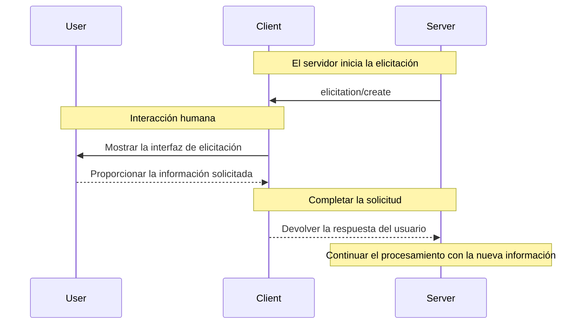
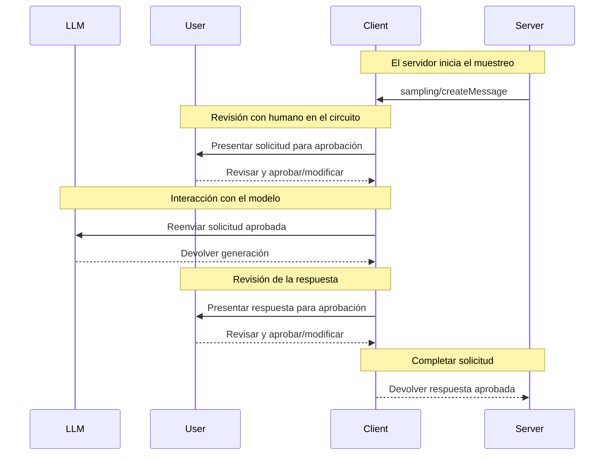

Los clientes MCP son instanciados por aplicaciones anfitrionas para comunicarse con servidores MCP específicos. La aplicación anfitriona, como Claude.ai o un IDE, gestiona la experiencia del usuario en su conjunto y coordina múltiples clientes. Cada cliente mantiene una comunicación directa con un servidor.

Es importante entender la distinción: el _anfitrión_ es la aplicación con la que interactúan los usuarios, mientras que los _clientes_ son los componentes a nivel de protocolo que permiten las conexiones con los servidores.

<div id="core-client-features">
  ## Funciones principales del cliente
</div>

Además de aprovechar el contexto proporcionado por los servidores, los clientes pueden ofrecer varias funciones a los servidores. Estas funciones del cliente permiten a los autores de servidores crear interacciones más ricas.

| Función         | Explicación                                                                                                                                                                                     | Ejemplo                                                                                                                                          |
| --------------- | ----------------------------------------------------------------------------------------------------------------------------------------------------------------------------------------------- | ------------------------------------------------------------------------------------------------------------------------------------------------ |
| **Muestreo**    | El Muestreo permite que los servidores soliciten completaciones de LLM a través del cliente, habilitando un flujo de trabajo con agentes. Este enfoque deja en manos del cliente el control total de los permisos del usuario y las medidas de seguridad. | Un servidor para reservar viajes puede enviar una lista de vuelos a un LLM y solicitar que el LLM elija el mejor vuelo para el usuario.         |
| **Raíces**      | Las Raíces permiten a los clientes especificar a qué archivos pueden acceder los servidores, guiándolos a directorios relevantes y manteniendo los límites de seguridad.                        | A un servidor para reservar viajes se le puede otorgar acceso a un directorio específico, desde el cual puede leer el calendario de un usuario. |
| **Elicitación** | La Elicitación permite que los servidores soliciten información específica a los usuarios durante las interacciones, proporcionando una forma estructurada de recopilar información bajo demanda. | Un servidor para reservar viajes puede preguntar por las preferencias del usuario sobre asientos de avión, tipo de habitación o su número de contacto para finalizar una reserva. |

<div id="elicitation">
  ### Elicitación
</div>

La elicitación permite a los servidores solicitar información específica a los usuarios durante las interacciones, lo que habilita flujos de trabajo más dinámicos y con mejor capacidad de respuesta.

<div id="overview">
  #### Descripción general
</div>

La Elicitación ofrece una forma estructurada para que los servidores obtengan la información necesaria bajo demanda. En lugar de requerir todos los datos por adelantado o fallar cuando algo falta, los servidores pueden pausar sus operaciones para solicitar insumos específicos a los usuarios. Esto habilita interacciones más flexibles, donde los servidores se adaptan a las necesidades del usuario en lugar de seguir patrones rígidos.

**Flujo de Elicitación:**



Este flujo habilita la recopilación dinámica de información. Los servidores pueden solicitar datos específicos cuando sea necesario, los usuarios proporcionan la información a través de una interfaz adecuada y los servidores continúan procesando con el contexto recién adquirido.

**Ejemplo de componentes de Elicitación:**

```typescript
{
  method: "elicitation/requestInput",
  params: {
    message: "Confirma, por favor, los detalles de tu reserva de vacaciones en Barcelona:",
    schema: {
      type: "object",
      properties: {
        confirmBooking: {
          type: "boolean",
          description: "Confirmar la reserva (Vuelos + Hotel = 3.000 $)"
        },
        seatPreference: {
          type: "string",
          enum: ["window", "aisle", "no preference"],
          description: "Tipo de asiento preferido para los vuelos"
        },
        roomType: {
          type: "string",
          enum: ["sea view", "city view", "garden view"],
          description: "Tipo de habitación preferido en el hotel"
        },
        travelInsurance: {
          type: "boolean",
          default: false,
          description: "Añadir seguro de viaje (150 $)"
        }
      },
      required: ["confirmBooking"]
    }
  }
}
```

<div id="example-holiday-booking-approval">
  #### Ejemplo: Aprobación de reserva de vacaciones
</div>

Un servidor de reservas de viaje demuestra el poder de la Elicitación a través del proceso final de confirmación de la reserva. Cuando una persona usuaria ha seleccionado su paquete de vacaciones ideal para Barcelona, el servidor necesita obtener la aprobación final y cualquier detalle faltante antes de proceder.

El servidor solicita la confirmación de la reserva con una petición estructurada que incluye el resumen del viaje (vuelos a Barcelona del 15 al 22 de junio, hotel frente a la playa, total de 3.000 $) y campos para cualquier preferencia adicional, como selección de asiento, tipo de habitación u opciones de seguro de viaje.

A medida que avanza la reserva, el servidor solicita la información de contacto necesaria para completar la reserva. Podría pedir datos de los viajeros para las reservas de vuelos, solicitudes especiales para el hotel o información de contacto de emergencia.

<div id="user-interaction-model">
  #### Modelo de interacción con el usuario
</div>

Las interacciones de elicitación están diseñadas para ser claras, contextuales y respetuosas de la autonomía del usuario:

**Presentación de la solicitud**: Los clientes muestran solicitudes de elicitación con un contexto claro sobre qué servidor está preguntando, por qué se necesita la información y cómo se utilizará. El mensaje de la solicitud explica el propósito, mientras que el esquema proporciona estructura y validación.

**Opciones de respuesta**: Los usuarios pueden proporcionar la información solicitada a través de controles de la interfaz (campos de texto, menús desplegables, casillas de verificación), negarse a proporcionarla con una explicación opcional o cancelar toda la operación. Los clientes validan las respuestas contra el esquema proporcionado antes de devolverlas a los servidores.

**Consideraciones de privacidad**: La elicitación nunca solicita contraseñas ni claves de API. Los clientes advierten sobre solicitudes sospechosas y permiten que los usuarios revisen los datos antes de enviarlos.

<div id="roots">
  ### Raíces
</div>

Las Raíces definen los límites del sistema de archivos para las operaciones del servidor y permiten que los clientes especifiquen en qué directorios deben centrarse los servidores.

<div id="overview">
  #### Descripción general
</div>

Las Raíces son un mecanismo para que los clientes comuniquen a los servidores los límites de acceso al sistema de archivos. Consisten en URI de archivos que indican los directorios donde los servidores pueden operar, ayudándoles a entender el alcance de los archivos y carpetas disponibles. En lugar de otorgar a los servidores acceso irrestricto al sistema de archivos, las Raíces los guían hacia los directorios de trabajo pertinentes mientras mantienen los límites de seguridad.

**Estructura de la Raíz:**

```json
{
  "uri": "file:///Users/agent/travel-planning",
  "name": "Travel Planning Workspace"
}
```

Las Raíces son exclusivamente rutas del sistema de archivos y siempre usan el esquema de URI `file://`. Ayudan a los servidores a comprender los límites del proyecto, la organización del espacio de trabajo y los directorios accesibles. La lista de Raíces puede actualizarse dinámicamente a medida que los usuarios trabajan con distintos proyectos o carpetas, y los servidores reciben notificaciones mediante `roots/list_changed` cuando cambian dichos límites.

Es importante señalar que, si bien las Raíces brindan orientación a los servidores sobre dónde operar, el cliente siempre tiene el control total del acceso a los archivos. Las Raíces simplemente comunican los límites previstos: el acceso real a los archivos siempre está mediado por las políticas de seguridad del cliente.

<div id="example-travel-planning-workspace">
  #### Ejemplo: espacio de trabajo para planificación de viajes
</div>

Un agente de viajes que gestiona múltiples viajes de clientes se beneficia de las Raíces para organizar el acceso al sistema de archivos. Considere un espacio de trabajo con distintos directorios para varios aspectos de la planificación de viajes.

El Cliente MCP proporciona Raíces del sistema de archivos al Servidor MCP de planificación de viajes:

- `file:///Users/agent/travel-planning` - Espacio de trabajo principal que contiene todos los archivos de viaje
- `file:///Users/agent/travel-templates` - Plantillas de itinerario reutilizables y recursos
- `file:///Users/agent/client-documents` - Pasaportes y documentos de viaje de los clientes

Cuando el agente crea un itinerario para Barcelona, el servidor trabaja dentro de estos límites: accede a plantillas, guarda el nuevo itinerario y hace referencia a documentos del cliente. No puede acceder a archivos fuera de estas Raíces. Los servidores suelen acceder a archivos dentro de las Raíces usando rutas relativas desde los directorios raíz o utilizando herramientas de búsqueda de archivos que respetan los límites de la raíz.

Si el agente abre una carpeta de archivo como `file:///Users/agent/archive/2023-trips`, el cliente actualiza la lista de Raíces mediante `roots/list_changed`.

<div id="user-interaction-model">
  #### Modelo de interacción del usuario
</div>

Las Raíces suelen gestionarse automáticamente por las aplicaciones Anfitrión MCP en función de las acciones del usuario, aunque algunas aplicaciones pueden permitir la gestión manual de raíces:

**Detección automática de raíces**: Cuando los usuarios abren carpetas, los Clientes MCP las exponen automáticamente como raíces. Abrir un espacio de trabajo de viajes da a los Servidores MCP acceso a los itinerarios y documentos dentro de ese directorio.

**Configuración manual de raíces**: Los usuarios avanzados pueden especificar raíces mediante la configuración. Por ejemplo, añadir `/travel-templates` para Recursos reutilizables mientras se excluyen directorios con registros financieros.

<div id="sampling">
  ### Muestreo
</div>

El muestreo permite que los servidores soliciten completaciones del modelo de lenguaje a través del cliente, habilitando comportamientos de agente mientras se mantiene la seguridad y el control del usuario.

<div id="overview">
  #### Descripción general
</div>

El muestreo permite que los servidores realicen tareas que dependen de la IA sin integrarse directamente con modelos de IA ni pagar por ellos. En su lugar, los servidores pueden solicitar que el cliente —que ya tiene acceso a modelos de IA— gestione estas tareas en su nombre. Este enfoque deja al cliente el control total sobre los permisos del usuario y las medidas de seguridad. Como las solicitudes de muestreo se producen en el contexto de otras operaciones —por ejemplo, una herramienta que analiza datos— y se procesan como llamadas al modelo independientes, mantienen límites claros entre distintos contextos, lo que permite un uso más eficiente de la ventana de contexto.

**Flujo de muestreo:**



El flujo garantiza la seguridad mediante múltiples puntos de control con humano en el circuito. Los usuarios revisan y pueden modificar tanto la solicitud inicial como la respuesta generada antes de que regrese al servidor.

**Ejemplo de parámetros de solicitud:**

```typescript
{
  messages: [
    {
      role: "user",
      content: "Analyze these flight options and recommend the best choice:\n" +
               "[47 flights with prices, times, airlines, and layovers]\n" +
               "User preferences: morning departure, max 1 layover"
    }
  ],
  modelPreferences: {
    hints: [{
      name: "claude-3-5-sonnet"  // Suggested model
    }],
    costPriority: 0.3,      // Less concerned about API cost
    speedPriority: 0.2,     // Can wait for thorough analysis
    intelligencePriority: 0.9  // Need complex trade-off evaluation
  },
  systemPrompt: "You are a travel expert helping users find the best flights based on their preferences",
  maxTokens: 1500
}
```

<div id="example-flight-analysis-tool">
  #### Ejemplo: Herramienta de análisis de vuelos
</div>

Considera un servidor de reservas de viajes con una herramienta llamada `findBestFlight` que usa muestreo para analizar los vuelos disponibles y recomendar la opción óptima. Cuando un usuario dice: "Resérvame el mejor vuelo a Barcelona el próximo mes", la herramienta necesita asistencia de IA para evaluar compromisos complejos.

La herramienta consulta las API de aerolíneas y reúne 47 opciones de vuelo. Luego solicita asistencia de IA para analizarlas: "Analiza estas opciones de vuelo y recomienda la mejor opción: [47 vuelos con precios, horarios, aerolíneas y escalas] Preferencias del usuario: salida por la mañana, máximo 1 escala."

El cliente inicia la solicitud de muestreo, lo que permite que la IA evalúe los compromisos, como vuelos nocturnos más baratos frente a salidas matutinas más convenientes. La herramienta utiliza este análisis para presentar las tres mejores recomendaciones.

<div id="user-interaction-model">
  #### Modelo de interacción con el usuario
</div>

Aunque no es un requisito, el Muestreo está diseñado para permitir el control con intervención humana. Los usuarios pueden mantener supervisión mediante varios mecanismos:

**Controles de aprobación**: Las solicitudes de Muestreo pueden requerir consentimiento explícito del usuario. Los clientes pueden mostrar qué quiere analizar el servidor y por qué. Los usuarios pueden aprobar, denegar o modificar las solicitudes.

**Funciones de transparencia**: Los clientes pueden mostrar la indicación exacta, la selección del modelo y los límites de tokens, lo que permite a los usuarios revisar las respuestas de la IA antes de que regresen al servidor.

**Opciones de configuración**: Los usuarios pueden establecer preferencias de modelo, configurar la aprobación automática para operaciones de confianza o exigir aprobación para todo. Los clientes pueden ofrecer opciones para eliminar o enmascarar información sensible.

**Consideraciones de seguridad**: Tanto los clientes como los servidores deben manejar adecuadamente los datos sensibles durante el Muestreo. Los clientes deben implementar limitación de velocidad y validar todo el contenido de los mensajes. El diseño con intervención humana garantiza que las interacciones de IA iniciadas por el servidor no puedan comprometer la seguridad ni acceder a datos sensibles sin el consentimiento explícito del usuario.