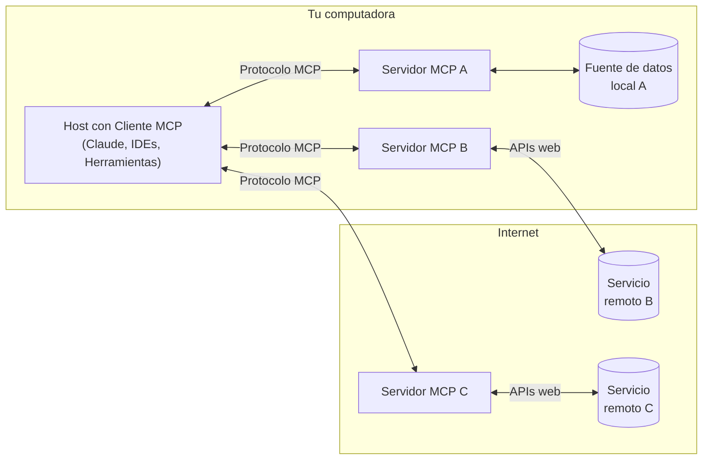

MCP es un protocolo abierto que estandariza cómo las aplicaciones proporcionan contexto a los LLM. Piensa en MCP como un puerto USB‑C para aplicaciones de IA. Así como USB‑C ofrece una forma estandarizada de conectar tus dispositivos a diversos periféricos y accesorios, MCP proporciona una forma estandarizada de conectar los modelos de IA a distintas fuentes de datos y Herramientas.

  ## ¿Por qué MCP?

MCP te ayuda a crear agentes y flujos de trabajo complejos sobre modelos de lenguaje (LLM). Los LLM a menudo necesitan integrarse con datos y Herramientas, y MCP proporciona:

* Una lista creciente de integraciones listas para usar a las que tu LLM puede conectarse directamente
* La flexibilidad para cambiar entre proveedores y plataformas de LLM
* Mejores prácticas para proteger tus datos dentro de tu infraestructura

  ### Arquitectura general

En esencia, MCP sigue una arquitectura cliente-servidor en la que una aplicación host puede conectarse a múltiples servidores:

* **Hosts de MCP**: Programas como Claude Desktop, IDEs o herramientas de IA que buscan acceder a datos mediante MCP
* **Clientes MCP**: Clientes del protocolo que mantienen conexiones 1:1 con servidores
* **Servidores MCP**: Programas ligeros que exponen capacidades específicas a través del estandarizado Protocolo de Contexto de Modelo (MCP)
* **Fuentes de datos locales**: Archivos, bases de datos y servicios de tu computadora a los que los servidores MCP pueden acceder de forma segura
* **Servicios remotos**: Sistemas externos disponibles en internet (p. ej., a través de APIs) a los que los servidores MCP pueden conectarse

  ## Primeros pasos

Elige la opción que mejor se adapte a tus necesidades:

  ### Guías rápidas

<CardGroup cols={2}>
  <Card title="Para desarrolladores de servidores" icon="bolt" href="/es/quickstart/server">
    Empieza a crear tu propio servidor para usar en Claude para escritorio y otros
    clientes
  </Card>

  <Card title="Para desarrolladores de clientes" icon="bolt" href="/es/quickstart/client">
    Empieza a crear tu propio cliente que pueda integrarse con todos los Servidores MCP
  </Card>

  <Card title="Para usuarios de Claude para escritorio" icon="bolt" href="/es/docs/develop/connect-local-servers">
    Empieza a usar servidores prediseñados en Claude para escritorio
  </Card>
</CardGroup>

  ### Ejemplos

<CardGroup cols={2}>
  <Card title="Servidores de ejemplo" icon="grid" href="/es/examples">
    Explora nuestra galería de servidores e implementaciones oficiales de MCP
  </Card>

  <Card title="Clientes de ejemplo" icon="cubes" href="/es/clients">
    Consulta la lista de clientes que ofrecen integración con MCP
  </Card>
</CardGroup>

  ## Tutoriales

<CardGroup cols={2}>
  <Card title="Crear MCP con LLMs" icon="comments" href="/es/tutorials/building-mcp-with-llms">
    Aprende a usar LLMs como Claude para acelerar tu desarrollo con MCP
  </Card>

  <Card title="Guía de depuración" icon="bug" href="/es/legacy/tools/debugging">
    Aprende a depurar de forma efectiva los Servidores MCP y las integraciones
  </Card>

  <Card title="Inspector MCP" icon="magnifying-glass" href="/es/legacy/tools/inspector">
    Prueba e inspecciona tus Servidores MCP con nuestra herramienta interactiva de depuración
  </Card>

  <Card title="Taller de MCP (Video, 2 h)" icon="person-chalkboard" href="https://www.youtube.com/watch?v=kQmXtrmQ5Zg">
    <iframe src="https://www.youtube.com/embed/kQmXtrmQ5Zg" />
  </Card>
</CardGroup>

  ## Explora MCP

Profundiza en los conceptos y capacidades fundamentales de MCP:

<CardGroup cols={2}>
  <Card title="Arquitectura central" icon="sitemap" href="/es/legacy/concepts/architecture">
    Comprende cómo MCP conecta clientes, servidores y LLM
  </Card>

  <Card title="Recursos" icon="database" href="/es/legacy/concepts/resources">
    Expón datos y contenido de tus servidores a los LLM
  </Card>

  <Card title="Indicaciones" icon="message" href="/es/legacy/concepts/prompts">
    Crea plantillas de indicaciones y flujos de trabajo reutilizables
  </Card>

  <Card title="Herramientas" icon="wrench" href="/es/legacy/concepts/tools">
    Permite que los LLM realicen acciones a través de tu servidor
  </Card>

  <Card title="Muestreo" icon="robot" href="/es/legacy/concepts/sampling">
    Permite que tus servidores soliciten respuestas de los LLM
  </Card>

  <Card title="Transportes" icon="network-wired" href="/es/legacy/concepts/transports">
    Conoce el mecanismo de comunicación de MCP
  </Card>
</CardGroup>

  ## Contribuir

¿Quieres contribuir? Consulta nuestra [Guía de contribución](/es/development/contributing) para saber cómo puedes ayudar a mejorar MCP.

  ## Soporte y comentarios

Cómo obtener ayuda o enviar comentarios:

* Para reportar errores y solicitar nuevas funciones relacionadas con la especificación de MCP, los SDK o la documentación (código abierto), [cree un issue en GitHub](https://github.com/modelcontextprotocol)
* Para debates o preguntas y respuestas sobre la especificación de MCP, use las [discusiones de la especificación](https://github.com/modelcontextprotocol/specification/discussions)
* Para debates o preguntas y respuestas sobre otros componentes de código abierto de MCP, use las [discusiones de la organización](https://github.com/orgs/modelcontextprotocol/discussions)
* Para reportar errores, solicitar funciones y hacer preguntas relacionadas con la integración de MCP en Claude.app y claude.ai, consulte la guía de Anthropic sobre [Cómo obtener soporte](https://support.anthropic.com/en/articles/9015913-how-to-get-support)