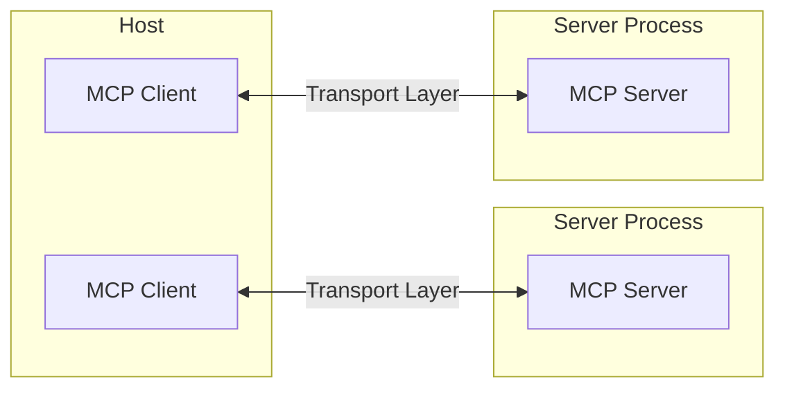
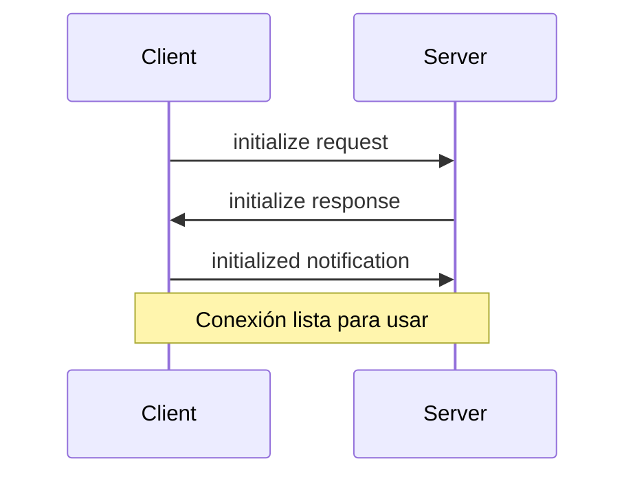

El Protocolo de Contexto de Modelo (MCP) se basa en una arquitectura flexible y extensible que permite una comunicación fluida entre aplicaciones e integraciones con LLM. Este documento aborda los componentes y conceptos arquitectónicos esenciales.

<div id="overview">
  ## Descripción general
</div>

MCP sigue una arquitectura cliente-servidor en la que:

* **Anfitriones** son aplicaciones LLM (como Claude Desktop o IDE) que inician las conexiones
* **Clientes** mantienen conexiones 1:1 con los servidores, dentro de la aplicación anfitriona
* **Servidores** proporcionan contexto, Herramientas e Indicaciones a los clientes



<div id="core-components">
  ## Componentes fundamentales
</div>

<div id="protocol-layer">
  ### Capa de protocolo
</div>

La capa de protocolo se encarga del encuadre de mensajes, el enlace solicitud/respuesta y los patrones de comunicación de alto nivel.

<CodeGroup>
  ```typescript TypeScript
  class Protocol<Request, Notification, Result> {
    // Manejar solicitudes entrantes
    setRequestHandler<T>(
      schema: T,
      handler: (request: T, extra: RequestHandlerExtra) => Promise<Result>,
    ): void;

    // Manejar notificaciones entrantes
    setNotificationHandler<T>(
      schema: T,
      handler: (notification: T) => Promise<void>,
    ): void;

    // Enviar solicitudes y esperar respuestas
    request<T>(request: Request, schema: T, options?: RequestOptions): Promise<T>;

    // Enviar notificaciones unidireccionales
    notification(notification: Notification): Promise<void>;
  }
  ```

  ```python Python
  class Session(BaseSession[RequestT, NotificationT, ResultT]):
      async def send_request(
          self,
          request: RequestT,
          result_type: type[Result]
      ) -> Result:
          """Enviar una solicitud y esperar la respuesta. Lanza McpError si la respuesta contiene un error."""
          # Implementación del manejo de solicitudes

      async def send_notification(
          self,
          notification: NotificationT
      ) -> None:
          """Enviar una notificación unidireccional que no espera respuesta."""
          # Implementación del manejo de notificaciones

      async def _received_request(
          self,
          responder: RequestResponder[ReceiveRequestT, ResultT]
      ) -> None:
          """Manejar una solicitud entrante desde el otro lado."""
          # Implementación del manejo de solicitudes

      async def _received_notification(
          self,
          notification: ReceiveNotificationT
      ) -> None:
          """Manejar una notificación entrante desde el otro lado."""
          # Implementación del manejo de notificaciones
  ```
</CodeGroup>

Las clases clave incluyen:

* `Protocol`
* `Client`
* `Server`

<div id="transport-layer">
  ### Capa de transporte
</div>

La capa de transporte se encarga de la comunicación entre clientes y servidores. MCP admite varios mecanismos de transporte:

1. **Transporte STDIO**
   * Usa la entrada/salida estándar para comunicarse
   * Ideal para procesos locales

2. **Transporte HTTP transmitible**
   * Usa HTTP con Eventos enviados por el servidor (SSE) opcionales para transmisión
   * HTTP POST para mensajes de cliente a servidor

Todos los transportes usan [JSON-RPC](https://www.jsonrpc.org/) 2.0 para intercambiar mensajes. Consulta la [especificación](/es/specification/) para obtener información detallada sobre el formato de mensajes del Protocolo de Contexto de Modelo (MCP).

<div id="message-types">
  ### Tipos de mensajes
</div>

MCP incluye estos tipos principales de mensajes:

1. **Solicitudes** esperan una respuesta de la otra parte:

   ```typescript
   interface Request {
     method: string;
     params?: { ... };
   }
   ```

2. **Resultados** son respuestas satisfactorias a solicitudes:

   ```typescript
   interface Result {
     [key: string]: unknown;
   }
   ```

3. **Errores** indican que una solicitud falló:

   ```typescript
   interface Error {
     code: number;
     message: string;
     data?: unknown;
   }
   ```

4. **Notificaciones** son mensajes unidireccionales que no esperan respuesta:
   ```typescript
   interface Notification {
     method: string;
     params?: { ... };
   }
   ```

<div id="connection-lifecycle">
  ## Ciclo de vida de la conexión
</div>

<div id="1-initialization">
  ### 1. Inicialización
</div>



1. El cliente envía la solicitud `initialize` con la versión del protocolo y las capacidades.
2. El servidor responde con su versión del protocolo y sus capacidades.
3. El cliente envía la notificación `initialized` como acuse de recibo.
4. Comienza el intercambio normal de mensajes.

<div id="2-message-exchange">
  ### 2. Intercambio de mensajes
</div>

Tras la inicialización, se admiten los siguientes patrones:

* **Solicitud-respuesta**: El cliente o el servidor envía solicitudes y la otra parte responde
* **Notificaciones**: Cualquiera de las partes envía mensajes unidireccionales

<div id="3-termination">
  ### 3. Finalización
</div>

Cualquiera de las partes puede finalizar la conexión:

* Cierre limpio mediante `close()`
* Desconexión del transporte
* Condiciones de error

<div id="error-handling">
  ## Manejo de errores
</div>

MCP define estos códigos de error estándar:

```typescript
enum ErrorCode {
  // Códigos de error estándar de JSON-RPC
  ParseError = -32700,
  InvalidRequest = -32600,
  MethodNotFound = -32601,
  InvalidParams = -32602,
  InternalError = -32603,
}
```

Los SDK y las aplicaciones pueden definir sus propios códigos de error superiores a -32000.

Los errores se propagan mediante:

* Respuestas de error a las solicitudes
* Eventos de error en los transportes
* Manejadores de errores a nivel de protocolo

<div id="implementation-example">
  ## Ejemplo de implementación
</div>

Aquí tienes un ejemplo básico de cómo implementar un Servidor MCP:

<CodeGroup>
  ```typescript TypeScript
  import { Server } from "@modelcontextprotocol/sdk/server/index.js";
  import { StdioServerTransport } from "@modelcontextprotocol/sdk/server/stdio.js";

  const server = new Server(
    {
      name: "example-server",
      version: "1.0.0",
    },
    {
      capabilities: {
        resources: {},
      },
    },
  );

  // Handle requests
  server.setRequestHandler(ListResourcesRequestSchema, async () => {
    return {
      resources: [
        {
          uri: "example://resource",
          name: "Example Resource",
        },
      ],
    };
  });

  // Connect transport
  const transport = new StdioServerTransport();
  await server.connect(transport);
  ```

  ```python Python
  import asyncio
  import mcp.types as types
  from mcp.server import Server
  from mcp.server.stdio import stdio_server

  app = Server("example-server")

  @app.list_resources()
  async def list_resources() -> list[types.Resource]:
      return [
          types.Resource(
              uri="example://resource",
              name="Example Resource"
          )
      ]

  async def main():
      async with stdio_server() as streams:
          await app.run(
              streams[0],
              streams[1],
              app.create_initialization_options()
          )

  if __name__ == "__main__":
      asyncio.run(main())
  ```
</CodeGroup>

<div id="best-practices">
  ## Buenas prácticas
</div>

<div id="transport-selection">
  ### Selección de transporte
</div>

1. **Comunicación local**
   * Usa el transporte STDIO para procesos locales
   * Eficiente para la comunicación en la misma máquina
   * Gestión de procesos simple

2. **Comunicación remota**
   * Usa HTTP transmitible para escenarios que requieren compatibilidad con HTTP
   * Considera las implicaciones de seguridad, incluida la autenticación y la autorización

<div id="message-handling">
  ### Manejo de mensajes
</div>

1. **Procesamiento de solicitudes**
   * Valida exhaustivamente las entradas
   * Usa esquemas con seguridad de tipos
   * Maneja los errores con elegancia
   * Implementa tiempos de espera

2. **Reporte de progreso**
   * Usa tokens de progreso para operaciones prolongadas
   * Reporta el progreso de forma incremental
   * Incluye el progreso total cuando se conozca

3. **Gestión de errores**
   * Usa códigos de error adecuados
   * Incluye mensajes de error útiles
   * Libera los recursos en caso de errores

<div id="security-considerations">
  ## Consideraciones de seguridad
</div>

1. **Seguridad del transporte**
   * Use TLS para conexiones remotas
   * Valide los orígenes de la conexión
   * Implemente autenticación cuando sea necesario

2. **Validación de mensajes**
   * Valide todos los mensajes entrantes
   * Depure/sanitice las entradas
   * Verifique los límites de tamaño de los mensajes
   * Verifique el formato JSON-RPC

3. **Protección de recursos**
   * Implemente controles de acceso
   * Valide las rutas de los recursos
   * Supervise el uso de recursos
   * Aplique límites de tasa a las solicitudes

4. **Manejo de errores**
   * No exponga información sensible
   * Registre errores relevantes para la seguridad
   * Implemente una limpieza adecuada
   * Maneje escenarios de DoS

<div id="debugging-and-monitoring">
  ## Depuración y monitorización
</div>

1. **Registro**
   * Registrar eventos del protocolo
   * Seguir el flujo de mensajes
   * Monitorizar el rendimiento
   * Registrar errores

2. **Diagnóstico**
   * Implementar comprobaciones de estado
   * Monitorizar el estado de la conexión
   * Seguir el uso de recursos
   * Perfilar el rendimiento

3. **Pruebas**
   * Probar distintos transportes
   * Verificar el manejo de errores
   * Comprobar casos límite
   * Realizar pruebas de carga a los servidores